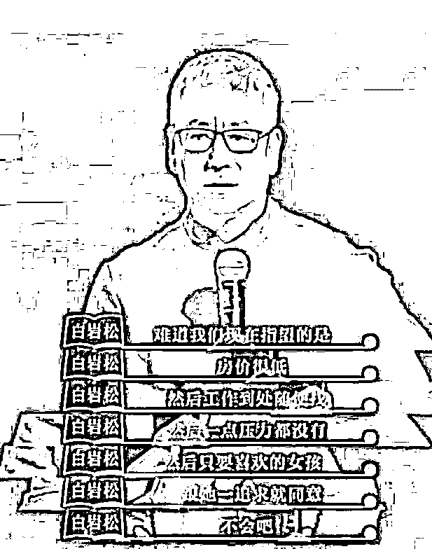

# 白岩松真的“爹味儿”十足么？

> 原文：[`mp.weixin.qq.com/s?__biz=MzU0MjYwNDU2Mw==&mid=2247503539&idx=1&sn=eb2e65e4b5813fd80444d212dab3bc7e&chksm=fb1aa2cfcc6d2bd961cfeeadfb4208cdb275e9fa9b9c3dcde76530106791137f6b61c30b3465#rd`](http://mp.weixin.qq.com/s?__biz=MzU0MjYwNDU2Mw==&mid=2247503539&idx=1&sn=eb2e65e4b5813fd80444d212dab3bc7e&chksm=fb1aa2cfcc6d2bd961cfeeadfb4208cdb275e9fa9b9c3dcde76530106791137f6b61c30b3465#rd)

白岩松首次针对网友评论他爹味十足出来辩解。此前他的翻车，是因为那句著名的“不会吧”。 

让我们来复习下他在采访节目里翻车的那番话。 

呵呵。这样的话，不翻车也难。 

所谓翻车，其实很简单，大家希望你这样，结果你不是，甚至你那样，那你就会翻车。 

那我们来想一想，什么样的车子会翻？ 

很简单，高处的车子才会翻，一辆车子，掉坑里了，这就叫翻车。

你们看西风为啥从来不翻车？

因为读者对我的预期实在是太低了。

很多读者，尤其是老读者，心目中的西风，就是一个流氓，没谁了的那种。 

所以很多人替我说好话，有人是这么替我辩解的。 

西风是一个流氓，但人家是国际流氓，理解啥意思？人家在国际市场上耍流氓，人家不在自己家耍。盗亦有盗，人品啊，你看看，这就是人品。

真相是什么？真相是国内根本不允许日内交易，想耍也没地儿耍呀。 

这话一出来，又是一片赞颂之声，西风，好人啊。 

诚实，你看，诚实可靠小郎君，又是一个大大的赞。 

有人问我，为啥不定居国外？ 

我很老实的说，因为做国际市场，难免留下各种后遗症，你看贪官奸商为什么排队往外面跑？很简单，犯事儿了呗。

同样的道理，我不敢定居国外呀，屁股不干净。

马上又是一篇赞颂之声，你看，好人啊，割洋韭菜，在国内花.......

我算是看懂了，无论我做什么，都是表扬，为什么？因为你们期待中的我，实在是太不堪了。 

我的人设大概是待在马里亚纳海沟深处，那你还让我怎么翻呢？翻到地心深处去么？

这么想，文人们很可怜，咱们还老骂人家，忒不地道。 

一个文人，他无论做什么，都会挨骂，因为大家心目中的形象， 或者讲预期，是杜甫那样的。 

你看杜月笙的名声就很好。 

张啸林做了汉奸，黄金荣只会抽大烟，其实杜月笙就是个流氓而已，问题是，人是衬托出来的。

全靠同行陪衬。 

回到正题，白岩松的这番话，让大家很失望，因为大家心目中的文人是像杜甫那样，捂着胸口说出安得广厦千万间的，而不是在年轻人胸口再插一把刀。 

严格意义上讲，白岩松没有说假话，任何时期，想要得到难得之物，都很不容易。 

白岩松是 60 后，他年轻的时候，想买房也没地儿买，就算有，相对于几十一两百的月收入，以千计的房价，也是买不起的。

白岩松那代人肯定吃过很多物质上的苦，也有过追女孩子而不得，也有过兜里的窘迫。

也许站在白岩松的角度，今天的孩子物质上很幸福，起码能洗热水澡，房间里有厕所，哪怕是租的。

白老师年轻的时候，北京人住胡同，很多今天你眼中以亿计的四合院，连厕所都没有，大冬天的起夜，得上公共厕所。 

北京冬天很冷，《红楼梦》里的晴雯是怎么得病死的？就是冬天起来上厕所，衣服没披够，落下的病根。

不仅没厕所，而且没地儿洗澡。有单位才有澡堂子，没单位街道口也许有，但是要钱，一星期能洗一次很幸福了。 

这是今天的人不可想象的。 

但是今天的年轻人物质上很好，起码不用上公厕，起码每天能洗澡。所以他反问了那句话，不是吧？

年轻人之所以听不进去，是因为他们面临着另一种痛苦。 

他们也许物质上比前辈幸福很多，但是他们需要和同龄人比较，而且，他们得不到自己想要的生活。

这是网友评价白岩松最多的一句话，似乎某种意义上能够代表年轻人的心声。

得不到自己想要的生活，所以很痛苦。

我介于白岩松和年轻人之间，我是 80 前。我听得懂两种人的分歧。 

在白岩松那代人眼里，得不到自己想要的生活，这算什么痛苦？

谁能得到自己想要的生活？谁？白岩松自己能么？他也不能呀。 

看懂了吧，就这点事儿。 

在中老年人眼里，年轻人属于没事儿找抽，放着好日子不过。 

因为他觉得现在已经很好了，和他年轻的时候比。 

年轻人没有经历过那些，他们没有对比对象呀。 

幸福是比较出来的，就像翻车需要一个高度。你的人设高了才能翻，人设太低了，想翻都翻不了。

你看我无论做什么，大家都是表扬我的。 

我哪怕做坏事，人家都是夸我的，本以为我坏到 100 分，没想到只坏到 80 分，太出人意料了。

这就是实际上的问题，年轻人真正的痛苦在于预期太高。预期太高在于他没有经历过很低的起点。

**而这个世界不会给你降低预期的机会，也不会培养你正确的预期。** 

你想想看，你生活在什么世界里？

商业世界。

商业世界的第一要务是刺激消费，没有消费，就没有资本活动，没有资本活动，就没有就业，就这么简单。

商人的世界里不存在人口，只存在消费人口。 

这就是为什么女人>孩子>老人>狗>男人。因为这就是消费力排名。

《三十而已》里的王漫妮会花一个月的薪水买一个包，而男人只会花一个月的薪水去给她买包。 

你不要觉得男人吃亏了，如果王漫妮不买包，就会有男人失业，这是商业社会的闭环。 

你说买了一个包，就会幸福么？ 

幸福重要么？ 

还记得我曾经举过的那个例子么？当年我卖服务器的时候怎么向运营商展示我们的平台？ 

硬邦邦的讲并发，讲性能？

当然不是。 

我在页面上加载了很多奢侈品，各种珠宝，名车，豪宅，酒店。这些东西攒一个商城真的会有销量？真的会有利润吗？

并不重要。

炫酷就够了，吸睛就够了。我就是要让我的客户沉迷于纸醉金迷，同时教给他们这种营销套路，让他们在运营的时候，把重点放在纸醉金迷上。

就是忽悠客户花钱嘛。让客户觉得我描述的生活才是你向往的。

客户肯花钱，运营商才有的赚，运营商有的赚，我们供应商才有的赚。 

至于用什么方式忽悠客户花钱重要么？不重要。我不忽悠客户花钱，我们公司怎么开工资呢？ 

所以这跟幸福没有关系，天底下所有的产品经理都会想尽一切办法让你扩大消费，花的越多你越爽，只是一个由头，一种说法。 

女人>孩子>老人>狗>男人，这可以看作消费力排名，也可以看作，这条线上的客户，越来越不好忽悠呗。

男人比狗都不好忽悠，太抠了。所以只能用女人去忽悠他们嘛，完美形成闭环。

如果你要让一个男人掏钱，你就要告诉他，不掏钱娶不到媳妇哦。 

回到我们的正题，现在看懂 90 后，00 后为什么不快乐了？ 

因为你就不可能快乐。就像我说的，你所有的想法都是别人灌输给你的，包括你想要的，也是别人灌输给你的。

是一群产品经理在卖拐，他们告诉你，有了拐才能幸福哦。别人有拐你没有哦。

就这么点套路，等你做了产品部门，市场部门的负责人，你全都学得会的。商业社会的本质，就是围绕这个转呀。 

所以你当然不会幸福，**因为你永远缺一个拐**。 

可是这一点不可能让大多数人想明白，真想明白，商业社会的运转核心机制就出问题了，就崩了呀。

如果大家都说，电动牙刷有什么意义，手动也能刷，那电动牙刷厂的人，不就失业了么？ 

你看懂了？这个话题的本质根本不是白岩松说的那些，而是人类的阶段。 

人类目前就在商业社会阶段，各行各业就是靠卖拐过日子，你必须买拐，你也必须认为买拐是幸福的，这是你我他都能够就业的核心。