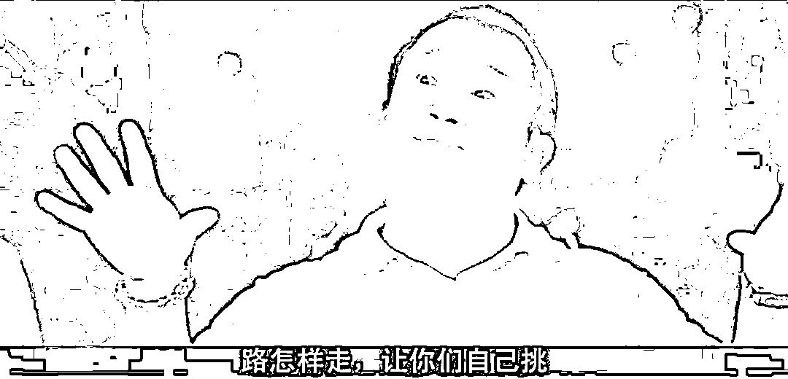
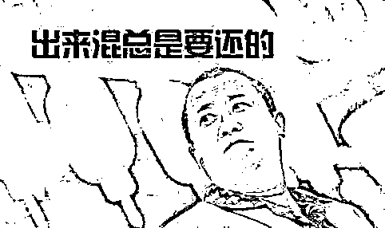

# 从《失孤》到《亲爱的》，路怎样走，你们自己挑

> 原文：[`mp.weixin.qq.com/s?__biz=MzU0MjYwNDU2Mw==&mid=2247502717&idx=2&sn=5ccc7246c14b734d93c261a5c1a21d69&chksm=fb1aa701cc6d2e1778e461bb0f6d2912f54a152178f91e20b7b932bb704b16ad372fd8f0c193#rd`](http://mp.weixin.qq.com/s?__biz=MzU0MjYwNDU2Mw==&mid=2247502717&idx=2&sn=5ccc7246c14b734d93c261a5c1a21d69&chksm=fb1aa701cc6d2e1778e461bb0f6d2912f54a152178f91e20b7b932bb704b16ad372fd8f0c193#rd)

陈可辛导的《亲爱的》原型，孙海洋，就像刘德华演的《失孤》里的原型，郭刚堂一样，都找回来了自己失去的孩子。

这是一件值得恭喜的事情么？

是，但是这份喜悦中，夹杂着无奈。

郭刚堂失去孩子时，孩子 2 岁，从那时开始，孩子生死未卜，自己踏上漫漫寻子路。

孙海洋失去孩子时，孩子 4 岁，从那时开始，孩子生死未卜，自己踏上漫漫寻子路。

可是，当十几年后，他们找到孩子的时候，真的能够找回来什么吗？

不，他们找回的是线索，找不回的，是情感。

无论郭刚堂的孩子，还是孙海洋的孩子，当被亲生父母找到后，都选择了与养父母继续生活在一起。

原因很简单，丢失的过早，他们对亲生父母毫无记忆。

**换句话说，无论对于郭刚堂，还是对于孙海洋，在孩子丢失的那一刹那，就已经注定丢失了。**

**时间啊，是找不回来的。**

我评价这个新闻，不是在为孙海洋难过，因为几个月前，他经历过的这一切，郭刚堂都经历过。

我更不会谴责两个孩子，他们一个 2 岁丢失，一个 4 岁丢失，十几年，二十几年后，你把一对陌生人摆在他面前，让他理解这才是父母，对不起，他们真的做不到，因为没有记忆。

那我要说什么呢？

老生常谈，预期管理。

我想讨论一个问题，**在拐卖儿童这件事当中，买家起的究竟是个什么作用？** 

来看下两起案件。

昔日买郭刚堂 2 岁儿子的买家，并不是没有孩子，有，而且有两个，有两个闺女。他想要的不是孩子，而是儿子，也就是当地所谓的传宗接代。

换句话说，他要买一个男孩子，这才是他的目的，这也是郭刚堂 2 岁儿子被贩卖的市场环境。

你说他买了之后虐待这孩子了么？并没有。他抚养这个孩子，供他念大学，甚至剥夺自己两个女儿念书的机会，也要供这个买来的男孩子念大学。

他自己的亲生女儿，割猪草，为这个买来的弟弟，攒学费。

我们站在不知情的角度，郭刚堂丢失的这个孩子，当然对养父母有感情，甚至我相信他对姐姐们都有感情。

人家待他不薄嘛。

孙海洋儿子的遭遇是相同的，被卖到一户所谓生不出儿子的家庭中，抚养长大。

那我们来想一想，这件事是不是情有可原。

打个比方，假如张三，出钱，让人把隔壁老王给绑架了，比如绑个十来年，二十几年，直到被警方查出，老王才获救。

你认为张三什么罪？

最起码 10 年起，或者无期，还要没收财产并处罚金，等等。

那我们再想，如果张三出钱，雇人把老王绑了去，安排进入自己的传销集团，每天洗脑，让老王认为张三才是自己亲爸爸，那你觉得什么罪？

比前述更重，数罪并罚。

所以我们现在回来看，这两对所谓的“养父母”，和雇凶绑架的张三，有没有实质上的区别？

答案是有，也没有。

所谓有，体现在张三是目标明确的，他雇凶绑架的就是老王，这个老王是被指定的。

所谓没有，体现在这两个所谓的“养父母”，他们没有指定必须是孙海洋，或者郭刚堂的儿子，而是说，随便谁家孩子都行。

你想一想，**没有指定作案对象的作案难道就不是作案了吗？**

你故意杀害老王是大罪，难道你上街随便挑一个加害，就不是大罪了吗？

人的生命是什么构成的？不正是时间构成的么？

你剥夺老王十几，二十几年的时间，判你无期都是轻的，你剥夺这个孩子乃至他背后的家庭十几，二十几年的时间，为什么不判你呢？

你搞个传销集团，对员工忽悠洗脑都是有罪的，你忽悠一个根本与你素昧平生的人管你叫爸爸，为什么就不是罪行呢？

我很坦率地讲，买卖儿童中的买家，从构成伤害的角度看，与买凶杀人，买凶绑架，并无区别，如果大家讲道理，理应执行死刑，明正典刑。

为什么不？为什么明明合理的事情没有执行，为什么这么多买家逃避了法律的制裁？我想，和保护儿童的处境有关。

如果丢失者众，你处罚的深，难免买家，包括人贩子在内，会杀害这个儿童，甚至贩卖器官。

狗急了还跳墙，何况人呢。

这是过去无法对买家惩罚，对人贩子严惩的天然限制，就像我们都看到了一只耗子，都有心杀了它，无奈它待在花瓶旁边，我们迟迟无法动手。

但是**这一切的转机，正在悄悄的到来。**

随着城市里摄像头密布，随着人口登记，普查，互联网，定位一系列手段的铺开。如今想要再丢人，难度系数比 80 年代，90 年代，包括 00 年初，要困难的多得多。

**这意味着什么？意味着人贩子，或者买家手里的筹码，人质，越来越少了。**

当天平不断地倾斜，我认为，适时推出严惩，改变预期管理的策略，十分必要。

为了妥当起见，可以分阶段。

比如大力宣传，买入儿童的，构成严重刑事犯罪，死刑，或者无期。

但是，三年内主动坦诚的，免责，五年内主动坦诚的，罪责减轻一半。五年以上仍不悔改的，一经发现，从严从重处理。

**路怎样走，让你们自己挑！**

给你机会，历史原因给你历史解决方案。但是屡教不改，那就勿谓言之不预也。

从下达最后通牒开始倒计时，对于贩卖儿童者，包括买家，不断的加重惩罚，不断的加大围剿的力度。

就是要打灭你的预期，就是要让你绝望。

说到底，法律的本质就是预期管理。而随着技术的一日千里，随着买家手里的孩子越长越大，婴儿越来越少，他们的筹码越来越小，我们严惩的时机也越来越近。

有人说，养父母被严惩，是否是对这个孩子的二次伤害，毕竟他以为那是父母。

我认为，**管理预期比管理当下更重要。**

所谓治未病，不治已病。如果你始终为了这个买家手里的人质迁就，甚至当人质解救后，仍然为人质的精神状态迁就，那我们所有人，就都被犯罪分子绑架了。

他们不是养父母，法律上从来也不认，他们就是劫匪，而他们买的孩子，就是人质。

劫匪，迟早要击毙的，我们暂时没有击毙，只是出于对人质安全的考虑，这个考虑，是有时限的。

我们可以考虑人质身体上被劫持，我们无法迁就人质精神上被劫持。

如果我们总是这样犹豫，只会纵容更多的劫匪，因为我们给了劫匪们一种软弱可欺的预期。

这是绝不可有的。

所以我强烈呼吁，严惩买家的时机到了，原因无他，技术手段使得买家手里的儿童，越来越少，人质，越来越少。此时不动手，更待何时？

**出来混，迟早要还的！**

****

毕竟，没有买家，就没有市场，没有买卖，就没有伤害。