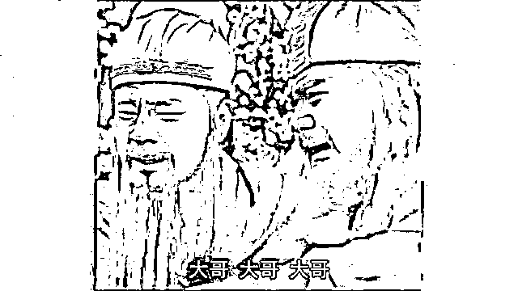

# 能够躺平，是几千年来的追求

> 原文：[`mp.weixin.qq.com/s?__biz=MzU0MjYwNDU2Mw==&mid=2247499311&idx=1&sn=ddd20cf02af46b4d7482f4b67ee89771&chksm=fb1a9253cc6d1b45502dd904324ee86644502983613cfc010d7a7357ace95cb9bc971e1c810d#rd`](http://mp.weixin.qq.com/s?__biz=MzU0MjYwNDU2Mw==&mid=2247499311&idx=1&sn=ddd20cf02af46b4d7482f4b67ee89771&chksm=fb1a9253cc6d1b45502dd904324ee86644502983613cfc010d7a7357ace95cb9bc971e1c810d#rd)

[昨天的文章里提了王阳明的一段话](https://mp.weixin.qq.com/s?__biz=MzU0MjYwNDU2Mw==&mid=2247499303&idx=1&sn=35086be2b18e78ab96f35b0554d311b5&chksm=fb1a925bcc6d1b4dee4b91f20d663665c796fed2f3f579caac399ecc81b2bcfc8a836f8e40fd&token=487209335&lang=zh_CN&scene=21#wechat_redirect)。 

**王阳明的心学告诉你心即理，人的行为由什么决定？由他的预期决定，你控制了别人的预期，自然就控制了别人的行为。**

很多读者感兴趣，我说抽空在小号里解释，但是[小号今天发了华为鸿蒙](https://mp.weixin.qq.com/s?__biz=MzU3NDc5Nzc0NQ==&mid=2247503938&idx=1&sn=86ffdb6006d0e3ad5bf3ff3f9b1e5cca&chksm=fd2e729cca59fb8abf7156f936222503a5ddace9166cf3ee9069e9d2271a181d9d6967cbb455&token=50447172&lang=zh_CN&scene=21#wechat_redirect)，那个话题显然更重要，于是大号就继续昨天的话题吧。

我们来聊心即理。

知者行之始，行者知之成。你总得动心起念了才会行动，你总是行动完成了才知道结果吧。

你饿了，想吃饭，吃了，饱了。是不是逻辑很简单？ 

那你想要预测别人的下一步行动，怎么做？只能猜猜看，他想要什么。 

猜不出来对吧？猜不出来就把他引到一个不得不选择的局中，你自然就猜出来了。 

给你举个例子，应用的例子。 

王阳明巡抚江西，他可没有电视剧宰相刘罗锅巡抚广西那么幸运。

广西特产荔浦芋头，江西特产土匪。

他倒是想把土匪这玩意进贡了，问题是宫里也不要。 

不要怎么办呢？那就只能自己消化。 

一个地方如果土匪成了土特产，只有一种可能，就是自己人里面布满了土匪的内应。 

所谓无间道。 

既然你都猜到了，那怎么办呢？发布命令，说：我要剿匪。然后派人趴墙根，盯梢，看看手底下都谁去通知土匪。 

知道后怎么做呢？把手底下这些内应挨个叫来谈心，晓之以情，动之以理，从此之后，大家就都幡然悔悟，成了谍中谍，给土匪传假消息，以助王大人剿匪。 

真的是这样么？真这样就见鬼了。 

真相是王阳明把这帮手下叫来，挨个问候他们的家小。你妈妈在哪个养老院呀，你小孩在哪个幼儿园呀，不说没关系，我早就调查过了。

这意思很清楚，只要你配合我，过去的事情既往不咎。土匪给过你多少银子，权当没发生。 

不仅如此，今后你还可以继续领双份，我这里领一份，土匪那里领一份。将来剿匪成功，奏报上也有你一份功劳。 

花花轿子众人抬嘛。 

如果你不配合呢？我会把你送官么？不，你想多了。 

如果你不配合，我就放两个假消息，让土匪上当，回头再让第三方告诉土匪是你故意挖坑陷害他们，然后把你家小的地址，行踪，比如你小孩在哪家幼儿园呀，你妈妈早上几点去买菜呀，都交给土匪。

你猜猜看，他们会怎么对你和你的家小呢？

....... 

是不是很无语？圣人之道，吾知之矣.....

这就叫操控了别人的预期，自然操控了别人的行为。 

无论他手下是好人，是坏人，是清官，是贪官，谁会不配合？谁敢不配合呢？ 

虎毒还不食子。

王阳明算准了这一点，他知道你只有一个选项，自然提前知道你的行动。 

这就叫控制别人的心理预期，自然就控制了别人的行为。 

你注意这个例子，王阳明并没有真的指望自己身为上官的那点权限和资源，他有没有说如果你们不配合，他就去找 ICAC？或者年底考评给你们个 C？ 

没有，他这人一点都不迂腐，他利用了一切能利用的资源。

**所以说所谓的权力是指你自己能行使的能力边界而不仅仅是一纸任命。** 

《红楼梦》第四回《葫芦僧乱判葫芦案》，贾雨村听完护官符的解读为什么当场不表态，而是先遣走了小沙弥？

他要是连这点提防心都没有，他还当什么主官？他早晚被小沙弥摆布成傀儡。因为他没有脑子嘛，没脑子给你一纸任命又有何用？

但是有脑子也要分高下的。贾雨村最终还是被小沙弥摆布了，小沙弥押解着昔日的主官贾雨村走在雪地上..... 

所以权力在谁手里？始终在心智碾压别人的那个人手里。

亚历山大大帝临终的遗言讲的很清楚，天下谁属？终归是属于强者的，而强者是变化的。 

再举一个例子。王阳明平定宁王叛乱。我们看看他如何操控完全敌对一方的预期。

宁王就是周星驰《唐伯虎点秋香》里面那个咋咋呼呼的王爷，他早有准备。可是王阳明手底下什么人都没有。 

敌众我寡，怎么办呢？ 

很简单，还是那个套路：操控了别人的预期，自然就操控了别人的行为。 

他先是写假信，故意被宁王的下属截获。让宁王以为他要攻击的城池是个陷阱，有大军埋伏，只等他落网。

于此同时，信中又语焉不详的暗示，他手下有人是内应。

宁王就很犹豫，犹豫来犹豫去，耽误了，给王阳明筹集军队以时间。 

与此同时，王阳明又丢出一封信，让宁王怀疑手底下两个重要的谋士背叛了。 

于是宁王心生一计，问俩谋士，我应该如何？那俩又没有看过王阳明第一封假信，当然建议宁王尽快出击。

宁王心想，感情叛徒果然是你俩，你们巴不得我中埋伏......，内讧了。

看懂了吧？哪儿来的埋伏，从头到尾都是局。

王阳明算准了每个人就自己的信息面做出的判断，然后把两个小坑连起来，计中计，合成一个大坑。 

你说这种故事我听过很多呀，没什么稀奇。是的，本来就不稀奇，你翻开《三国演义》，全篇都是这种段子。 

昨天文末聊的：给别人超出预期的，才叫给，符合预期的，给了也无效。

这句话就是史书对曹操的评价，只不过被我翻译成了白话文。 

史书上说曹操这个人总是给别人超出预期的奖励。

是因为他人傻钱多？不，他跟自己的亲儿子讲过原因，也被史书记录了下来。

他告诉自己的儿子，你要让下属觉得你恩威莫测，你看得透他们，他们看不透你，就不敢逾矩。

如果你觉得曹操也没那么恩威莫测会怎样呢？具体参考杨修，课本上学过，杨修之死。 

当然，这本事他的儿孙们显然学得不到家，媳妇们该给他们戴绿帽子戴绿帽子，下属该背叛背叛。 

反观曹操，他一辈子娶的尽是人妻，收的尽是降将，却始终后院不起火，靠什么？就是诸葛亮的那句评价：抑亦人谋也。老曹心眼太多了。

昨天文末还聊了这么一句：

他正发愁首付呢，你把奖金给到了；他想要 3 个月，你给了 6 个月；他家里有事，组长都不知道，你身为副总裁都知道了。大部分人都会被感动的。

也没什么新意，很多人都这么做过。 

比如袁世凯小站练兵，觉得段祺瑞是个人才。他回老家结婚，就巴巴的把礼银送去，恭贺，段祺瑞受宠若惊。 

新婚过后，段祺瑞回归军营，背着行李卷到小站报道，远远的就看见胖乎乎的袁大人挤在人群中，亲自来迎他。 

这还不算晚，晚上他请客，给同僚们补喜酒，正要买单，店家告诉他，袁大人早已派人把账预先结过了。

感动啊，感动的五体投地。

...... 

这些手法太多了，不再列举。无非就是利用自己的资源控制别人，利用别人的资源控制别人，威胁利诱笼络忽悠。

我们聊了三个人，其实手法上没啥差别。那你说为什么袁世凯臭名昭著，曹操贬义居多，而王阳明是圣人呢？

很简单呀，袁世凯，曹操是进攻方，王阳明是防守方。

王阳明的爸爸是成化十七年的状元，做到南京尚书。王阳明自己也是封疆大吏。 

他还被封新建伯，死后追封侯爵，明代除了开国功臣和亲戚，文官这里就到头了。于谦，张居正那么大功劳，也没见捞个爵位。

而且王阳明家宅子特别大，大到无法形容。 

所以无论从权，钱还是名，各个角度看，王阳明都是防守一方。他没有理由发起进攻，于是他也就不可能被指责手段。他做的所有事四个字就可以解释：职责所系。

你曹操总不能说你想当文王也是职责所系吧。

所以用同样的手段，王阳明得到的评价就都是正面的了。 

但是我们仔细想一想，王阳明巡抚过江西、福建、湖南、广东四省，到处剿匪。

何以这许多匪？好端端的人，为什么要做土匪呢？

其实是因为根本没饭吃，你去翻史料，王阳明剿的很多土匪极其可怜，他们的孩子，他们的老母亲，都没有饭吃.......

所以王阳明后期在他的心即理上打了一个补丁，也就是致良知。人在做天在看，好歹自己内心过得去，凡事别太过了。

说穿了，身为收租的，他也意识到，其实土匪很可怜。所以他是相对仁的，你注意，相对。

他不会让人吃饱的，但也不会让人饿到不得不做土匪。

这就是熬鹰之道。你给鹰喂饱了，它就飞走了，你给鹰饿极了，它就来啄你的眼，所以要饿到刚刚好，仅剩的那点力气正好去干活。

放在今天，其实是个妥妥的资本家，但在古代，做到这份上，他很够意思了，所以就成圣了。 

圣人，首先要有能力，他简直是心理战的集大成者，把操控预期左右他人行为的游戏玩到炉火纯青。

其次他天生是防守方，他生在某个团体里，而且这个团体恰好是当时的正统。他一生兢兢业业维护正统的利益，就是维护自己的利益，别人无可指摘。 

最后他还能够有所反思。他不是说欺人太甚，而是回头向上打报告，质疑咱们是不是玩太过了，你好歹给人留一口呗，一口不行半口行不行。 

做到第一件事就曹操了，做到前两件事就诸葛亮了，三件事全做到了，那可不封圣怎的？ 

所以回到第一件事，我们说心即理，就那么回事。其实你也都看过，没看过也听过，只是没有仔细想过。 

所谓手段，就是一把刀，刀不分好坏的，拿在谁手里都是用。无非看你的出发点是什么了。

所以前几天我为什么说，孔孟王阳明只是大学问家，而袁老先生才是真正的圣人。

你想一想，王阳明搞出来这么复杂的套路，最终为了什么呢？争来夺去，不就是争一口吃的？

他要是能提前五百年发现杂交水稻还需要剿匪么？派几个列车员推着小车，在山脚下喊：来，小伙子，把腿收一下，啤酒泡面火腿肠，无限量供应。

山上的人全下来了，山寨大哥是宋公明也没用。土匪们全得抱着王阳明的大粗腿亲热的喊哥：哥，你才是亲哥......

你瞧，多简单个事儿，他还需要耗尽一生剿匪么？

正因为大家今天的生活变得很容易，也就没有动力研究那么烧脑的技巧。 

除非你待在利害争夺很大的地方，比如要上市了，几个高管勾心斗角，斗赢了一堆股票；或者金融市场里，分分钟数字在跳动，跳错方向你就得上天台。 

如果不牵扯很大的利益，生活在物质已经很丰富的现代社会里，作为大多数，根本没必要研究这些。 

现代社会里，你可以够 young 够 simple，依然比古人活的好很多很多倍。小啤酒喝着，小泡面吃着，小电影看着，快乐的不要不要的。

你想一想，今天为什么很多人可以选择躺平？

说到底，这是一种幸福，这是一种幸运。你要是投胎在王阳明那个时代，往哪儿躺？要是有的躺，土匪早下山了，王阳明早下岗了。说难听点，连王阳明自己都没地儿躺，你还想躺？想什么呢你？

人类过去的数千年里，生存始终是重大且艰巨的话题，今天变得像游戏一样容易。以至于我们多了一个选项叫躺平。

所以感谢科技，感谢时代，感谢一切像袁老一样推动人类文明前进的人。