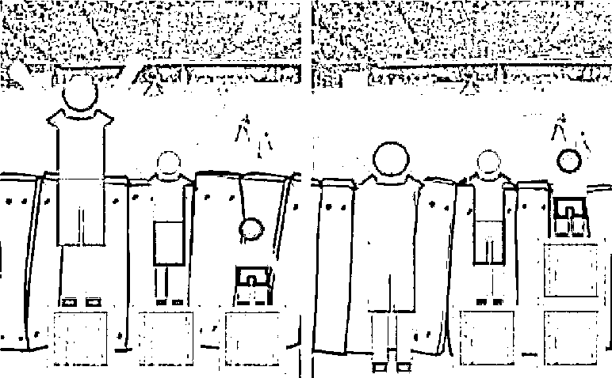

# 这只自暴自弃不想抓羊只想躺的 AI 狼火了

> 原文：[`mp.weixin.qq.com/s?__biz=MzU0MjYwNDU2Mw==&mid=2247497778&idx=1&sn=c01d94dffdc304776ed88ad01edd0958&chksm=fb1a944ecc6d1d587648d970247a0ae96fdf795f87537df9aaaca1d72fafcbfe1cbff46e9a36#rd`](http://mp.weixin.qq.com/s?__biz=MzU0MjYwNDU2Mw==&mid=2247497778&idx=1&sn=c01d94dffdc304776ed88ad01edd0958&chksm=fb1a944ecc6d1d587648d970247a0ae96fdf795f87537df9aaaca1d72fafcbfe1cbff46e9a36#rd)

最近网上有个狼吃羊的 AI 训练小游戏纷纷在传，很有趣。 

这个游戏的设计规则是如果狼抓到羊，就奖励 10 分；如果狼撞到了障碍物就扣 1 分；为了避免狼磨洋工，待在原地不动，每秒钟狼都会被动的扣 0.1 分。 

他们训练了这只 AI 狼 20 万次，结果 AI 狼选择开局直接撞死，工程师们大为不解，于是开始人工推算各种选择的概率。 

他们惊奇的发现，如果狼开局直接撞死，只扣 1.1 分，撞死 1 分，第一秒的惩罚 0.1 分。

可是他朝羊走两步再选择撞死，就有可能扣 1.1 分到 2.4 分，因为有可能撞到障碍物，路程花费的计时扣分也更多。 

他有时候能够吃到羊，但总体来说，是不划算的，因为吃到羊的奖励，10 分，不足以弥补抓羊的风险损失。

当然，从游戏设计的角度看，出现这个问题的原因在于分值。如果抓一只羊奖励 100 分，或者待在原地不动，每秒被动只扣 0.01 分，又或者撞到障碍物，只扣 0.1 分，再或者主动撞死直接扣 1 万分，都足以改变这只 AI 狼的选择，让他努力抓羊，或者不得不努力抓羊。

但是，这个设定的不太合理的奖惩制度，恰恰像极了很多人对生活的体验。 

于是网友们纷纷说，这只 AI 狼好聪明，它学会拒绝卷了，它选择直接躺平。 

呵呵。 

其实躺平不失为一个好选项，对于某些人来说。

[我们昨天小号再一次聊杠杆，风险，与策略](https://mp.weixin.qq.com/s?__biz=MzU3NDc5Nzc0NQ==&mid=2247501582&idx=1&sn=54d613f57c6bce12d489d683ad61d8f4&chksm=fd2e65d0ca59ecc6c8d22f349ed86364322e7d24e6882d165ec20ffe6f3907d912161a223dc5&token=817595557&lang=zh_CN&scene=21#wechat_redirect)，把那位高杠杆赌博的包钢工人和爆仓的交易员比尔黄拿到一起对比。 

结果收到了两个不同的后台消息，几乎是同时发出，排在一起，让人看了很有感触。

助理告诉我，两个都是很老的读者，他追踪过两个读者的全部历史留言。

第一个 18 年关注。她觉得如果能看进去那篇文章，可以让多少“雨伞族”知难而退，不再干这种没有胜算的赌博。

第二个 19 年关注。他很愤怒，他觉得文中那样的普通工人，年薪不过 6 万，不赌博，怎么可能买得起一线城市动辄数百万的房子？这是他的错么？不，这是投资环境的错。凭什么专业的就该赢非专业的？这公平么？ 

你觉得两个人谁是对的？ 

答案是，都是对的。

因为持有不同的价值观。

前者并不认为每个人都应该在一线城市买房子，并不认为每个人都应该买大房子，买不起北京的房子就在自己公司所在城市买房子好了，比如包钢的，就在包头买。

买不起包头市中心的房子就买郊区的好了，买不起大房子就买小一点好了。量力而为。包钢工人年入六万，在包头不会过不下去的。

后者关注到了公平这个话题。 

公平不是自由搏击，而是通过规则保护每个人。说穿了就是规避强者的优势，让大家尽可能的得到相似的结果，比如下图：

这张图很流行，左边是公平么？当然不是，虽然每个人脚下都有一只箱子，但是矮的那个人什么也看不到呀。 

右边才是公平，虽然高个子脚下没有箱子，矮个子拿了俩箱子，但是大家都可以看比赛了。 

**这幅图很正确对吧，有没有发现一个漏洞？或者说设计者故意隐瞒了什么？** 

我经常说，听人说话不要听他说了什么，要听他没说什么。

这个设计者很有趣，他选择的奖励是看球赛。

**看球赛是什么？是一种可以免费复制的东西，就像知识传播。一场球赛给一个人看也是看，给三个人看也是看，这个资源本身就是可以共享的。**

就像我愿意分享给你们我的认知，我怎么不愿意分享给你们我的午餐呢？ 

我的认知被一万个人拿走，我自己的那份还在我这里，我又没什么损失，助人不损己，何乐而不为？ 

我的午餐要是被你吃了，那我吃什么？

**生活中，是所有的标的都像这场球赛么？** 

如果把球赛换成一个美女，你让这三个人，谁娶？

你看到了，画这张图的人在偷换概念，他在逗你玩。 

**在看球赛这件事情上，大家好商量，反正高个子也看得到，他并没有出让什么利益，那个箱子对他而言可有可无，让出来还有好名声。** 

**而在金融市场里，你赚他就赚不到，甚至你赚，他就要赔，你觉得你还能说服他让出来么?**

所以第二个读者错了么？不，他并没有错，那就是他当前条件下的最优选择。 

面对一个分蛋糕而不是看球赛的游戏，蛋糕有人吃就有人没得吃，人家也不肯让我，我也抢不过。 

那我只有两个选择，一个是像第一个读者一样，放弃这个目标，转而寻找自己够得着的，比如去找馒头。另一个就是跺脚骂。 

后者没有错的，他只是不愿意放弃蛋糕这个目标，不愿意不是一种错。不愿意本身也是一种选择。

我就想吃蛋糕，你甭管我够不够得着，我就想吃蛋糕，这件事有错么？ 

没有的。

这是一种选择，你自己的选择。

你有什么，你要什么，你愿意放弃什么。 

我只有劣势，够不着，但我就要吃蛋糕，我愿意放弃其他所有可能，比如馒头包子饺子，我想清楚了，我没有错。

再举一个例子，咱们的助理跟我说，别的平台上的留言，比微信上的留言档次低很多。 

我的文章会在微信首发之后，继而转发到其他平台上，只不过我没空去看，我只看微信留言，其他都是助理打理。

他给我举了一个例子，就是[张三烧耐克鞋那篇文章](http://mp.weixin.qq.com/s?__biz=MzU0MjYwNDU2Mw==&mid=2247497576&idx=1&sn=21d176026d1b466e744f77c2b933bd61&chksm=fb1a9b14cc6d12025596585879f3ef7bc53c21ae608216445baa35a8a9269097c3d50943e3fa&scene=21#wechat_redirect)。 

别的平台上，至少有一半的人在喷，他们在说，这是个利益问题么？不，这是骨气的问题。 

张三烧自己的鞋子好样的，他是个有骨气的汉子。

助理看了之后就感慨，说这么多年过去了，还是有那么多人像阿 Q 一样。 

他感慨的这句话我给翻译翻译，因为很多人恐怕都忘记了。

阿 Q 是个受气包，走哪儿都让人看不起，但是他有一种本事，就是把别人对自己的看不起，换个领域转嫁到第三者身上。 

比如钱太爷，阿 Q 是万万惹不起的。但是钱太爷的儿子去东洋留学回来，把辫子给剪了，还穿着西装，没有像赵秀才一样走科举仕途之路。 

于是阿 Q 就在心中：“呸，假洋鬼子。”

可是真当钱太爷的儿子欺负到阿 Q 头上的时候，他敢反抗么？不，他不敢的。 

他只敢去欺负小尼姑，去欺负比自己弱的人。

助理不愧是北大的，深刻的理解我那天文中打的比方。 

那天文中我举例子，自南宋理学兴起，自己的媳妇被金兵强暴了，不敢打过去，不敢把那个强盗正法，而要自己的媳妇上吊守节。 

别人欺负你，你欺负更弱者，这不叫骨气。 

**烧自己的鞋子不叫骨气，让自己的媳妇上吊不叫守节。在哪里丢掉的场子，在哪里找回来，谁打你，你打回去，那才叫骨气。**

我的助理能准确理解我的意思不稀奇，他要是这点水平都没有，当年怎么考上北大的？ 

但是他有一点理解错了，我要在这里批评他。

我写这种东西不是给所有人看的，而是给个别人。 

阿 Q 这种思维模式是一定存在的，再过五百年，依然有相当多数人是这样。 

**那不是一种错误，那是一种在他的处境下的最优选择。** 

阿 Q 没有办法打过去的，明白么？智商，情商，性格，环境，方方面面，所有领域他都处于绝对劣势，他没有办法改变的，这是一个事实，你必须要承认。 

你的起点只是穷，可你爱学习，爱思考，勤奋，聪明，又能不断的跳出舒适区，所以你考上了北大，你变成了高薪收入者，你有两套房子两部车子。 

阿 Q 有什么？他什么都没有，他在所有领域，所有方面都是绝对的劣势，他唯一能做的，就是用尽全力守护自己最后的“面子”。 

印度人为什么烧寡妇？因为只有在那一刻，只有火燃起来的那一刻，他觉得自己还活着，觉得自己活的比被烧的那个寡妇“高贵”了那么一点点。

他一辈子都在被人看不起，只有火燃起来的时候，他终于有机会看不起别人了。

咱们那些喷喷们，烧寡妇了么？没有嘛。但是有一点他们和无知的印度人一样，就是他们一辈子都在受窝囊气，一辈子都在看别人脸色，无论家里还是外面，一辈子都抬不起头。

回到现实生活，他很压抑，真的很压抑，就像阿 Q 一样，谁都不给他好脸。

你让他怎么办？他只想找一点自己高人一等的感觉。 

通过骂不烧鞋子的人，他内心深处忽然觉得自己比别人终于有个地方强了那么一丢丢。 

看懂了吗？这是人家内心深处的需求，这是人家自己发明的道德优越感。

人家已经是个阿 Q 了，人家在现实中够可怜了，人家想精神上自我愉悦下，你都非要拆穿，小助，你的行为符合北大教你的精神么？符合蔡元培的兼容并包么？ 

何况你这个小助，还是个学文的，圣人教你的忠恕之道呢？ 

K 完员工，回到我们的主题，AI 狼。 

我不知道读者有没有注意，游戏只引入了一只狼。

可现实的环境中，狼有很多的，每只狼面对的参数是不一样的。 

有的狼的跑得快，每秒 0.1 分的惩罚对它而言是划算的，有的狼跑的慢，每秒 0.1 分的惩罚对它而言是致命的。 

有的狼判断力准，碰到障碍物的概率低，有的狼判断力差，常常碰到障碍物。

也有的狼走在正确的找羊方向上，而有的狼，南辕北辙。 

你觉得这难道不是像极了真实的生活么？

有的人待在风口，有的人智商情商逆商什么商都很高，有的人反应敏捷行动力强且自我矫正快。但是有的人，一切都相反。

有的狼已经在研究如何“能远程，能近程，能魔法，能攻击，还能变身德鲁伊.....”。

而有的狼，发现无路可走，只好碰石头。

分享思考的目的不是为了改变所有人。就像游乐场的快速通道，分享的目的仅仅是帮助一部分人去体验更多的游戏，而不是指望所有排队的人都能排进去。