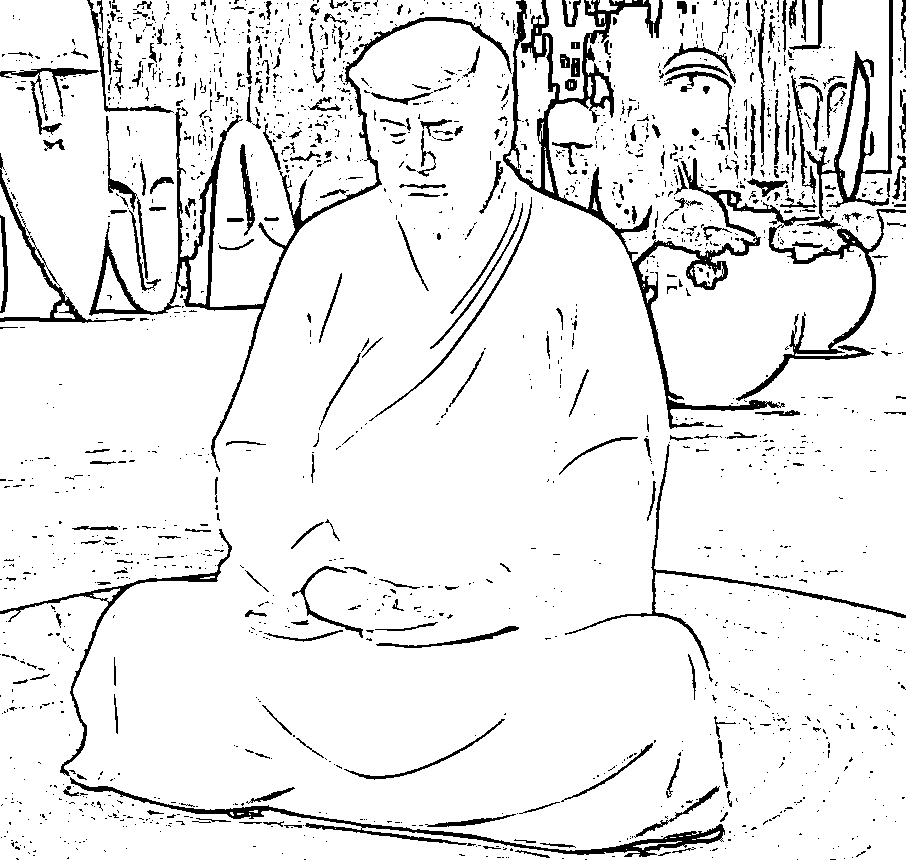

# 我预定了一尊懂王的雕像，号称“西天懂佛”

> 原文：[`mp.weixin.qq.com/s?__biz=MzU0MjYwNDU2Mw==&mid=2247497355&idx=1&sn=8c124a467d9c4528d168ed87926f25c5&chksm=fb1a9af7cc6d13e10eb85b5fa7e8a23cf17abd17496093eda6d22585a74f0406774972dd9924#rd`](http://mp.weixin.qq.com/s?__biz=MzU0MjYwNDU2Mw==&mid=2247497355&idx=1&sn=8c124a467d9c4528d168ed87926f25c5&chksm=fb1a9af7cc6d13e10eb85b5fa7e8a23cf17abd17496093eda6d22585a74f0406774972dd9924#rd)

我也是无意间看到有人报道，有这么个东西，如下图： 

在哪儿看到的不方便告诉你，因为严格意义上讲，生产，销售，以及购买此类商品，都是涉嫌法律纠纷的。 

因为商家并没有得到设计，生产的许可，这么做涉嫌侵犯肖像权。

当然，我们赌的就是懂王不会派人来告状，所以就有人这么做，也有人私下里购买。 

我在网上看到的是小尺寸的，只有几十厘米高，我要烧的比较大，要特殊定制，专门建模。 

我有一个想法，本来打算在地下室采光井正对着的松树盆景的旁边摆一副立着的日本武士铠甲。 

你去看 NHK 的大河剧，剧中武士们都喜欢在自己坐着的地方旁边摆放一副铠甲，当然，他不是为了装饰，他是为了穿，随时穿着去打仗。

但是我后来发现一个问题，这种带着面具的铠甲放在那里，光线不好的时候，傍晚看起来如同鬼魅，会把自己吓一跳。

所以我换了一个主意，我希望放一尊如同真人坐着相同高度的“西天懂佛”的雕像，这样每次去车库都能看到。我还准备在他脑袋后面的墙壁上再弄一个光圈的灯带，这就自带神像效果了。

你们肯定以为我又在调侃懂王，未经他人同意，把人家的雕像摆回家，还这么嚣张，西风，你太过分了。

这次不是的，我是真心的，因为我真的很喜欢这个“懂”字。

对投资来说，“懂”就是吃饭的家伙。 

**如果把投资这么复杂的事情浓缩成一个字，就是“懂”字。**

以懂博弈不懂，这就是赚钱的必经之路。

我说过无数次，什么情况下你才能确定的，长期的赢牌？ 

**只有和相对于你不懂的人在一张桌子上玩牌，才能确定的，长期的赢牌。**

如果四个人打麻将，另外三个都比你更懂，如果要赢，那是运气，时间长了，你必输无疑。 

咱们那天聊[怎么看王石写了又删的“千年不遇”通胀“洗劫”论](http://mp.weixin.qq.com/s?__biz=MzU0MjYwNDU2Mw==&mid=2247497236&idx=2&sn=20a3652c439e9c569c0cec7835a21739&chksm=fb1a9a68cc6d137ea5e7915f5cc43e3d854019447005d6dd3a4990f5d560d9710eba271b3cec&scene=21#wechat_redirect)。 

我说了一个很重要的话题，对于大多数人来说，流动性差反而产生了好结果，因为他被动的降低了交易频次。 

你知道为什么要降低交易频次么？ 

就是因为你不懂。 

你和比你更懂的人在一张桌子上玩牌，圈数越多，你输的概率越大。 

这就是为什么有一种说法，一个素人去赌场，最好的策略就是只赌一把，无论输赢，转身就走。 

因为只有第一把是公平的，你等于和庄家在赌命，赌运气。次数越多，懂所能发挥的作用就越强，不懂的人就越发处于劣势。

**这就是为什么越是素人，越要降低交易频次，你翻来覆去的买进卖出，就是送人头的行为。**

但是我们反过来想，如果你是强者的那一方，如果你是更懂的那一方，你要怎么做？

你要反复逼迫对方加速出手的频次，你要强迫对方不停的跟你开新局，不断地对赌。

这样才能提高你手头资金的利用率，就像餐厅提高翻台率，你才能在单位时间，单位资金范围内，赚取更多的钱。

这就是高频的前提条件。

高频的本质就是我比你懂得多得多，只有在绝对不平等的牌桌上，你才能干这种事儿。

巴菲特当年骂过西蒙斯，他说西蒙斯就是个贼，说的其实没有错。

严格意义上讲西蒙斯就没有在投资，他就是在盗窃，利用美国交易系统的漏洞，不断地在合法盗窃。

你堵一个漏洞，他就升级一次手法，就像病毒与防火墙。所以他开的那家 Rentec，名字就叫做文艺复兴科技公司。里面雇佣了大量的科学家。他本人也是顶级数学家，和陈省身齐名。

他们公司里很少做金融的，为什么这么多科学家，工程师？就是研究交易平台，交易系统本身的漏洞。 

比如软件和硬件之间的传输时间，比如图像捕捉技术，比如平台间通信的延迟，乃至你一个指令形成的数据包，通过网络各个节点到达服务器的先后排序。

这从头到尾就不是在投资，这就是在研究赌场的角子机有什么 BUG。 

所以巴菲特骂他的理由就是金融本身已经很不公平了，这虽然表面上是一个猜密码的游戏，但每个人的信息量不一样。 

而你现在竟然拒绝猜密码，干脆雇了一群科学家，暴力破解密码，这样还玩什么玩？ 

是的，这么做很无耻，但合法。所以老巴也只能骂骂了事。

这个背后其实揭示给你看的，就是懂字。 

**我曾经说过，人世间最大的不公平就是信息不对称，比信息不对称更不公平的，是有些人连信息都不用获取了。**

懂的程度不同，影响着很多事情。 

当然了，人世间最懂的，自然非懂王莫属，所以他叫西天懂佛嘛，家里摆一个，图个彩头。

咱们昨天聊[合肥 29 岁全职妈妈携子女跳楼的警示](http://mp.weixin.qq.com/s?__biz=MzU0MjYwNDU2Mw==&mid=2247497274&idx=2&sn=7c0589446c809ee6cd56f09fa9d9f5ac&chksm=fb1a9a46cc6d1350d572f8d49f89cd45e5c44367b1b6f896aef66841ce1c513210c1cd2deb4e&scene=21#wechat_redirect)。 

文末我描述了自己刚毕业第一年前 10 个月，住阁楼日租房，住 6 平米的小房间，住回迁房隔板间，不仅每几个月换次房，都选很差的，离职的最后一周还提前退房，住公司，住澡堂。

有些人说，吃苦是福，是财富，感慨我年轻的时候就懂了。 

那你错了，我不是这意思。

我不认为吃苦是什么财富，吃苦就是吃苦本身，就像失败就是失败，从来不是成功之母。 

从吃苦中学到了点什么，从失败中学到了点什么，你学到的那点才是成功之母。

如果什么也学不到，那只是祥林嫂。

我要是单纯为了吃苦，就会住在 6 平米小房间里 10 个月，就不会这么翻来覆去的折腾，每个地儿都只住仨月。

**我想要的不是吃苦，我想要的仅仅是了解，了解就是为了懂。** 

有的人，租了一间房，住了一年，回头房东要卖房，不肯续签，他不得已搬家找房，非常麻烦，于是哀叹，生活很苦。

这种文章十几年前我就在网上看过，所以当时我就是要弄清楚，这里面有多少弯弯绕。 

于是我每个地儿只住三个月，十个月搬了四次家，最后还嫌不尽兴，在公司里睡，在澡堂子里睡。

通过实践，我找到了解决问题的方法，就是减少不必要的行李。 

比如当时我所有的家当，一个箱子就能装下。搬家就是一个行李箱，提着就走了。绝对不会像货拉拉那次惨案里面，上下搬运 13 趟。

我的行李箱里就只有一个睡袋，非常薄，但是保暖。保暖不是非得要厚度，空间密闭效果是一样的。 

内衣，冬夏各两套，外套，冬夏各一套，一双球鞋，一个靠枕。洗漱，毛巾，手机，充电线，完了。就这么多。这就是我当时全部家当。电脑都不需要，我一毕业做码农的，笔记本走哪发哪儿。

所以我冬天穿羽绒服，热了把口子解开，再热就衬衣，衬衣就是冬天的内衣，复用了，还可以外穿，再热就 T 恤了。 

U 形靠枕在公司可以睡午觉，回到家可以当枕头，出差坐飞机还可以当脖垫。 

那你说冬天睡觉怎么办呢？很简单，开空调。还嫌冷，就穿着外套钻进睡袋。 

你看到了，频繁搬家被我用减少行李，完美的解决了。 

我是为了解决这个问题么？当然不是。我当年做这件事，目的是为了寻找适应长期出差的办法。

虽然当时我的工作不需要长期出差，但我看到老板们都是天天飞的，而且经常是中美之间飞。

有时候，这里面不完全是钱的问题。比如你去的地方可能很小，公司哪怕预算很足，够给你住五星级，也没法落实，因为当地可能就那个条件，有张床，仅此而已。

而有的时候，则是时间不足。可能你一天之内要飞三个城市。你可能根本就没有时间，我是说连睡觉的都时间都稀缺。 

这种情况下，你一定要习惯于逮哪儿住哪儿。能在车上睡觉，能在飞机上睡觉，能在候机室里睡觉，随便找个机场卫生间就能刷牙洗脸。

而且如果你一年 365 天，天天在不同的城市，你就不应该有家的概念，也不应该有私人物品的概念。

你要习惯于所有私人用品统共不超过一个行李箱。

再举一个例子，十年前投身甲方的时候，我就好奇，大老板为什么连装修一个展厅，预算 500 万，他都要一笔笔算给你看，看，这件事能够砍到 200 万。 

要知道，当时集团内部胡乱报销成风，别的不说，就是马路侧对面那一家小饭馆，一年谎报的发票餐费都不止 500 万。你想想整个集团那么多万人分布在大江南北。

我当年很年轻，就好奇，那帮鸟人你都不管他们，这点小事，你反而如此睿智，何解？

当然后来我懂了，其实大老板从来也没人能骗他，他从头到尾都是清楚的，只是不同的事情扮演两种不同的角色。

有时候，他是懂，拆穿给你看；有时候，他是懂，装作不懂，让你觉得你能晃点他。

就这么简单。 

他不让外人赚集团的钱，说白了，这是一种本能，做生意的本质就是多进少出，低买高卖。

他允许内部人赚钱，是因为他清楚水至清则无鱼，没有那么多德才兼备的愿意投靠。如果他下面的人弄不到钱，就跑光了，毕竟人家去互联网大厂，每年合理合法就能收入几百万，谁会拿着几十万给他卖力呢？

这是个很现实的问题，由于种种限制，他没有足够的预算，又不想用一些没有能力混日子的。 

换句话说，他的底线始终很明确。你真的晃点我是不可以的，我假装被你晃点了，是可以的。 

明白这意思吧？主动权得在他手里，他得时刻握着强者真正意义上的信息优势，所以他才是业内枭雄。 

你也可以认为，这是一种对懂的渴望，对懂的占有，对懂的迷恋。

毕竟只有懂，才是这个世界上真正的财富。

所以这个雕像还是很有市场的，毕竟对着懂王的雕像，可以每日三问吾身，今天，你懂了吗？