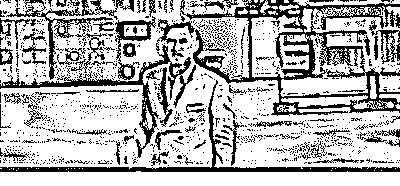

# 有时候你差的就是这句话：“耶稣也留不住他，我说的！”

> 原文：[`mp.weixin.qq.com/s?__biz=MzU0MjYwNDU2Mw==&mid=2247494116&idx=2&sn=7a25194c5934e9e47262388848eb8fab&chksm=fb1a8598cc6d0c8eb88b410cb8095c99b13e6dd472b2bae7bc0dcffc7b61905497ec094ae504#rd`](http://mp.weixin.qq.com/s?__biz=MzU0MjYwNDU2Mw==&mid=2247494116&idx=2&sn=7a25194c5934e9e47262388848eb8fab&chksm=fb1a8598cc6d0c8eb88b410cb8095c99b13e6dd472b2bae7bc0dcffc7b61905497ec094ae504#rd)

这是咱们一位小读者的留言：

“西风，考研倒计时还有四十天，关注您的号已经半年了，每篇文章我看了，都说大学是象牙塔，学生都是温室里的花朵，是您这阵西风吹醒了处在梦中的我。

从那时起，我真正下定决心要考研！别人问我考研的动力是什么？我说：“我任何时候的动力都是我要前往信息高地！考研也是。”

别人笑笑，云里雾里的。我不去解释，但我知道您一定能懂的。

我是农村孩子，辛辛苦苦考上大学，按照你的标准，我是高考失败的，我没有办法，我已经拼尽全力了，无奈出生于高考大省，只得了一个超越一本线十几分的成绩，很失败吧……

但我想我一定能配得上我想要的。我也想和爸妈说一句“我考上了。”我太想了，我很累，可环境太差，学校垃圾不让租房室友通宵打游戏，老师一堆实习实验作业期末考试，我快被拖垮了。

西风，能给我一些人生建议吗？考研是我目前能想到的接触到更高层次信息的唯一办法了，不怕您笑话，我们家几代人就出了我这么一个大学生，以至于我考了村里人都知道，我妈觉得我考上大学就够了，可我明白学历贬值。我和父母那代人对于学历的期待不一样，您肯定懂。

给我些人生建议吧，我接下来怎么走，无法改变现状，只能熬自己，但有很多事分心，请问您是如何做到不受外界干扰的，我是一个普通人。”

说实话，我没看懂。

留言的开头告诉我你有不普通的想法，留言的结尾告诉我你是个普通人。

所以？你想说什么？

**我不是很明白，既然你都认定自己是个普通人，那普通人为什么要有不普通的想法呢？** 

通常普通人只会出现在两种人的口中。

第一种：成功人士。

比如马化腾，他赢了，谦虚跟大家讲，他只是个普通人，无非家里住的稍微大了点。

回头你去看，他家比好几个足球场加起来都大得多。

第二种：真的很普通。

我们国家有近半数的人月收入不超过两千块，只要你一个月挣三千，恭喜你，你已经成为普通人中的佼佼者了。

你自己也说了，你要考研，我不相信你们班都能考上，能有 1/5 不错了。

谁是普通人？剩下的 4/5 就是你们班的普通人。

如果你认定自己是普通人，为什么要考研呢？

你想证明什么？你想证明研究生的录取规则有问题？

不应该择优录取头部的 20%，应该录取尾部的 80%？

所以我看不懂你的逻辑。

一方面你渴望那些极少数人才能享有的东西，另一方面，你又认定自己是个普通人。

那我只能认为，你想吃饭不给钱。

觉得我跳跃的不要急，给你们讲个故事就明白了。

有一本电影，不记得什么名字了，好像是魔鬼交易人还是什么。

剧中的主人公想要得到金钱，权势，唯一的办法是和魔鬼做个交易，出卖自己的灵魂。

他这个人很纠结，又想要金钱权势，又舍不得自己的灵魂，就这么个故事。

我们想一想，成功是什么？

成功不就是一笔交易么？你和上帝之间的交易。

上帝问你，若我许你成功，你愿意放弃什么？

你跳上祭坛，二话不说把自己献祭了，这就叫交易。

当然，这是理想情况，现实比这个糟糕的多，因为肯献祭的人太多了，而成功的名额没有那么多。

于是就变成一群人接二连三的跳上祭坛，只能换一个抽签的机会。

很多个献祭的人里面，运气好的那个，也许会抽中成功，即便如此，追求者依然如同过江之鲫。

那我们想一想，什么叫做普通人想要不普通的结果？

就是说，你只想付出普通人的努力，承受普通人的打击，但希望得到不普通的结果。

你觉得有可能么？这和吃饭不给钱有区别么？

那些把自己献祭了又没有抽中签的人听到了情何以堪？

**我们在追求稀缺事物的时候，往往只看到自己，看不到别人。**

你看到一个美丽的女子，关关雎鸠，在河之洲，窈窕淑女，君子好逑。

可是你尽力的对她好，她还是不肯嫁给你，是她错了么？

是你错了。

**你没有意识到，你并不是她唯一的追求者。**

你不能光看你能付出多少，你要了解下在所有她的追求者当中，你付出的排名是多少。

**我们很多时候，并没有感动那个美丽的女子，我们只是把自己感动了。**

我们之所以会被自己感动，是因为从小的教育使然。

比如我上幼稚园的时候，有个传统项目叫做排排坐，吃果果。

就是老师让大家挨着坐下来，只要你听话，坐的端正，就有果子吃，例如小蛋糕。

我不喜欢这个传统项目，我觉得这是在耍猴，确切点说，是我们在被当猴耍。

有一天，我把整块蛋糕一把撸在地上，然后举起盒子里仅剩的那一小块，对小伙伴们说：来，咱们抢它。蛋糕只剩一块了，谁抢到归谁。

当然结局是不美好的，我被开除了。

我上过三年幼稚园，但等于没上，因为转学多家，回回被开除。

跟学校百般道歉无用后，我奶奶把我接走了，她跟我说，我没有教养。

但我没有认错，我觉得老师错了。

我那时候很小，不可能懂什么教育理念，我只是固执的问奶奶。

今天我想要的是一块蛋糕，老师可以弄来，大家排排坐，吃果果；明天我想要月亮，你是不是也能给我弄来，大家排排坐，分月亮呢？

能听懂小孩子的逻辑吧？

用成人的语言翻译下：当我的欲望小于你的供应时，可以排排坐，等着你喂；可当我的欲望大于你的供应时，当然是靠我自己抢。

前者就叫做普通人思维，后者就叫做不普通。

前者的教育是有问题的，人的欲望是会上升的，明白么？

**排排坐，吃果果的游戏没有告诉孩子们，果果的边界在哪里。**

他让孩子们误以为，只要乖乖的坐好，就能得到一切自己想要的。

事实上，幼稚园里的果果仅限于一块小蛋糕，如果你想要变形金刚，那是没可能的。

但这一点，老师不会说明，很多人也不会去想。

等他们长大了，他们会觉得，你看，我有听话呀，你让我上学我上学，你让我工作我工作，但是果果呢？

果果呢？果果怎么没有了呢？是不是被当年班上那个坏小子打烂了？

其实果果给你了，果果就是月薪两千块。

六亿人的收入低于 1000 块，说明每月两千块的工作就是那个果果，多了没有了。

这时候大家傻眼了，我以为果果是考上研究生，我以为果果是年薪百万，我以为果果是漂亮媳妇，我以为果果是北上深的房子......

结果你告诉我，果果只是月薪两千块的工作，你丫挺的忽悠我啊？！

其实没人忽悠你，付出普通的努力（乖乖的坐好），得到普通的结果（一块小蛋糕）。

如果你想要不普通的结果，那就靠自己的力量去取呀。你把全班都打趴下，整块蛋糕都归你，这叫不普通的模式。

你的收益和你的风险是成正比的，你有可能被打的像熊猫一样，结果连一小块蛋糕都得不到。

你也可能抢到了蛋糕，但是被老师叫家长，甚至开除了。

但无论怎么样，这都是你选的吧？

你总不能说自己开启战端，结果被暴揍了一顿，然后跟老师讲，他们抢走了我的蛋糕？你好意思么？

**当你决定做一个不普通的人的时候，你已经做好了接受一切惩罚的准备。**

有些老读者，看过我的考研生涯。

我当时本科翘课太多，以至于考研考不出，就没法毕业。

知道怎么创造奇迹么？先捅一个天大的篓子，一个没有奇迹就补不起来的篓子，然后你就能创造奇迹了。 

**人，想要不普通的结果，就别去想着做个普通人，天底下没那好事儿。**

要快速成长，最简单的办法就是一个人跑去一群人的面前，说：你们老大我吃定了，耶稣也留不住他，我说的！

或者像叶问那样高喊：我要打十个......

恭喜你，从此你就开启不普通的模式了。 

接下来你要么被一群人追着打，要么创造奇迹......

生活很简单的，不要老想着拿 50 块钱从上帝兜里骗 100 块钱的好事儿。

上帝忽悠人类的时候，你太爷爷还穿兜裆布呢，你能忽悠的过他？

想要得到任何稀缺的东西，就要做好经历残酷命运的准备。

Do you know that the harder thing to do, and the right thing to do，are usually the same thing？

Nothing that has meaning is easy. 

Easy doesn't enter into grown-up life.

📹 [`v.qq.com/iframe/preview.html?width=500&height=375&auto=0&vid=c0818o0xt3g`](https://v.qq.com/iframe/preview.html?width=500&height=375&auto=0&vid=c0818o0xt3g)