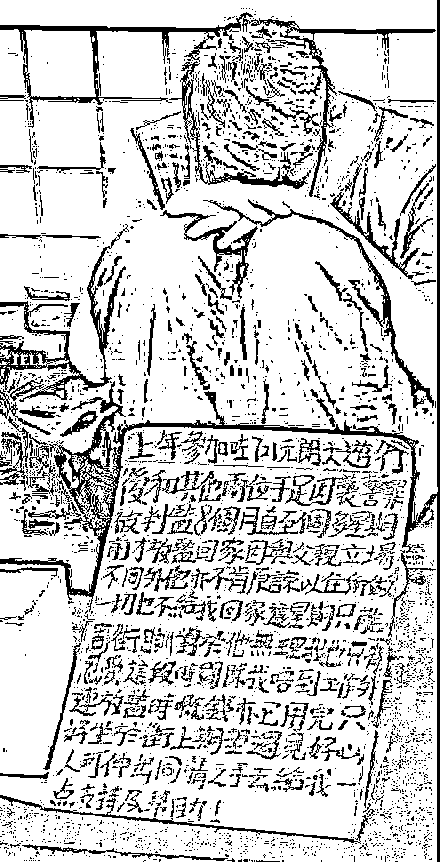
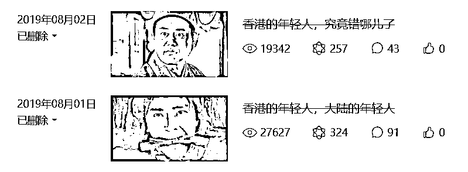
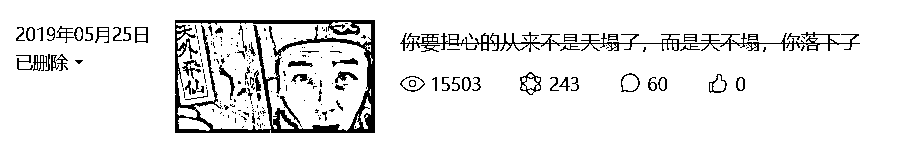

# 不听老人言，吃亏在眼前

> 原文：[`mp.weixin.qq.com/s?__biz=MzU0MjYwNDU2Mw==&mid=2247492665&idx=1&sn=415e310e5fa157f78b071313ac1648f0&chksm=fb1a8845cc6d0153e9513a0b4091557362c049d4322a58540b2866da8a6699c81890ff67e815#rd`](http://mp.weixin.qq.com/s?__biz=MzU0MjYwNDU2Mw==&mid=2247492665&idx=1&sn=415e310e5fa157f78b071313ac1648f0&chksm=fb1a8845cc6d0153e9513a0b4091557362c049d4322a58540b2866da8a6699c81890ff67e815#rd)

给大家看一张图，黄金周香港街头的一张图。

图中是一个青年，字牌上写的很清楚，去年他参加了元朗的游行，因为打砸抢去号子里吃了 8 个月牢饭，刚出来两星期。

现在状况很不好，本来大陆的游客就少了 99%，又叠加疫情，号子里出来，回到家老父亲不待见他，扫地出门，流浪街头。

“哥哥姐姐们，行行好吧，给口饭呀，不然我就要扑街啦......”

还记得我去年被多少读者骂么？

这些都是我写的，去年 8 月。

你看到被删了，不是网管删的，是我自己主动删的。

为什么？

因为骂的人太多了呀，喷子们不停的骂我，骂到工作人员都来不及处理，那干脆删了，都别看了。

我当时讲的很清楚，建议香港的年轻人，回去读书，不要只有情绪，没有脑子。

喷子们骂我什么？骂我没有情绪，脑子里只有利害。

骂的对呀，我一个职业交易者，要是有一丝一毫的情绪，我就挂了，就爬到天台上排队去了。 

我就是没有情绪呀，我就是只懂得利害呀。

我是怎么说的？

你这么年轻，要好好读书，不要干那些没名堂的事情，不要为那些心怀叵测的人火中取栗。

我怕这些年轻人因为不读书，连火中取栗什么意思都不懂，还耐心的解释。

我说的很白了，你信这些人，回头你坐牢，你的女朋友跟他们跑了，你一个人流落街头讨饭食。

14 个月过去了，你看看，是不是流落街头讨饭食？

我不是料事如神，我只是过来人。

你大哥我行走江湖的时候，你还抱着奶瓶在海洋公园里看安安与佳佳呢！ 

这是对香港的年轻人说的，对内地的年轻人，我也说过呀。

把时光再往前推几个月，17 个月前，内地的年轻人，铺天盖地的聊川普对华为的制裁，一个比一个变得没信心。

我写的是什么？

我告诉你们，科技行业的春天来了，尤其芯片行业的从业者，尤其有股票的那些人，尤其公司属于业内小龙头的那些。

你们的春天来了！

喷子们依旧骂我，骂我迷之自信。

你今天回头去看，我有说错什么？

去年我有很多小伙伴内心动摇，他们跟我讲，华为都被制裁了，是不是接下来要轮到他们公司了。

而且老板也很凑趣，上赶着裁员，不断地释放悲情气氛，打压他们的心理预期，暗示他们赶紧跳槽。

而我，反复的劝他们，只要有期权的，留下，留下，留下，你再等一年看看，科技的春天就来了。

你要面临的不是制裁，而是发财。

你今年再看，你们公司是不是风向 180 度大转弯？上市已经进入审批了，再过个一年，就上去了，两年后就能卖第一笔股票了。

前前后后也就那么三年，有的人升天了，有的人，打道回府了。

人生际遇往往就在一瞬间。

我这么笃定的建议你，理由很简单。

两只霸王龙打架，一定会掉点肉沫儿下来，这点肉沫儿，一定掉在你现在所在的这个位置。

你要做的，就是把嘴张大，傻傻的看着天。

天上真的会掉馅饼，而且就在这个位置，张嘴，站立，保持不动，足矣。

这个逻辑我去年在小号里写过一系列的文章，说的那么清楚了。

人家掐我们的科技脖子，我们有什么选择？你告诉我，除了扶植国内科技领域的企业，还能有什么选择？

怎么扶持你告诉我？除了给钱还能怎么扶持你告诉我？

那怎么给钱呢？就是让你上市呀。

原来你求爷爷告奶奶，满地打滚都上不去的市，现在八抬大轿送你去。

资本市场怎么会不热捧你们呢？它不追捧你，还能追捧谁嘛。

买房子也不允许呀。

**我不管你能不能做出来，我也不管你是不是真的行，但有一件事，是一定会发生的。那就是你们一定会发财，一定。**

**因为资本是买预期，不是买事实。**

你好好琢磨这句话，**只要你站着预期位你就会发财，哪怕你搞不定也会，这一点和事实无关。**

所以我去年那个时候不停的建议本来就站对位置的读者，要坚守。

有期权，待在重点扶持的行业，待在龙头公司的，要坚守，熬一熬，下辈子都不愁了。

没有期权，待对行业，待在龙头公司的，要努力，人生很长，但能够决定你命运的，就那么几个关键点。

如果你是学生，要加速，红利期有个时间段，你赶不上早班车，说不定能赶上末班车。

如果你岁数大了，像我这样；或者行业距离很远，跳不过去，那祝福别人就行了。

你现在去看，你去看科创板上市的速度，你去看那个市盈率，你看看他们是不是爽爽的套现了一把又一把？

这就是财富重分配。

我告诉读者的就是这么一个朴素的道理。

我昨天为什么说值得为朋友圈里那些财富自由的声音开心，因为他们做出了正确的选择。

我很清楚，公司上市前的那一刻，往往是个人内心最动摇的。

为山九仞功亏一篑，行百里者半九十，你熬过了太多苦日子，所以当幸福砸来的时候，你往往会精神错乱，瞎决策。

而你老板们，此时此刻，也会刻意晃点你，释放公司不行了的信号，让你犹豫，让你恐慌，让你离开，从而低成本的把你的期权收回来。

他比你懂得多，我说的这些天下大势，他门儿清，他就是在算计你不清不楚，他就是刻意的利用信息不对称，来收割你。

你能躲过这一关，以后就是资方了，出门右拐，你也去做天使投资人了，和你的老板平起平坐。

熬不过这一关，你还是你，他还是他。

两类话题都挨骂，香港的喷子骂我，内地的也骂我。

为什么？ 

骂我的话就是答案。

他们骂我什么？

骂我现实。

恭喜你，骂对了，我就是这么现实啊，就是这么现实啊，就是这么现实啊。

现实，就是我的长处啊。

咱们今天聊的这位年轻人，坐在元朗的街头，立个牌子，抱头痛哭，他女朋友跟人跑了，他好害怕，他好迷茫。

咱们昨天聊的那位年轻人，刚套现，其实一样迷茫。

他最近刚买了一套核心城市核心地段的精装大别墅，一个人坐在空旷的家里，拿个手机，抱头痛哭，给我发微信说，那么多女生追他，他好害怕，他好迷茫.....

你让我说什么呢？

有钱人的生活，就是这么朴实无华，且枯燥.....

两个人都很年轻，两个人都很枯燥，两个人都很迷茫，但我喜欢后者。

因为后者还有办法引导。

你有钱不会花是吧？没关系，我教你。

有钱还怕没地儿花？

去看看谁生病了，跳出来，替他买单；

去买点好酒好菜，上工地，送温暖；

谁上不起学？谁有梦想？过来排队，领取天使投资。 

.....

我分分钟让你的脑袋后面冒出理想主义的光圈。

我告诉你，有钱，想成为理想主义者，太容易了，把钱分了，财散人聚，你就成功了。

但是反过来，没钱，想成为理想主义者，太难了。

你兜里一分钱都没有，蹲在元朗的街头乞讨，如果讨不来呢？

你会怎么做？唱哈雷路亚？那能唱饱吗？

肚子会饿的呀，饿急了，你就会去偷，会去抢.....

不出三年，你就变成一个街头混混了，说不定还会染上毒瘾，和皮条客们泡在黑暗的角落里。

十年后，昔日班上的校花来找你，塞给你一张青葱岁月里和同学们拍的照片。

照片上，抱着篮球的你，是那么阳光，是那么积极。

可是现在.....

抚摸着因为斗殴打断的腿，抚摸着泛黄的照片，看着面前妆容精致的阿花，再看看胡茬满脸的自己，你转身走了，走的是那么一瘸一拐，走的是那么步履蹒跚，只留下一个落魄的背影...... 

曾几何时，你的梦想也是成为一个理想主义者，可你改变了什么呢？

先照顾好自己，再照顾好家人，有能力了，为社群服务，最后，去改变世界，这就叫成功。

而把次序反过来的，不是阴谋家，就是神经病。

如果那些晃点你逃课逃学去街头打砸抢的是阴谋家，那你自己，会是什么呢？

我讲的这些深刻么？这些是小学课本上的内容好不好。

修身齐家治国平天下，出自《礼记·大学》。

古之欲明德于天下者，先治其国；欲治其国者，先齐其家；欲齐其家者，先修其身。

连小学课本都没记住，还老想着改变天下，能不被人忽悠吗？

书没念好不是问题，书没念好，还老想着走邪路才是问题。

同样是年轻人，电影《一点就到家》里的这三个小伙，想着如何带领村民们种咖啡，如何带领村民们送快递，如何把村里的咖啡卖到全世界去。

他们成就了家乡，也成就了自己。

这才叫理想，这才改变世界。

这些人，才是中华民族的好儿郎！！！