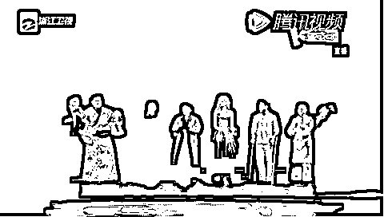
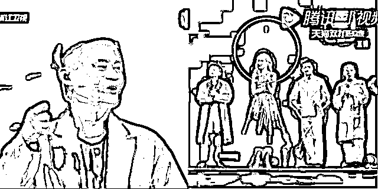

# 你以为人家在敬你酒？人家只是在宣示权力

> 原文：[`mp.weixin.qq.com/s?__biz=MzU0MjYwNDU2Mw==&mid=2247491669&idx=1&sn=f97058ea2d6389457f0bd34bd3d949ae&chksm=fb1a8c29cc6d053f63f9b514edbaae294c56e44fb39ab9e02b4fadc87a89b0ae7766dc6b76de#rd`](http://mp.weixin.qq.com/s?__biz=MzU0MjYwNDU2Mw==&mid=2247491669&idx=1&sn=f97058ea2d6389457f0bd34bd3d949ae&chksm=fb1a8c29cc6d053f63f9b514edbaae294c56e44fb39ab9e02b4fadc87a89b0ae7766dc6b76de#rd)

近日厦门国际银行北京分行中关村支行爆了一件事。

某位新员工在聚餐的时候，因为不肯喝酒，被领导给打了。 

事情是这样的，这名新员工在聚餐之前，跟支行长已经报备了自己不能饮酒，体质特殊。 

这本来很正常，就像有些人对花生过敏，有些人对酒精过敏，不慎可能引起严重后果。 

这件事当时支行长不置可否，然后大家就奔赴盘古七星酒店聚餐。

饭桌上领导多次要求他把饮料换成酒，但他拒绝了。 

酒宴过半的时候，大家都已经醉醺醺，这时候，一名领导到他面前，发酒疯，质问他为什么不给面子，甚至连大领导的面子都不给。

接着就发生了冲突，这名领导当众扇了他，而且还满嘴脏话。

之后打人的那位，被予以严重警告处分，扣两个季度绩效工资；而打人者的领导，饭局的发起者，支行的负责人，被予以警告处分，扣一个季度绩效工资。 

这个事情的处理也很有意思，通告里表示，这是工作时间之外发生的，他们聚餐也是自费的。 

说到底，就是想表示，这事儿与银行无关，是你们私下行为不当。

但实际上，**这是酒的事儿么？这是打人的事儿么？** 

恰恰都不是。 

这就是一个管理问题，这就是一个带队伍的问题。

我那天聊了茅台前董事长关于白酒好喝，他每天都来个半斤的胡诌，还做了一份问卷调查。 

[如何看茅台前董事长说年轻人不喝茅台是因为没长大？](http://mp.weixin.qq.com/s?__biz=MzU3NDc5Nzc0NQ==&mid=2247491785&idx=1&sn=26f47193ae58558d05d8589b4e6f013a&chksm=fd2e4217ca59cb01f1951bc611f44592aa2908fd9555ed7f3c63dd315f75479345766ee13458&scene=21#wechat_redirect)

抽样调查的数据显示，绝大部分的读者，并不喜欢喝酒，也不主动喝酒，更别说白酒。

这充分说明了问题。 

说明我之前的结论是对的，酒是个社交用品，它就不是拿来喝的，它是拿来完成某些特殊任务的。 

比如敬酒，主要发生在两种场合。 

**第一种是客户与销售之间。**

求人办事儿的，和办事儿的之间，也是类似的关系。

客户敬销售酒，并不是对你有敬意，也不是想要分享一个好东西，说到底，他想知道的是，你的底线在哪里。 

或者说，在你眼里，他的分量几何。

酒精是一级致癌物，如果你把酒干了，说明他在你心目中的分量很重，他是 VIP。 

非常重要的人士。 

因为你肯为了让他满意，自残嘛。

如果你自残都可以，那就可以有进一步的要求，比如，降价，或者，索取回扣。 

**第二种是团队内部，所谓团建。** 

团队内部聚餐饮酒的作用仍然是为了试探对方的态度。 

下属敬领导酒，是想知道自己在领导心目中的分量。

如果你分量足够重，领导通常会干了，因为他也不想让你不开心。

更重要的是，如果他不干，等于在大庭广众下告诉大家，你的分量还不够。

为了让大家都知道他器重你，他就得干。

当然，如果你分量不够重，那人家就不会给你这个面子。

反过来，当上司敬下属酒的时候，他想要试探的，是你的底线。

说到底，**你干的哪里是酒嘛，那分明是执行力。** 

**喝不喝，是执行力；喝多少，是战斗力。** 

上司就是想要通过敬酒，知道自己团队的执行力和战斗力，究竟几何。 

如果我们把酒，换成汽油，也是一回事。

只不过强迫别人喝汽油，太过匪夷所思，太容易被媒体关注，所以才拿酒替换。 

在上司眼里，如果你连酒都不肯喝，那又怎么说服你加班，又怎么说服你出差，甚至说服你和他一起做一些，违规的事情呢？ 

换句话说，这是一种彼此的试探，大家都想知道，对方的态度，对方的底线，以及咱们之间是不是自己人。 

**所谓的自己人，就是能不能一起做坏事。** 

如果是要拉你做好事，比如植树造林，就不需要这么复杂的试探了。 

敬酒，说穿了，就这么点事儿。 

他打你，实际上是因为他喝醉了，发酒疯，一不小心把内心深处的小秘密给曝露了。

他不打你，其实也会给你穿小鞋的，如果你是个没有分量的新员工的话。

很多人看过我之前的那篇白酒，我说我基本上逢敬酒都是挡回去。 

这是有原因的。

我之前待外企，没有这种强迫喝酒的习惯。外企大都自助餐，你随意。 

我后来待的公司，老板就是自己当年读书时的老师们，同事们很多是同学。

人与人之间有感情，是不会为难你的，取笑肯定会取笑，但不可能强迫。 

再后来我去的是甲方，我是采购方。

在与厂商的饭局上，我不逼你酒，已经很好了，你怎么可能反过来逼我呢？

而在甲方内部，我是核心的技术负责人，如果惹毛了撂挑子，会影响领导个人的利益。 

在这种情况下，别人不会硬来的，取笑一定会有，但你要是不高兴了，人家就识趣的打住了。

但假如这些条件，都不具备的情况下，比如一个刚毕业的新员工，其实不喝是很难的。

因为我前面说了，这不是酒，这就是投名状。 

如果真的身体对酒精过敏，真的建议去外企，就没有这些问题。 

但是外企仅仅是规避了酒，原理还是存在的。 

很多华人在外企里混不过印度人，原因就在此。 

说到底，你始终和老板是工作关系，没有建立私人感情。 

老外不喝白酒，不等于他们没有别的嗜好，不等于他们没有别的社交用品。

社交还是那个社交，只不过社交用品变了而已。 

比如你老板可能很喜欢冰球，印度人不管真的假的，反正人家很深入的研究冰球，也装模作样的和老板聊的很嗨。 

老板就对他有好印象，就能建立私交，就能打成一片。 

人与人之间，建立了信任，才容易升迁，小钱是靠能力赚的，大钱是靠人家信任你赚的。

人家怎么信任你？

他都不了解你，何谈信任？ 

而社交，就是了解的过程。 

两个中国人，喝过一场酒，成了朋友；

印度人跟白人老板聊冰球聊的火热，也成了朋友。

无非酒，换成了冰球，其他原理都没变。

上有所好，下必效焉。

你老板如果只是喜欢喝酒，你该谢天谢地，因为太容易了。 

事实上，真实的社会千姿百态，很多时候出的难题让你欲哭无泪。

比如你老板就是想要和王菲一起合唱，而他唱的像杀猪一样。 

那你怎么办呢？

有人就是可以做到嘛，这个人曾经写过一首歌，叫《同桌的你》。 

再比如你的老板就是想要拳打泰山，脚踢北斗。 

怎么办呢？

只能把成龙李连杰吴京甄子丹都找来，让你老板打个痛快，以衬托他江湖第一的梦想。 

甚至因为他有个武侠梦，所以下属们只好纷纷给自己起个武林中人的名号。 

来的早的，叫郭靖黄药师权且罢了，来的晚的，连田伯光岳不群都轮不到你当。

楚王好细腰，宫中多饿死，你跟谁说理去？ 

其实在这些面前，喝酒是最轻的。

有人应该记得前年有一期节目，马云在舞台上即兴自编自演了一段歌曲。 

名字就叫《哆哆哆哆》。

他唱的很投入，就像机器猫里的胖虎，自以为是个天才歌唱家。 

伴唱的一众明星主持人的表情，非常的有意思。 

甄子丹的表情是不自然的，但又强迫自己表现出一副惊为天人的感觉； 

朝青龙很幸运，长得胖，眼睛眯成缝，让你看不出来他的想法；

而华少和黄子佼，非常的谄媚，非常的浮夸，十分享受的陶醉在尴尬的歌声中；

只有妮可比较诚实，因为她是个外国人，她非常的尴尬，又不敢暴露，只好仰起头看着天，让所有人都看不到她的表情，以为她彻底被征服了。

如果现场有个二选一的机会，我相信，这几个人都愿意干一大碗白酒。

你看到了，**成年人的生活，就是这么不容易**。

但是，说到底，社交这东西一定要你情我愿。

强扭的瓜是不甜的。

任何时候，社交都不该强迫别人，无论是强迫人喝酒还是强迫人聊冰球。

聪明人不会硬劝，他会笑着告诉你，要么干了，要么把马老师的《哆哆哆哆》唱一遍。

我相信，一个人如果连《哆哆哆哆》都肯唱，他肯定是根本无法喝。

换个角度想，一个人如果连《哆哆哆哆》都肯唱，你就再也不要质疑他的执行力了。

只有脑子拎不清的领导，才会把事情弄成僵局，让彼此都没法下台。

至于打人，打人是违法的，那是另一个层面的话题。

甭管你是怎样的 VIP，哪怕打遍江湖无敌手，在华山派出所面前，都得老老实实夹起尾巴，低着头。