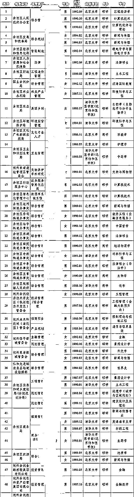

# 余杭区街道办招聘公示，生活中没有清华北大，只有柴米油盐

> 原文：[`mp.weixin.qq.com/s?__biz=MzU0MjYwNDU2Mw==&mid=2247491664&idx=1&sn=9d9addccad6f0319bce1c4056a434662&chksm=fb1a8c2ccc6d053ad85b3bc837b2b72d307230771038ab8517d961a0ace0f5885906ad623294#rd`](http://mp.weixin.qq.com/s?__biz=MzU0MjYwNDU2Mw==&mid=2247491664&idx=1&sn=9d9addccad6f0319bce1c4056a434662&chksm=fb1a8c2ccc6d053ad85b3bc837b2b72d307230771038ab8517d961a0ace0f5885906ad623294#rd)

这两天杭州市余杭区的一张招聘公示在网上流传开来，原因是吃瓜群众们被学历震惊了。

一群小小的街道办，招来的公务员，一水儿的清北硕博。 

有人就纷纷议论，这是不是大材小用了？

你说你一个区，你说一群街道办，要这么多清北的硕博，能干啥？

也有人说，你清华北大毕业的，不想着做大事，跑去街道办，是想混日子么？你对得起这么多年的培养么？你对得起我们这么多考不上的，对你的期待么？

这个话题要解释清楚，分三个方面。

**第一、你对名校生的期望，究竟来自什么？**

事实上，大部分人对世界的总体认知来源于影视剧。

这很正常。

比如一个国企，一个人在接线员的岗位上工作了半生，后半生被提拔为主管。

对于她们营业厅里的那点事儿，她肯定最懂。但是外面的世界，她又没有那么复杂的个人经历，不通过媒体，通过什么了解呢？

但媒体在表达的时候，要考虑的不仅仅是真实性，更得有观赏性。

这道理更简单，只有真实性，没有观赏性，就没有人看，没有人看，这家媒体就倒闭了。

所以不可能把所有的片子都拍成纪录片，这是受众群体决定的。

前两天我们聊《八佰》，表现了三十年代的战场。

在绝大部分影视剧里，国军都很帅气，穿着德国的军服，拿着美国的装备，还像楚云飞一样，动不动体现一把国学素养。

但这不是事实。

如果真是这样，日军就打不进来了。

真实的三十年代，老蒋一共就三个德械师，所谓德械，只是说他们有个钢盔，部分武器是德国造。

你去看黄仁宇的书，他不仅仅写过《万历十五年》，他本人就是陆军第十四师排长及代理连长，1943 年加入驻印远征军，任新一军上尉参谋。

他参加过缅北之战，负过伤，得过陆海空军一等奖章，最后做到司令部少校参谋。

他对国军很了解，看下他笔下的描述，那才是真实的。

在黄仁宇眼里，老蒋的兵有三个特点。

1、不识数。

你注意，是不识数，不是不识字。字是肯定不认识的，能识字就当参谋了，谁当兵呀。

问题是，这帮人，0 到 9 都认不全，甚至左右都弄不清。

2、吃不饱。

这件事后来老美做过调查，老蒋的军队，一半人营养不良。原因很多，一方面是将官克扣，另一方面是生产力不足。

当时一颗子弹的价格是 35 个鸡蛋，连子弹都不足，哪有钱吃饭？

3、伤残，疾患者众多。

这个伤残不一定是被打的，很多人是自残。

因为老蒋是拉壮丁的方式招募，很多人不乐意，就把自己眼睛弄瞎、手弄残，让自己瞄不准目标，握不住枪。 

反观共军那边，优势很明显。

虽然共军补给更少，但是很公平。上到战区指挥官，下到新兵小鬼，吃的一样，分配的公平了，反而能吃饱。

而且他们是自愿参军的，很有积极性。

更重要的是，共军的兵，被强制要求扫盲，被教育识字，还教战略战术，其实单兵素养非常高。

你去玩《钢铁雄心》，就会发现共军的组织度比国军高 10 个百分点。说明老外在做游戏的时候参考了真实的历史，而不是影视剧。

所以国军当然打不过共军。

但是放到影视剧里，为了效果，为了观赏性，就只好乱编，乱编固然好看，但是国军打不过共军的逻辑性被破坏了。

绝大多数人是没有耐性去看类似纪录片那种枯燥玩意儿的，所以预期不知不觉的被引导了。

前几年流行一个话题。村里的老汉好不容易把儿子培养考上了北大，逢人就说儿子在北京做大官。

其实儿子只是个普通的码农。

父亲觉得儿子给他丢了脸，儿子觉得无法得到父亲的理解。

这就是一个典型的预期被误导的故事。

父亲对北大的了解是通过影视剧，影视剧里动辄清华北大毕业的，不是老板就是领导。

所以他爹还以为北大毕业就像古时候中状元，出将入相。

但事实上，在大城市里，普通的岗位上，比如医生，老师，记者，公务员，工程师，保险经纪，甚至房产中介，不乏清北的身影。

同理，如果你穿越回民国给老蒋当兵，等待你的不是德械美式，多半是饥饿与疾病。 

**第二、理想是否具备普适性？**

我们提到清北，动辄是一番理想主义的画卷。

这也是媒体的作用。

媒体描述的，往往是清北里面少数成功者。

比如梁思成、林徽因，当然是大师，是理想主义者。

但问题是，这是他们个人的行为，并不意味着，只要你读了清华，就会被这种理想加持。

道理很简单。

创立佛教的释迦牟尼当然是理想主义者，但是难道你去庙里转一圈，对着他的佛像拜一拜，就会变得和他一样么？

别说去烧个香，拜一拜，哪怕是和尚，很多人做了一辈子和尚，也未必能得大自在。

读书也是一样的。

媒体把镜头都给了梁思成、林徽因，以至于大家以为清华毕业的都那样。

其实大多数人，和你我一样，芸芸众生。只是得不到媒体的关注，默默无闻。

媒体把镜头都给了历代高僧，以至于大家以为和尚都是唐僧。

其实也有很多和尚，只是想去庙里打几年工，攒些钱，回头还俗回家娶媳妇盖房子。

我知道你看不起这些人，但我想说的是，你看不起的那些人，那些事儿，你自己也未必能免俗。

就像高晓松在电视节目里痛斥清华的博士不思改变世界，成为栋梁，却总想着找一份高薪工作。

但高晓松，学半导体的，自己也没有去做芯片，而是琢磨着写歌、出名、挣钱、出国，挣大钱，享受生活。

你看到了，他痛斥的那些，他都做了，他宣扬的那些，他都没做。

所以我说，个别人有理想当然是好事，但理想这东西，很难普及。

马云说，员工离职，只有两个原因：钱没给够，心委屈了。

他怎么不说员工离职是缺乏理想呢？

因为他知道，对着大面积的人群，谈缺乏理想，是耍流氓。

当年国军之所以大面积的倒戈共军，说到底，就是理想给的太多，饭给的太少。

你老蒋的将官，又克扣军饷，又不让人家吃饱，还打骂人家，人家能不委屈么？

反观共军那边，是没钱。问题是总指挥和小鬼们一个锅里搅马勺，大家都吃地瓜烧。

还尊重你，还教你读书识字。

人心都是肉长的，他怎么可能挡得住这种诱惑嘛。 

**第三、具体到每个人，策略是否能一样？**

如果你觉得自己是耶稣那种，这一段就不需要看了。

如果你是个俗人，就会明白大部分人所思所想，不过衣食住行而已。

余杭区的街道办们，确实也只是一群街道，可是此街道非彼街道。

我们当初说，川普是在和深圳市南山区粤海街道办之间较量。

这么说很贴切呀，华为，中兴，大疆，都是粤海街道办辖内的企业。

同样，余杭区有阿里呀。

你不要看那只是个区，那只是一堆街道办，问题是，有阿里在，他们就是很富裕的区，很富裕的街道办。

你想一想，如果一个街道里面待着谷歌，或者苹果，你还觉得它仅仅是个街道么？

所以这些岗位开出的薪水并不低。

他们给硕士的待遇是科级，年薪 35 万，博士是副处，年薪 38 万。还有安家补贴各种福利。

站在一个普普通通应届生的角度想问题，你清北毕业了去大厂做码农，一开始也就这点钱。

后来当然有可能涨很多，但竞争也激烈的多，压力也大的多。

真正清北扎堆的地方是互联网大厂，扎堆密集到别人更关心你的第一学历，就是你本科哪儿毕业的。

本科考清北的难度比硕博考清北，难得多。

我们假如你本科是普通一本，硕士读了个清华。

你跑去互联网大厂和本硕清华的一起拼加班的胜算大呢？

还是去街道办拿着差不多的薪水和清北相对不那么密集的人一起拼升迁的胜算大呢？

生活有时候，就像打牌。

有的人觉得我赢的还不够，愿意把自己所有的都压下去，继续玩。

有的人觉得我赢的已经差不多了，不想赌了，想要落袋为安。

文凭也是一种阶段性的成果，进入事业单位，提前把它变现，也是一种思路。

是否要采用这种思路，取决于很多原因，你要综合考量。

比如你是个女生，进入互联网大厂，人家和你拼的可不是限定时间内的角斗，而是无限战争。

什么叫无限战争？

就是别人一直加班一直加，一年两年十年八年。

你总要生孩子吧？那他就耗你，他加，你加不加？你不加你出局，肯定是他升迁。

你一直加，你怎么生孩子？

还不行就出差，他一直出差一直出，他出，你出不出？你不出你出局，肯定是他升迁。

你一直出，常年见不到孩子，身为女性，你情感上受得了么？

你看到了，对方并不会用公平的手法来正面击败你，他会利用性别优势，迫使你放弃从而胜出。

很多人，也是想清楚了这些问题，所以做了她们认为更适合自己的选择。

平静一点看清北，我们今天不是民国了，受教育并不是那么稀缺。

我们年年都在扩招。

我读书的时候，比我妈读书的时候扩招了很多倍，今天又比我读书的时候扩招了很多倍。

即便清北的热门专业，大部分人也会始于码农，止于码农。

一个人，拥有正确的预期，很重要。