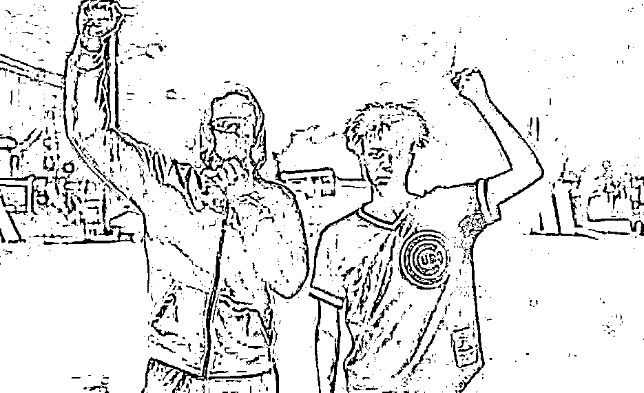
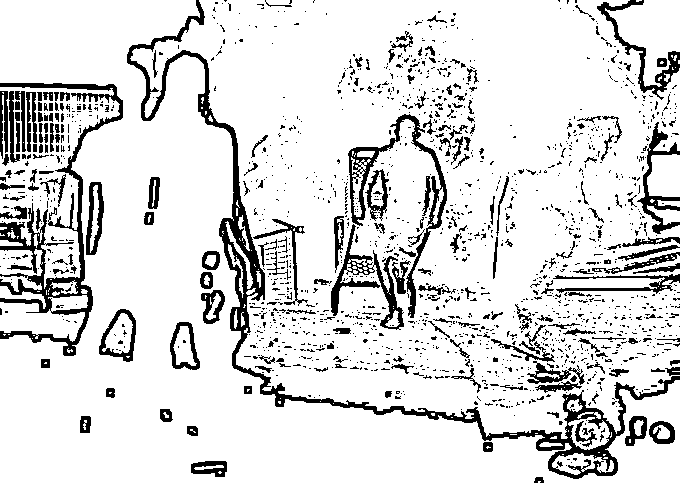
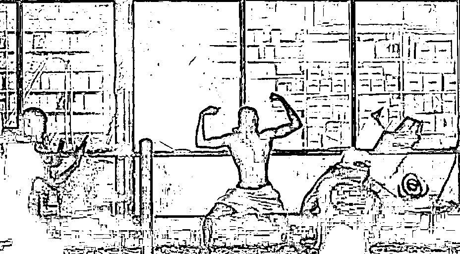
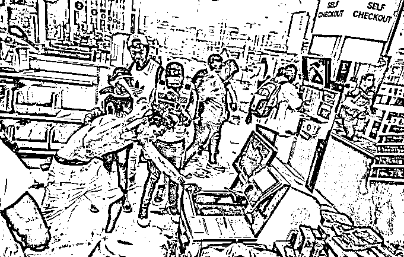
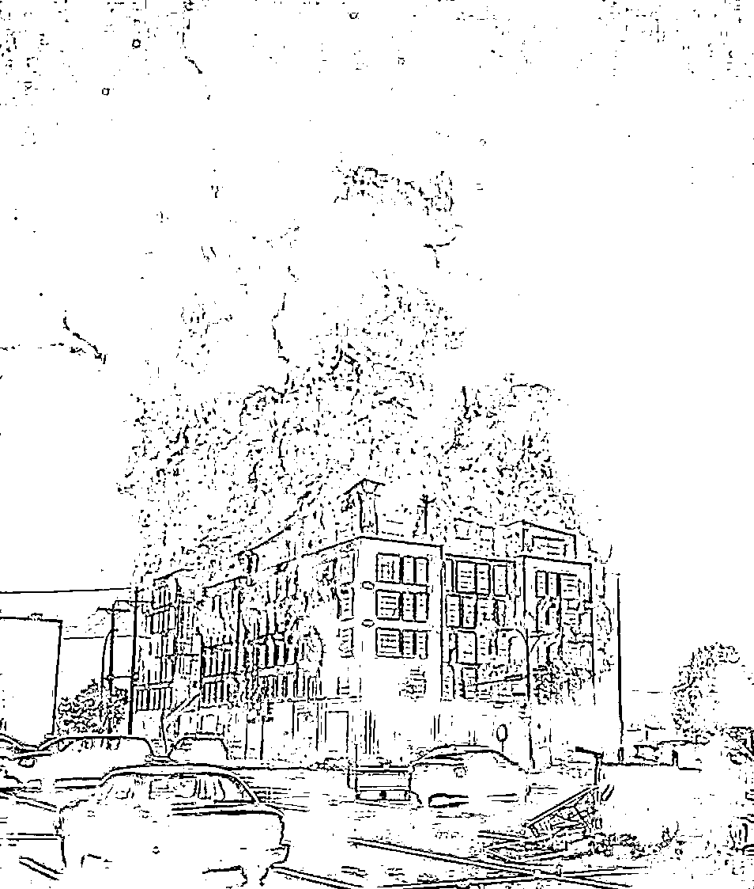
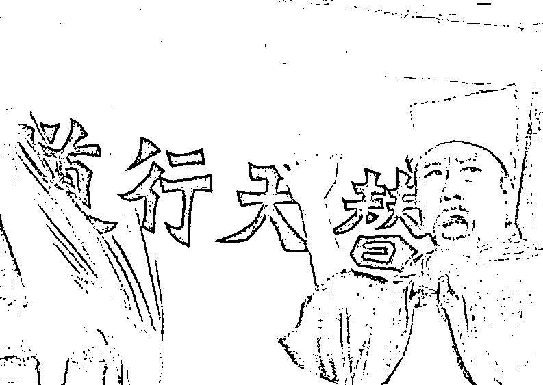

# 明尼苏达的黑人兄弟们，静下心来，听我讲

> 原文：[`mp.weixin.qq.com/s?__biz=MzU0MjYwNDU2Mw==&mid=2247489742&idx=1&sn=bb50b674facaabdfec9368e6d385614e&chksm=fb1974b2cc6efda4e67eadbc4e1d3b8a9fc752ddeae76180a6a8ab94fe56691d7c6d96045e87#rd`](http://mp.weixin.qq.com/s?__biz=MzU0MjYwNDU2Mw==&mid=2247489742&idx=1&sn=bb50b674facaabdfec9368e6d385614e&chksm=fb1974b2cc6efda4e67eadbc4e1d3b8a9fc752ddeae76180a6a8ab94fe56691d7c6d96045e87#rd)

昨天，应一位美国黑人读者朋友的要求，另一个号写了一篇文章。 

[当东方的太阳升起后，根本不需要什么灯塔](http://mp.weixin.qq.com/s?__biz=MzU3NDc5Nzc0NQ==&mid=2247488642&idx=1&sn=ea1eaa70b5e51119411784d35cf98e86&chksm=fd2db65cca5a3f4a73a61341478dbb110aac8286c724f356160efcb21425b882c63bc72ede37&scene=21#wechat_redirect)

咱们这位读者，我后来还和他沟通了，在东方留过学，学过汉文化的就是不一样，遇事很冷静。 

但明尼苏达州，他的同胞们，就未必有这份冷静了。

他们在干嘛呢？火烧美国国旗，攻击警车，警局，乃至一切公共设施。 

就像下面这样。

我们看到了，到处是大火，到处是抢掠。

明尼苏达的黑人朋友们的心情，我非常理解，同胞遇难，当然要斗争。

但斗争不是这么个斗法，这么斗，是不持久的，也是达不到目的的。 

昨天我的文章里曾经提过，我想聊《水浒传》，但怕文化差异，对方听不懂。 

沟通之后，觉得应该行，所以今天再写一篇。 

我来指导这位在美国的黑人读者斗争的策略，希望你翻译给你的同胞，能够影响他们的行为。

我们的文化中，有一本书，是四大名著，叫做《水浒传》。 

水浒传写的是梁山好汉 108 将聚义的故事。

在宋江入伙梁山之前，实际上，是晁盖做大当家。 

晁盖为人讲义气，截了生辰纲，给兄弟们大碗喝酒，大块吃肉，大秤分金银。所以甚得拥戴。

但实际上，这些都属于小恩小惠，说到底，梁山的企业文化是什么？目标宗旨是什么？

晁盖并没有给出来。

假如始终是晁盖的打法，要不了多久，那些真正有能力的好汉，就会离去。

人家有本事，凭什么跟你混，永远当草寇呢？

因为你这里看不到希望呀，他一个好汉，跟哪儿没有酒肉，跟哪儿没有金银？ 

所以，梁山要发展，梁山要兴旺，就要有奔头，你得让大家伙明白，咱一群人聚集在这里，是为了干啥。 

完成这个转变的人叫做宋江，他昔日是二当家，晁盖死后做了大当家。 

他给出的目标是四个字：替天行道。

他当着梁山众兄弟的面，树了一面旗，一面杏黄大旗，上书四个大字：替天行道。

宋江树旗的时候是这么说的： 

“我们这些人，哪个生来就是强盗？

无非是奸臣当道，残害忠良。 

我们才被逼上梁山，不得不反。 

我等都是有志之士，只是报国无门。 

又有哪个生来愿作草寇？

脸上带着两行金印，一生被世人耻笑。

我等兄弟在此共聚大义，并非只为打家劫舍，杀人放火，贪图一时的快活。

各路义士相聚这梁山，为的就是除暴安良，匡扶正义，替天行道。” 

这番话之后，天下英雄云集，因为大家有了理想，有了目标。 

即便你要搞点啥，也可以挂在这面大旗下，事出有因。 

咱们回到明尼苏达的问题上。 

现在，黑人兄弟们的诉求是什么？这是当务之急要搞清楚的。

是像图片中那样，到处点个火，抢俩超市，弄瓶酒喝醉了拉倒，还是希望这样的事情以后不再发生？

我觉得，宋江的这番话，给明尼苏达的黑人朋友们看，是非常有价值的。 

有哪个黑人，生来便想抢超市？说到底，都是被白人逼的。 

都是美国人，都一样的纳税，只不过皮肤黑了点，就被白人耻笑，甚至踩踏致死。

明尼苏达这么多黑人聚集在一起，为的不是烧俩超市，掀翻几辆警车，图一时的快活。 

而是为了从此之后，让黑人兄弟们也报国有门，也能够维护正义，除暴安良。

换句话说，明尼苏达的黑人兄弟们需要的是一面杏黄大旗，需要的是一个明确的纲要。

这个纲要是什么呢？

我替你们想好了，一句话：

美国不能仅仅是白人的美国，美国应是各个种族共同的美国。

有了理想，接下来，要有诉求。

既然黑人兄弟们的行为不是图一时快活，是正义的，是能够得到全世界舆论同情的。

那就要有一个合理的诉求，把它变成合法的。

我觉得，这里面有三个要求，明尼苏达的黑人朋友们可以思考。 

**1、要把黑人变成美国的主体民族。**

你们想一想，美国建立到上世纪初，是个什么国家？

是全球的大农场，是欧洲的后花园。

农场里是谁在劳作？是一代又一代的黑奴。而且是被迫离开家园，被迫离开妈妈。 

换句话说，是美国的黑人，奠定了美国的基础，全世界的黑人才是美国这家公司的原始股东。

那作为曾经伤痛的非洲，作为原始股东发祥地，为什么今天不能开放对美国任意移民的大门呢？ 

这难道不是一个合理的补偿诉求么？

假如非洲大陆上的黑人，可以随意移民美国，那美国就会变成一个黑人为主体的国家。

到那时，还怕白人欺负你们么？

**2、怎么才能有效的改变黑人在美国的社会地位。**

我说句实话，靠打砸抢是一点用都没有的。 

你打砸抢，人家一时怕你，长期来看，反而看扁了你。

因为白人知道你胸无大志。

就像梁山如果只是草寇，就不会在历史中留下名号。

所以，要玩，就要玩大的。 

在美国所有族群中，黑人的平均收入是最低的，黑人的平均拥有财富，也是最低的。

你不要听信美国白人的洗脑，说你们不思进取，故而贫穷。 

你要弄清楚，美国的商业体系，是谁建立的？是白人。

在白人建立的游戏下，你怎么可能胜出？

短短几个月疫情期间，美国有 4000 万人失业，其中大量黑人。而白人的前 600 名富豪的财富反而增加了 4000 亿美金。

这公平么？这合理么？这正义么？ 

数百年以来，黑人是作为奴隶被贩卖到北美大陆上的，白人老爷们呢？坐着喝茶，鞭打，监督黑人种植香蕉园。

可是数百年过去，创造财富的黑人一无所有，失业，辛辛苦苦找个服务员干，还被白人警察虐杀。

而白人呢？却成为资本大佬，在疫情期间财富大幅度增加。

这合理么？这正义么？

这就是黑人兄弟要争取的。

有钱才能有地位。

**3、美国黑人怎么才能报国有门？**

目前美国各个族群里面，黑人的受教育程度是最低的。 

用白人的说法是黑人考不及格，但这只是他们的一面之词，是他们用来剥夺黑人受教育权力的偷天换日。 

考试的内容是谁制定的？是白人。 

如果白人考高尔夫，黑人没钱，平时无法训练，当然考不及格。

可如果考黑人自己的民族舞蹈呢？

谁会是学霸，你想一想？

为什么不能呢？为什么不能用民族舞蹈作为哈佛录取标准呢？

咱们先前觉得不能，是被白人洗脑了，因为考官是他们的人。

所以，第一个诉求就是要求极大幅度的增加黑人考官的占比，改变美国的考试制度，考试科目，考试内容，让更多的黑人可以进入藤校。

从而使得更多的黑人进入美国各大机构。

要让美国的科研机构，教育集团，研发中心，航天，军事，计算机，金融，各个领域的专家，学者，指挥官中，充满黑人的身影。

你想一想，这三点如果争取到了，结果是什么？

是美国黑人会比白人更多，是美国的名校中充满黑人的身影，是美国的财富榜上，遍布黑人的名字。

当你们有人、有钱、有权的时候，还怕今后再发生此类种族歧视的恶性事件么？

假如白人他们不答应，那是谁没理？是白人没理。

你占据了大义的名分，以正义讨伐不义，那你现在所有的暴力行为，都将变得合理，也能够得到全世界舆论的同情。

你等于是被迫暴力，被逼上梁山，这将唤醒更广大的美国黑人同胞们，加入你们。

可如果你们不要这个大义的名分，那就真的变成乌合之众了。 

乌合之众，岂能久乎？ 

那要不了多久，还会一次又一次的爆发此类事件。

你们的后代，子孙，仍然会遇到不公平的对待。

暴力本身是不可持久的，有目标，有理想，有组织，有纪律，在斗争中学习，在学习中斗争。

这不是一时的愤怒，这将是全美黑人，终身为之奋斗的事业！