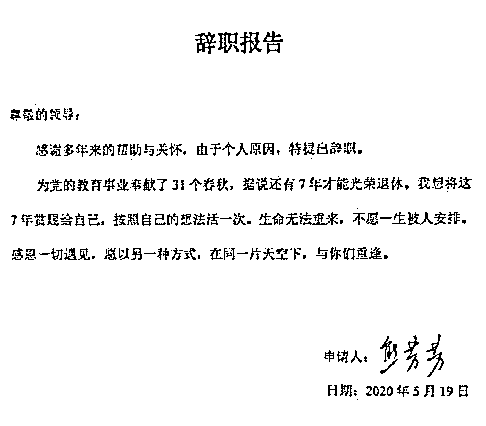

# 教龄三十年女老师辞职，这是放飞自我，还是失守职责？

> 原文：[`mp.weixin.qq.com/s?__biz=MzU0MjYwNDU2Mw==&mid=2247489640&idx=1&sn=d3b41cab55e79d27ab8e438b134bd833&chksm=fb197414cc6efd0241250b4937e87249fc36e79ab2ddfb9ab12d4d40989e08a97ce1cbcdbd38#rd`](http://mp.weixin.qq.com/s?__biz=MzU0MjYwNDU2Mw==&mid=2247489640&idx=1&sn=d3b41cab55e79d27ab8e438b134bd833&chksm=fb197414cc6efd0241250b4937e87249fc36e79ab2ddfb9ab12d4d40989e08a97ce1cbcdbd38#rd)

很多读者想要听这件事。

深圳市盐田高级中学语文教师熊芳芳。17 岁参加工作，拥有 31 年教龄，广东省“强师工程”重点课题负责人、深圳市“十三五”重大招标课题负责人，她于上周，递交了辞职信。

其中有一句话，叫做“生命无法重来，不愿一生被人安排”，刷红了网络。

吃瓜群众的意见分两拨，一拨说她失守职责，因为她找好了下家，据说是教网课，年入百万以上。

另一拨人称赞她，放飞自我，活出性格。

我不想评价人家，怎么做，都是人家的自由，跟咱半毛钱关系也无。

但她做的这个选择，很值得我们分析一下利弊。

什么样的人适合体制内那种被安排的工作性质，什么样的人适合混社会呢？

这是一个很有普遍性的问题。

正巧咱们昨天写了《[北大毕业当中介，掉价么？](http://mp.weixin.qq.com/s?__biz=MzU0MjYwNDU2Mw==&mid=2247489632&idx=1&sn=09e4c89fa4049cc287b1b569a871d07c&chksm=fb19741ccc6efd0a8f54d08051a88fec5bab6c2c2bc1d70574c4cb8ed198f58723c985f0322f&scene=21#wechat_redirect)》，提了一笔我的助理。

那我们就拿身边的人来说事儿。

昨天的文章，自觉写的很清楚，但还是有好些读者问了两个问题。

1、他为什么这么幸运，可以得到这样一份工作。

2、你为什么这么有耐心，悉心的培养自己的员工。

这俩问题看的我一头雾水，还带点小紧张。

他幸运么？他幸运么？他真的幸运么？

我在心里反复嘀咕。

你说他幸运，难道是暗示我被坑了？

这笔买卖不划算？我其实可以雇到更值的？

你看，做老板的都这样，不怕别人说他奸诈，就怕被发好人卡。 

我翻来覆去的想，没觉得自己被坑了，也不觉得他幸运，因为这笔交易在我看来很合算。

昨天的文章我说的很清楚：

在他之前，他的工作外包出去的价格，大于他要的那份钱，所以我省钱了。

在他之前，前任有很多人，但都不如他划算，所以他不仅省钱，而且是诸多省钱方案中，性价比最高的。

所以我不觉得这里面有什么幸运，这就是一笔正常的市场交易。一份合约，各取所需。

第二个问题就更加奇怪了，我为什么要有耐心？我干嘛要培养员工？

通常悉心培养一个员工，只有一种可能，就是他从事的是重复性非常强的岗位。

我们拿工人和研发工程师来对比。

工人是要悉心培养的，因为他做的事情是重复性的。

你画个图纸给他，他按照图纸生产，操作流程，操作设备，都是固定的。

工程师，尤其是新兴行业的研发工程师，大都是野蛮生长，因为你没法培养。

培养的前提是你知道他应该长成什么样。

但新兴行业，你不知道他应该长成什么样，你什么都不知道。作为老板，你和员工一样，是同一个探险队里的成员。

你们的处境是“盲人骑瞎马，夜半临深池”。

员工两眼一抹黑，老板也是两眼一抹黑，谁也不比谁强到哪儿去，这才叫探险队。

我大概理解读者为啥羡慕那位助理，因为他们误以为他的工作性质没变，工作内容没变，仅仅是跳了个槽，薪水翻了五倍。

这是不可能的。

你赚的钱，一定是来自风险，而不是劳动，所有高薪岗位都是如此。

什么叫劳动赚钱？

比如公司里的保洁阿姨，她就是劳动赚钱。

她没有承担任何风险，而且一定有培训，一定有工具，一定是条件充足的。

一定让她事先掌握了扫地的技能才能上岗，而且一定会给她配备拖把。

但我们换个场景就不成立。

大多数人对研发不熟，那我们聊聊 UI 设计。

我以前创业的时候，招聘过一个美院的硕士，画画专业的，过来设计产品的界面。

我经常提一些听起来似乎很过分的要求。

比如，我说你选的产品看起来不够上档次。

她马上换个奢侈品上线。

我看了之后又说，这不是我要的，我要的是那种，高贵的接地气。

她听完一脸黑线。

再比如，我说你这个用户登录上去的首页，太素了。

她马上换个丰富多彩的。

我看了之后又说，这不是我要的，我要的是那种五彩斑斓的简约，你懂么？

她听完一脸黑线。

我就给她讲一个故事。

昔日宋徽宗做了一个梦，梦见雨后的天空，醒来就要求工匠给他烧天青色的瓷器，汝窑做到了。

而你，就是我的汝窑，你要想办法做到。

这女生就问我，天青色终究有个参照物，你那个五彩斑斓的简约，金光灿烂的雅致，暗无天日的白，.....，我去哪儿找参考物呢？

我告诉她，去淘宝，那上面有卖图片的，你可以参考别人的设计，一定要拿出让我眼前一亮的东西。

我给了她多少钱的预算呢？大概 500 块吧。

就拿着 500 块，去淘宝上随便买图片做参考，但最后一定要让我眼前一亮。

这有点像什么？

有点像《国产凌凌漆》里面那个局长给了星爷 200 块钱，让他去好好买一身西装，穿出去莫要丢了国家的脸。

这女生就很郁闷，一脸茫然的坐在淘宝面前。

两个华为干了 5 年以上的老兵，我的俩产品经理，就跟她开玩笑，说怎么才能让我眼前一亮呢？

你干脆把这 500 块钱，买一堆 200 瓦的灯泡，跟我面前一点，我肯定眼前一亮。

呵呵。

这就是真实的职场。

你真要完全按照老板的意见去执行，会发现处处行不通。

他给你的预算肯定是不够的，这叫做巧妇就是要为无米之炊，而他给你的要求，又肯定是多变的，如果你真信他，真照他的思路走，天天加班，他都不满意。

事实上，这个女生最后做的 UI 非常好，那套演示系统，整个行业所有甲方的董事长们看过，都赞不绝口。

让每个人都眼前一亮。

她到底怎么设计，根本不重要，因为我也不知道我想要什么，我想要的，是个结果。

就像一个餐厅老板告诉厨师，我要你烧一道菜，要兼具川菜鲁菜粤菜苏菜众家之所长。

而你要做的是什么？很简单，让食客满意。

只要你让食客满意，你怎么做都是对的，如果你让食客不满意，你怎么做都是错的。

老板不会认账的。

这就是复杂工作。

你看到了，设计师的工作和保洁阿姨的工作，性质上完全不一样。

你要是敢跟保洁阿姨说，你给我把房间整理成杂乱无章的整洁，她一定抽你。

这就是为什么同一级别的设计师，比保洁阿姨贵。

贵有贵的道理。

因为一个是知道怎么做的情况下，去做，另一个需要自己弄清楚怎么做。

所以我不解，为什么有读者羡慕那位助理。

从他们的语境中，我听出来他们误以为人家从事的是一份确定性的工作，而且可以享受高薪。

但现实中，不存在这样的工作。

确定性的工作只存在于体制内的非一把手，比如盖章，走流程，照模板，或者传统行业的操作者，比如工人。

这样的工作，竞争者众多，薪水怎么高的起来？ 

而之所以不确定的工作竞争者少，是因为精神压力很大。 

老板成天跟你要什么五彩斑斓的简约，金光灿烂的雅致，暗无天日的白，你抽死他的心都有。

我相信咱们助理每天都在心中化只苍蝇诅咒我，就像我历任下属一样，只不过看在钱的面子上，敢怒不敢言。

工作方法不确定，就是高薪一部分溢价的来源。

高薪的另一部分溢价来自什么？

来自你承担的风险。

第一，在企业里，大概率只有两种结局。

要么你跑的比公司快，结局就是你跳槽。

要么公司跑的比你快，结局就是你被裁。

你和公司同步，那将是，很罕见的，雇佣史上善始善终的一段佳话。

第二，你在这家公司积累的经验，离开了不一定还能用。

你想，为什么那些帮我整理数据的机构的报价远大于他？

因为人家不愿意做定制化的小买卖，人家投入人力做这一块没有意义。

他们想要的不是做一份数据给一个人看，这样挣不到钱。他们要的是做一份数据卖给一万个人，这样才划算。

换句话说，我的助理给我整理数据的这份技能，换个老板，就不管用了。

因为定制化色彩太浓烈。

你看到了，高薪拿的并不幸运，他要完成一件事，冒两个风险。

一件事：每天面对不确定的需求，充满精神压力的反复挑战自己。

两个风险：别人可能取代自己，自己积累的技能不可复用。

为了对冲这一件事和两个风险，他当然要得到一份高薪，否则就不会成交。

到这里打住了么？没有。

其实还有一种风险，就是跟错了老板。

老板提那种五彩斑斓的简约，金光灿烂的雅致，暗无天日的白，很变态，但并不过分。

前提是，只要他能把他提的这些“五彩斑斓的简约”统统卖掉。

只要他能卖掉，你的工作就没白做，你是来挣钱的，不是来赌气的。

最怕的是老板提完了要求，你也让他眼前一亮，但他错判了市场，打眼了方向，结果卖不掉。

那对不起，前面你所有的付出，都变成了无用功。

一件事情，三个风险，都想清楚，再去看这位女教师的行为，你会有别样的感觉。

一样米养百样人，每个人都有自己的牌面，不是简单的谈谈对错。