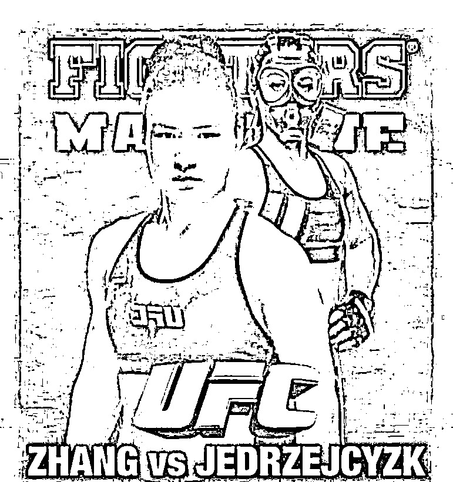
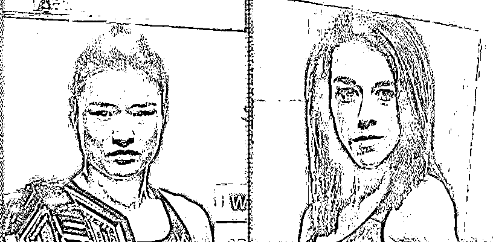
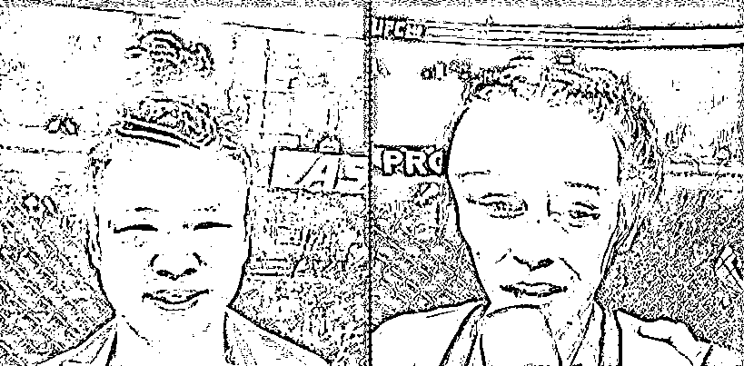
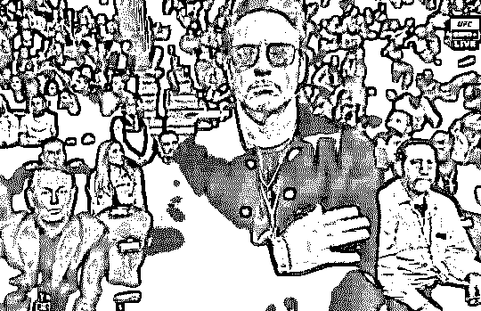

# 为你我用了半年的积蓄，飘洋过海的来打你

> 原文：[`mp.weixin.qq.com/s?__biz=MzU0MjYwNDU2Mw==&mid=2247488616&idx=1&sn=f1bfcf2d5dc4af1cb251e8bc921109aa&chksm=fb197814cc6ef10215909e706bf4ab8d6e9f33d0b242832c75c4646b25c2f9656de834e965b8#rd`](http://mp.weixin.qq.com/s?__biz=MzU0MjYwNDU2Mw==&mid=2247488616&idx=1&sn=f1bfcf2d5dc4af1cb251e8bc921109aa&chksm=fb197814cc6ef10215909e706bf4ab8d6e9f33d0b242832c75c4646b25c2f9656de834e965b8#rd)

就像金庸的小说，一开始出场的肯定是丘处机与江南七怪之流。

当然，打到后面你就会知道，先出来的肯定是配角，不值一晒。

所以，按照这个套路，我们今天从乔安娜讲起。

乔安娜，全名 Joanna Jedrzejczyk，1987 年出生于波兰。

职业：泰拳运动员 

身高：169CM

体重：52KG

臂展：168cm

主要奖项：四次欧洲泰拳冠军、六次世界泰拳冠军

MMA 头衔：UFC 女子草量级冠军

战绩：9 战全胜，MMA 草量级世界排名第一位

这么跟你说吧，就算别的，你都看不懂，看最后七个字就明白了。

世界排名第一位。

灭绝师太级的人物。

很显然，她不是今天的主人公，灭绝师太从来不会成为主人公。

主人公是谁呢？

1990 年，张伟丽出生在河北邯郸一个煤矿工人家庭。

燕赵自古多壮士，古人诚不我欺！

12 岁那年，她进入武校学习，14 岁，夺得河北省散打冠军。17 岁，因腰部拉伤，退役。

退役之后，成为了一名“北漂”。

北漂张伟丽，做过保安、保洁员、旅馆前台、超市前台、健身房销售......

住过地下室，在寒风中发过传单，遭受客户的冷嘲热讽，大体上的遭遇请参考岳云鹏，小岳岳。

与小岳岳不同的是选择，小岳岳选择用嘴，她选择用拳头。

**人生有多硬，拳头就多硬！**

2012 年，张伟丽开始学习 MMA。

很多人不知道 MMA 是个什么东西，MMA 是个术语，意指综合格斗。

比赛允许选手使用拳击、巴西柔术、泰拳、摔跤、咏春、跆拳道、空手道、柔道、散打、截拳道等多种技术。

你看着很复杂是吧，一言以蔽之，MMA 的意思就是你想怎么打就怎么打，把对方打趴下就算你赢。

这里有件事要强调下，张伟丽可不是体制内的运动员，她是没有任何后勤保障的草根拳手。

这话什么意思呢？

《安家》里面孙俪演的房似锦是个女中介，有次参加 10 公里的长跑，她拿了第一，把职业马拉松冠军都比下去了。

对方不理解，她的同事也不理解，这怎么回事呢？

你一个中介，怎么就把职业选手都给干下去了呢？

房似锦就说，自己原本不叫房似锦，她实际上叫做房四井。

她上面有仨姐姐，下面有一个弟弟。

当年她一出生，她妈就要把她丢到井里，幸好被她爷爷救下，那口井就叫做四井。

你想，连名字都不给她娶，从小啥待遇。

无论是她妈还是三个姐姐，成天不给她吃饭，见一次打一次，她年纪小，跑不过，就得挨打。

后来稍微大了一点，练成了奔跑女王了。

对别人来说，那是跑步，对她来说，那是逃命。

要是没有跑那么快，她还不一定能长大呢。

换句话说，张伟丽打的赢才有饭吃，打不赢，那只能饿肚子，或者回去当前台。

就是这样一个野蛮生长的张伟丽，北漂张伟丽，前台张伟丽，保洁张伟丽，在 3 月 8 号的时候，做了一件事。

**飘洋过海，来打你。**

飘洋过海去看你，顺便来打你。 

去打谁呢？

打我们前面所说的，MMA 草量级世界冠军 —— 乔安娜。

这就像一个连门派都没有的曾阿牛，独上峨眉单挑灭绝。

你觉得灭绝会怎么对她？

闭门不见？

派个门下打发了？

...... 

都不是。

乔安娜贴出了这样的一张海报：

图中她戴着防毒面具，暗示张伟丽来自中国，暗示张伟丽有可能携带病毒。

煽动自己的粉丝疯狂的污蔑张伟丽，攻击她。

你不要激动，这里面不是人品与恶意的问题，这是一种战术。

乔安娜第一轮先开展心理攻势，要让张伟丽处于极大的心理压力下，要让她处于舆论的风暴中心。

没开打，先用心理战摧毁对方。

而且在打的过程中，乔安娜也多次犯规，偷袭，各种手段层出不穷。

这个过程可以写武侠小说了，乔安娜如何如何强大，手段如何如何阴险，张伟丽因为被心理打击，连续犯了多少多少错误。

此处省略三万字，有待金庸的接班人去补。

我的写作方式，你们懂，古龙式的。

古龙怎么描述两个高手对决？

过程略去，直接上结果。

结果是下面这张图。

图的左侧是张伟丽，右侧是乔安娜，这是她俩比赛前。

这是她俩比赛后。

我一直以为周星驰说：“把他打的连他妈妈都不认得”，只是一句玩笑话。

现在看起来不是玩笑。

从图片上看，乔安娜真的被打成了外星人，乍一看，还以为是马云的妹妹。

当然，打成这个结果，绝非偶然，事后 UFC 对张伟丽做了测试。

她一拳 180 斤，平均一分钟可以输出 7.5 吨的伤害。

7.5 吨。

有人测试过，北极熊一掌是 1 吨。 

7.5 吨，相当于一头北极熊，在乔安娜身上拍 7 下。

其实我也挺服气的，乔安娜不愧是昔日的世界排名第一，前冠军。

每分钟被北极熊拍七下，她硬是忍了 5 个回合，每回合 5 分钟。

相当于被一头成年北极熊，打了 170 多掌......，这是多么顽强的生命力啊......

赛后，乔安娜被送去了医院，疼的哭了几个小时。

你想嘛，一个人，生生被打成马云的妹妹，那得有多疼......

至此，我们的北漂小姑娘，前台小姑娘，站在了世界之巅。

至少是半个世界之巅。

天下女子谁敌手？

没有。

真没有了。

台下一众美国观众，鸦雀无声，目光呆滞的看着张伟丽。

其中就有著名的钢铁侠，以有钱为特长的科技富豪小罗伯特・唐尼。

UFC 在美国的名气是非常大的，喜爱的人非常多，这场面怎么形容呢？

就像一个老外跑过来当众夺了我们的乒乓球冠军的感受是一样的，你就琢磨吧。

现场的老美呆呆的看着张伟丽，以为她要撂几句狠话。

毕竟乔安娜之前那么侮辱她，各种小动作，让人恶心坏了。

毕竟她受到过太多的屈辱，心酸，这一路走来，没人知道这姑娘经历了什么。

结果她什么都没做，只是静静的说了这样一番话：

“**我的祖国正在经历疫情，我经过好几个国家才来到这儿，非常不容易。**

**希望我的国家赶紧度过疫情，我也知道疫情现在已经不是中国人的事儿，而是全人类的事儿。**

**希望大家共同努力，一起度过难关。**”

你注意我前面的铺垫，我为什么要告诉你她的出身。

她不是体制内的运动员，她是一个朝不保夕，打不赢就没饭吃的业余草根拳手。

她没有受过什么恩惠，她小时候读体校，也不过是些年纪小，被欺负的往事。

她没有受过什么重视，她成年后，做的都是前台，保安，保洁之类遭人白眼的工作。

她来参加这场比赛，连代表国家的资格都没有，甚至连通关文牒都没有。

因为疫情，她去哪儿，哪儿没签证，不得已经过泰国、阿布扎比，一路隔离，辗转来到美国。

她真的像李宗盛的歌词里唱的那样：

为你我用了半年的积蓄

飘洋过海的来打你 

为了这次相聚

我连打你的动作都曾反复练习

言语从来没能将我的情谊

表达千万分之一

为了这个遗憾

我只好抡起拳头

狠狠的打你

...... 

写到这里，我忽然理解乔安娜为啥事后悲伤的不能自已。感动的，这份情谊，太深厚了...

试问天底下有几个人，肯不远万里来打你，还花了半年积蓄...

我们大小号都写过孙杨，我说过，我相信他是清白的，但对他的表现很失望。

一个 28 岁的男人，连情绪都控制不了，可见在他身上堆叠的资源太多，多到他的心智根本无法成长。

我前文中引用房似锦这个故事，有特殊用意。

房似锦的妈妈一味的问她女儿要钱，弄来的钱一味的供养她那个儿子，只会让后者，彻底沦为废物。

**有时候，那个爹不疼，娘不爱的孩子，往往出色的，让你震惊，往往懂事的，让你心疼...**

现在，这一刻，她，前北漂，站在世界之巅。

她的下面，以有钱为特长的钢铁侠，是她的粉丝，仰望着她，流着哈喇子...

她没有回应乔安娜，也许，她的心胸早已超越了武林。

她只是平静的告诉大家：

“**疫情不仅仅是中国的事情，也是全人类的事情。**

**我不希望在八角笼里说垃圾话，我们都是武者，需要互相尊重，给孩子们树立榜样。**

**我们是冠军，不是暴君。**”

这一刻，时空好像凝滞了，这姑娘的话，比拳头更硬，穿透了在场每个人的心，透过互联网，击穿了全世界每个人的心。

这世上什么最硬？

是命运么？

我不敢想象这姑娘吃了多少苦，受了多少罪。

是拳头么？

人家是把双拳打出茧子。她，是把拳头上的茧子，又给打没了......

是语言吗？

看完比赛，听完她演讲的那一刻，我彻底崩溃了。

我在屏幕前跟着老美一起喊：“张伟丽，张伟丽，张伟丽，张伟丽......”

黄飞鸿说：拳脚小功夫，容人大丈夫。

张伟丽，真丈夫。

赛后有网友戏谑的问，这么猛，谁敢娶她？

这问题我替她回答了。

这样的女人，不是你配娶的，你想嫁，人家还看不上你呢。

也有恶意的记者，心怀叵测的问她关于暴力的看法。

你看到了，他们一向是双标的。

我们封城，他们骂我们；意大利封城，他们夸意大利。关键是连样子都不愿意装，前后两条新闻，挨着推送。

张伟丽要是打不赢，他们又好找理由骂病夫了，可我们打赢了，他们居然开始暗示我们崇尚暴力。

张伟丽的回答，我相信谁都猜不到。

小姑娘霸气的说：“我们打人是要收费的，你给钱了吗？”

......

这回答，真够草根......

曾经有个四线女演员，非要说自己是奋斗出来的，自称王的女人。

她错了，她只是姓王的女人。
张伟丽，才是封王的女人。

通向铁王座的路，是鲜血铸就的。

今天，王座上的女人，叫张伟丽。

请全世界记住这个名字，这个让世界沸腾的女人！

KO！