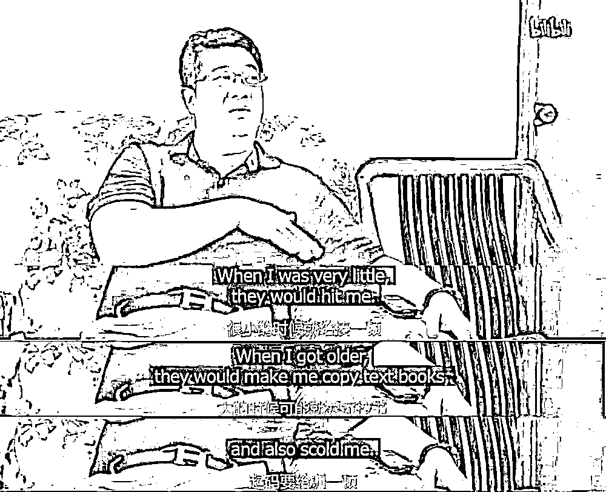
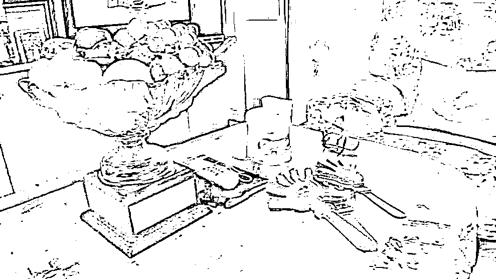
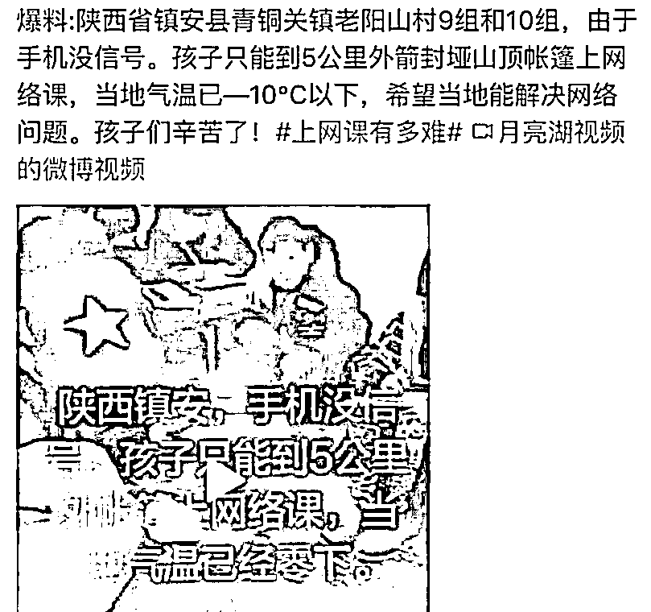
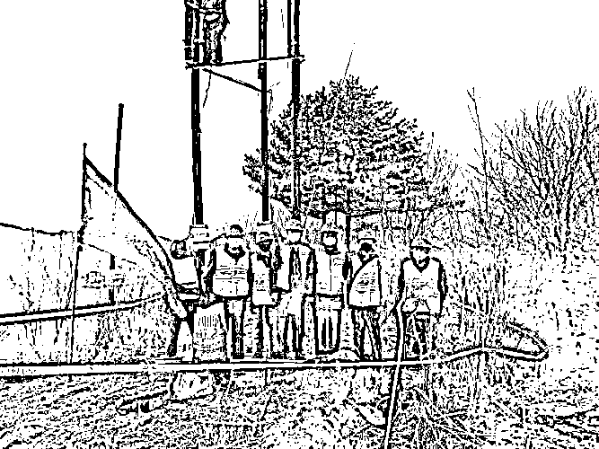

# 看了钟南山儿子戴的爱马仕皮带，我准备买条红裤带

> 原文：[`mp.weixin.qq.com/s?__biz=MzU0MjYwNDU2Mw==&mid=2247488501&idx=1&sn=28d8c05407496d4d6232b73eb1263afb&chksm=fb197f89cc6ef69f42065ae42168c7764251d1bf8f7c851d1d1730b34829f4609f67f65c1824#rd`](http://mp.weixin.qq.com/s?__biz=MzU0MjYwNDU2Mw==&mid=2247488501&idx=1&sn=28d8c05407496d4d6232b73eb1263afb&chksm=fb197f89cc6ef69f42065ae42168c7764251d1bf8f7c851d1d1730b34829f4609f67f65c1824#rd)

有人问我标题这件事，怎么说呢，我给大家简单复述下。

就是这张图，纪录片里显示钟南山的儿子，他露出来的皮带，经某些有心又热情的网友提示，品牌是爱马仕。

这腰带多少钱呢？他们查了下，6999，七千块钱。

于是议论纷纷，说什么的都有。

有人喷，就有人反驳，第一时间就有人跳出来指出：

钟南山的儿子不仅仅是钟南山的儿子，他叫钟惟德，是主任医师，教授，博导，国家百千万人才，曾经获得过泌尿外科最高奖，“吴阶平泌尿外科奖”。当年年轻的时候，还是广州十大杰出青年。

这个词是不是很熟悉？

让人想起黄飞鸿，呵呵。 

这样的人物，戴了一个七千块的腰带，被一群网友，这那那这的，反正，你懂得。

打抱不平的人很有心，摘了纪录片里的一张图。 

这张图就是钟老家客厅的一角，他的儿子，小钟教授接受采访时，就坐在长沙发上。

很显然，钟老的家我不方便评价。

我如果说他家很简朴，又会有很多网友跟着喷，说很多人在广州还买不起房子云云。

但是，他家的目测面积，装修程度，对吧，你不会看不出来吧。

我其实挺怕得罪网友们，所以我只能很委婉的表达一下态度。

我觉着吧，如果小钟教授，当然这么称呼人家不合适，人比我还大一辈，但没法子，谁叫他爹也是教授呢。

如果小钟教授都不配戴个爱马仕的皮带。

那我这号的，该咋办呢？

我肯定没当过什么十大杰出青年，我读完研，工作到第 8 年就等于退休了，那时候才 30 出头。

和小钟教授这种，工作了大半生，做出无数成就的人比，我大概是个混子吧。

可混子也是人，总不能让我光个腚吧？

那我栓个啥呢？买条红裤带？系在腰间？大概只能这样了。

看了钟老家的装修和面积，我也没法住了，你说人家这样的才这样，那我咋办？

难道你们让我去天桥底下搭个棚子？

呵呵。

你现在回忆我昔日写的那篇文章。我说医生，老师，凡是面向大众的差，都不怎么好当，理解了吧。

因为很尴尬。

大众对你的期待，近乎于圣贤，所谓圣贤，就是你必须一辈子勤勤恳恳，永远为大家，最后自己因为饥寒交迫，再饿出个什么病来，然后大家来看你，握着你的手，说，你人真好。

这样的人肯定有，对吧，但如果你按照这个标准去要求所有人，就有点那啥。

你注意到了么？我说话是小心翼翼的。

因为我也怕触碰网友们敏感的神经。

既然我们掀开了这个敏感话题的一角，不妨再给大家看一个例子。

这张图，是陕西省商洛地区镇安县青铜关镇老阳山村的孩子们。

不是因为隔离嘛，学校没开学。孩子们只能通过手机上课，可他们村手机没信号，所以就在 5 公里外有信号的地方搭了个帐篷，几个孩子躲在里面上学。

为了解决这几个孩子的网上教学问题，陕西移动于 2 月 22 晚，在他们村完成了 4G 基站新建及网络开通，陕西电信于 2 月 26 日完成了 4G 基站建设改造及网络开通。

就是这张图。

他们在 1800 米，覆盖着白雪的山村山顶上，建了 3 座 4G 基站。

其实建一个就行了，回头手机开热点，大家凑合下也能用，电信和移动，居然为了这么几户人家，愣是把竞争开到了山里。

这个村一共不到 200 人，要不是过年，要不是隔离，平日里都没啥人。

说实话，我看到这个消息的时候，心里五味杂陈。

这话咋说呢，稍微理智点，你会觉得好傻。

就像昔日网上流传的一个日本故事，一列火车为了一个孩子，硬是保留了一个站台很多年，直到她毕业。

其实这样的傻事，我们干过很多，只是大家不想看，或者说不乐意看。

不想看的原因，我理解，很多人都不太喜欢运营商。

我在运营商里干过，待了 8 个月，我理解这种偏见。

我为啥说自己内心五味杂陈，是因为我知道，替这帮人，讲句公道话，一定会导致自己挨骂。

最安全的方式，最鸡贼的方式，自然是站在网友一边。

我知道很多人，不以为然。

运营商是国企，你做任何事都是本分，你该，你本来就该做这些不符合经济利益的事情。

但是，我们通常说，公平与效率是两个对立面。

可是当落到国企面前，大家就双重标准了。

大家既要国企保证公平，去做那些没有效益的事情，同时，也会斥责他们，缺乏效率。

缺乏效率是很多甲方的通病。

当年，我和我待的那家甲方的高层，关于这个话题，展开过讨论。

我说，身为架构师，我什么给力的人都招不到，实际上根本无法开展工作。

我们唯一能做的，就是依赖于乙方，发布一些规范。

我说的问题，高层心知肚明，原因是什么，大家都明白，但没法捅破。

招人，是需要花钱的，但是在甲方内部，这个钱，是没法突破预算的。

站在公众的角度看，甲方的薪资已经让他们极其不满了。但是你站在行业内部的角度看，那个薪资，说实话，是招不到人才的。

我们就说那家企业里排名前十的高管，第十位，公开的年薪，只有 80 万。

当然，那年月购买力比今天高很多，那时候房价比今天低的多。

所以很多人是非常不满的，他们认为，这份薪水高了。

但我给你做个对比，还是那一年，同行某民企中厂的销售省代，中厂哦，连个大厂都不是。工资奖金股票都不算，除了这些之外，每年仍然有八位数的收入。

你自行去脑补。

很多时候，舆论中的强势一方，没有你想的那么；舆论中的弱势一方，也没有你想的那么。

事实上，我也只待了 8 个月就出去创业。

我自己也成天说甲方如何安耽，如何幸福，乙方如何苦 B，如何艰苦。

但如果你真的问我一句：既然这么好，那你为啥不肯留在甲方呢？

事实上，我很受器重，几乎可以毫无悬念的一直升迁一直升。

为啥呢？

我不愿意回答。

我不可能承认自己觉悟不够。

实际上，业内所有人都清楚，如果你要让甲方雇佣一帮像乙方那样的兵的代价是什么。

是你得把整个公司给他们，可这是做不到的。

作为甲方，公司是不能给你的，授予股权是根本通不过的，那是所有人的，这就是为啥好的人才，甲方招不到。

我们很多人在疫情面前，都会指责，每年那么多最顶级的学神哪儿去了？

都去玩金融，玩概念，开发游戏去了？

为啥总是第二批，第三批的人才们往上冲？

这个话，很难回答。

现实中你会发现，下面两件事是并存的。

一方面，老百姓觉得医生赚的太多了，让他们很不满意，看见教授戴着 7000 块的皮带，很生气。

另一方面，别说学神，学霸们也不乐意从医，医学院毕业的学生，8 成都不当医生。

是不是很有趣？

前者觉得后者赚的太多了，太爽了，后者用脚投票，反而走了。好矛盾啊。

所以你问我，问我这个曾经在运营商待过 8 个月，成天调侃他们很滋润的前员工，为啥闪那么快呢？

为啥非要苦 B 的选择创业的道路呢？

我只能告诉你，因为我有理想，我愿意把幸福的留给你们，我愿意去寻找高难度的有挑战性的事情。

我只能这么回答，甭管你信不信，甭管你是否觉得我在给自己脸上贴金，反正我就这么说，你也拿我没辙。

就像你问我小钟教授戴 7000 块的皮带到底是贵了还是便宜了，我拒绝回答。

但有一件事，我可以告诉你。

某位胡说八道的大 V，是谁我就不点名了。

他老喜欢说一些讨好粉丝的话，然后装的很清高，很那啥的样子。

但在自媒体圈里，大家都知道，别说他有怎样天文数字般的收入，单单说人品。

这人吧，开过很多次粉丝见面会，和三位数以上的女粉，......

重点是，他还有病......，而且那病还，......

我可啥都没说哦。

我并不是在为小钟教授说话，也不是在为某些甲方说话。

喜欢一个人，不喜欢一个人，是大家的自由。

只不过，每个人的信息渠道不太一样，看同一件事，可能想到的点就不一样。

就比如某民企销售省代，是谁我也不说。

反正他在很多城市，都有那啥，还有那啥，还那啥了之后，有了那啥......，注意，是几乎每个城市哦。

我啥都没说。

但他在业内的形象是什么呢？

是个很普通的打工仔，穿着的也很让你喜欢，开的车也很让你喜欢，说的话也很让你喜欢。

特别谦恭，特别讨巧，感觉特别让人心疼的样子......

但是，......，哎，不说了。

这样的故事，我有一箩筐。

我认识太多甲方，认识太多乙方，认识太多科技圈，认识太多金融圈，也认识太多自媒体。

我只能很平静的说，人上一百，形形色色。

**任何一个圈子里都有人品很不错的，都有不咋地的，但更多的是一般般的常人。**

**你很难用贴标签的方式去理解这个世界，毕竟，只有幼稚园才贴标签。**

**成人的生活，一直都很复杂，复杂到一言难尽。**

**你也别觉得小钟教授那么大的人才，戴个爱马仕就被网友说，很委屈；**

**你也别觉得有些喷他的人，明明是个二混子，还装清高骗钱骗那啥很卑鄙。**

**成人的世界，真就是这样。**

**有人给你治病，你恨人家；**

**有人割你韭菜，你爱人家。**

**割就割吧，还.......，还把那种病，传染给.......，这样还爱人家，爱的死去活来。**

**呵呵，我也是醉了。**

**上述都是酒后胡言，别计较，我啥也没说，我谁也不得罪。**

**就这样吧。**