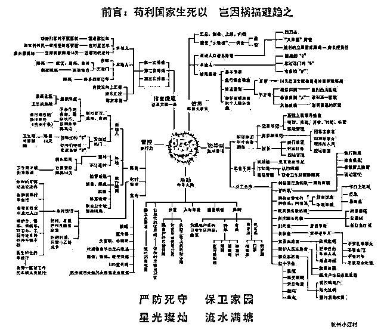
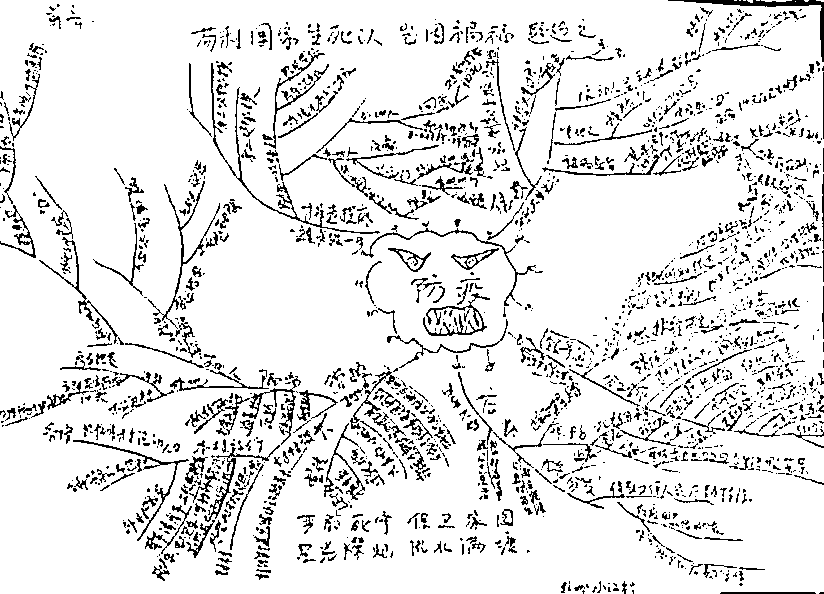

# 到底谁才是那个“大王叫我来巡山”的“小钻风”？

> 原文：[`mp.weixin.qq.com/s?__biz=MzU0MjYwNDU2Mw==&mid=2247488390&idx=1&sn=85997d09c4c48cd038caa43ddd413e79&chksm=fb197ffacc6ef6ecb24dadfa3075c8170565aed3be53f25c4982eed90ea4942439a09a16924d#rd`](http://mp.weixin.qq.com/s?__biz=MzU0MjYwNDU2Mw==&mid=2247488390&idx=1&sn=85997d09c4c48cd038caa43ddd413e79&chksm=fb197ffacc6ef6ecb24dadfa3075c8170565aed3be53f25c4982eed90ea4942439a09a16924d#rd)

有人问一个消息。

一家三口打麻将，结果被执勤的砸了麻将桌，那男的反击，还被扇了仨耳光。

与此同时，还有一个村民因为没带口罩，被捆在柱子上，以示警告。

这种消息没啥好讲的，肯定是不对的，执法者，自己不能违法。这事刚报出来立刻就被通报批评处理，然后就是乡长上门道歉。

所以读者让我聊这个，我不知道有啥好聊的，对错明摆着的事。

我觉得，有意思的不在于这件事本身，而在于很多自媒体对这件事的发散，颇值得玩味。

有很多自媒体聊过这个话题，比如大王叫我来巡山，把这些执勤者看作是拿着鸡毛当令箭的小钻风。

小钻风就是《西游记》七十四回，唐僧师徒在狮驼岭遇到的巡山小妖。

我发觉，有很多自媒体文人，他们想要把一部分执勤者，一部分工作中出的问题，当作一个帽子，当作一个标签，扣在所有基层执勤者的头上。

这一点，我实难认同。

我从不否认，我不大看得起文人。

当然，这是句客套话。如果把话讲开，那就是我根本看不起文人。

这是我们家的传统，打我爷爷就看不上只会耍笔杆子的，我初中的时候就在全国性报刊上发表过文章，那年代报纸很少，成年人能有一个小豆腐块被刊登，马上就能从文青升格文人了。

亲戚都夸我，毕竟才初三。我爷爷就说，别学那种篾片相公的本事，做事才是真功夫。

篾片相公是什么呢？就是《红楼梦》里的清客。

你看贾政让宝玉给大观园题诗，考教他的才情，一群围着出主意做陪衬的落地秀才，就是清客。

过去大户人家，养几个落魄文人，陪着聊天，凑趣，权当乐子，就干这活的。

古代的官考的是笔杆子，但重视的，并非笔杆子，说到底，你还是得能做事。

我们说于谦，二十三岁就中了进士，“粉身碎骨全不怕，要留清白在人间。”

他后来很大名望，历史上很高地位，不是他分考的高，诗写得好，而是做事做的强。

明英宗带着五十万大军跑到草原上，被瓦剌两万人团灭，连英宗本人都做了俘虏。

瓦剌人就趁机来打京城，出动十几万大军，这种风雨飘摇的局面下，于谦守住了，从此暴得大名，一夜之间就成为上上下下的主心骨。

这是干出来的，光写两句诗，谁也不会服你。

我们说做事的人，难免犯错误。

不做事就不会错，你做的越多，错的肯定越多，这是个概率问题。

你要去挑刺，古往今来的文人，一个比一个能挑。

于谦身上也有一堆可以攻击的地方。

比如抗击瓦剌的过程里，是不是粗暴了？肯定有。

但做过事的人都知道，一码归一码。

哪个做错了，该批评就批评，该惩罚就惩罚。

但如果你要因为个别人的错误，从根子上否定于谦北京保卫战这件事，那我只能怀疑两点。

要么，你没有脑子；要么，你居心叵测。

事实上，于谦后来的结局，就是死于内斗。

他做过的事情太多了，要找茬很容易，这就是为什么我们翻开历史，经常扼腕叹息。

每当紧要关头，总有些人是有担当的，他们来替大家做了一个决定，在两个不怎么好的选择里面，做了决定。

但事后，人们往往已经忘记了当初的窘迫。

就像《三体》，写的很好的一本小说，把人类的那点丑陋，揭示的历历在目。

人类要被三体灭了，罗辑出来救大家第一次，等被救了，又觉得罗辑浑身都是缺点，没有圣母婊程心看着那么完美，就把罗辑赶走，结果又要完了，罗辑跑出来救第二次，等安全了，又看罗辑不顺眼。

最后什么结局呢？最后就是人类被灭了嘛。

人类从历史中获得的唯一教训，就是从不吸取任何教训。

可见刘慈欣也是个深谙人性的。

回到这条新闻，我请大家做一个假设，假如回到上个月 23 号，有心的读者翻看历史文章的留言，你去看看上个月 23 号开始的最初几天里，大家伙面临的是什么问题？

是无法劝说长辈，是家里内部矛盾纷扰不息。

你劝你妈不要走亲戚，你妈非要走亲戚，你让你丈母娘别过来了，你媳妇不干，劝的多了，就骂你六亲不认，云云。

是不是这些事儿？

所以那几天，我就盛赞几个拿着戏台上的大刀蹲在村口石凳子上的壮汉，我说：人才啊。当下，这就是人才。

能办事的，就是人才。

很多人还不服气，说这帮人粗，说我替他们说话，居心何在。

事实上是什么？

事实上是极短的时间内，很多省份的很多小区乃至村口，都迅速的完成了隔离。

这一切，是今天这么好局面的开端，来源。

你说这些人粗鲁，没文化，是的，你说的是事实。

可我问你，在上个月 23 号，上哪儿找那么多有文化，不粗鲁，又肯实心任事的？

那些扯淡的自媒体，倒是有文化，可你们愿意去么？

你愿不愿意顶着雨雪到村口站岗？

你愿不愿意对着不理解的村民，甭管是说服，还是强行，总之让他们待家里？

这活你自己愿不愿意干嘛。

不愿意对吧。

你不愿意，人家干了，里面有些人犯错了，那咱就事论事，谁犯错就谁的事儿，这点良心总有吧？

事实上，大 V 们没有。

他们喜欢扣帽子，因为扣帽子有流量，因为扣帽子招人待见，因为扣帽子显得自己能的不行。

嫌我说话刻薄了是吧？嫌我说话诛心了是吧？

别看我是理科生，骂起人来比文人尖刻。

现在明白为啥我看不起这帮人了吧。

要本事没本事，要担当没担当。

别人做事，他在后面戳，别人事儿做完了，他去显摆自己能。

是男人么？

......

人这东西，不是个个有脑子的。所以很多不怎么样的人，一样会有大量的拥趸者。

但是，在清醒者面前，那些小心思，一望而知。

就像《士兵突击》里的成才，很灵光一个人，见人下菜碟。

给排长发塔山，给班长发红河，给战友抽春城。递根烟都分三六九等，你以为大家看不出来？

有的傻，被他忽悠，但总有看的出来的。

所以老 A 的队长袁朗不想要他，看不上。

成才和许三多，伍六一，三个人经过那么多苦难，最后冲向老 A 考核的终点，伍六一的腿筋跑断了，有一个人已经去占了 3 个名额之一。

成才眼见着只剩俩名额了，丢下伍六一，自己跑去先抢一个坑，此时，名额只剩一个了。

许三多怎么做的？

放弃伍六一？不是。

他背着伍六一，往终点跑。

我问你，这么做有意义吗？

从老 A 考核的角度看，当然没意义，名额就剩一个了，你就算把六一背到了，又能如何？

可这么做有意义，因为人生长的很，不只有一次老 A 的考核。

人生时时是考核，人生处处是考核。

就算许三多失去了一次老 A 的资格，他也在所有人心里埋下了种子。

人在做，天不会看的，但人在看，所有明眼人，都看着呢。

你当袁朗瞎啊？能混到老 A 的头，能混到 A 中的 A，他心里明镜儿似的。

这才是许三多这么傻，这么呆，这么一个犯过那么多错误的憨货，还居然越走越远的缘故。

因为总有不瞎的，班长想他赢，团长想他赢，连长想他赢，老 A 也想他赢。

就像我们昨天的文章，聊起湖北给一线医护人员子女中考加十分。

对其他考生公平么？不公平。

那又怎么样？

大家想你赢，想你的孩子赢，就是想嘛。

袁朗后来对成才公平吗？考过了都给他穿小鞋，愣是一次次找茬轰出老 A 为止。

许三多呢？二哥赔钱欠了一堆债，家里房子炸塌了，全体战友给他凑钱度过难关。

就像爱一个人需要理由吗？

回答我，真的需要么？

同样，讨厌一种人，也不需要理由。

尊重，是你赢来的，别无它途。

为啥成都的武侯祠不叫先主庙呢？

明明俩在一起呀，明明诸葛亮是刘备的马仔，按说马仔都是帝王陵寝里陪葬的。

匾额大书昭烈庙，世人都道武侯祠；

由来名位输勋烈，丞相功高百代思。

由来名位输勋烈，大家服的不是你的名望与地位，而是你实心任事。

对于基层执勤者，我们要区分。

1、他风里吹，雨里淋，自己守规矩，你就别争了，“you can you up no can no bb”。

2、他暴力，越界，自己都不守规矩，那就投诉他，别客气。

要知道，大部分基层执勤者，是认真做事的，部分文人，不要随意因为个别人的错误，就针对人家整个群体的劳动与付出。

比如这张图，这是杭州某个小区的基层社区工作人员，一个四十多岁的居委会大姐画的工作流程图。

上面这是被报社发现后重新编排过的，下面这张是她的手稿。

看看人家工作做的多细致。

看到手稿排头的那句话了么？

"苟利国家生死以，岂因祸福避趋之。"

一个月薪三千的居委会大姐写的，谁说居委会只会发耗子药？谁说基层执勤者没文化？

文化不是挂在嘴上的，人品是干出来的。

当然，有人做的好，一定会有个别人做的不好。

所以，做事一定有个顺序。**事急从权，不急了怎样？******不急了就要把权收回来。****做的不好的，要及时纠正或者让他下来。****

****什么时机，当做什么事儿，识实务者为俊杰。**** 

****什么时候，用什么人，做什么事儿，都有顺序。****

****农民都知道依四时而耕作，这帮文人连这点 B 数都没有，你说他们的书，读到谁肚子里去了？****