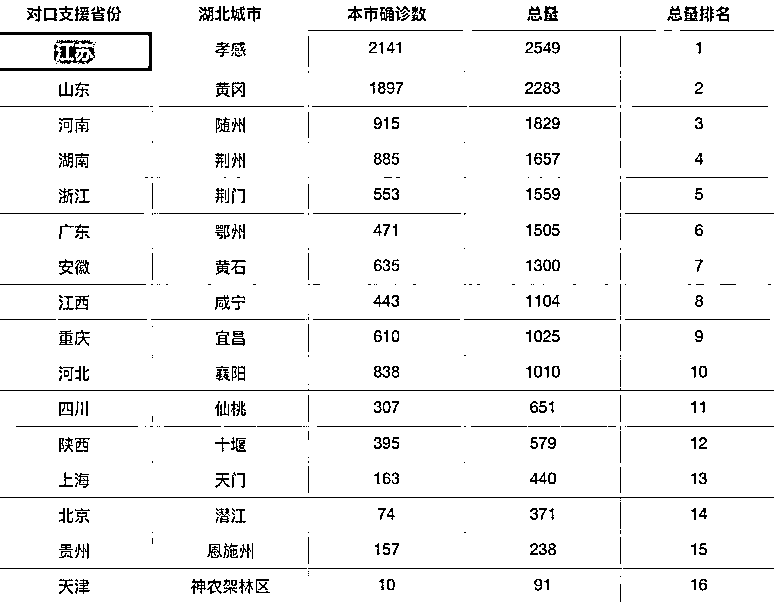
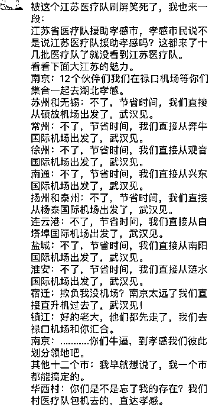
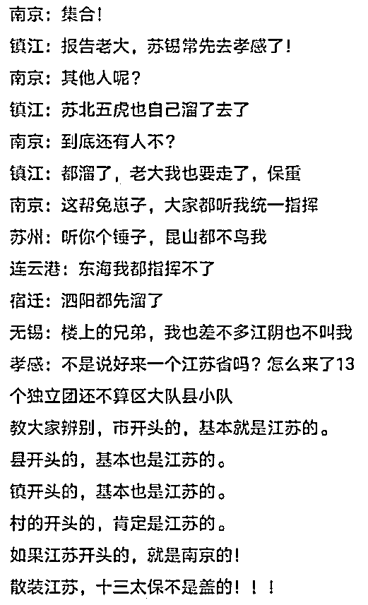
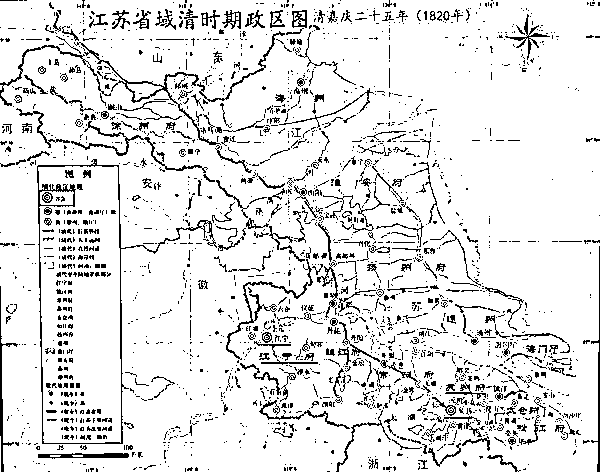

# 驰援湖北走位最“风骚”的“散装大省”的古往今来

> 原文：[`mp.weixin.qq.com/s?__biz=MzU0MjYwNDU2Mw==&mid=2247488292&idx=1&sn=8bc488a85f8e8e5de75c1c80c7793d9e&chksm=fb197f58cc6ef64ec95b9eb413d036abd024fbeb0f5d6f8d5e64a5af84818ed842e11850dac7#rd`](http://mp.weixin.qq.com/s?__biz=MzU0MjYwNDU2Mw==&mid=2247488292&idx=1&sn=8bc488a85f8e8e5de75c1c80c7793d9e&chksm=fb197f58cc6ef64ec95b9eb413d036abd024fbeb0f5d6f8d5e64a5af84818ed842e11850dac7#rd)

我们看一张图：

2 月 7 号，卫健委把湖北除武汉之外的 16 个行政区，交给十六个省或者直辖市一对一支援。

你可以清楚的看到，对接孝感的，是江苏。

别的省，都是以省的名义直接支援，江苏非常有特色。他是怎么做的呢？

所以网上有人说，散装江苏，十三太保。

很有意思对吧。

通常江苏人，不会说自己是江苏人，他会说自己是哪个市的人。

所以江苏一直是有名的内斗大省，就是彼此不认同。

不认同是历史原因造成的。

明代的时候，朱元璋定都南京，围绕南京建立了南直隶，就像清代围绕北京建立直隶是一样的。

李鸿章，直隶总督兼北洋大臣；

袁世凯，直隶总督兼北洋大臣。

所谓直隶，在保定府办公，辖区比河北大很多，东到天津，北到内蒙，南到河南，西到山西。

所以明朝的南直隶最初也很大，江苏，安徽，上海都在里面。

这段时间有本热播的电视剧，叫做《大明风华》。

里面的历史可以说篡改的一塌糊涂，整个一个 YY 加胡说八道。

但是，它告诉你一件事，就是朱棣篡位，干掉侄子朱允炆，定都北京之后，南京依然被保留，南直隶也依然被保留。

所以明代一直是两京制。

17 世纪的时候，南直隶，经济繁荣，赋税居全国之冠，文化昌盛，崇文重教，半数以上官员皆出自江南贡院，约占全国人口 18%，面积 235368 平方公里，仅占全国面积 7%左右。

到了清代，它不再是两京制了，南直隶就被改名，叫做江南省。

所以你看郑少秋演乾隆皇帝下江南，江南地区就这么来。

当然江南省是侠义的江南，唐朝的时候设立过江南道，江苏，安徽，上海，浙江，江西，福建部分地区等等，这是广义的江南地区。

对于清朝来说，江南省太大了，不好控制。

你看金庸的小说里面，无论是书剑还是鹿鼎，江南一直不怎么服管。

扬州十日，嘉定三屠。

历史上著名的庄廷鑨明史案，被金庸拿来做《鹿鼎记》的开头。

庄廷鑨是浙江的湖州人，他出资延揽了江南省的一些文人编明史，比如吴炎，潘柽章，这都是江苏吴江人。

这帮人写禁书，导致庄廷鑨被抄家，那个双儿，就是庄家的丫鬟。

所以康熙登基的那一年，江南省就被一拆为二，拆成江南左和江南右。

你细读金庸的书，会发现他很严密。

江南省拆分的时候，康熙刚登基，才 8 岁，很显然，之前的事儿，或者当下的事儿，都得归顺治和后来的鳌拜。

这是他埋的伏笔，给韦小宝洗白康熙埋伏笔。

所谓江南左，就是安徽省，江南右，那自然是江苏省。

上海市我们就不提了，那时候它还没成立。

江苏是怎么来的呢？

江，江宁。你看《红楼梦》，江宁织造，江宁就是南京。

苏，苏州。这个很清楚，历史上吴越争霸的时候，吴国的都城就是苏州。

有人说，江在前，江宁是省会，其实不是的。

清代江苏有两个省会，一个是江宁，就是南京，另一个是苏州。

《钦定大清一统志》里面的原话：“苏州府与江宁并为省会”。

从官员的安排上也能看到：

江苏省设置了两个布政使（主管全省的财政、民政及人事）。

江苏布政使，驻苏州，主管苏州府、镇江府、常州府、松江府、太仓州相关事宜；

江宁布政使，驻江宁，主管江苏其他地区。

而于此同时，两江总督驻江宁府，江苏巡抚驻苏州府。

妥妥的两套班子，一套以江宁府为老大，一套以苏州府为老大。

我们看清代的地图，很清楚。

这张地图里的府，就是今天江苏各个城市的来源。

苏州府：苏州市；

镇江府：镇江市；

常州府：常州市；

扬州府：扬州市；

淮安府：淮安市；

江宁府：南京市；

松江府的治所华亭县，管辖的就是今天上海苏州河以南地区，华亭县就是现在的上海市松江区。

三国时期的陆逊，火烧连营七百里，让刘备白帝城托孤的东吴大将，他就被孙权封为华亭侯。

我们要知道，大部分分歧的来源是什么？

就是不一个老大。

不一个老大久了，分歧就会有。

你想想我们汉人这个“汉”，怎么来的？

我们为啥不叫夏商周族？不叫秦族？偏偏叫汉族呢？

有汉朝，才有汉族。

秦末，大家不认自己是秦人，大家人认自己是六国人。

否则就没有“楚虽三户，亡秦必楚”。

等到汉朝建立，有一个共同的敌人，匈奴。

那就只能抱团跟他打，一打就是几百年，一直打到：“有敢犯我强汉者，虽远必诛。”

认同感是打出来的，是在同一个老大旗下，打久了，打了很多代人，他就会慢慢意识到，大家是一伙的。

因为形成了利益共同体。

我们所有的地域文化，本质上都是这么产生的，所谓地域，其实和血缘无关，和你是否长期待在某个利益团体内部有关。

我们曾经比较过浙江与河南，比较两地面对疫情时，手法不同，殊途同归。

其实浙江与河南从血缘上看，就是关系最近的一拨人。

北宋定都开封，南宋迁都杭州。

“山外青山楼外楼，西湖歌舞几时休？暖风熏得游人醉，直把杭州作汴州。”

汴州就是汴京，汴京就是开封。

今天杭州的著名餐饮品牌，与苏州松鹤楼齐名的楼外楼，就打这句诗来的。

但你今天去看，只能看出蛛丝马迹的联系，实际两地的习俗，差异已经很大了。

不要说上千年，即便是东北，我们仔细想一想，哪儿来的东北人这个称呼？

严格意义上，就不存在东北当地的汉人，除非你是满人。

清代东北是龙兴之地，是禁止汉人出关的。

当时还修了一条对内的边界，叫做“柳条边”。

“柳条边”是一道土墙，高、宽各三尺，土墙上每隔 5 尺种三棵柳树，柳树之间再用绳连接，土墙和柳树形成了一道“篱笆墙”。

长达 1000 多公里的柳条边有点像什么呢？

有点像川普为了阻止墨西哥人移民建的那种很粗陋的边境墙。

你看到了，历史上没有新鲜事儿。或者说，反正都是人，脑袋里能想出来的，无非那点事儿。

川普的边境墙有多大作用我不知道，但柳条边还是有作用的。到了清末，放松守备，才开始了大规模的闯关东。

所以东北人填祖籍，很多人填山东，就这么来的。

这才过去一百年，你去看东北和山东，就有很大的不一样。

也许是冬季漫长，闲来无事，东北诞生了非常强的演艺文化。

我们过去，90 年代最风靡什么？最风靡港台，所以我小时候，也会学粤语，也会学台湾腔。

我们今天会学什么？随着港剧黄金时代的消逝，我们会去学本山大叔的口音。

所以你看到的是地域，但其实背后是什么？

是模式。

前面搞笑图片里，华西村为啥单独行动？他为啥不说自己是江苏省江阴市华士镇下属华西村呢？

因为它形成了自己的产业模式，就像阿里不会说自己是杭州的阿里。

阿里一定说自己是世界的阿里。

华西村虽然名字里有个村，但实际上，它是一家企业，而不是一个村。

江苏的人均 GDP 是全国最高的，全国百强县里面江苏占了 1/4。

经济独立会导致什么？当然是各行其事。

他不需要再寻找归属感，因为他找到了最好的归属感。

最好的归属感是什么？就是自我归属感。

你像程维，他不会说自己是阿里人，因为他是滴滴的创始人。

我们这一代人，注定以世界为舞台，你一生可能踏遍全球每一个角落，你可能从事三五个行业，可能待过十几个团队。

没法子，你的寿命太长了。

比公司长得多，比行业长得多，甚至比城市的兴起与衰落，都长得多。

好几年前，有个思科的售前的头，一个北京人，在饭桌上笑我，因为饭桌上坐着思科另一位 VP，一个台湾长大的香港人。

我对着那个台湾 VP，讲台湾腔，转身对着她，就撂京片子。

一段话，上半句和下半句给你拆成两个口音。

无它，时代造就的。

相声演员们当年都是学广东话，我至今记得粤语里的一二三四，现在，流行东北话，无它，观众朋友们喜欢什么，咱就说什么。

就像我父亲那一支，都是南方人，我母亲那一支，都是北方人。

随着城市化和流动的加速，迟早有一天，大部分家庭都会变成这样，天南地北，甚至，家庭成员全球化都不可避免。

但那又怎么样呢？

无论哪里人，在困难面前，都是自己人。

就像黄冈说感谢山东，襄阳说感谢河北。

孝感说什么？

感谢南京苏州泰州常州宿迁徐州扬州镇江淮安无锡盐城连云港南通东台建湖泰兴昆山沭阳泗洪江阴......还有蔷薇村。

（排名不分先后）

哎呀妈呀，我特么累死了......