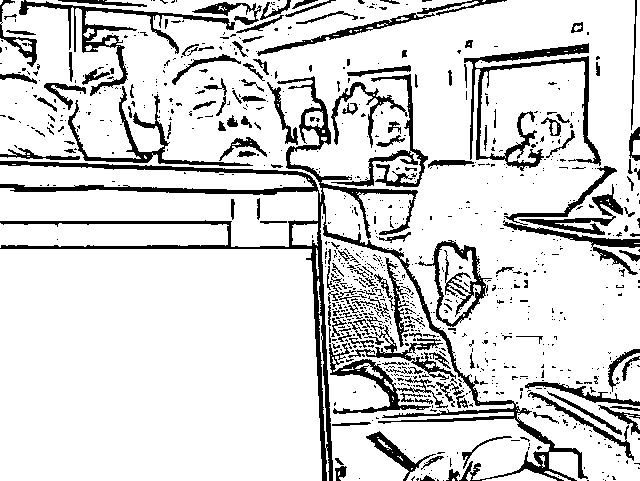
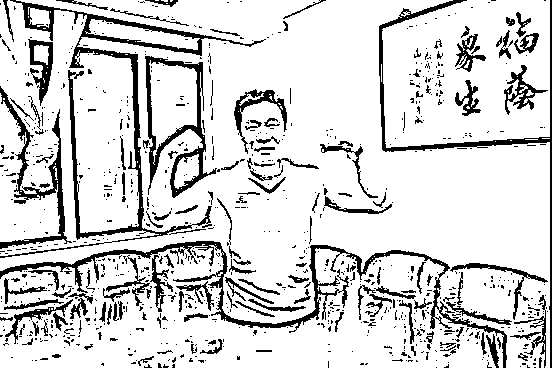
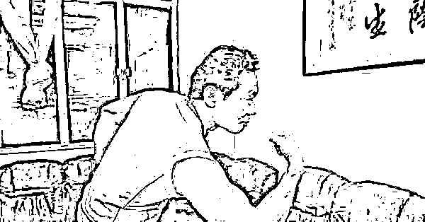
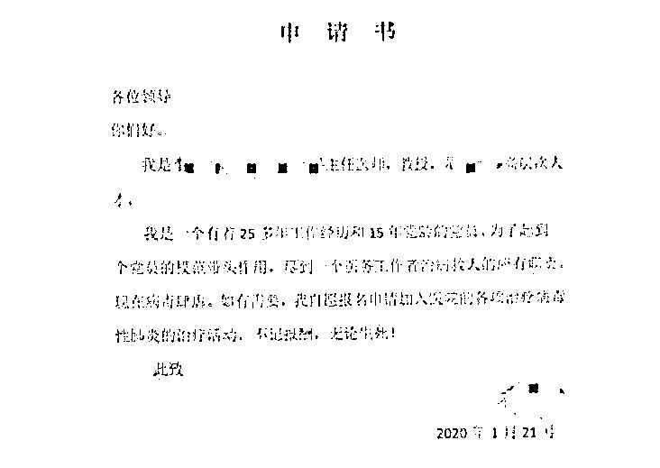

# 这次是真的重要通知

> 原文：[`mp.weixin.qq.com/s?__biz=MzU0MjYwNDU2Mw==&mid=2247488162&idx=1&sn=f98f4d1da69c12fdfed91e18ae617ccd&chksm=fb197edecc6ef7c8fc39e9b880fb6978aa44511f34a997e04d2f3b26aab4583406a1b4856de0#rd`](http://mp.weixin.qq.com/s?__biz=MzU0MjYwNDU2Mw==&mid=2247488162&idx=1&sn=f98f4d1da69c12fdfed91e18ae617ccd&chksm=fb197edecc6ef7c8fc39e9b880fb6978aa44511f34a997e04d2f3b26aab4583406a1b4856de0#rd)

先说通知，我们号于 1.23 ~ 2.2 之间休假。日更改为不定时推送。

有人说，西风你怎么能休息呢。

我怎么就不能休息呢？

是个人都会有假期，说相声的也不例外。

不重要的事情说完了，我们说点重要的。

据终南山说，新型冠状病毒怕酒精，不耐高温。

确切的说冠狀病毒对热敏感，56℃30 分钟、乙醚、75%乙醇、含氯消毒剂、过氧乙酸和氯仿等均可有效灭活病毒。

有些人瞎扯，他们说喝酒，蒸桑拿也是有效的。

你想，人喝酒，哪怕喝大了，酒精含量摆明了就那么点，怎么可能杀死病毒呢？蒸桑拿是一个道理，那能有多少度？40 度？

所以应该是指被病患用过的器皿上如果有病毒，75 度酒精，消毒柜的高温可以杀死病毒，避免传染。

我觉得这是个挺有效的信息，最近还是消停点吧。饭碗放到消毒柜里消毒了再用，别出去吃了，出门 N95 的口罩还是戴上吧，没坏处。

有人不知道说这话的钟南山院士是何方神仙。

当年 SARS，他是首功。

十七年前，他怒吼一声：“把重症患者都送到我这里来。”

现在，他告诉大家，别去武汉了，然后只身前往。

84 岁了哦，84 岁了哦，84 岁了哦。

重要的事情说三遍。

当然，你不要以为他 84 和咱爷爷奶奶们一样，还真不一样。

人家是这样的耄耋老人。

牛吧，这不仅能当院士，还能当健身教练。

不光有钟南山这样的大神挂帅，放弃假期，奔赴武汉的志愿者医生们是一波又一波。

比如这样：

四个字。

“不计报酬，无论生死！”

人这东西，很多时候真的是忘恩负义的。

前几天杨医生被患者谋害的时候，还有很多人叫好。他们全然不记得十七年前的非典，死者中 1/3 是医护人员。

他们是为了救大家，明知山有虎，偏向虎山行。

我觉得吧，甭管你有什么意见，你是嫌医药费贵或者嫌态度不好，都不是用这种伤害救你的人的思路。

但非常遗憾，不是每个人，都能被教育成能够站在全局看问题的。

所以荀子才会说人性本恶。

十七年前的 SARS 我经历过，那时候我还在大学校园里。

那时候我也不戴口罩，还喜欢到处乱窜。主要是因为一个城市里有那么多人，才那么点感染的，自己也没当回事。

寝室里的同学，基本上都这个态度。就是不关自己鸟事。

但今天我不这么想了，人的岁数不能活到狗肚子里，不能十七年前和十七年后一个样。

我觉得吧，自己怕不怕死，是自己一个人的事儿，就像某些人爱吃竹鼠，爱吃果子狸。

你爱吃是你的事儿，但你应该找个没人的地儿去吃，比如买张船票，去南极洲，把自己流放了，爱吃点什么吃点什么，吃完待个半年，没事儿来再回人堆里来。

这是一种负责任的吃货态度。

你不能自己想干嘛干嘛，回头尽给别人添麻烦，那就不叫吃货，那叫坑货。

我现在的想法和十七年前不一样了，就源于此。

我可以对自己的生死负责，但没道理坑别人。

如果你让我回头去想自己十七年前的行为，是很烂的。

万一当年感染了 SRAS，自己不在乎那是你的事儿，可人家医生为了救你，不得不跟着被迫冒险。

人家没爸妈么？人家没孩子么？

你这不是坑人，坑人全家么？

其实很多事儿，想通了就这么点道理。

当然，你也可以拒绝去想，就像我当年那样。

但我想吧，人总得有点长进，看着人家是出一份力的那种，咱出不上力，好歹别添乱吧。