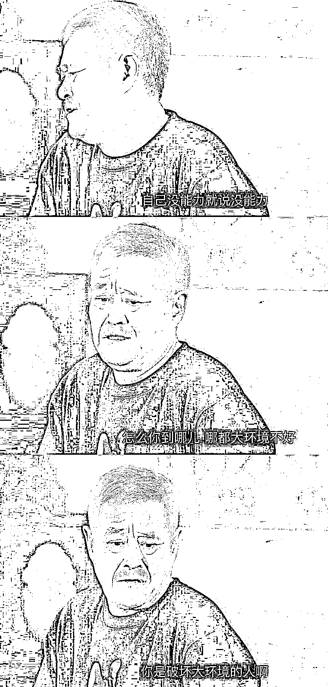

# 自己没能力就说没能力，不要怪地球没有吸引力

> 原文：[`mp.weixin.qq.com/s?__biz=MzU0MjYwNDU2Mw==&mid=2247487745&idx=1&sn=b129cbd7fef884c16fe16b373f25f211&chksm=fb197d7dcc6ef46b212099d9a8ea643d84638ea00d80108847b7c1fde4ac748fe60f70fdb2a2#rd`](http://mp.weixin.qq.com/s?__biz=MzU0MjYwNDU2Mw==&mid=2247487745&idx=1&sn=b129cbd7fef884c16fe16b373f25f211&chksm=fb197d7dcc6ef46b212099d9a8ea643d84638ea00d80108847b7c1fde4ac748fe60f70fdb2a2#rd)

我们有个别读者在后台反复问我，为什么对他们的问题视而不见。

我让编辑整理了下，列了个 EXCEL 表，把这些问题归了个类，我看完之后，哑然失笑。

因为这些问题不构成问题，在我看来，只是一种情绪，对着情绪，我没法给你意见。

这些情绪五花八门，但总结起来，全是一个套路。

1、这个社会不好，有无数的问题，为什么不可以没有问题？

2、我待的行业不好，不景气，为啥它不能景气？

3、我待的公司不好，反正我的努力没有得到回报，为啥不能给我回报？

4、我与配偶，亲人的关系不好，反正他/她们对我不好，我很伤心。

需求，西风，帮我请分析。

我没有回应是正常的。

因为你需要的不是对着具体问题的解读，你需要的，是小叮当。

康夫是怎么得到小叮当的？

是京东上买的？淘宝上淘的？还是拼多多拼的？

都不是。

是他的孙子坐着时光机，穿梭回来，送给他的。

所以，你坐在家中静静的等待即可。我这里，不出售小叮当。

我不仅不出售小叮当，也不会在你等待小叮当的这段漫长的岁月里，陪你聊你所谓的那些人文性质的话题。

我很早就对那些纯粹的，自诩人文知识分子的人表达过我的看法。

生产关系取决于生产力，这个世界在漫长的岁月里逐步解决一个又一个的问题，依靠的是科技，是理工男们持续的努力，并不是宗教神话。

明白我的意思么？

病，是药治好的，在漫长的岁月里，在药没有被研制出来的岁月里，宗教起到了安抚你的作用。

所以那些自诩为人文知识分子的人，其实分两类。

一类是一边批判，一边探索，他们的本意还是企图帮忙的；另一类，纯粹是耍嘴的，甚至就是单纯博眼球的。

昨天的文章：[去打工，和跟着生意人混，怎么选？](http://mp.weixin.qq.com/s?__biz=MzU0MjYwNDU2Mw==&mid=2247487737&idx=2&sn=b44c12495926570090a4efad1e31f94d&chksm=fb197c85cc6ef59319da1c8f2150caf8f480bddbf40f125a7b1676f1b1369ea1e4d4961f45b1&scene=21#wechat_redirect)

读者留言里被大家点的最多的那一条，聊到了许知远这个人。

那我们今天就聊他和他采访过的某些人。

我对许知远的看法是这人吧，看书很多，但缺少人生经历，很多东西，似懂非懂。

他和真正通透的人对话的过程中，当对方反问他的时候，他体现出来的不是自己的领悟，而是找出一些自己曾经看过的书，用别人的话作答。

这是很多自诩人文知识分子身上的通病。

因为把时间都用在批评上面了，自己没工夫，或许也是没能力去真正经历一些事情，真正做到一些事情。

光看书，你是通透不了的。越看越迷惑，很正常。

我不想重复南怀瑾训和尚们的那句话了。

南怀瑾的通透不仅仅在于他读了那么多书，更在于他在多个领域里大起大落，真正达到过某些层面，他才真的能够和他读过的那些书的作者，进行一场跨时空，但同层次的“对话”。

我们说对话是需要同层的。

就像你让我去和一个脑外科医生在他的领域里对话，是没办法的，因为我缺乏必要的专业背景；

同样，你让一个见习助理医生和一个跨国医疗集团的董事长对话，也没办法，因为前者没有足够的阅历，他没法理解医疗体系。

但是，你注意我转折了。

但是，许知远留给我的感觉是很不错的，因为他做了一件事。

他开了一个书店，在一个纸媒衰落的时代里，开书店就等于赔钱。

不仅如此，他书店里卖的还都是些没销量的书，这里面可没什么斗罗大陆，斗破苍穹，他卖的都是哲学，人文类。

我们说看一个人，不要光看他说了什么，你也得看他做了什么。

他的这个做法，起码说明他是表里如一的，起码说明他自己相信自己的观点。

这就是我对他的看法。

我不认同他想的那些问题，我觉得他在钻牛角尖，但是，我很欣赏他这个人，我觉得这就是个不错的人，起码很真实。

但你要知道，自诩人文知识分子的人，并不都这样。

比如他采访过的贾樟柯。

贾是一名导演，很多人不喜欢他，因为他老喜欢拍一些不好的场景，片段，然后去国外拿奖。

很多人就会觉得他很片面，他的行为是刻意的，故意迎合老外的某些心理，他对于这种不理解很愤怒，在批评社会这一点上，他看起来和许知远是一样的。

但在我看起来，是不一样的。

贾樟柯曾经做过一件事，他发过一条微博。

“雾霾，导致他逃离北京，返回家乡。”

对于公众人物关心环境，我深表赞同，他对雾霾不满，所有人对雾霾都不满。

问题在于，贾樟柯这个人，最大的嗜好就是吸烟，而且吸的是雪茄。

即使在采访中，当着公众的面，他也始终在吸雪茄，一根接一根。

试问，你什么感觉？

雪茄，焦油和尼古丁的含量比同等重量的香烟少，说明他注重自己的健康；可是雪茄那么粗，燃烧产生的烟雾比香烟大的多，说明他根本不在意周围人的健康。

一个反对雾霾的人，每天活在云里雾绕之间，每天自己制造大量的烟雾。

你不觉得他这号的，跳出来高喊雾霾把他逼走了，十分荒唐么？

他为减少雾霾做了些什么？

有戒烟么？

没有。

这叫什么?

这叫伪善！

我想起赵本山说过的一句话。

这话放在贾樟柯身上再合适不过。

**贾樟柯！****怎么你到哪儿，哪儿空气不好？****你是破坏空气的人啊！**

而且此人发完微博之后，回的是哪儿？是他的老家山西汾阳。

山西空气好么？你真的是因为空气回去的么？

你要是说完这话，搬去海南岛，我还真信你反感雾霾了。

如果你吐槽完北京的空气，直接回山西，那别人当然看不上你。

想回家就回家呗，制造什么热点？博什么眼球？找什么借口？

我们通常对于前者，是宽容的。

许知远采访过香港四大才子之一的蔡澜，另外三个更有名气，分别是金庸，倪匡，黄沾。

蔡澜监制过很多电影，我们看过的那些早期的邵氏的电影，很多是他监制的。

而且蔡澜还是著名的美食家，我爱去的很多餐饮店，很多特色菜都是打他旗号的。

你可以认为他就是我们的一种类似米其林的存在，蔡澜吃过说好，那就代表好吃。

许知远采访蔡澜，蔡澜请他又是吃火锅，又是吃甜品，又是吃早茶。

俗话说吃人家的嘴短，许知远嘴一点不短，完全不领情，反复的挖坑，诱导蔡澜回答他设计的一些问题。

这些问题说穿了，无非是一些改变世界的问题。

他其实就是想问，你为啥没有花一生的时间去改变世界？对此，你内疚不内疚?

显然，许知远留给别人的印象还是不错的，蔡澜知道他轴，只是平静的告诉他：“你改变不了的。吃吃美食，看看人生，算了。”

老人家经历过很多事，早已看透世间了，显得很平淡。

我看节目的时候就在想，如果换个人，换贾樟柯上，也问同样的问题，估计饭都吃不完，就被下逐客令了。

我举这两人，不是个人好恶，而是告诉你，别人不会仅仅看你成天说些什么，别人更重要的，是会看你平日里都做了些什么。

我为人父都十年多了，会批评不是什么了不起的事儿，当过父母的都知道，孩子一生下来，就会找借口。

我儿子上小学之后，都做不到每天大号，经常三四天不大号。

有时候我就很烦，因为总要提醒，搞得连大号也像家长的一项任务一样，连这种事都要我们操心。

有时候你问他，今天有没有。他会说拉不出来，我就反问他，为啥拉不出来？是地球引力不够？

所以是我的错喽？

我没能给你找到一个引力更大的星球，害的你无法轻松又惬意的大号成功？

如果你自己真的有做了什么，比如坐在马桶上，用力了，没出来，那是我的错。我没有提供猕猴桃和蜂蜜。

但如果连坐都没坐上去，那就是你懒呀，有啥好说的呢。

事实上，他不愿意坐在马桶上稍加用力，他一定要等着那东西，自由落体，自己落出来，快要沾到裤子了，他才肯去马桶。

但是他会承认自己懒么？不会的。

他会给你找一万个借口。

做过父母的，都有这种体验。

明明你没有多预习几个单元，回头考不好了抱怨老师为什么考的内容没有教过。

明明你上课没有专心听讲，把作业漏了回头抱怨老师为什么没有反复提醒，家长为什么没有替自己认真检查。

我听到纯粹的抱怨时的感受，就像看见自己儿子跟我胡扯时的感受，是一样的。

除了反感，没别的情绪。

怨天，怨地，怨空气，没什么不可以，但在这一切之前，别人更关心的，是你做过些什么。

如果你真的做过些什么，就像许那样，一直在赔钱，一直在开书店，不管你多轴，别人都会愿意静下来，看看能否给你提供些什么帮助，或者一些有价值的开导。

可如果你一上来，不告诉人家你自己为之做过些什么，只有纯粹的抱怨。那你留给别人的印象，要么，是一个不停的找借口的小学生，要么，就是别有用心的贾樟柯。