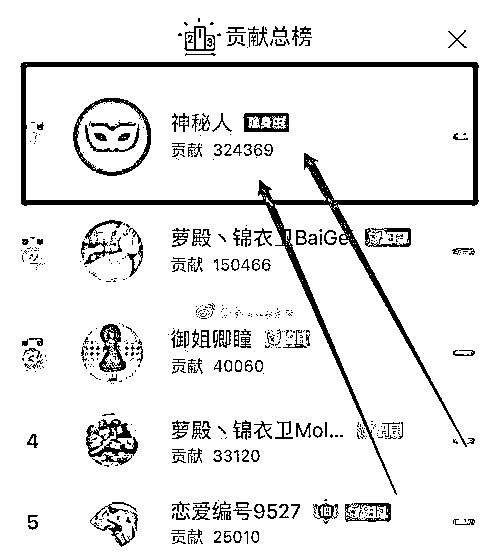

# 为大妈主播付出十万的粉丝，需要的是真相么？

> 原文：[`mp.weixin.qq.com/s?__biz=MzU0MjYwNDU2Mw==&mid=2247487038&idx=2&sn=8153222ffee71e7e3f267a6e23137a61&chksm=fb196242cc6eeb544bc486117cf5b62bafe8298bc653cc98855335e9cc94bedd43a23c455430#rd`](http://mp.weixin.qq.com/s?__biz=MzU0MjYwNDU2Mw==&mid=2247487038&idx=2&sn=8153222ffee71e7e3f267a6e23137a61&chksm=fb196242cc6eeb544bc486117cf5b62bafe8298bc653cc98855335e9cc94bedd43a23c455430#rd)

最近有个新闻，我看的乐翻了天。

某鱼有个网红主播，平时不露脸，直播时拿一张二次元的图遮脸，就靠甜美的声音圈粉。

据她自己发布的照片，都是些高颜值的少女，7 月 25 日她和另一位女主播连麦直播的时候，没想到意外发生了。

大概是软件 BUG 吧，平日里那张遮脸的图片消失了，她的真容曝露在直播间，很长时间，她都没发现。

无图无真相，给大家看看。

当然，和她连麦的那位主播也挺坏的，不提示她，还故意套词，问她颜值如何，是不是萝莉。

直播间里她的粉丝们彻底崩溃了，内心受到一万点暴击。

最搞笑的是，排在榜首的男粉丝，一怒之下，删了自己的号。

你要知道这位痴情的男子，为这个 58 岁的大妈已经打赏出去 10 万块......

估计是无颜再见江东父老.....

有读者肯定会觉得，我这人吧，怎么这么幸灾乐祸。

人家该多痛苦啊，对着个 58 岁的大妈 YY 了那么久，还付出了那么多真金白银，你非但没点同情心，还乐不可支。

对不起，我这人就这样，看了这个新闻，开心的不要不要的。

我曾经多次借用过马未都的一句话，他说：

历史没有真相，只残存一个道理。

我说：世间没有真相，你的认知到了什么 level，你就会把世界解读成什么样。

其实这句话也不是我最先提出来的，你去看王阳明的《心学》，他几百年前就告诉过你类似的道理。

仔细想想，这个道理很容易理解。

蚂蚁和我们眼中是同一个世界，但解读后的，肯定不一样。

所以，刘慈欣的小说里，三体人为啥会把我们人类当作一种虫子，不言而喻。

假如我们和蚂蚁之间，不可能对着一个所谓的“真相”展开辩论，那三体同样不会和我们针对“真相”展开辩论。

比如就说那个装萝莉的大妈。

表面看起来，所谓的假象，她装美女萝莉，所谓的真相，她是大妈。

但你以为把这张图揭开之后，真相就会大白于天下么？

我告诉你，事情的演变会让曾经碎了一地眼镜的吃瓜群众，再碎一遍。

这位大妈当天确实掉了很多粉，她在事后也积极弥补，又不断的去刷自己的美颜镜头，现在的美颜技术真的很 NB，能把大妈给你 P 成美女。

但接下来的五天，就让这位大妈，喜出望外了。

因为她的粉丝翻了几倍，她从一个月入几万的主播，变成月入十几万。

全赖这次技术故障。

我相信一个 58 岁的大妈，不至于真的希望通过科技的力量，把自己变成 18 的萝莉。

我相信她想要的，就是赚点钱。

可是她做到了呀，她从一个年入几十万的网红，变成了年入一百多万，这不正是她最初的目的么？

至于她在粉丝心目中，究竟是美少女，还是老大妈，对她而言，重要么？

你看到了吧，真相后面，还有真相。

我知道大家一定很郁闷，这还没天理了么？

如果你说她装美少女，吃瓜群众第一次是上了科技的当，那么第二次，都已经揭破了，为啥她的热度不减反增？

大家口味这么重？这年头流行超熟女？

那我告诉你，一点都不稀奇，你要知道直播的本质是什么。

一个主播，想要被大家了解，这个过程的成本是高昂的。

就像为什么大家说孙宇晨花三千多万请巴菲特吃顿饭，吃的超值。

是因为他这顿饭，所吸引的媒体眼光，达到的宣传度，曝光量的商业价值，起码好几个亿。

这句话的意思就说，假如他靠打广告，打成这样，3 个亿都不止。

可是他只付出了 3000 万，而且更绝的是，这哥们还把饭局取消了，这一取消，又上了头条，第一个爽约巴菲特的男人，又创造了 3 个亿的广告热度。

来来回回，才花了 3000 万，真的是给媒体行业上了一课，这以后都能写入商业经典案例。

如果你理解了塑造一个网红的成本，就会理解这位大妈最初的处境。

她伪装美少女，是在美少女爱好者这个圈子里，与很多伪装的美女和极少数真的美女，同台竞争。

我们假如喜欢美少女的直播粉丝，总共有 1 亿，那么她是在这 1 亿的池子里，分一杯羹吃，也许她争取到了 30 万。

这就是她的市场份额。

你看到了，网红就相当于一家企业，企业有市场份额，她也有。

可是，当她露脸的事件发生后，无数像我一样的人笑的前仰后合。

这里面就有无数媒体，替她做了免费的宣传，比如我就替她做了一次免费宣传，因为她把我逗乐了。

这么多免费宣传的商业价值，值几个亿。

相当于媒体行业替她做了几个亿的免费广告。

那你说，这种黑广告，有啥用呢？

太有用了，全国有 14 亿人，林子大了，什么鸟都有。你没那么重口味，不等于别人没有。

所以，她的粉丝从 30 多万，暴增到 70 多万。从爱好美少女为主，也许变成了爱好大妈为主。

假如没有媒体替她做这个免费广告，她也许一辈子，都无法从 14 亿人里挖掘出这么小众的一个 70 万的爱好大妈的群体。

你觉得真相到这里就打住了么？远远没有。

这件事真的是个意外么？每天发生那么多意外都不见走红，为啥她能够？

当天露脸的大妈和娃娃音的主播，你确定是同一个人么？

这是意外还是排练好的预谋？

大妈也好，美少女也罢，也许都是某鱼旗下签约员工，从头到尾，不过是排好的剧本。

看到了吧，真相背后，还有真相，背后的真相，还有背后。

你看到了也许你就创造了商业奇迹，就像拼多多的崛起。

你也许发现身边所有人都会告诉你，这东西，怎么可能成功，大趋势是消费升级，人家都是追求品质，他反其道行之。

但这就是成功，拼多多的成功告诉你，你根本不了解真相。真相就是还有一个超级大的市场，它不追求品质，哪怕山寨，哪怕假货，不重要，价格是王道，你认为趋势是消费升级，事实告诉你，还存在一个消费降级的大市场。

我知道很多人都会对很多政治不正确，但又真实存在的，非常愤怒。

怎么可以消费降级呢？怎么可以！

别说拼多多不该存在，哪怕淘宝，都应该严厉打假，应该让市场上，只剩下高品质的商品与服务，只剩下工匠精神，对吧？

怎么可以有这么多年轻人无所事事，拿着父母的钱去给 58 岁的大妈送礼物，还一送就是十万，十万只为线下请大妈共进烛光晚餐......

其实你没必要生气，人世间就是这样。

你真以为所有人都该去上夏令营？

你真以为所有人努力了都会有回报？

你真以为所有人的时间都很宝贵，每一秒都不该浪费？

我相信我们的读者，都有点阅历，没人真的会这么认为。

这个世界，自古及今，大部分人，其实没那么重要。

不管这话听起来是不是让人不舒服，不管这话是不是政治不正确，但其实从古到今，就那么回事。

很多人也就是想混口饭吃，如果这口饭吃的舒服点，就很满足了。

但即使这么一点需求，也没那么容易满足，事实上，多数人都不能满足。

所以很多年轻人，放弃了，说白了，就这么点事。

当你企图戳破画皮的时候，要好好想想，人家真的需要真相么？

对一个没有什么希望的人来说，想要找点安慰剂，填充下不怎么友善的生活，又有什么不可？

孔子说：有教无类。

高调都是那么唱的，但真相往往很刺目。

你不相信你私下和那些名校的校长们聊聊天，我说的是私下，不是公开场合。

他们私下也会告诉你，中小学名校会想尽一切办法，去挑父母。

所谓的挑父母，就是打破有教无类的原则，尽可能的挑选那些他们认为更容易培养出优秀孩子的家庭。

当然，理由终归会做的冠冕堂皇，但事实，就那么回事。

这样政治不正确的真相，人世间有很多，只是大家都不想提。

如果你要较劲真相，那你就没法不辣眼。

这世上有方方面面的真相，拆开看，都像 58 岁的大妈。

可如果你不计较呢，权当它是 18 岁的美少女，也就那回事了。

我知道有很多年轻的读者不满我这种绥靖的态度，会很生气的指责我，既然你心里知道真相，你咋不去改变呢？

你应该去把那些 58 岁的大妈，变成 18 岁的美少女。

我只能这么告诉你。

你这种话，不该来对我讲，你应该去庙里，跟菩萨讲。

只有菩萨才有力量把大妈返老还童，我没这本事。

如果你非逼着我上，那我只能像美图秀秀一样，去作假，把大妈化妆成少女。

难道这是你想要的么？

让我也来说假话给你听？给你唱高调？

这世上说假话的人很多，粉饰大妈的也很多，并不需要再多我一个。

我们调侃一下狂追大妈而不得的首席粉丝，拿他乐一乐，大家笑一笑，生活不是挺美好的么？