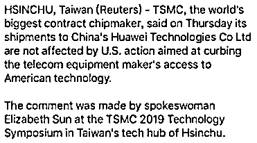

# 台龙头电信和台积电对华为的态度，截然不同

> 原文：[`mp.weixin.qq.com/s?__biz=MzU0MjYwNDU2Mw==&mid=2247486451&idx=1&sn=563fbb5394eda404928aa8011f49178e&chksm=fb19678fcc6eee9942120b68dbbb6329da18163083fc04bb94abc16ba61b5f04a2f852003112#rd`](http://mp.weixin.qq.com/s?__biz=MzU0MjYwNDU2Mw==&mid=2247486451&idx=1&sn=563fbb5394eda404928aa8011f49178e&chksm=fb19678fcc6eee9942120b68dbbb6329da18163083fc04bb94abc16ba61b5f04a2f852003112#rd)

很多老读者，就是关注一年以上的读者，等这一期很久了。

我们聊过贾诩，聊过曹操，聊过司马懿，聊过刘备，聊过诸葛亮，

但唯独落下了关羽。

按说关羽比这些都精彩，他毕竟封神了。

文圣孔子，武圣关羽，都盖关帝庙了。

我不聊他，是因为人到这份上，那就没法聊。

他的身上有了太多的神性，就显得距离我们太过遥远。

所以，我今天截取他性格里一个很小的片段，让大家看看，他人性的一面，他贴近我们寻常人的一面。

很多人解读过关羽降汉不降曹的原因。

比如曹操三日一大宴，五日一小宴，吃个鹿肉，还巴巴的连锅都给关羽送去。

这都不肯降，是基于两点。

1、忠于汉室。

2、兄弟情谊。

第一点，其实是宋人伪造的。

历史上关羽是熟读春秋，但读春秋晓得的那个“大义”，和后世解读的那个忠，是不是一回事，得两说。

关羽死后的八百余年里，并没有得到格外关注。

比如，唐明皇李隆基建武庙，主神为姜太公，以名将十人配享：张良，田穰苴，孙武，吴起，乐毅；白起，韩信，诸葛亮，李靖，李绩，并没有关羽。

到了唐建中三年，唐德宗又增加 64 个人参与配享，包括孙膑、廉颇、卫青、霍去病、关羽、张飞、周瑜、邓艾等人。

他到这时候才上来，但也只是跟张飞并列，很寻常的名将。

而五代十国时期在成都建立的后蜀政权，仅仅追封了诸葛亮和张飞为王，居然都没提到关羽。

一直到了宋徽宗时期，他才大放异彩。

北宋崇宁元年，宋徽宗追封关羽为“忠惠公”，使其由侯爵正式晋升为公爵；

大观二年，宋徽宗加封关羽为“武安王”，关羽正式晋升为王爵；

一直到明朝，明万历二十二年，明神宗加封关羽为“协天护国忠义大帝”，并改关庙名称“忠武”为“英烈”，关羽至此晋位为帝。

这就是关羽封神的过程。

这个过程中，很显然，统治者面临着巨大的外敌压力，比如宋徽宗面临辽，金，而明神宗，面临日本和辽东。

所以，忠于汉室这一点，是历代加封者加塞的私货，我们很难相信这是关羽的本意。

再来说第二点，哥们义气。

我觉得吧，用哥们义气来解释关羽，那你就把他看低了。

对于这一点，小说家罗贯中理解的很深刻。

他故意设定了一个场景，把他的理解用故事表达了出来。

他是这么编小说的。

话说关羽斩颜良，诛文丑，解白马之围，还曹操人情。

可刘备不知道呀，他身在袁绍营中。

于是刘备就写信给关羽，表示，愿意献上人头，以助其弟立功。

关羽看了之后，非常难过，他难过什么？

难过刘备不知道自己的心意？不相信兄弟情谊？

当然不是。

他难过的，是自己的为人，对方还是没看透。

关羽什么人？

就算他和刘备兄弟俩不合了，难道他会在刘备最危难的时候抛弃他么？

这种事，也是他关羽干的出来的？

这里面不是忠不忠于汉室的问题，也不是哥们义气的问题。

而是他就不屑于，不齿于干这种事。

你强大的时候，他也许会和你为敌，但你落难的时候，他绝不会和你为难。

所以关羽在华容道放了曹操，这里面只有很小一部分是昔日的恩情。

更大的，是他根本不愿意，对着一群落魄的残兵败将，下手。

这就是他身上人性的一面，或者说，可爱的一面。

大家为啥喜欢他？因为不俗嘛，不市侩。

市侩啥样子？

你富贵了，我就攀附你，你贫贱了，我就抛弃你。

趋利避害，追涨杀跌，这就是市侩。

苏秦早年贫，不得志，嫂子不给他饭吃，颇多羞辱，等他身佩六国相印还乡，天子相迎，俩嫂子匍匐在地上，十分谄媚。

苏秦就问，何以前倨后恭，嫂子回答，早年你贫穷，现在你富贵。

所以，市侩是很普遍的，大家司空见惯，更加觉得关羽这种性格的难得。

那当然喜欢他了。

几千年来，民间爱关羽，爱的是他的人格魅力，而不是他那些奇迹般的牛逼。

大家感慨的，是他明明这么牛逼，明明有更好的选择，但是，因为不乐意迎高踩低，就坚守自己的本心。

大家喜欢的，是这一点。

因为这一点，很贴近我们的生活，常人里，能做到的，也很多。

比如我们常说。

年轻时陪男人过苦日子的女人，

富裕时陪女人过好日子的男人。

你觉得这是在说爱情么？

当然不是。

这实际上是在告诉你，人品。

什么人品？

雪中送炭，而不是锦上添花。

大概十几年前，马云第一次上市的时候，公司里有很多新老员工之间有矛盾。

比如 03 年之前进入的老员工，和后来 07 年阿里第一次上市才进来的新员工，那时的新，今天看起来，也是老员工。

当时马云为了说服大家，讲了这么一番话。

他说，03 年之前进来的，是看不到希望的，这就是为什么他们拿了那么多股份。

公司奖励的不是贡献，不是能力，公司奖励的，是你曾经陪着我走过最艰难，最没有希望的岁月。

说白了，在我一无所有，连希望都没有的时候，你加入了我，那我给你最大的回报。

我回报的，是你的人品，而不是你的能力。

这是马云的逻辑，他曾经把这个故事还写成书，十年前就出版了。

其实你放眼望去，中华地区的人，接受的是同一种文化洗礼。

但不见得能够达成共识。

比如台湾的龙头电信表示，不再出售华为的手机。

但是同为台企的台积电呢？昨天表示，不受美国影响，维持对华为的出货量。

翻译一下：

全球最大的芯片制造商台积电周四表示，其对中国华为技术有限公司的出货量不受美国旨在限制这家电信设备制造商获取美国技术的行动的影响。

上述评论来自台湾新竹科技中心台积电 2019 技术研讨会上的女发言人孙丽帼。

很有意思。

其实要说矛盾，台湾与大陆的矛盾是很久远的。

当年，老毛和老蒋，打了一辈子，老蒋不得已去了台湾，他临终都不忘那啥。

去过台湾的，看他那块碑上面刻的字，写着光复什么什么，你就知道他是含恨逝去。

但是，当年美国要求老蒋不承认一个中国的立场，老蒋立马和美国人翻脸，到他儿子蒋经国，一样绝不妥协。

老毛听了这个消息，知道老蒋的难处，立刻下令炮击金门，老蒋连说“好，好，好”。

这就是给老蒋弹压反对势力，提供理由。

你要知道炮弹都是落在无人区的，这就是打给人家看，让大家知道，我们是一起的，我们哥俩还在打呢，没打完，谁也别想拆散我们。

这个炮击延续了整整 21 年，非常固定，单日开炮，双日休息。

连炮击的时间都是固定的，台湾人都知道打炮的时候进掩体，炮结束了出来该干啥干啥。

你可以看到他们二位终身是敌人，但是令人尊敬的敌人。

就是绝不在对方难的时候下手，甚至还去拉把手。

当然了，林子大了什么鸟都有，不见得都是蒋公这样的，令人尊敬的对手。

所以，我只是在给你讲共识，中美都是大国，共识永远只能在一部分人里面达成，而不能成为一种要求。

很显然，台积电做生意是很有味道的，不落井下石，但某些台企就不是。

如果你认可我说的这一点共识，就不会来问我某些问题。

关注我们一年多的读者都知道，我们被删无数次，被封很多次，甚至有号被永封。

为啥呢？

肯定是因为我这个人说话很逆耳。

所以某些老读者不明白，为什么近期我的态度 180 度大转弯。

道理非常简单。

你强的时候，我不会来拍你的马屁，哪怕你修理我，一就是一，二就是二。

但你难的时候，我绝不会来落井下石，相反，我会伸出援手，甚至，我可以在井里陪你。

不要在人家好的时候，上赶着蹭，也不要在人家难的时候，上赶着踩。

做人，就这么一点道理。

关羽教给我们的。

今日记忆承载 3 文章链接：

[ARM 暂停芯片架构合作，真的会危及备胎吗？](https://mp.weixin.qq.com/s?__biz=MzU3NDc5Nzc0NQ==&mid=2247484661&idx=1&sn=474f65bdd2d4ce171257e1ffbdae7ab2&chksm=fd2da62bca5a2f3d60445a27f58d992252cd1341ccbc6f56af939ffc99023980ade12ff1cd35&token=958850809&lang=zh_CN&scene=21#wechat_redirect)