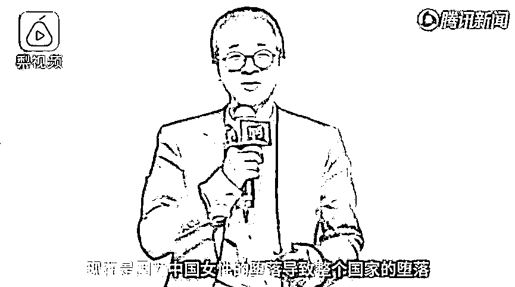

# 惹恼了全国同胞的俞敏洪

> 原文：[`mp.weixin.qq.com/s?__biz=MzU0MjYwNDU2Mw==&mid=2247485201&idx=1&sn=33804b7f1fdb3a59eb0b196ea7869481&chksm=fb196b6dcc6ee27b25388e10913c9eae9bb8f623a7e1f43c5ecedd631364ae849d592303dbbb#rd`](http://mp.weixin.qq.com/s?__biz=MzU0MjYwNDU2Mw==&mid=2247485201&idx=1&sn=33804b7f1fdb3a59eb0b196ea7869481&chksm=fb196b6dcc6ee27b25388e10913c9eae9bb8f623a7e1f43c5ecedd631364ae849d592303dbbb#rd)

俞敏洪最近给自己惹了大麻烦。

他说了句什么话呢？

他把整个国家的堕落怪在了女同胞身上。

我们来看下他整个视频。

📹 [`v.qq.com/iframe/preview.html?width=500&height=375&auto=0&vid=g14304f7yf5`](https://v.qq.com/iframe/preview.html?width=500&height=375&auto=0&vid=g14304f7yf5)

他大概的意思就是说：

如果女性找男人的标准，是这个男人会不会背诵唐诗宋词，那么所有的男性都会把唐诗宋词背的滚瓜烂熟。

如果女性找男人的标准，只是看这个男人有没有钱，而不管他良心好不好，那么所有的男人都会忙于赚钱而放弃操守。

因此，女性的整体堕落导致了国家的整体堕落。这是他的结论。

首先他讲的这个话当然是胡扯的。

男人又不是为了女人活着，总不可能女人想让男人变成啥样就变成啥样。

这番话不仅仅被女同胞痛骂，而且这种逻辑，让男同胞听了同样不爽。

他这是什么逻辑？

这是纣王丢了江山，然后埋怨红颜祸水的逻辑。

但这显然是后世的人胡诌，以讹传讹演变出的混帐话。

回到周朝最初的时候，说纣王丢了江山是因为女色，这不是在替纣王洗白，这是刻意的侮辱纣王。

纣王，好歹是个王啊，商天子。

丢不丢江山，关女人什么事，谁需要妲己替他抗过错？

人家纣王同意了？显然是不同意的嘛。

要是让纣王活过来，他一定耻于被周人如此污蔑。

周人这么造谣污蔑，就是故意抹黑他，让他的形象变成一个躲在女人背后的帝王，从而使得再无人纪念或者打着他的旗号复辟。

试想，哪个英雄豪杰还肯支持一个推诿过错，没有担当，躲避在女人背后的帝王呢。

同样的道理，哪个男同胞愿意被俞敏洪扣上这么一顶毫无大脑，推诿过错，躲在女人庇佑之下的帽子呢？

俞敏洪也不知道是脑袋被驴踢了，还是怎么着，最近昏话连篇，他这番话不仅得罪了女同胞，同时得罪了男同胞。

俞敏洪这套对女性的指责的逻辑是混乱的，混乱在于一个国家是由两性共同组成的。绝不可能一种性别的人完全听从另一种性别的人的需求，指挥和安排。

既然如此，那有了问题，一定是两性共同造成的，绝不可能一部分人有问题，另一部分人没问题。

但是，我们这么翻来覆去的骂俞敏洪，能得到什么呢？

其实什么也得不到。

能听懂我这个意思么？

老读者们知道我这么说，就是要转折了，我要转移主题了。

不跟着大众一起骂，而给出全新的视角，才是我们号一贯的特色。

我关心的并不是俞敏洪的说法有多少错误，我关心的是如何做一个更好的自己。

我给你换个故事。

小时候，我父亲经常指责我，告诉我，考了第二名就是一种失败，只有第一才会被记住，第二和最后一名是一样的，通通会被遗忘。

有一天，四姨妈来我家做客，他这番话就被听到了。姨妈就反问他，说我父亲小时候也不好好学习呀，我的成绩比他小时候，那要强八条街区了。他凭什么指责我呢？

然后好奇的问我：你难道不知道你爸在胡说么？你难道不知道你的成绩比你爸小时候好的多的多么？为什么不见你反驳呢？

我就很惊讶的看着姨妈，问，我为啥要反驳呢？我反驳可以得到什么好处呢？

你注意到了么？两种截然不同的思维模式跃然纸上。

我当然知道如何去反驳，但问题是，我反驳他，我能得到什么好处呢？

他这番话对不对根本不重要，只要这番话产生的效果是好的，我听进去了，我变成更好的自己，我赚了呀。

我去反驳他，就算辩赢了，那我自己又能得到些什么呢？

是能变成更好的自己么？能么？

人世间的指责林林总总，但你要是仔细想一想，其实只有两种。

第一种，是骂你为啥这么强。

第二种，是骂你为啥不够强。

我告诉你，第二种，没必要反驳。

他骂你不够强，你把他的话当作能量使，当作垫脚石，你就可以踏着这种骂，一步一步的变成更好的自己。

所以，回到俞敏洪的事件里去：

别人要不要活的堕落，我没法改变，但我起码可以让我自己活得很体面。

我知道有人说什么。

站在女性的角度上，总有个别人会说，我不是不想活得美美的，我是没有法子呀，生活就需要钱，我必须要找到一个有钱的男人，才能改变我的生活。

站在男性的角度上，总有个别人会说，我不是不想保有道德底线，我也是没有法子呀，我只有违背道德，才能赚到钱。

你还别说，说曹操，曹操就到。

就在俞敏洪说这番话的同时，嘉兴市南湖区就有一个赵某，因为女朋友说，一定要买得起玛莎拉蒂才肯嫁给他，屡屡闹分手。

最后男方急了，就在 4S 店偷了一辆价值 120 多万的玛莎拉蒂 SUV，并且把自己的雪佛兰的牌照换上去，然后去未来“岳父”家提亲，结果当晚就被南湖区分局东栅派出所的警察抓捕归案。

这新闻非常可笑，但他证明了俞敏洪的话不是空穴来风，还真有这么二的一对儿男女。

但我们是一个大国，国家这么大，人口这么多，总有脑子弄不灵清的。

我们总不能因为别人傻，自己就跟着傻吧？

**改变自己，比改变社会，要容易的多。**

如果我是个女性，我就会想想看，我应该怎么样去看待这个世界，我应该怎么样去教育我的女儿。

而作为一个男性，我就会想想看，我有没有因为外界的目光和要求，改变自己的节奏，放低自己对操守的要求。

看过上一期

[看一个十年的散户变韭菜的体悟](http://mp.weixin.qq.com/s?__biz=MzU0MjYwNDU2Mw==&mid=2247485194&idx=1&sn=6a1322a5f8302f9a054d997046fda6c6&chksm=fb196b76cc6ee26088a760237b777a95bc54ee18b560ab62f2c2b7afe2773d99e15db7677626&scene=21#wechat_redirect)

的人，应该知道我的观点。

爱钱和有钱，是两码事。

并不是说你爱钱，你就能有钱。

道德低和能赚到钱，同样是两码事。

并不是说不要脸，就能很轻松的赚到钱。

看过上一期的人应该知道，能不能很轻松的赚到钱，这是一个认知问题，这是一个方法问题，这是一个相对优势问题。

孟获遇见诸葛亮，他就算八辈子的脸都不要了，坏事干尽，也没有胜算，无非被诸葛亮捉来捉去，当只猴子戏耍，仅此而已。

我们的很多文化沉迷于逻辑不通的事情，比如我们的民间文化刻意的把阴谋诡计强化。

让人以为一切事情都可以靠取巧，靠以少胜多。

但实际上，你把所有的经典战例拿出来看，绝大部分的胜仗，都是产生局部优势之后形成的以多打少。

这叫什么？

这叫一力降十会。

诸葛亮对孟获，是靠玩弄技巧赢么？其实不是的。

是靠综合优势碾压对手取胜。

说白了，这就像三体对地球，一颗智子横扫星球。

你看着智子很小，地球很大，问题是，不是一个维度的，人家是降维打击。

换句话说，智子的综合实力原本就超过了地球。

一个女人，想有钱，靠指望男人替自己赚钱，是荒唐的。

一个男人，想有钱，靠指望道德低，就能赚到钱，是幼稚的。

一个人，想有钱，靠胡思乱想，读也没读懂的三十六计，七搞八猜，是可笑的。

**人生终究不过是综合实力的较量。**

有这点时间乱想乱搞，真的不如提高自己的综合实力。

我们很早期的文章里说过一句话。

拿自己的 100 块钱去换人家的 50 块钱，是一定成交的；

拿自己的 50 块钱去换人家的 100 块钱，是注定没戏的。

就算碰巧让你换成了，你中间这个试错成本耗去的时间，也远不止你赚到的 50 块钱。

当你的本事远远大于你面对的困难，当你人生时时处处都处于用 100 块换 50 块的绝对优势，那你会发现生活变得很轻松，很愉快，俞敏洪说的那些破事，都不会出现在你面前。

我想，俞敏洪最初的用意应该是想给他们家的生意打广告，告诉妈妈们不要成天想着赚钱，要多去上他们家的补习班，只是逻辑混乱，广告没打成，反而成了笑柄。

如果他真的想教育大家，与其指责某些女性爱钱，倒不如告诉大家，爱钱，不等于能够赚到钱。

有功夫爱钱而不付诸行动，不如有功夫提升下自己。划算的多的多！

原创不易，转发是最好的支持！