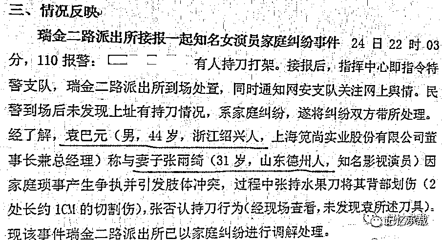
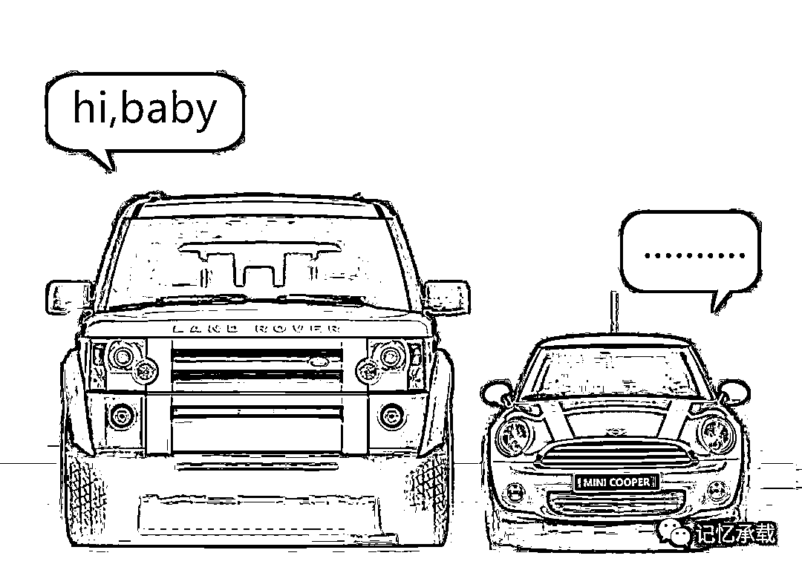

# 张雨绮又离婚了：屡屡遇见渣男有何秘密？

> 原文：[`mp.weixin.qq.com/s?__biz=MzU0MjYwNDU2Mw==&mid=2247484885&idx=1&sn=56e148368bd441e37e531b2b19cf8559&chksm=fb1969a9cc6ee0bfecd2cca2dba648afe6e8c35e45a45acc0b72ef16785de0ddbb93ab465208#rd`](http://mp.weixin.qq.com/s?__biz=MzU0MjYwNDU2Mw==&mid=2247484885&idx=1&sn=56e148368bd441e37e531b2b19cf8559&chksm=fb1969a9cc6ee0bfecd2cca2dba648afe6e8c35e45a45acc0b72ef16785de0ddbb93ab465208#rd)

张雨绮是谁呢，就是周星驰的电影《美人鱼》里那个对着邓超大喊：“老娘有钱有身材，你却去找几百块钱的鸡！”

张雨绮的第一任男友叫汪小菲，就是那个嗲嗲的大 S 的老公，当然，那时候汪小菲还没结婚。

张雨绮的上一任老公是王安全。

王安全名字叫安全，但是一点也不安全，他招妓嫖娼被抓，结果给张雨绮扣了一顶大大的绿帽子。

张雨绮刚刚离婚的老公是谁呢，是袁巴元，某公司董事长。

警方记录中写道，袁巴元称两人因家庭琐事产生争执并引发肢体冲突，过程中张雨绮持水果刀将其背部划出两道约 1 厘米的伤口。不过，张雨绮否认这种持刀行为，警方在现场也并未找到袁巴元所说的刀具。

从与汪小菲在雨中互扇耳光，到开车堵王安全的车门，又砸又踢，再到刀砍袁巴元，张雨绮每一次都能引起轰动。

用她自己在吐槽大会上的话说：“我看男人的眼光确实不行。”

可这是眼光的问题么？

如果说一次还可以解释为运气。那么为什么，自我感觉这么良好的她，回回遇见的都是渣男呢？

无独有偶，那个专业教人处理情感问题的教主，咪蒙，刚刚离婚。

她教人家的心灵毒鸡汤从道理上有没有错呢？

没错。她支持女权主义，认为女人就要爽，要活出自我，要随着性子，要释放。这些话本身都没错。

可问题是，理解这些话的本意了么？

什么叫活出自我？

你开着路虎去撞人家 cooper，这叫自我？

这叫霸道嘛。

自我是一个受教养，修养，涵养约束的东西。一个人，先有了教养，有了正确的认知，才配谈追求自我。

就好比一个人，你想自我很简单呀。你去罗布泊自驾嘛，你可以很自我的随便开。但你在城市里，你就得礼让行人，就得遵守交通规范！

一个女性，身上透着正确的认知，温文尔雅，知书达理。这就叫做淑女。

窈窕淑女，君子好逑。

诗经里面咋不说，伪女权者，君子好逑呢？

我知道张雨绮一定很不爽，因为她自我感觉超好，她一直觉得自己美美的，会赚钱，人很好。这是她的自我认知。

but，

**你是不是一个好人是一码事，你能不能遇见好人，是另一码事。**

**你表现出吸引什么样人的特质，你就会吸引来什么样的人！**

我愿意相信张雨绮内心深处是个非常好的人，问题是，别人成天看着你跟个太妹一样炸炸呼呼的，一会儿高喊“老娘有钱，又待如何？”，一会像那个教主咪蒙一样高喊“没钱的女人才叫离婚，有钱的女人那叫恢复单身”。

有哪个好男人，会愿意接近你呢？

你仔细想想看，难道不是这个理儿么？

你想要一个什么样的男人，那你就得有与之相匹配的优点。

并不是什么都能用钱买到的。

一个男人拿钱去买，那当然只能买到妓女。

同理，一个女人拿钱去买，那自然也只能买到鸭子。

人怎么可能用钱去买到一个比自己更有钱的人呢？

假如这个男人很有钱，很有才，很有趣，很有修养。那人家图你一个太妹什么呢？你能给别人带来什么呢？

但你反过来想，为啥你会吸引王安全。道理很简单呀，你每天巴巴的声称老娘就是有钱有身材。那王安全觉得不花钱还可以上一个美女，赚到了呀。他当然就凑了过去嘛。

你又为啥会吸引袁巴元呢？道理更简单。袁巴元是个伪富豪，债务缠身，本来就希望通过你还债呀，你四处高喊自己有身材又有钱，那不正好，他玩完了你还能顺便拿去抵债......

你说你想遇见一个好男人。问题是，当人家不需要你的身材不需要你的钱的时候，你还能拿出什么别的吸引人的素质呢？

当一个人高喊为啥自己有钱有身材还是不幸福的时候，其实是把自己当成了嫖客、当成了妓女。那怎么会有幸福呢？

money 很有用，但光有 money，远远不够。

男人不仅需要身家，同样需要才华与风趣；女人不仅需要大腿，一样需要温婉与贤良。

**一个人，把自己的渣性表现的淋漓尽致，那自然会招来一堆苍蝇趋之若鹜。**

**一个人，把自己的知性表现的淋漓尽致，总会有与之相匹配的人进入你的世界。**