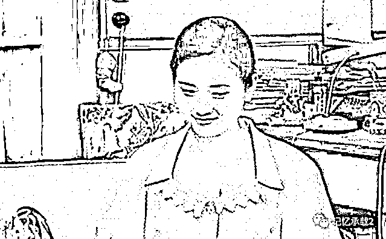
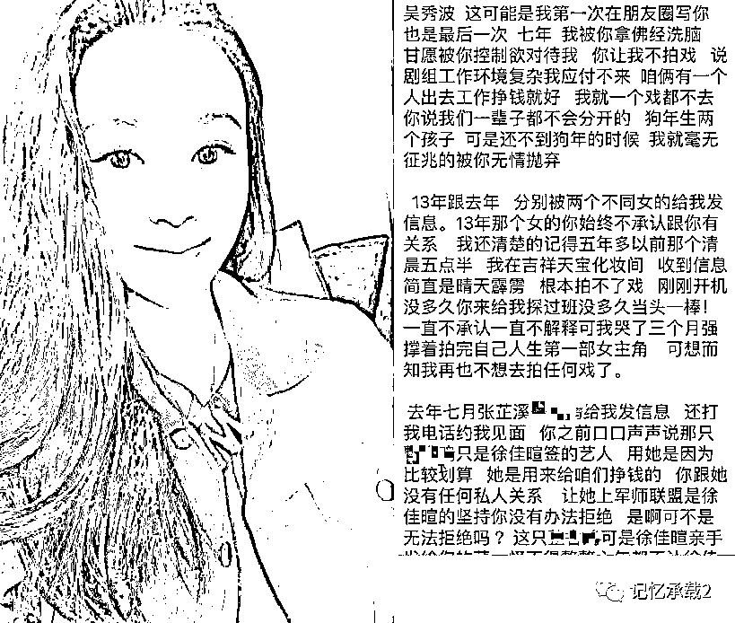
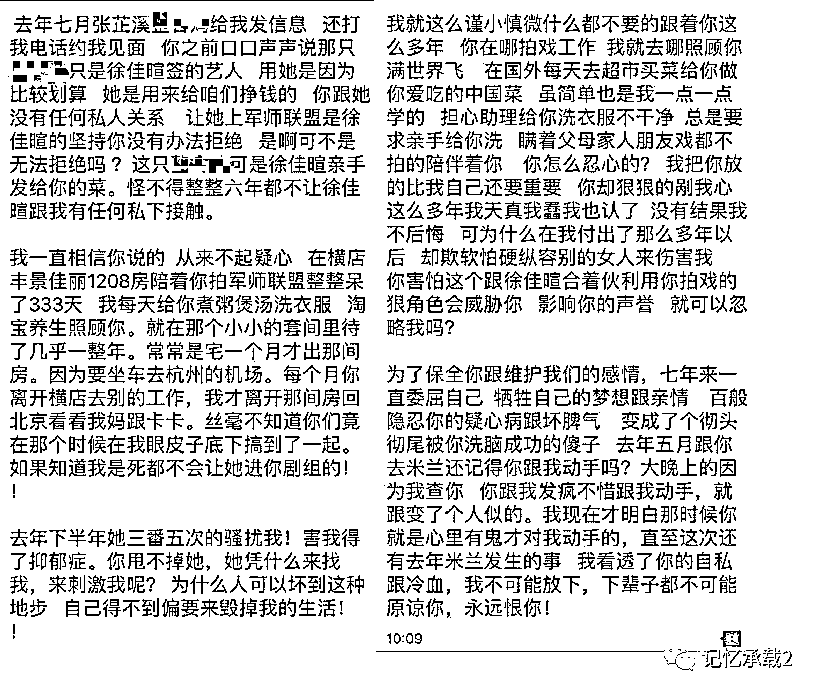
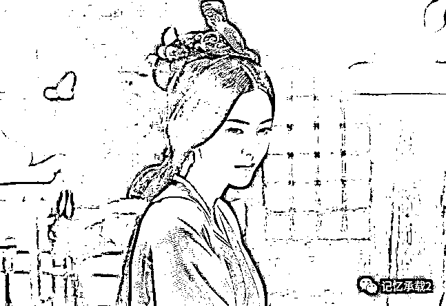

# 小三爆料：吴秀波后宫起火，小三大战小四小五

> 原文：[`mp.weixin.qq.com/s?__biz=MzU0MjYwNDU2Mw==&mid=2247484864&idx=1&sn=77e0c3deb117d7f134ad302b9b1b7684&chksm=fb1969bccc6ee0aa8a6e4f0c8aaf29ab1298c574d00ab1130f13eedcabae078dfdf1dd39a699#rd`](http://mp.weixin.qq.com/s?__biz=MzU0MjYwNDU2Mw==&mid=2247484864&idx=1&sn=77e0c3deb117d7f134ad302b9b1b7684&chksm=fb1969bccc6ee0aa8a6e4f0c8aaf29ab1298c574d00ab1130f13eedcabae078dfdf1dd39a699#rd)

中秋节正在陪孩子吃饭，忽然就弹出这么一则头条。看得十分有趣，就拿来与读友们分享。

吴秀波是我非常喜欢的一个演员。他实际上已经是 60 后了，妥妥的大器晚成。

严格意义上讲，他本不是个演员，而是个歌厅的歌手，当然，80 年代歌厅的歌手其实很挣钱，一个月收收花篮赚个几千块。你要知道那个年代老百姓的工资只有一百块。

当然，歌厅很快就没落了，90 年代后期基本就没什么人去歌厅点歌了。于是吴秀波也迎来了人生的低谷。

直到遇到了发小刘蓓，刘蓓可比吴秀波成名早的多了。

这张图贴出来，应该三十岁以上的人都认识。

不过我给你贴个图，估计很多人不记得。

这是刘蓓在我爱我家里客串梁天的女朋友的镜头，说实话，那时候的刘蓓才是妥妥的美女，当然，美女都会老嘛

吴秀波是个很有女人缘的，不仅仅在当歌手的时候，总有女富翁给他送海量的花篮，进入影视圈，也是刘蓓一而再，再而三的帮衬。

随着《黎明之前》的上映，吴秀波红了，而随着《北京遇上西雅图》以及《大军师联盟》等等一系列的影视剧上映，他红的发紫了。

去年吴秀波做了 51 信用卡的首席产品体验官，随后，今年 7 月，51 信用卡就上市了，当然，上市后股价就破发，随后两个月至今股价下跌了 21%，当然，P2P 大环境如此。

聊了这么多背景，是因为他毕竟是一个很多人喜爱的演员，但是，再喜爱，也得爆料哦。

这份爆料简单来说就是：24 日，女演员陈昱霖在朋友圈中发文透露自己和已婚演员吴秀波是恋人关系，已有七年感情。她表示在这七年中，自己放弃了事业，为吴生了两个宝宝，而且全职在照顾他起居。但是同期另有两人和吴秀波也存在过情侣关系，其中一位是和吴秀波合作过《军师联盟》的女演员张芷溪。因由张芷溪的“骚扰”，自己已患上抑郁症。云云。

张芷溪就是《军师联盟》里的东汉大美女甄宓的扮演者。甄宓可就是她的小叔子曹植写的《洛神赋》里洛神的原型哦，翩若惊鸿，婉若游龙.....

唉，秀叔咋这么有女人缘呢，全都是女神级的美女为他撕 B.......

这是单方面的爆料哦，吴秀波还没有回应。作为吃瓜群众，我们当然看热闹不嫌事儿大。但是作为男人，我们当然希望这事纯属子虚乌有，否则太让人羡慕妒忌恨了

但是八卦一下，当原配还没有跳出来的时候，小三先跳出来撕小四和小五，看来秀叔的后宫团也堪比一部清宫剧哦。

呵呵。