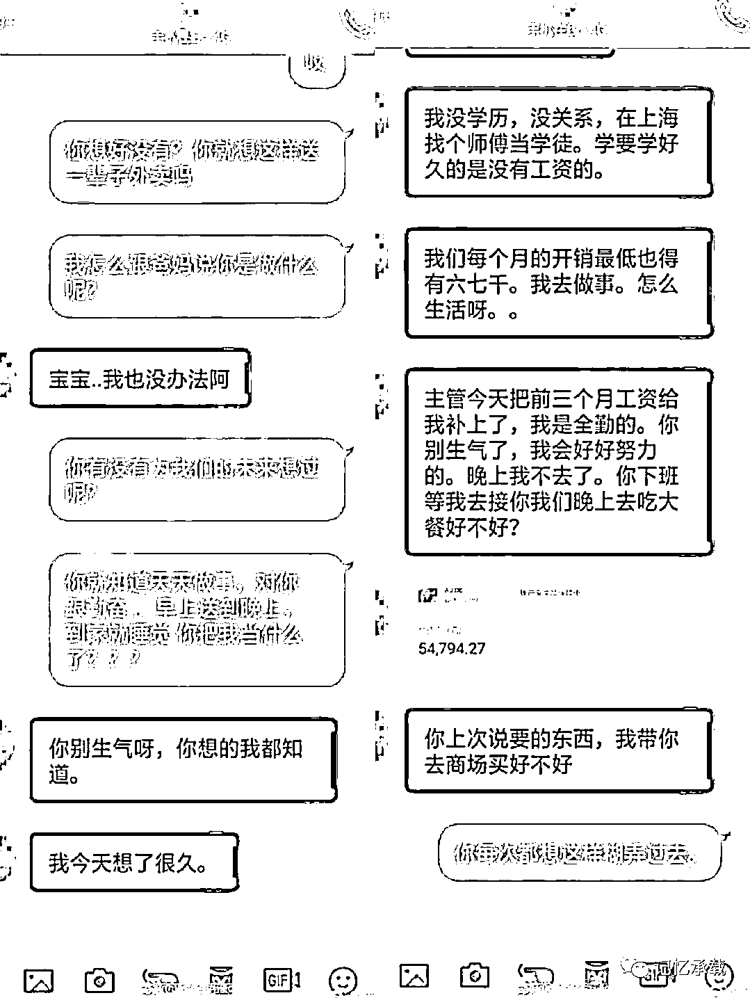
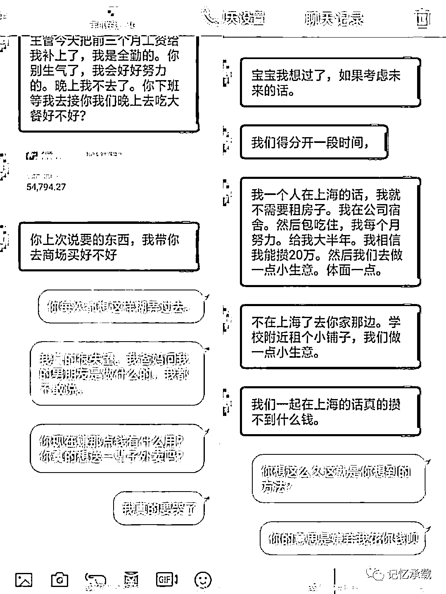

# 月薪 4k 妹子 vs 月薪 15k 外卖小哥 谁配不上谁？

> 原文：[`mp.weixin.qq.com/s?__biz=MzU0MjYwNDU2Mw==&mid=2247484858&idx=1&sn=393e8d73502f2c52399b1708c23c1d6d&chksm=fb1969c6cc6ee0d03589f3894bff6f87676c0de19cf46fa7f2f734af88a19b105bada388134f#rd`](http://mp.weixin.qq.com/s?__biz=MzU0MjYwNDU2Mw==&mid=2247484858&idx=1&sn=393e8d73502f2c52399b1708c23c1d6d&chksm=fb1969c6cc6ee0d03589f3894bff6f87676c0de19cf46fa7f2f734af88a19b105bada388134f#rd)

最近看了一个头条，非常有意思。

社交网络上一则妹子吐槽网恋男友的聊天记录截图引发网友热议。从对话可以了解，妹子与网恋男友同在上海生活，她自己月薪 4000 元，男友月薪 15000 元，她认为男友是个送外卖的，没有学历，而两人在上海生活成本较大，光租房子一个月要花 5000 多，她感觉看不到未来。

我们先来看看她俩在争个啥劲。

女方：

1、觉得男生不体面：认为自己是受过高等教育的，虽然只有 4K，男生呢，虽然有 15K，但是没有学历，对送外卖也有身份歧视或者说还有不稳定因素的考虑。

2、觉得男生没空陪自己：这就是那句网络名言，对一个男人来说，当他拿起砖头就不能抱你。

3、没有稳定感：在上海光租房子俩人就 5000 多，15+4 是 19，减去 6～7K 的开支每个月结余只有 11K。一年只有十万多。这个确实让女生看不到未来。

男方：

1、尽量满足女方的要求，比如送礼物，吃大餐，云云。

2、建议离开上海。

3、攒 20 万然后去做个小买卖。

男左女右，咱们先来聊男生的这些解决方案。

1、其实解决不了根本问题。这只是在哄孩子，或者说是在延迟对方发作。

2、这实际上是个挺靠谱的方案，但是离开上海之后，应该有更具体的细化后的方案。

3、这个我的看法略有不同，能不能赚到钱，和本金的关系真心不大。你得先有个好的商机，有好的回报率，有这样的事，钱是可以借到的。如果没这样的事，其实你看看实体经济的大环境就知道了。你有本金没有盈利的话，也是半死不活的耗着，做个小生意未必有你送外卖挣的多。

咱们再聊聊女生的这些。

说实话，没法聊。但这就是我们今天要聊的重点。

这姑娘从头到尾，提的都是问题，或者说连问题都算不上，我们认为只是抱怨。

什么叫问题呢？

我来示范给女生们看。

1、送快递这件事的可取代性是极强的。比如京东、阿里、苏宁等等，都开展了物流 2.0 的业务。就是手机下单，无人机或者无人车自动送货，小区货栈取货等等。这一切，就是要消灭人工快递这个岗位。这是大趋势，不可逆。在这个大趋势下，你的应对措施是什么？或者说，你未来有什么更好的打算？

2、受教育不一定能够立竿见影的带来回报。比如文中这个女生受过高等教育只有 4K，男生没有受过高等教育但是有 15K。但是受教育就意味着，你选择的范围会大很多。选择范围的扩大会带来两个好处，一个是更大范围内可能有更好的赚钱机会，另一个是你的安全边际变大了，当一个行业不好的时候，你转型变得更容易了。也就是提高了稳定性。

3、女人的生育年龄是受到限制的，如何尽快的在限定时间内，给孩子的出生以及受教育提供一个稳定的大环境。能否给出一个有时间表，内容切实可行的方案。

当然，女生要能写出我这三点。她就不会一个月只赚 4K 了。

这些矛盾也就没有发生的基点了。

这场网友们的争论最后都落到了聚焦体力劳动在国内有没有尊严这个问题上了。

但我想聊的并不是这个维度。

我想聊的是，你有没有发现，这个女生从头到尾只是提问，她自己并没有任何计划或者说改变命运的方案呀？

这就对了。

这是一个普遍的现象。

我们会发现，这其实不只是存在于女生身上。甚至不只是存在于个人身上。

一个女生，把改变命运变成押宝，不停的找男人，找到能够改变自己命运的男人。

一个男生，把改变命运变成押宝，不停的找公司，找到能够改变自己命运的公司。

一个官员，把改变命运变成押宝，不停的投靠新靠山，找到能够改变自己命运的大领导。

一个公司，把改变命运变成押宝，不停的傍大腿，找到能够改变自己命运的金主爸爸。

.......

这其实都算好的，起码有去找。

但实际上，上述里面的大部分，连找都没有找，只是在抱怨。比如抱怨现有的男友，比如抱怨现有的公司，比如抱怨体制，比如抱怨现在的资方......

但女生，男生，官员，公司，有木有想过一个问题。

这个问题就是，自己是干什么的呢？

呵呵。

融资的时候有一句名言：

一定要在你有钱的时候去融资，而不是在你没钱的时候去融资。

这里面有两种考量，首先你没钱的时候，别人不敢融资给你；其次，你没钱的时候去融资，人家就会趁火打劫，你会损失太多的股份从而失去控制权。

其实，这道理是普适性的。

一个公司，自身盈利性越高，未来预期越好，就越会得到市场的普遍认可。

一个男生，他越优秀，选择公司的范围就越大。

一个女生，她越优秀，她对男人的依赖度也就越低。

干的好不如嫁的好这句话是个伪命题，这个伪命题的背后没有告诉你真相。

真相就是你想要嫁的好，你也得有筹码呀。

去看看清宫剧，皇上选妃也是先考虑前朝政治平衡，才考虑后宫妃嫔排序。

这是个非常现实的世界。不要光看奶茶拿下了强东。更要看看奶茶不仅仅会喝奶茶，去网上查查她的履历，看看她到底具备多少牌，才能拿的下强东。