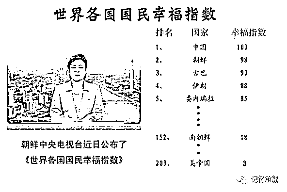
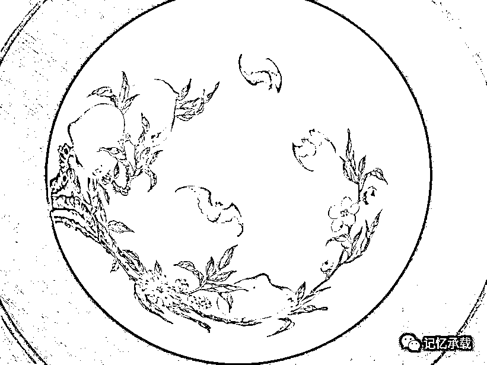
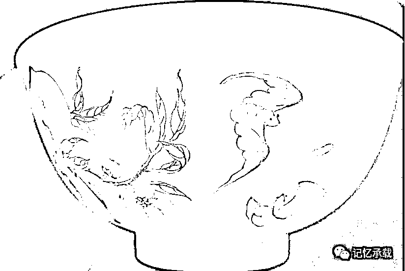

# 中国人到底幸不幸福

> 原文：[`mp.weixin.qq.com/s?__biz=MzU0MjYwNDU2Mw==&mid=2247483968&idx=1&sn=128d00ef8417dab0ab3e6af10c321af6&chksm=fb196e3ccc6ee72a048424388b4548eb8bebc8cebc41aa9b2a6418c863e1d3f6c73431454cab#rd`](http://mp.weixin.qq.com/s?__biz=MzU0MjYwNDU2Mw==&mid=2247483968&idx=1&sn=128d00ef8417dab0ab3e6af10c321af6&chksm=fb196e3ccc6ee72a048424388b4548eb8bebc8cebc41aa9b2a6418c863e1d3f6c73431454cab#rd)

前面有一期聊了朝鲜人民的幸福与美国人民的幸福指数之间的对比。有读者留言强烈要求写一期中国人的幸福。

我们来看一朝鲜中央电视台的幸福指数里中国人是满分哦。

那么我们这一期就应读者要求来站在中国人自己的角度上去评价下国人是否幸福。

讨论幸福，我们得首先弄清楚啥叫幸福。

这是一个粉彩的碗。里面有三只蝙蝠，外面有两只蝙蝠。

去过北京恭王府（和绅的旧邸）的都知道里面有一万只蝙蝠，这有什么讲究呢？这就叫万福风水宝地。蝙蝠就是福。

所以五只蝙蝠，就是五福临门。五福是哪五福呢？

《尚书》上记载的五福是：一曰寿、二曰富、三曰康宁、四曰攸好德、五曰考终命。

“长寿”是命不夭折而且寿数绵长 ；

“富贵”是钱财富足而且地位尊贵；

“康宁”是身体健康而且内心安宁； 

“好德”是心性仁善而且顺应自然；

“善终”是安详离世而且饰终以礼。

我们来从这五个维度看下中国人到底幸不幸福。

一、长寿：

根据 2016 年世界卫生统计。全球人均寿命为 71.4 岁，中国人均寿命为 76.1 岁。中国排在 53 名。

排名前三的是：日本为 83.7 岁；其次是瑞士 83.4 岁；新加坡 83.1 岁。

那么在中国的 53 名附近的是谁呢？往上 52 是乌拉圭，50 是卡塔尔，49 是古巴。往下 54 是越南，55 是伊朗。

所以从寿命的角度看，中国人应该属于中等幸福国家。比上不足，比下有余。和越南、伊朗、卡塔尔、古巴的水平差不多。

二、富贵：

富和贵是两件事，我们得拆开了看。

首先说富。

2017 年，全国居民人均年收入 25974 元，大概是 4123 美元。而美国人均年收入是 3.7 万美元是中国的 9 倍。

当然这个数据没有代表性。因为中国是个贫富差距巨大的国家。

我们换一种方式去比较。

民间的富翁阶层，比如榜上有名的马云，马化腾等人，在全球排名前十。也就是说和西方发达国家是一个层面的。至于有能力不上榜的，那我们不议论。

民间的中等收入者。这个没有统一的数据，以作者的观察，中国一二线城市的中等收入者大约是美国普通中产阶级收入的一半左右。比如美国一个家庭年收入在 100 万人民币，那么对应到中国一二线城市的中等收入者大约在 50 万人民币。

低收入者。我们按照整体人均收入的比例数据就能推断出，中国的低收入者是美国普通劳动者收入的 1/10。

当然，和美国对比不公平。因为美国是全球 TOP 10 的存在。而中国整体上还是发展中国家。比如印度的人均收入只有中国的 1/4，越南也是。

所以从富这个角度看，显然，中国是远不如一线国家的，但是比越南印度要强许多。（当然，看你处于中国的什么位置，如果你是富豪，那和美国是一样的。如果你中等收入，那相当于美国的一半，如果你是低收入者，那就只有美国的 1/10 了）

其次说贵。

如果你把贵定义为人上人，那永远都只有极少数人可以贵了。因为你以人踩人为标准。如果你把贵定义为有尊严的活着。那么我们来看下大体的社会情况。按照作者几十年的社会感受来看，作者三类人都接触过。中国大体上在贵这个层面分为三大类。

第一类：有权的。

第二类：有钱的。

第三类：没权也没钱的。

这个话题没法延展开讨论，这只是一个普通老百姓的普通感受。具有一定的代表性。也就是说以片面的看法，你越接近权力，你就越能维持体面，其次你可以接近钱，也可以相对维持体面，而离这两者越远，就越难以保有体面。

这一点，每个国家情况都不同，确实有日美等相对来说普通劳动者收入高，制度健全，万事不求人因此也活的更有尊严的国家，但也有像印度那样种姓制度严格，低种姓群体生活的不如奴隶的国家。

所以从贵这个角度看，也是一样的道理，比上不足比下有余，要看你到底是要和西方国家比较还是和非洲等欠发达国家比。

三、康宁：

先说康，健康。

联合国“可持续发展目标（SDG）”评估数据，按照儿童和婴儿的死亡率、交通事故中的死亡率、儿童的超重情况、酒精与烟草的消费水平、艾滋病、肺结核、患病率、乙肝的患病率、自杀率来置顶标准，在 188 个国家和地区中，中国名列第 92 位，评分是 60 分（满分为 100 分）。

这个数据我们无法有直观的感受，我们可以从一个细节去看。比较下全球的城市的空气质量。比如 PM2.5。

你去北京，经常都是 200 到 500，你去上海，大概是 100 多到 200，而你去深圳，就只有 100 以下了。当然，如果你去美国，去澳大利亚的一线城市，10 以下是很寻常的。但是反过来如果你去印度的孟买，500 以上也是很寻常的。

所以这个健康也是要看和谁比，和西方发达国家比确实有很大差距，但是比起印度还是有优势的。

再说宁。

宁是内心的安宁。

这个没法从数据上去对比。作者工作十几年，也接触过美国人，日本人，印度人，也接触过公务员、体制内的，风口行业的，传统行业的。从我个人的感受上来看。

如果拿中外做对比，我确实没有在美国人，日本人，印度人身上感受到过焦虑，当然，也许是人种不同，人家有焦虑也没让我看到。

如果拿中国内部各个行业来比较，我的感受焦虑感从弱到强是按照如下的次序：

公务员和体制内的 < 体制外的

传统行业的 < 风口行业的

老年人和孩子 < 中年人 < 年轻人

我们举一个细节就能感受到这个。比如中国人无论老中青扎堆聊的都是投资，并不是消费。

投资和消费虽然你看起来都是把钱花出去了。其实不然。前者并没真花出去，它只是换了个形式，而后者才真的花掉了，花没了。

其实这么多人热衷投资的本质就是焦虑与不安。国家希望拉动消费，那这种焦虑就会阻挡政策的推行。人只有安心的花钱，不要成天想着赚钱的时候，内心才会有真的安宁。或者换个角度说，人只有内心真的安宁了，才会安心的花钱，才能拉动真正的消费，而不是通过国家力量用投资或者集中采购的方式去强行拉动基建式的突击消费。

四、好德：

心性仁善和顺应自然这个要求吧，在大陆是很难做到的。我们从一个尺度就能看出问题的根源在哪里。

改革开放近 40 年来，中国的 GDP 一直保持了极高的增速，大部分时候都是接近或超过 10%，而美国的 GDP 增速大概只有 2 到 3%而已。

什么叫 GDP 呢？通俗点说就是你折腾的程度。你 GDP 越高，你就越能折腾，说明你越活跃。

人类的活动本来就是企图征服自然改造自然的过程。而在这个过程中，人与人之间有合作，有竞争，有正面的，就有负面的。这个过程中人就很难仁善。

我们打个不恰当的比喻。GDP 增速高，就好像你处于竞争状态，或者叫战争模式。GDP 增速低就好像你处于平静状态，或者叫和平模式。商场如战场，你见过战场上有内心仁善的么？那肯定被干掉了。

五、善终：

这其实与上一个问题是一样的。你内心仁善且安宁，你顺应自然，你才能够有好的空气与水，才有安全的食品，才有人与人的信任与和谐，才有除了钱以外的其它更加丰富的追求。而你呆在战场上处于战斗模式，你最后还要求自己安详离世，这显然是不可能的。

**你一辈子都没安详过，临死前咋能安详呢？**

所以四、五的评价我们合并到一起说。我认为这是个取舍的问题。当你得到了某些东西的时候，你必然要失去某些东西。就好像河北的发展速度与北京的空气质量本来就是矛盾的。河北人民追求财富的需求和北京人民追求空气质量的需求在很大程度上也是彼此冲突的。

五福到这里讲完了。我觉得我还是蛮公正的站在纯客观的立场上去描述问题。

中国到底是不是像朝鲜电视台那样幸福指数满分全球第一，是一个仁者见仁，智者见智的问题。

当然文章这么写肯定很多读者不满意，或者说不过瘾，因为大家喜欢看有料的，这么平淡这么客观就没料了。

我知道读者希望看到什么，但是我不会那么去描述问题的，不仅仅是为了公众号的安全问题，更重要的是，我觉得，那么描述也并不客观。

如果要把中国人的看法划分下，我认为可以泛泛的划分成三类（不全，我没法划全了，道理都懂）。

三种人里想法各有不同，但是都可以找出代表性的声音。

高收入者：

我记得有两个人在饭局上的话挺有趣的，拿出来分享。

一个是 40 岁左右的小老板，他有次在饭局上抱怨了一段话，大概的意思就是感慨国家为啥非要制定双休日制度呢？他觉得如果员工都像他一样 7×24 小时干活该多爽，每次一过双休日，他看见员工没来加班就内心就像被蚂蚁啃食，煎熬的不得了。觉得耽误自己好多赚钱的时间和机会。饭桌上大家都笑。

另一个是个 50 多岁的手下有上千号人的全球顶级外企的 VP，他说这辈子好像也没人逼着他，为啥就过的这么累呢。呵呵。

其实这两个人的心态蛮有代表性，就是中国其实是有相当一批人，人家就不想幸福。或者说他们定义的幸福和大众的舒服不一样。他们不仅自己不想舒服，也不想让别人舒服，因为如果都舒服了，就没人帮他一起来满足他的野心或者叫雄心了。

中等收入者：

该有的都有了，不该有的看起来这辈子也没希望有。那既然如此，为什么不能让自己过得舒服一点呢？大家都跑慢点，悠闲一点，不是挺好么？

低收入者：

这个社会问题太多了，分配太不公。生存压力太大，更不要说体面的生活。

问题写到这里，其实已经浮出水面了。就是矛盾的根源是社会的声音本来就不同。彼此想要的幸福也不同。

改革开放早些年，全球化中国的比例不大，还有很大的发展空间。这就好像罗马帝国刚开始，地盘很小。你去攻打周边，贵族能分大头，贫民也能分小头。总是够分的。可是到了后期，罗马太大了，周边可以抢的国家太少了，说白了，不够抢了。矛盾就出来了。就如同今天，中国还要高速发展，那就要去和美国硬碰硬。硬碰硬，风险很大，预期收益不如意。

这就是根源。

邓公说让一批人先富起来，然后带动后富最后共同富裕。问题是先富的为什么要带动后富的呢？先富的说，既然富了，外部的预期利益空间又不大了，这种局面下如果要均富，那均谁的富，还不是自己利益受损？那干脆富了就走呗。资本于是外流了。但是穷人不干呀，你丫在牌桌上赢了，你就想走啊？没门。你输光才能走。

这就是矛盾。

十九大说当前的主要矛盾是人民日益增长的美好生活需要与不平衡和不充分的发展之间的予盾。这个定位非常准确。

问题是，怎么平衡，怎么充分？外部的预期空间不大，要让后富的人共同富裕，总得有人出血，外面没人出，那就只能里面的人出，谁出？先富的人出么？

**有一句大实话。就是有人幸福，就一定有人不幸福。**要么外国人不幸福，要么本国部分人不幸福。全世界人民共同幸福，这是个幼稚的想法。这个话题作者不想展开，到此打住。

但是从历史上看，中华民族确实不是一个善于内部妥协的民族。怎么样才能让绝大部分人满意，这是个非常复杂的话题。自有当政者去思考，与我等庶民无关。

地藏菩萨发愿：“众生渡尽，方证菩提；地狱不空，誓不成佛”。

结果是什么呢？结果就是她始终也没成佛......

为什么呢？

佛曰：渡尽一切众生，实无一众生可渡。

让所有人都幸福，本来就是所有人自己的事儿，而不是某个人或者某批人的事儿，幸福是要自己去追求的。

我很喜欢罗永浩的一个看法，也是自由君的一个看法，世界不需要你改变，改变自己就好了。你自己自由了，想去哪就能去哪，你想去找个内心安宁的环境去过小日子，是你的自由。你想留下，让大多数人陪你不舒服，也是你的自由。你首先得自由，才能幸福。你让自己幸福了，就等于把世界变得幸福了一点点。

这话鸡汤味很浓哦，呵呵。

是的，我们公众号的刊旨就是不说假话。

下面说点大实话。一个人想幸福。绝对不是这么笼统或者形而上的几句不痛不痒的屁话的事儿。而是非常复杂的系统工程。

且不说人生处处要花钱。有钱人，他也一样焦虑呀。马云难道不焦虑么？不焦虑他一天飞三个国家？有权人他不恐慌么？不恐慌.......此处省略 500 字。

一个人挣钱，如果把挣钱这个事和你自己捆绑在一起。你就必然忙碌。因为甭管你挣多大的钱，本质上你都是依靠出售时间。一旦你停止出售时间，你就停止赚钱或者说，你的财富在缩水。人都是喜欢走上坡路的，没人喜欢走下坡路。甭管这个人多有钱。你让他走下坡路，他都不干，所以，最后都把自己累死了。

我们看秦始皇就是累死的。但是你反过来看刘邦，就很悠闲，斗鸡的斗鸡，洗脚的洗脚。为什么呢？因为有韩信嘛。刘邦斗鸡的时候，韩信还是战必胜，攻必克，也就是说，汉朝的扩张不依赖刘邦自己。

所以，如果你挣钱的姿势不依赖于出售时间，你才可能每天回家陪孩子吃饭。而且是安心的陪。因为陪孩子吃饭的时候，你还是在走上坡路。因为你把自己变成了刘邦，打江山成了“韩信”的事，从你身上剥离了。

所以很多人说要如何如何，但是从来不谈条件。这就是幻想。要陪孩子，要舒服，要多休息，要少工作，要玩，要开心，其实不用你写文章告诉大家的。人类都知道。

问题是，怎么才能做到安心的玩，丝毫不焦虑的玩，就没人告诉你了。

而后者才是真正有价值，可操控，可执行的。

当然，你该不是要问如何找到“韩信”？那就是非常复杂的系统性话题了。那变成讲一部书就不是聊“中国人到底幸不幸福”这个简单的话题的故事了。

那就不是这里能聊的完的了。

我推荐一个节目，声明不是打广告哦。因为人家的粉丝几百万，咱的粉丝几百个。根本也轮不到我给他打。

《随口说美国》，大 V 叫自由君。我对于什么外国的月亮比中国圆半点兴趣也没有。我喜欢听的是他描述的整个移民前后的过程里利弊得失的比较和每一步决策的思考。这是我有兴趣听的。

他移民前是个小公司的高管，他被动收入超过主动收入三倍的时候，才对老板 say no，才能够不错过女儿的成长能在家里陪孩子；他移民美国不是为了诗与远方，更不是为了自由民主，而是为了给孩子一个安全保障。比如知道人混的最差的时候会是怎样，比如为了空气食品水医疗养老等各种福利；他做音频节目最后做到大 V 也不是为了改变人类，而是觉得这是蓝海，可以找到新的市场。

这种就是非常真实的人生，你可以认为人生处处是谋划。这就对了。人生本来就处处是谋划。而且不是你一个人的谋划，是你全家都上阵，个个都谋划，代代在谋划！

你想要舒服，人人都想舒服，问题是，凭什么轮到你呢？

想要幸福的人太多了，远比幸福多得多。

通往幸福的路有两条。

第一条，知足常乐。

第二条，通往幸福的路上充满了谋划。

而且这绝对不是什么轻松的谋划。主流媒体有句话我非常认同，让人民幸福的路径唯有奋斗可以到达。

但是这个奋斗并不是你以为的多加两天班就足够了。

你说加班了，老板没给你股份，你说老板给你股份了，旁边那家上市了你们家没有。很正常啊。老板凭啥非得给你股份？上帝凭啥非得让你们公司上市。

难道老板不是好老板，上帝不是好上帝，咱的日子就不过了？

看了我的文章也千万别以为我鼓动你去投资哦。人人都躺着挣钱，那挣的谁的钱？也不想想可能么。

我们 QQ 群里有位这个领域里非常有话语权的人，我们前面几次文章也提到过他。我记得他有句话非常有趣。我直接从 QQ 群里转载下来。

“你们散户以为投资是采蘑菇的小姑娘？提着篮子就跑去森林里了？那你当职业的都是干啥吃的？人家在森林里不是埋伏陷阱，而是早就架满了高射炮，还是卫星定位的，还是自动巡航导弹的，还是人工智能的，别说一个小姑娘，一只蚊子都别想活着离开！你们以为努力投资是咋努力？一个胳膊挎两只篮子就叫努力？你以为学习是咋学习？能让你看得到的学习资料和新闻信息全部都是被控制好了的，说白了，想让你知道什么，你才能知道什么。这个游戏早就已经玩到散户无法理解的状态了。你跑进来，就是韭菜，无非是哪一天的韭菜而已。”

他说的不无道理。尤其在国内，更是如此。并没有什么路是坦途。即使你想要一个公平的交易环境，也是要通过奋斗的，立法的奋斗，监管的奋斗。

路越是难走，走的人越要好好走，如果自己都不好好走，那下一代就更难走。即使我们今天这种在全世界相对中等水平的幸福，也是前人流血牺牲换来的。我想他们并没有想过自己会不会幸福，更多的是想着是否能让后人幸福。既然我们承了前人的恩，那我们更要跑好这一棒。

无论你是打算呆在这个国家和大家一起努力奋斗还是准备换个国家为了小家奋斗，都无可厚非。只不过有一点是相同的。

通往幸福的路一定是奋斗出来的。

对作者最好的打赏就是转发

欢迎其它公众号转载，转载请注明来自微信公众号：wodqbs

扫码关注有惊喜