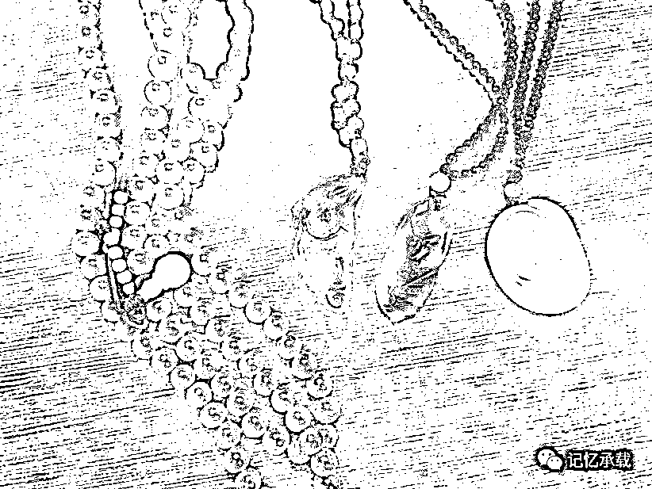

# 人要成为自己而不是某某某

> 原文：[`mp.weixin.qq.com/s?__biz=MzU0MjYwNDU2Mw==&mid=2247483896&idx=1&sn=21daca69aa2ac30fa61e8dff8b710ea6&chksm=fb196d84cc6ee4925f49486bfc8fc9101c6ded4f2668225422acbd0c63df6dd9d7b41321bf81#rd`](http://mp.weixin.qq.com/s?__biz=MzU0MjYwNDU2Mw==&mid=2247483896&idx=1&sn=21daca69aa2ac30fa61e8dff8b710ea6&chksm=fb196d84cc6ee4925f49486bfc8fc9101c6ded4f2668225422acbd0c63df6dd9d7b41321bf81#rd)

这是堆什么东西呢？反正是挂在脖子上的东西吧。

人类为什么会在自己身上穿戴一堆原本不属于自己身体的东西呢？比如首饰、手表、还有其它零零碎碎的装饰品。

我想，大约是他们不想做自己吧，于是把自己装扮成另一种样子。

这两天我老婆在看热剧《恋爱先生》，里面靳东就是个教男人如何装扮自己的恋爱专家。她每次看这类题材的电视剧，就总想把我按照靳东的标准装扮下。

我平日里是个什么样子呢？举个例子，比如夏天，我在家里赤条条一丝不挂，类似竹林七贤里的刘伶一样。我家里只有老婆和我儿子，幸好生的是儿子，要是女儿，我还不能如此随意。

当然，我没有像刘伶那样一丝不挂的见过老婆儿子以外的人，其它时候，我还是穿的很得体的，只是经常一件衣服穿了十年不换新的。

我小的时候是这样么？显然不是的，我小时候被打扮的很体面，注意我用的词是被。为什么呢？道理很简单，虽然我认为刘伶没做错，人类生来什么样，就以什么样示人，才算坦诚。但如果我小时候敢这么坦诚，我爸一定揍死我。

所以，你怎么想的，和你当下到底可以怎么做，是两回事。

我大一的时候把两块手表扔到了六和塔对面的那个钱塘江里，一块是摩凡陀的潜水表，我爸送我的，另一块是香港回归纪念表，我外婆送我的。我并非对长辈有意见，而是我一直很厌恶有个东西趴在我手腕上，所以就趁住校实现了心愿。从那以后，除了结婚期间被迫戴了几个月婚戒。我身上再也没有过任何不必要的东西。

这里加句声明，仍东西这件事我做错了，那时候青春期，叛逆心理很严重。其实不想戴，还给爸妈就是了。扔了，是不对的。不要以为我文章里写的每件事都是对的，我做错的事比我做对的事，多得多，只是很多事，要很久之后，我才能意识到错哪儿了。

注意哦，这些都是有前提的。如果你看了我的文章觉得我说的甚是有理，然后赤条条跑到小区里，那保安一定把你扭送公安局。

所以，做自己想做的，是有前提的。千万别越界。

如果要去见领导，我也得西装革履系上领带毕恭毕敬，就像我儿子并不敢当着我的面赤条条。

说这么多，不是来讨论裸奔是否合理合法的，我是要引入下面这个话题。

有一些投资群里的朋友，也是这个公众号的读者，他们留言想聊一期投资。我是个工程师，不想跨专业领域胡诌，但是我可以从旁观者的角度去聊一个更广泛的话题。就是你到底要做什么样的人。

先抛出结论，我的看法是，人一定要做自己。

小时候，老师总是鼓动大家学习雷锋好榜样。

我们班有个同学就跳起来反对，他说，雷锋一做好事，就开心的不得了，所以才能坚持做好事，而他一做好事，就痛苦的不得了，反而是一做坏事就开心的不得了，那你让他怎么学雷锋呢？

虽然这个小盆友因为诚实的美德被老师修理了，但是，他给我们揭示了赤裸裸的真相，就是人与人是完全不同的。

这就像森林里有很多动物，你不能因为一条鱼游泳游的好，就要求狮子老虎乌鸦麻雀统统去游泳。

回到正题，投资群里不乏有些高人，他们确实获利颇丰，如鱼得水。但是，你注意到没有？他们首先是条鱼。

就像你们提到的那个群里的 wu，按照郎咸平的定义，他就是 International financial speculator，他的圈子就是 Wall Street，就像α老师一样。你看他的朋友圈就知道他的朋友主体都是 speculator，就像我的朋友圈的主体都是工程师是一个道理。不同领域的人可以成为好友，可以彼此欣赏，但是最好看清差异。

他们做的事情，我不了解，也没资格评论，但我起码注意到了一点，他们很享受他们做的事情。可是他们享受的，换个人去承受，也许就是种煎熬。

鱼是用腮呼吸的，它在水下叫如鱼得水，他一天没有压力，他就很难受，会窒息，就像鱼到了岸上。

可我们是用肺呼吸的，我们去做鱼擅长的事情，未必也会感到同样的惬意。实际上，你下水你就得憋气。

我们且不论一个陆生动物有没有可能比鱼游的更快，就算能。你想过没有？

作为一个陆生动物，在水底下待一辈子，你，快乐么？

或者说，身为一只鸟，你是否愿意离开主场，很痛苦的承受水压，去和一条鱼赌看谁游的快？

人为什么想投资？难道是因为嫌赚钱太容易，想找个更富有挑战性的？我相信大部分人不是。大部分人只是觉得现实生活里赚钱太难，才想找个更容易的。

那么，我就要问你了，作为一个陆生动物，你在空气里尚且觉得呼吸困难，难道你下了水，就能呼吸容易？

实际上，你最好试试，如果你一下水，发现自己是水生动物，如鱼得水。那你天生就适合躺着挣钱，因为无论盈利与否，首先你是快乐的。恭喜你回归主场。

反之，如果你一下水，就极其痛苦。那你最好反思下，做自己不擅长的，还要付出这么大的代价，值得么？有希望么？

人，最好做自己。而不要总想成为某某某。身为一只鸟，不想成为最好的鸟，干嘛非要成为条鱼呢？

就像有的人西装革履，头发油亮，会觉得生活很美好。

而我，趿拉着板鞋，头顶鸟巢，我也觉得生活很美好。

**是鱼就游的更快，是鸟就飞的更高，专心做自己，就是最好的。**

当然，还有种动物叫鱼鹰，它在天上飞的比鸟高，它在水里游的比鱼快，这叫天赋，学不来的。如果你天赋异禀 ，恭喜你，如果不是，很正常。

林子大了，神奇的动物多的是，不可能每种神奇都落自己头上。

文后做个注释，任何事都是有前提的，就像《乱世佳人》的女主斯嘉丽出场就被她妈妈逼迫勒紧腰带，穿套裙。

身为男性天生就有可能获得更大的社会包容度，而且我同时非常努力的提升自己的利用价值，以至于别人碍于我的价值，容忍了我的个性而已。

如果你是个女性，觉得我说的很对没问题，如果照着做，也头顶着鸟巢去见男友，也许就嫁不出去了。

前者叫理想，后者叫现实。

欢迎转发

欢迎转载，转载请注明来自微信公众号：wodqbs

扫码关注有惊喜