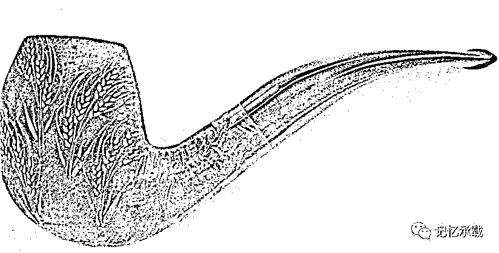

# 人最好的归宿是什么？

> 原文：[`mp.weixin.qq.com/s?__biz=MzU0MjYwNDU2Mw==&mid=2247483892&idx=1&sn=aca5e68a4be8b2a44604b17f4d876f50&chksm=fb196d88cc6ee49e545de365f9fa88dc2693515dcd0ada1dc4c5054654030cb263f5b95fbc01#rd`](http://mp.weixin.qq.com/s?__biz=MzU0MjYwNDU2Mw==&mid=2247483892&idx=1&sn=aca5e68a4be8b2a44604b17f4d876f50&chksm=fb196d88cc6ee49e545de365f9fa88dc2693515dcd0ada1dc4c5054654030cb263f5b95fbc01#rd)

这是一根石楠的烟斗。上一篇是水烟袋，那这一篇继续换个烟斗。

如果说水烟袋象征着安逸，那这个烟斗让人想起二战时巴顿将军叼着烟斗牛逼哄哄的样子。

我喜欢巴顿将军不是因为他传奇的经历，而是他说的一句话：

“一个军人最好的归宿，是在最后一场战斗中被最后一颗子弹击中。”

这句话是有争议的，我知道很多人不喜欢，觉得巴顿是个战争狂，不过我们这里不是辩论赛，我只是在陈述个人观点而已。我虽然观点常常与众不同，但是从不强求别人认同。就像小时候看射雕 83 版，很多人都喜欢郭靖黄蓉，而我喜欢欧阳锋。

我是能够理解巴顿说这句话时的感受的，就像一匹赛马，从小到大历经选拔，人生除了训练就是比赛，如果有一天，它不能再参赛了，与其让它落寞的活着，还不如一枪打死它，在荣耀与高潮中死去。

我相信我写这篇文章一定骂声一片，因为很多人都会质疑我的观点。

推荐一部 97 年发行的电影《千钧一发》。

电影设定的未来世界，每个人的命运都不再是充满未知。当一个生命刚刚诞生，他/她的人生路径就已基本确定，除非有一些意想不到的非基因因素出现。从基因的角度来说，文森特是个不幸的人。他一出生就被宣布带有一定的基因缺陷，长大后的他将是近视和心脏病患者，更可怕的是：根据基因推断，他只有 30 年的生命。

文森特的父母非常想要一个优秀的儿子，因此用基因优选法为他生了一个弟弟。尽管文森特在成长的过程中事事努力，但仍受到不公正的基因歧视，人们相信的只有基因！文森特痴迷于太空，为了实现飞上天去的梦想，他离家出走，历尽人间风雨，经过各种尝试企图成为一个宇航员。

我要讲的并不是他的梦想，而是一个剧情。文森特最喜欢跟弟弟比赛游泳：朝着大海深处游去，看谁先顶不住而往回游。当然，每次失败的都是文森特。

直到有一次，他赢了。

知道怎么赢的么？

他只游去程，不游回程。

说白了，就是他一往无前的向大海深处游去，不打算活着回来了。于是，他赢了。他游的比弟弟更远。

有些人可能以为导演想表达爱拼才会赢。但是我第一次看到这个镜头的时候，我想到一个问题。

**人生，有回程么？**

这是个很有趣的问题，很多人应该都会记得从小老师忽悠你，要努力，以后才会轻松；长大了领导忽悠你，敢吃苦，吃苦半辈子，怕吃苦，吃苦一辈子。

但是你有没有想过一个问题，半辈子既然都走过来了，难道还怕再走半辈子么？

就像玩梭哈，已经跟了 3 轮了，到最后一轮，你是梭呢？还是梭呢？

如果人生没有回程，那你留一半体力，往回游，干什么呢？

如果人生没有回程，那你活着离开战场，又有什么意义呢？

关注、转发有惊喜

欢迎转载，转载请注明来自微信公众号：wodqbs

