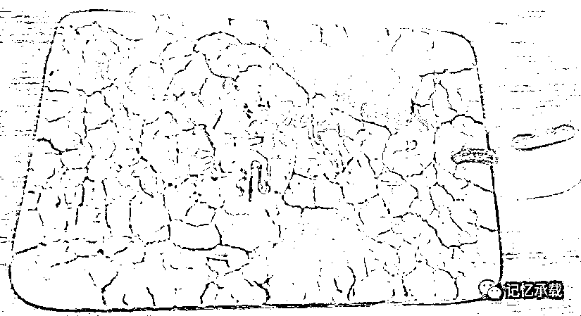
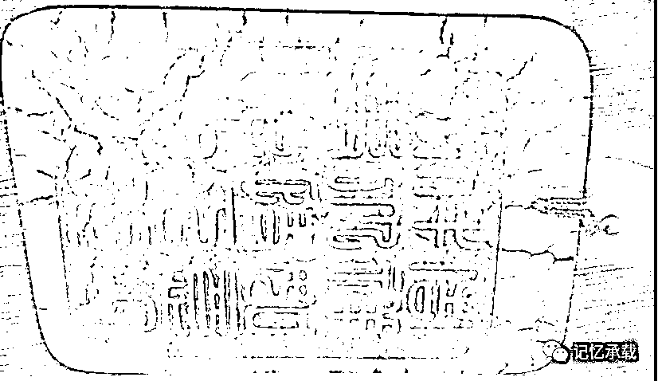

# 人只要做事就注定是要挨骂的

> 原文：[`mp.weixin.qq.com/s?__biz=MzU0MjYwNDU2Mw==&mid=2247483874&idx=1&sn=99066187830754c984a33a3c1d71ae08&chksm=fb196d9ecc6ee488eaf4a1873940466a14ff0ead3dd37c5762af2f1549478349757872b360a8#rd`](http://mp.weixin.qq.com/s?__biz=MzU0MjYwNDU2Mw==&mid=2247483874&idx=1&sn=99066187830754c984a33a3c1d71ae08&chksm=fb196d9ecc6ee488eaf4a1873940466a14ff0ead3dd37c5762af2f1549478349757872b360a8#rd)

这篇文章以第一人称写给我儿子。

昨天你数学测验没考好，被你妈骂的狗血喷头，明天要期末考试了，考前又被威胁了种种。诸如砸了你的 IPAD，以后都不许看电视云云。看你被骂的惨样，又不被允许辩解，我想安慰你又不知道说点什么，明天你要考试了，考完了看看这篇文章吧。

你很喜欢看鬼吹灯、盗墓笔记之类的电影、电视剧，知道下面这是什么吗？

这是一块墓葬中出土的玉佩。带有沁色，玉沁有很多种，黄色沁称土沁，白色为水沁，绿色为铜沁，紫红色为血沁，黑色为水银沁。这块玉上的叫血沁，血沁有很多种，有的是墓葬中的铁元素浸染，有的是朱砂沁入，而这块，出土在棺椁之内，是墓主人尸体贴身的随葬品，因此这种血沁，又叫尸沁。

我拿它出来不是吓唬人的。

人活着，就像这块玉佩，甭管你出生的时候如何洁白无瑕，终其一生，必然会遭到无数的攻击，有些是善意的，有些是恶意的，有些是无意的。就像它上面的沁。

你爸爸我小时候是学霸，但是学霸不等于不挨骂。

我数学第一的时候，会有人挑刺为什么语文不是第一，语文第一的时候，会有人挑刺为什么外语不是第一。等我所有科目全部单科第一总分第一的时候，还有人嘲笑我，为什么平时这么多第一，竞赛的时候却拿不到奖呢？甚至初赛都被筛下去。

我初中的时候参加数学竞赛，初赛就被淘汰了，评委组的洪老师私下有校外办学之事有求于你奶奶，于是就私自做主特批让我参加了复赛，当然我复赛还是被淘汰了。我的班主任就当着所有同学的面公开嘲讽我走后门。

当时我还太小，被当众侮辱却又无法自证清白。急怒之下在抽屉里用手反复的拗断了一根钢尺。等下课了，才发现自己已然满手是血。

到了高中的时候，数学依然是第一，竞赛的时候也依然无法通过初赛。我物理也是第一，但是直到物理第二拿走了全国物理竞赛一等奖，我仍然没有通过物理竞赛的初赛。这个奇怪的现象持续了三年，以至于老师都不理解，他不明所以，就随意给我安了一个浮躁的名头。

只是那时候的我已经不想辩解了，男人的胸怀都是被委屈撑大的。

人活着，是为了按照自己的规划一步步做自己的事，不是为了堵别人的嘴。后来，我仍然做过很多事，仍然被更多人嘲笑过更多次。

十二年前我做实习生的时候，因为太用功，效果又不如另一个实习生，被他耻笑从未见过如此用功之人，言外之意就是从未见过如此愚蠢的人。他当众说的多了，甚至连个不懂技术的市场部的头都质疑我的技术天份。为了避免无谓的纷争，我只好等所有人都下班了，再一个人溜回公司，深夜里学习。

九年前我刚学投资的时候，平均一天只睡 3 个小时，你妈总笑我，每天晚上不睡觉搞的这么努力，一天只挣几毛钱。不过她说的是事实，当时一年的总盈利十几万，扣除交给银行的手续费十几万，纯利润，100 块，平均到一天是只有几毛钱。

还记得么？我就拿着这 100 块，带着还没上幼儿园的你一起去满陇桂雨顶上玩漂流以示纪念，咱俩一人 50 块。

人活着，就一定有无数人来骂你，无论是好意还是歹意或者只是持有异议。世人不会有耐心来了解你。想骂你总能找得到理由，只要人家愿意。

你有钱可以骂你没名气，你有名可以骂你没地位，哪怕是马云都可以骂他没身材没相貌，你又算个什么东西。

做事，就一定会挨骂，就一定得挨骂。这就是千古真理。

就像一个人在雕塑，在他雕的整个过程里，背后永远都是非议，即使他雕成了，人家也一样可以找到其它的方式继续非议。

做事的人，没有不挨骂的，就像那块被沁了的玉。

想不挨骂，除非你不做事。

可是如果你真的受了点委屈就不做事了，那这辈子也就白活了。

人生就是一边做事，一边受委屈；一边受委屈，还得继续做更多的事。

还记得你很小的时候我带你驱车数百公里去看过的李鸿章故居吗？

不被人忌是庸才，没人骂你，那你肯定是个怂货。

有很多人骂你，说明你牛逼了。

等天底下一半的人都在骂你，那百年之后，你住过的地儿就成某某某故居了。

这篇文章你妈看了肯定要埋怨我给你开脱，所以补一句，你妈骂你是为了你好，你要感激她。我不是在为你考的不好开脱，我只是想让你知道：

**一块玉，注定是要被沁的，与其让那些不知道什么东西泼在自个儿身上，倒不如先动手，用自己的血、用自己的汗，亲手把自己给沁了。**

**一个人，如果生来注定是要挨骂的，与其让别人骂，倒不如自己先骂自己！**

欢迎转发

欢迎转载，转载请注明来自微信公众号：wodqbs

扫码关注有惊喜