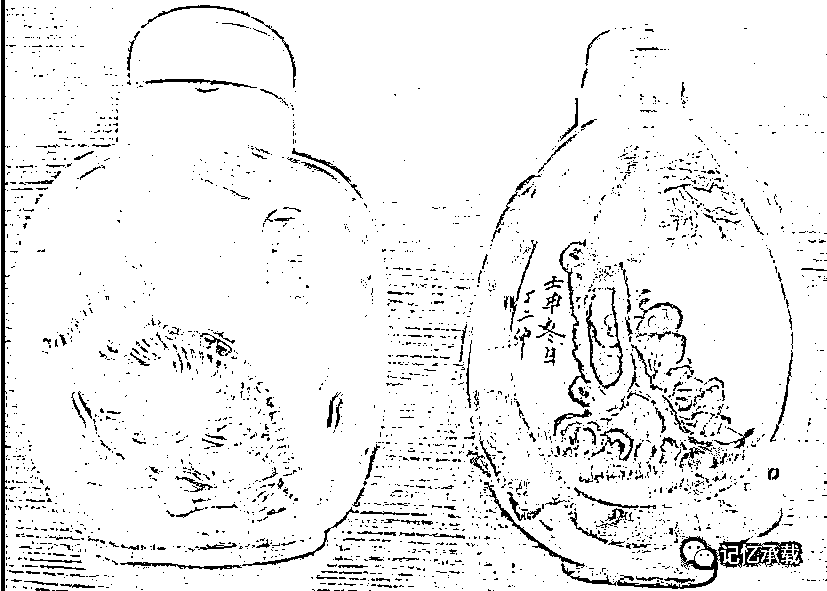
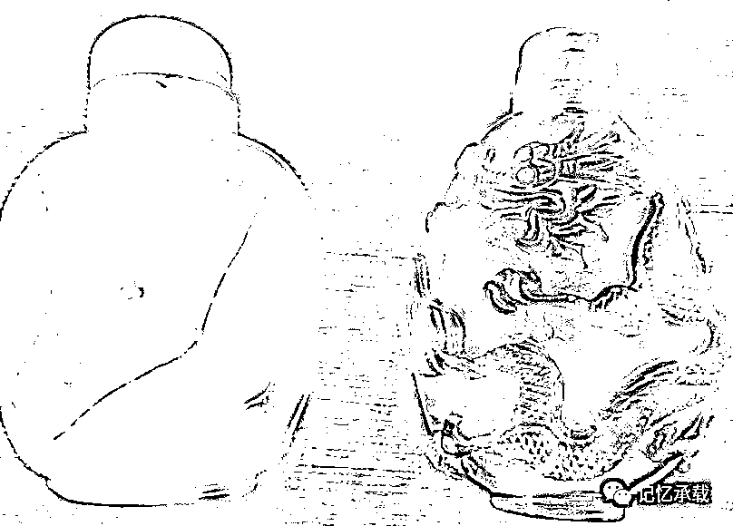

# 治未病不治已病

> 原文：[`mp.weixin.qq.com/s?__biz=MzU0MjYwNDU2Mw==&mid=2247483804&idx=1&sn=e68ad33aeaae9e993f0381327f76e470&chksm=fb196de0cc6ee4f692781c006c0339eff5bdf5a479a2da94ef0acc0931acb5b084afe469f109#rd`](http://mp.weixin.qq.com/s?__biz=MzU0MjYwNDU2Mw==&mid=2247483804&idx=1&sn=e68ad33aeaae9e993f0381327f76e470&chksm=fb196de0cc6ee4f692781c006c0339eff5bdf5a479a2da94ef0acc0931acb5b084afe469f109#rd)

上一章讲了牛人教了些什么，读者回复说大神尽教你些没用的。难道就没人教你比如怎么努力，怎么奋斗，怎么考试，怎么挣钱之类有用的？

努力奋斗、考试挣钱，是两个概念，前者是勤奋，后者是成功学。

不知道有没有回报的勤奋，作者是知道的，这就是习惯。

该如何有回报的勤奋，俗称成功学。作者是不知道的。因为作者本人既不成功，也不知道如何成功。

先说不求回报的勤奋，这就跟呼吸一样，只是一个很小就养成的习惯。你有很努力的呼吸过么？你肯定不会觉察自己有在呼吸，但终其一生，实际上你一直都很勤奋的 7×24 小时的呼吸着。如果你连呼吸都要别人在旁边打鸡血，要努力呼吸啊，要努力呼吸啊，那肯定是有病了，而且病的很重。

已经病了，还有办法么？来张图。

图中这个，是鼻烟壶。小时候感冒了，鼻塞，父亲会倒点，让我吸一口，吸一口，打个喷嚏，鼻子就通了。

鼻子是通了，但是感冒会好么？当然不可能。过一会，鼻子又会塞了。

作者没想过怎么样才能有结果有回报的勤奋，但是作者读过很多成功学的书，它们每本都介绍了至少 108 种飞黄腾达的姿势。我没试过，因为它们实在太多了，十万八千种成功的技巧，这么大一坨，光看目录，都要看一辈子。

虽没试过，但个人觉得，它们和鼻烟是一个效果，如果您有心，这辈子把十万八千种秘诀挨个试过去，下辈子碰巧遇见了作者，可以告诉我，哪种是有效的。

有人问，我就是没有好的习惯，我就是病了，该咋办？

黄帝内经里有段话，上医治未病，中医治欲病，下医治已病。到了已病，治不治也就那回事，药治不死病，佛渡有缘人。

这话什么意思呢？就是抢占先机要比当前的局面重要得多的多。

人最大的问题是什么？是只顾眼前。我让你提前很多天去定假期的酒店，你会不会定？一定不会，为什么？你觉得眼前没需要呀，等你到了需要的那天，你去定，有没有房间？多半没有。

你把它放大了看，你面临的今日事都是果，而昨日没有抢占先机才是因。

种地从来不是秋天的事，秋天是收获的季节，播种，在春天就已经结束了。

问题在于，很多人，春天的时候不舍得把种子放进地里去，到了秋天自然没有收获。

上一章讲舍得，没有舍哪来得？牛人教你的不就是舍得么？让你在春天舍得把种子扔进地里去，让你舍得做眼下无用的事情，到了秋天才有得。你舍不得，到了秋天，哪有得？

就像今天写文章，是给三十年后用的，因为三十年后，我真的需要写它们的时候，已经记不起来小时候的事了。

这和订酒店不是同一个道理么？

有人可能会问，那已经错过春天了，怎么解？就是不敢把种子扔到地里去，怎么办？

记得围棋怎么下么？还记得天龙八部里虚竹怎么破解珍珑棋局么？如果眼下这局你已经失了先机，那就干脆放弃当下，把时间用在做未来的事情上，等到了未来，你就占据了先手，你永远在做未来的事，每次到了未来，你永远都占据先手。

我们都是 ID，没有人是 IP，没谁戴着主角光环，唯一能做的事情就是冒险和牺牲当下，一分耕耘一分收获是不可能的，一百分的耕耘，是有一定的概率有可能换来一分收获的，我们追求的，原本就是这一点点的概率，仅此而已。

宁失一子，不失一先。

欢迎转发

欢迎转载，转载请注明来自微信公众号：wodqbs

扫码关注有惊喜