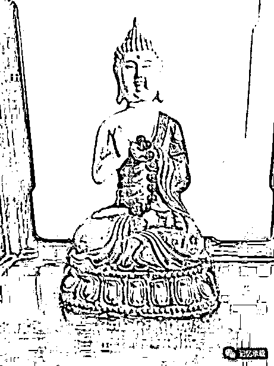

# 牛人到底教了些什么

> 原文：[`mp.weixin.qq.com/s?__biz=MzU0MjYwNDU2Mw==&mid=2247483795&idx=1&sn=e50cc2e3ef6aaaf18c3bc8f29b243841&chksm=fb196defcc6ee4f99616336569c5d9ac4bad71a55ccd233683d3e60bc38d94196a83711956aa#rd`](http://mp.weixin.qq.com/s?__biz=MzU0MjYwNDU2Mw==&mid=2247483795&idx=1&sn=e50cc2e3ef6aaaf18c3bc8f29b243841&chksm=fb196defcc6ee4f99616336569c5d9ac4bad71a55ccd233683d3e60bc38d94196a83711956aa#rd)

上一章“由跨年演讲想到的”有读者留言，想知道你提到的校外的牛人到底教了你什么，那本章就聊这个。

接着上一章继续声明，本号聊的首先不是知识，是段子，其次，不仅是段子，而且是无用的段子。因为作者小时候，是 8，90 年代，那个时候没有成功学这个词，成功学本身就是 2000 年以后才引入大陆并被我们自己发扬光大的新学，因此，作者小时候教作者的所有人，按照今天的标准来看，他们都不是成功人士，他们也都没有学过有用的学问，因此，作者小时候学到的本来就是无用的旧学。我们聊的，只能是这些无用的人和事儿。

有人问，你怎么不教你儿子一些有用的，作者的看法是，不需要。我相信这种知识他每天都能接触到。因为我自己，每天都能接触到。我早上去上班，在公司楼道里上个厕所，门口肯定有一群清洁大妈聚集着，大妈里有股神，有房神，还有赌神，她们都和中南海保持着某种不可告人的密切关系，无论是楼市有什么政策消息，还是证监会有什么经济策略，她们都比大 V 们知道的要早。而且都还很爱学习，每天不是在聊傅盛的"要么进化，要么去死“，就是在聊”如何避免成为一个油腻的中年大妈“。你想，随便找个人都精通的学问，还需要特意教孩子么？我相信他们学校的门卫、保洁、厨师每天也都会聊这些，孩子们从小耳濡目染，想不成为顶尖高手也难。

言归正传。

牛人不是一个人，是一群人，少年的有拿过全国数学竞赛第一名的，这算是哥哥级的，青年的有本省外贸局的首席翻译，这算是叔叔级的，中老年的有 985 的某些学科的教授群体，这算是爷爷级的。当然，还有太爷爷级的，避讳，不介绍。

他们教的东西是不一样的，但是有一个规律，就是越牛逼，教的内容就越没用。

哪怕是最初级的，哥哥级的，他见我第一面，一上午就嘚啵嘚自顾自的连念题带解答的教了 400 道竞赛题，平均每半分钟一道，注意这是竞赛题，一周之后，我再次见他，他问我懂了多少，我告诉他，当天我大约强行记住了一半，回去之后又忘了一部分，花了一周大约弄懂了 1/4，也就是 100 来道。

他见我第二面，除了问上次的事，只问了一个问题，你不怕“竹篮打水一场空“么？他的意思我明白，他教我的东西，是没有用的，从短期看，对考试，升学毫无用处，从中期看，对保送，加分毫无用处，从长期看，对工作生活也毫无用处。一个人，要花这么多精力，做一件任何时期都毫无用处的事情，你，怕不怕呢？显然，他都不怕白教，我自然是不怕白学的。

再聊聊叔叔级的，我记得有一次在他家里背书，背的实在无趣，拿了本英语选择题问他题，他看了看，告诉我，咱不学这没用的。那他教了我些什么有用的呢？大约是背英文版的圣经，英文版的新旧约全书，英文版的莎士比亚罢了。如果你站在考试的角度，他花了那么多年教的这些，绝对是用不上的，如果你站在与外国人交流的角度，他教的这些，更加是用不上的。

再往上，那就更形而上了，最上面的大牛，教的所有东西的中心思想就是在教你要学会放弃，放弃急功近利的想法，放弃当下的欲望，始终平静且专注的优先处理那些当下看起来无用的，几十年后到底有没有用他自己也不确定的事。

配一张释迦的照片吧，父亲家里的一尊佛。

我想，再大的老师，也没有大过他的了。他教了世人几千年没用的东西，教了世人几千年的放弃。

我小时候是见过昙花开的，有天晚上，忽然，阳台上的昙花就开了，好神奇。那一夜，我想起一个有趣的问题，也没见父亲有怎么努力的让花开，他只是在修剪那些不要的枝叶，修着修着，昙花，就莫名其妙的开了......

这么多年过去了，很多人都不在了，忽然想明白他们当年教的话了，你舍着舍着，得就莫名其妙的来了......