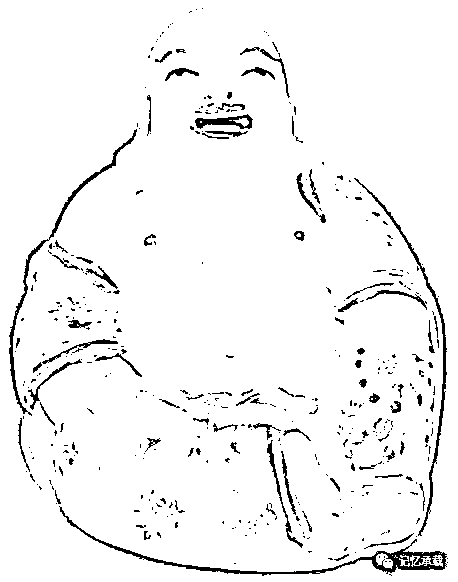
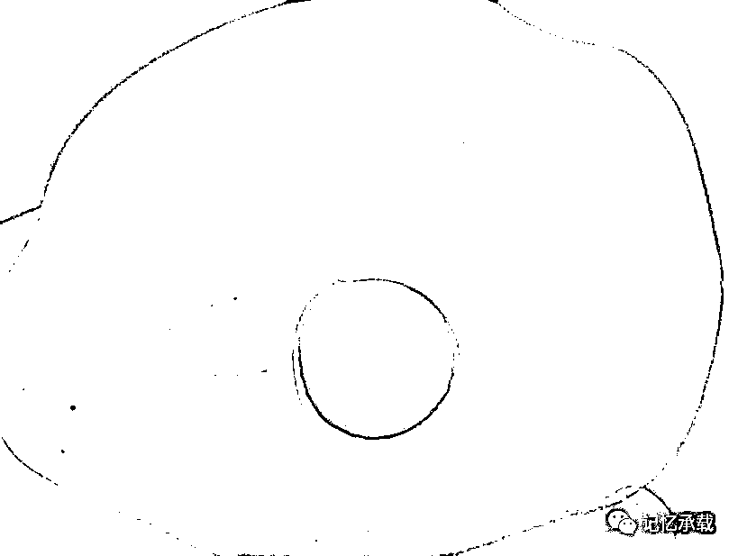

# 哪怕放个屁，也好呀

> 原文：[`mp.weixin.qq.com/s?__biz=MzU0MjYwNDU2Mw==&mid=2247483782&idx=1&sn=70263471223c329914e506d1305d543f&chksm=fb196dfacc6ee4ec329fafe26095f7db639e7d916f2df84831d3e223865d7485bcd9b8319abb#rd`](http://mp.weixin.qq.com/s?__biz=MzU0MjYwNDU2Mw==&mid=2247483782&idx=1&sn=70263471223c329914e506d1305d543f&chksm=fb196dfacc6ee4ec329fafe26095f7db639e7d916f2df84831d3e223865d7485bcd9b8319abb#rd)

这标题一定让人懵逼，这章是要谈什么？

我写它的时候，我儿子正在看西游记伏妖篇，有句台词，让儿子笑了很久。

唐僧说：“佛祖，你能给我点提示么？哪怕放个屁，也好呀”。

上图，

这是一尊瓷佛，80 年代初期家父不知道为啥，很喜欢这尊看着没什么特别的瓷佛。他说很珍贵，因为它只剩下这一尊了，其它的都被碎了。

我们可以看到底座的编号，不知道左边那个章是否是红卫兵查没时留下的。

佛有过去佛（燃灯），现在佛（如来），和未来佛（米勒），玄奘法师不远万里执意要去印度的那烂陀寺，目的就是为了学习 Yogācāra-bhūmi-śāstra（瑜伽师地论），瑜伽师地论正是弥勒佛口授，无著菩萨手抄流传下来的。

而这尊，就是米勒塑像。

我们都知道印度的瑜伽，10 年前在女性中就很流行了，各个健身房都有开设这门课程，健身房里的瑜伽其实就是印度的身瑜，也就是藏传佛教密宗的金刚亥母的四十多套拳。音声瑜伽就是咒语。而心瑜伽就是心地法门，只有中国的《瑜伽师地论》也就是唐僧带回来并翻译的这一百卷，才是真正正宗的瑜伽。

也就是说，你修炼瑜伽师地论得道了，才算是真正的瑜伽师，而不是健身房里那个教你身瑜的教练。

怎么叫地论呢？地就是范围，分为十七个范围来说明，普通一个人，由人生讲到物理世界，再到整个宇宙。物理世界讲完了，回转来讲怎么样修持，怎么样修心，证得形而上这个道。然后，又分开：小乘道怎么修持，大乘道怎么修持，一直到成佛，一百卷说完了。

所以合起来叫做瑜伽师地论。 

唐僧最大的功绩就是带回并翻译了瑜伽师地论。

可惜，作者根器浅薄、资质驽钝，并没有读过这部著作，大约，想来也是知道自己读不懂罢了。

回到标题，电影里的唐僧也有很多困惑，希望佛祖提示，就算不给提示，哪怕给放个屁也好，起码坚定下自己的信心，相信佛祖是存在的，或者说，是有听到了自己的声音。

但是很可惜，现实中，大约是没有佛祖会响应我们的，也许是因为我们信念不够坚定，也许就算坚定，佛祖也没发现我们的存在。

但，这正是最让人感动的地方，人类，是如此的卑微，却又满怀着如此宏大深远的理想，就算始终听不到屁声，依然在蹉跎轮回中前进着......

如果红颜命不曾单薄

这世间有没有传说

生为飞蛾若是不敢扑火

这宿命凭借什么壮阔