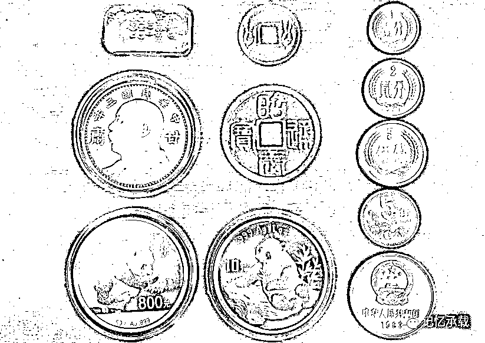
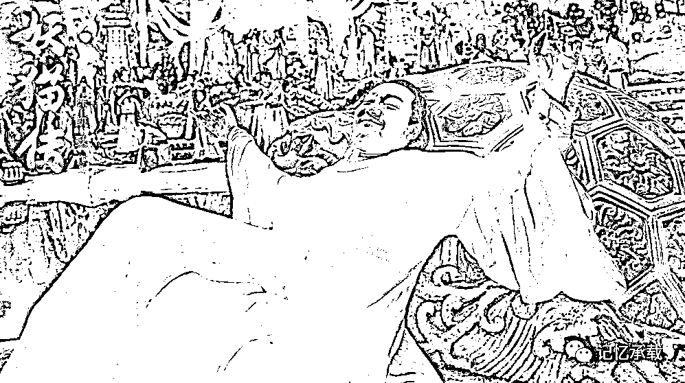

# 你需要的，真的是钱么？

> 原文：[`mp.weixin.qq.com/s?__biz=MzU0MjYwNDU2Mw==&mid=2247483762&idx=1&sn=e737626e85857233865afb3f5ad584f1&chksm=fb196d0ecc6ee4183ac49040c5acdb142044bbb71f7502bf8195b27194087c6fb38903348d9a#rd`](http://mp.weixin.qq.com/s?__biz=MzU0MjYwNDU2Mw==&mid=2247483762&idx=1&sn=e737626e85857233865afb3f5ad584f1&chksm=fb196d0ecc6ee4183ac49040c5acdb142044bbb71f7502bf8195b27194087c6fb38903348d9a#rd)

这一章，我们谈钱，谈钱挺俗的，但我们不免俗。

在开侃之前，先回答某位好心的读者的意见。

有读者建议作者，不要总说实话，要迎合读者的转发需求。说的具体点，就是多从抱怨的角度去写文章，比如，“为什么越是努力越没有钱”，“人到中年不如狗”，诸如此类，这样读者看到了，就方便转发，比如转发给老板看可以抱怨钱少，比如转发给家人看可以抱怨辛苦。

作者是这么看的：

从读者的角度，抱怨并不能解决任何问题，作者从小就见过很多上一代的人在没有互联网的时代每天聚在一起从早到晚的抱怨社会和政府，但是抱怨了几十年，直到他们有些人已经不在人世了，旧的问题没解决，新的问题倒是添了不少。可见提供可分享的抱怨类的文章对读者没啥用。

从作者的角度，作者有自己的职业，无意炒作并从公众号中牟利。这就是个单纯的记录思想，留下回忆的非商业用途的公众号。

也有读者建议抨击政府抨击社会抨击福利制度等等，这样很容易引起共鸣和转发。

写文章开炮不是不可以，陈琳《讨贼檄文》，骆宾王《讨武曌檄》都是骂人堆儿里的千古雄文，至今读起来热血沸腾。但是这事吧，得等时机，真有好的题材，作者也很想一抒胸臆，你们也很想看的时候，偶一为之，是可以的。但是如果为了刻意圈粉天天开炮，那就成了泼妇骂街，怨妇呻吟了。

正式开侃。

过去的 2017 年里，所有的投资品里谁最亮眼？显然是比特币。它从 1000 美金涨到 2 万美金，无比耀眼。

比特币只是一串密码，它没有实体，我们贴一组有实体的。

这张图中有共和国各个时期的硬币，还有银币，金币，民国的袁大头，古代的铜钱，乃至金子。货币未必都是金属，但是黄金天然是货币。

我记得我很小的时候，大约是 80 年代中期，白天祖父祖母都去上班了，我就一个人呆在家里，祖父吃饭的八仙桌上有四个抽屉，抽屉里有好些铜钱和毛泽东像章。我那时候就把它们都摆在桌面上，表示两队人马，然后我排兵布阵，让它们对战。后来稍大一点，看拿破仑传，读到他小时候也干过类似的事儿，不禁莞尔。

我从小很爱钱，但是和今天人们的爱钱不一样，今天的人们爱的是钱能给他们买来什么，我小时候爱的就是钱本身。那时候最爱两种钱，一种是硬币，一种是外汇券。硬币是可以用来排兵布阵的，外汇券是因为它长得和人民币不一样。外汇券是当时的体制下的一种特殊货币，面值和普通人民币等值，可以拿来兑换外汇。可惜外汇券都没有保留下来。

前段时间同事聚餐，恰好聊到工作上的事情。有的同事说，其它城市的其它分公司里的某些人，工作很不积极，遇事就推脱，人品很差，但是人家混的很好，也许评了优秀员工，也许分了股票，他们哀叹为什么付出和回报从来不对等。大家自然而然的谈起了价值观，有同事说人活着就是为了钱，你做个好人，有什么用呢，等你老了，等你没钱的时候，难道那些觉得你是好人的人会替你买单么？你做个烂人，不管别人觉得你有多烂，只要你有钱，你不理睬这个世界对你的评判就是了。有钱，你就能多活几年。大家纷纷称是。

其实我心下不以为然，只是饭桌上，不便展开这个话题。人生无钱，就如同菜里无盐，作者从来无意否认钱的重要性，只是，挣钱有这么简单么？只要做个烂人就能有钱了？如果真这么容易，那美国、日本、西欧一定是世风日下、道德败坏之地，事实上，是这样么？

世上的事原本就很复杂，并不是调整一个维度就能左右结果，也许你今天因为这盘菜淡了，就下意识的觉得只有盐重要，其它都可以丢弃，但是如果这盘子里什么菜都没有，就剩下一大坨盐，今天这饭局，你准备咋吃？

最近，带儿子看了陈凯歌的《妖猫传》，从另一个维度演绎了大唐气象，几千年来，没几个人能记得石崇的富有，倒是有无数人怀念李白的洒脱......

天生我材必有用，千金散尽还复来。

烹羊宰牛且为乐，会须一饮三百杯。

岑夫子，丹丘生，将进酒，杯莫停。

与君歌一曲，请君为我倾耳听。

钟鼓馔玉不足贵，但愿长醉不复醒。

古来圣贤皆寂寞，惟有饮者留其名。

陈王昔时宴平乐，斗酒十千恣欢谑。

主人何为言少钱，径须沽取对君酌。

五花马，千金裘，呼儿将出换美酒，与尔同销万古愁。

欢迎转发

欢迎转载，转载请注明来自微信公众号：wodqbs

扫码关注有惊喜