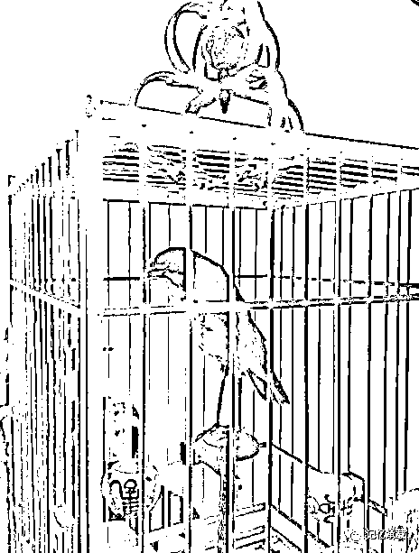

# 问世间情为何物

> 原文：[`mp.weixin.qq.com/s?__biz=MzU0MjYwNDU2Mw==&mid=2247483712&idx=1&sn=3bd26e170c39d21783d8c2fc49e59da9&chksm=fb196d3ccc6ee42a49caa3c78bafc68ed58f46a5dae54a45e2b3aa900997ac46b161f4197327#rd`](http://mp.weixin.qq.com/s?__biz=MzU0MjYwNDU2Mw==&mid=2247483712&idx=1&sn=3bd26e170c39d21783d8c2fc49e59da9&chksm=fb196d3ccc6ee42a49caa3c78bafc68ed58f46a5dae54a45e2b3aa900997ac46b161f4197327#rd)

看到这个标题估计读者们都要猜测该不是要写什么男女之类的话题了。恭喜你，答错了。

这章，我们写鸟。

起：陨石（运势）

承：玉壶（品格）

转：鸟（感情）

这转的尺度有点大，怎么会是鸟呢？没错，我们确实写鸟。鸟跟感情有什么关系呢？且听我细细道来。

图中这只鸟，不是活的，它只是一只鸟的标本。我父亲年轻时一直有养鸟，二十几年前他跟我说养画眉的笼子要几根椽子，鸟要喂小米，小米要嵌入在蛋黄里蒸熟了，把蛋黄丢掉，只喂它小米，至今恍若隔日。

也许如今他年纪大了，再没精力伺候活鸟了，于是拿个标本玩玩，权当一个乐子。本文的主角是另一只鸟，一只活鸟，一只我小时候家里养过的鸟，我再也没见过它了，于是只能借这只鸟的标本配图。

主角是一只鹦鹉，一只幼年的母鹦鹉。在九十年代中期大约我上初一的时候，父亲不知道是怎么想的，刻意托一个朋友从四川的老林子里抓了一只未经驯化的幼年野鹦鹉。我第一眼见到它的时候，它被白布蒙着头，我协助父亲给它的脚上上环，刚摘掉它的白布，它就死命的啄了我一口。当然，事后证明上环都是多余的，因为它根本不能拴在架子上，因为它会啄人，所以只能被关在笼子里。

在接下来的时间里，我常常想，一只年幼的鹦鹉，昨日还呆在四川的深山中与父母兄妹在一起，忽然就做了笼中囚徒，这种遭遇倒是蛮让人同情。那个时候，我还是个初中生，并没有学会照顾别人，但正是源自这种同情，让我每天都惦记它的存在，有时天冷了，只有我一个人会在睡觉前惦记它的笼子究竟是被放在阳台上还是被放回室内，甚至，有一次我从学校跑回家只是因为外面在下大雨，我担心它在阳台上淋雨。当然，我的好意并没有得到过什么回应，每次我把手指头放进笼子里，它还是会恶狠狠的啄过来。

时间过得很快，一晃眼两年过去了，父亲花了很多精力训练它，企图教它说话。当然，事后证明这些都是多余的，因为直到最后它始终被关在笼子里，别说学说话，它自始至终都保持着啄人的攻击性，身为一只鹦鹉，连被拴在架子上，也没达到过。

父亲的耐心一日日的消失了，但是我对它却越来越敬佩。父亲给它起了个名字叫奴才，让它学叫奴才，我却给它取了个名字叫关二爷，虽然，它是母的。我时常想，假如易地而处，换作我被另一个物种捕捉了去，生死未卜前途不明沦为笼中之囚，我是否会自始至终的保持本性，维持尊严呢？这个问题我当年想过很久，不敢作答。时隔 20 多年，时至今日，我想，绝大多数人类，恐怕都不如这只鸟有骨气。从这个角度看，它确实该叫关二爷。

终于，有一天，父亲受不了始终失败的挫折感，把它送给职业驯化鹦鹉的人，换了一只已经被驯服的乖巧的鹦鹉回来。那只野鹦鹉离开我们家的前一晚，似乎我预感要发生什么，我夜里起床，专门去摸摸它。它竟然出乎意料的第一次没有啄我，只是用头温顺的蹭我的手，似乎它也预感到即将离别。那一晚我惊呆了，因为两年了，为什么今天忽然不啄我了呢？

4 年后，我上了大学，大一入学第一次英文课，我写了篇英文的作文，内容就是这只鸟的故事。我的英文老师因为赏识这篇文章，让我做了英文课代表，当然，实际上，我的英文并不好。

这篇文章在说情，其实我说的情并不是我和那只鸟之间。我说的，是那只鸟对它的物种之间的感情。它身为一只鸟，坚决不学人话，这叫忠。在各种训练压力下，始终不屈服，这叫勇。我想，一个生命，没有大情，大约是没有这种忠勇的。可惜我不是鸟，没法知道它究竟是怎么想的。

关羽降曹，曹操三日一大宴五日一小宴，关羽斩颜良诛文丑解白马之围之后寻兄而去，临走时，他封金挂印，留下一句话，“关某来时明白，去时不能不明白”。

这只鸟来时不明白，毕竟因我父子让其被囚失去家人失去自由，但是它去时却很明白，我想，它最后一夜不啄我了，大约是想告诉我，它看懂了我的内疚，它宽恕我了。

它走时，免除了我的内疚，选择独自面对未卜的前路，我想，以它倔强高傲的性格，落在训鸟人的手中，大约前路坎坷。

我的前半生，不曾敬佩过谁，如果有，只敬佩过一个生命，它，是一只鸟。