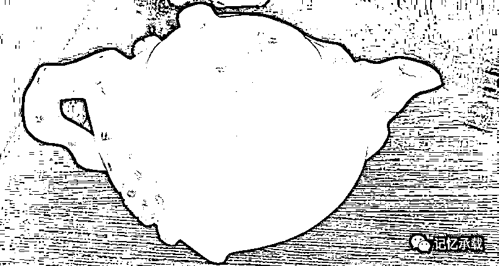

# 一片冰心在玉壶

> 原文：[`mp.weixin.qq.com/s?__biz=MzU0MjYwNDU2Mw==&mid=2247483679&idx=1&sn=257f77e9ea980d62f67d7b7d8b076af7&chksm=fb196d63cc6ee47558b6d6f3e4cc01228ee7a65a8373be950f9246649c538b18cb32e8643ff1#rd`](http://mp.weixin.qq.com/s?__biz=MzU0MjYwNDU2Mw==&mid=2247483679&idx=1&sn=257f77e9ea980d62f67d7b7d8b076af7&chksm=fb196d63cc6ee47558b6d6f3e4cc01228ee7a65a8373be950f9246649c538b18cb32e8643ff1#rd)

寒雨连江夜入吴，

平明送客楚山孤。

洛阳亲友如相问，

一片冰心在玉壶。

这是唐代王昌龄的诗。他认为“玉壶”与“冰心”一样，都象征着人的品德美好。

我们第一篇讲了陨石（运势），那第二篇就讲玉壶。如果说陨石是运势，那么玉壶就是品格，起承转合，由运势起，由品格承接。没有运势不能成事，没有品格，成事也是坏事。

这壶大约是 90 年代后期我上中学的时候在家里见到的。一把白玉的茶壶，上面带一点黄色的皮色，很漂亮。因为玉很少拿来掏空了做壶，通常都以把件，配饰，摆件的形式存在，所以我一共也就见过这一把玉壶。

我曾经见过我的父亲拿它泡过一次茶，也就见过一次，毕竟，玉壶并不好清理，象征性远大于实用。

当然，它现在已经不属于我了，被我送人了。有很多东西，它在你手里的时候，也许你不曾注意，当它不在你手里了，你反而会常常想起。这是很有意思的话题。我记得 90 年代中期我上初中的时候，曾经写过一篇作文被登在了全国性的报刊上，那是我第一次也是唯一一次作文被刊登。那次我写的标题是分离，内容是初三毕业，平时没有觉得有什么特别的同学的关系，直到分离的那一刻，忽然觉得有些怅然所失，我在文中写了一句话，得到的东西人们往往不会珍惜，失去的那一刻才后悔莫及。也许就是这句话出自一个初三学生之口让编辑们采用了我的文章，声明一点，我发表文章的时候，无论是我还是当时北京的编辑们，都没有看过大话西游，那个年代大话西游还没有进入内地市场，我高二以后才看到周星驰的台词，能提前两年和他的台词撞车，是我后来觉得蛮好笑的一件事。

我拿这个事情做类比并不是后悔把它送人。万里长城今犹在，不见当年秦始皇。世上并没有什么东西是永远跟随你的，它有缘到了我父亲身边，有缘被我小时候看到，又从我手里送了出去。这是缘分到了，缘分散了。相对于人的寿命来说，物也有寿命，它可能会有很多任主人，我只是它漫长生命中的一个过客。