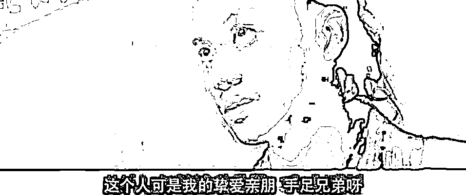
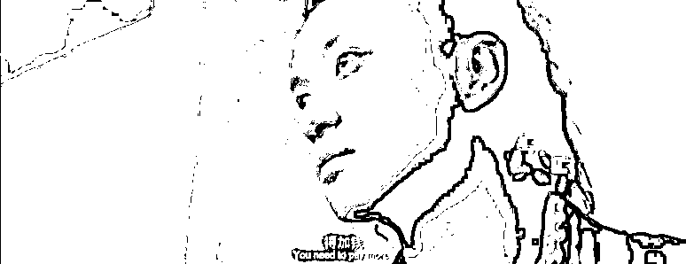

# 这个饿死在日本的精日女的死因到底是什么？

> 原文：[`mp.weixin.qq.com/s?__biz=MzU0MjYwNDU2Mw==&mid=2247512046&idx=1&sn=6ff658fcb1017de42cb3d3c355bb2c54&chksm=fb1ac392cc6d4a8415e54408629c4db47e047bf7de9c070b897cf46254f59a38abc16dd8ed64#rd`](http://mp.weixin.qq.com/s?__biz=MzU0MjYwNDU2Mw==&mid=2247512046&idx=1&sn=6ff658fcb1017de42cb3d3c355bb2c54&chksm=fb1ac392cc6d4a8415e54408629c4db47e047bf7de9c070b897cf46254f59a38abc16dd8ed64#rd)

很多读者都看到了，想听我也谈谈。

一个国内 985 的新闻系女硕士，在国内媒体工作十几年后，花光所有的积蓄，负债留学日本。

没想到在日期间，交完学费所剩无几，只能靠网络乞讨度日，长期营养不良，最后饿死。

引起了网络热议，你看，这就是精日的反动分子的下场，这就是润到发达国家的下场，21 世纪，竟然饿死在所谓的发达国家。

这种题材，最简单的写作模式就是跟着骂，没毛病，引流量，叫好又叫座。

问题是，我们的读者画像远高于互联网平均水平，所以我只能舍易就难，写点深刻的。

这个精日女，究竟死于什么？

**六个字：对劳动的理解。** 

我以前在讲发达国家这种话题的时候，给过读者清晰的路径分析。

人分三种。第一种是有一技之长的蓝领穷人，第二种是从事脑力劳动的中产，第三种是富人。

第一种人，如果你在国内赚 7000，去日韩能翻番，去澳洲能翻 4 倍，去美国能翻 5，6 倍。

前提是手艺精湛，肯干，灵活，语言学习能力强。

这种以水管工，修空调的，修汽车的，搞装修的为主要群体。

第二种人，你不要出去，因为你适应不了。

也许你语言更利索，但是，你在国内当白领赚 3 万，去澳洲修马桶赚 3 万，你要不要去修？

就算你要，你会不会呢？你的动手能力强不强？

你要知道国内所谓的学霸是怎么培养出来的？

在家里从小什么都不做，被子都不叠，碗筷都不洗，父母告诉你，如果你不好好读书，你将来就去街头挑大粪。

到了学校，老师每天吓唬学生，如果你不好好学习，那么你将来就只能去街头挑大粪。

几十年如一日的价值观教育之下，这个孩子长大成人后，挑大粪是一种侮辱，已经深入骨髓，成为他精神信仰的一部分。

你去美国街头看看，那个拉大粪的小伙，很精神，很阳光，很乐观，他把自己的大粪车擦得油光锃亮，看着比保时捷还拉风。

你比如福特的皮卡 F150，在美国就是拉大粪用的，到国内要卖 7，80 万，被富二代们当作豪车用来泡妞开。

所以光从外表看不出他是富二代还是挑大粪的，人家那个美国小伙也许穿着一身保洁员的制服，笔挺，知道的他是清理大粪的，不知道的还以为是二战时期德国的禁卫军。

那小伙儿干得也很开心，因为一年有 9 万美金。

工作自由，快乐，钱不少挣，体面，受人尊重，他由内向外散发着一种自信。

白天拉大粪，晚上去酒吧泡妞，即便情敌是奥本海默，他也敢争一争。

美国的博士没多少钱的，补助一年就 3 万美金。毕业后无法留校任教的是绝大多数。

9 万打 3 万，那个拉大粪的小伙充满了自豪。

但是我们想，如果一个国内的中产白领，他以前是某报业集团的总经理，年薪 60 万。

现在跑去美国和那个小伙一起拉大粪，年薪 9 万美金，他什么感觉？

他会痛苦的不得了，每天晚上睡不着，辗转反侧，我怎么能拉大粪呢？

从小我的老师就跟我讲，不好好学习去拉大粪，从小我妈妈就跟我讲，不好好学习去拉大粪。

我都念到 985 的博士了，我都混到总编了，我现在居然在美国拉大粪？

我对不起列祖列宗啊，哭得眼睛跟兔子一样，最后抑郁而终。

所以我说，你不要去，你去了适应不了。

那为什么还有这类人去呢？

很简单，他们有着不切实际的幻想。

你比如国内的教授拿 60 万一年，和日本的同行教授交流一下，发现对方拿 120 万一年。

国内的报社总经理拿 60 万一年，和美国的同行报社总经理交流下，发现他拿 300 万一年。

于是怎么样？

于是想着我过去当教授，当总经理，不就收入提升了吗？

答案是几乎做不到。

为什么？

因为供需。

那个有一技之长，肯吃苦，而且语言学习能力强的蓝领，之所以可以从 7000 跳去日韩拿 1 万 5，跳去美国拿 4 万，是因为对方缺这样的。

市场需求大于供应，对方缺有一技之长且能吃苦的蓝领。所以语言关过了之后，有机会拿到收入提升之后的工作岗位。

而在教授，总经理这种岗位上，人家不缺人，明白不？

我再把话说白一点，你把中国，美国，日韩，澳洲，把这些都想象成一家公司。

我问你，公司里最缺什么？

**公司里最缺干活的，公司里最不缺领导。**

你跑去别的公司当领导？你脸白么？**人家提拔领导为什么不从自己的队伍里提拔呢？**

只有一种人可以跳槽了继续做领导，你知道是什么？

就是领域开辟者，俗称领军人物。

去了你就能够给人家打开技术方向，或者打开市场方向，只有这种人，可以从领导岗位跳槽到领导岗位。

**其余的那些循规蹈矩的，走流程的领导岗位，犯不着便宜外人的，明白不？** 

我说白了，大部分教授，大部分经理，之所以给你干，仅仅是因为你熬的年头久。

那就是奖励你的。

如果你不要了，你要去日韩，去美国，那你就只能去修马桶，挑大粪。

第三类是富人。

富人只要想清楚一件事就可以了，你是去发达国家挣钱，还是去享受。

如果是挣钱，就要考虑人力成本。

我以前拿助理开过玩笑，今天再来一回。

当初他跟我说，他对原单位很有感情，有一种超乎了兄弟般的感情。而且他们单位是铁饭碗，他从北大一毕业就进去，干了十年都不曾离开。

用他的话讲，叫做故主难弃，虽不敢自比关二哥，但是在他心目中，原单位就是刘皇叔。

他抒情了半天，我笑笑，表示听懂了。

总结一下，他其实就说了三个字：要加钱。

当时我猜他的底线是三倍薪，这个价钱开出去他绝对会投向我。

但是我没有这么说，我直接说，五倍薪，一步到位把我的底线亮出来了。

如果不是我们年龄相仿，我估计他当场就喊义父在上了。

接下来的对话就很简单，大概的意思无非是说他飘零半生，未遇明主，虽一介书生，亦颇知忠义二字。正所谓择木之禽得其良木，择主之臣得遇明主，平生之愿足矣。从今往后，老板指出的方向就是他活着的意义，老板的冲锋号就是他战斗的地方，甘效犬马之劳，但凭驱使，绝无二心！

玩笑开好了，言归正传。

我问大家一个问题，如果我去日本挖人，有没有办法达到这个效果？

答案是没有，因为当地人工费贵，我挖人的时候没办法开五倍薪，开了，我就倒闭了，开不到，就没有那么神奇的效果。

所以说发达国家是个成熟市场，你很难去那里通过开办企业来赚钱。

如果你不能像段永平一样通过他们的资本市场赚钱，那么实际上，对你来说，他们只有一个作用，就是消费。

确切地说，是高端消费。

我们国家因为限制，高端消费实际上是不放开的。

不放开就相当于禁酒令。

你研究过美国历史上禁酒令时期的价格就会知道，越禁，越贵。

了不起的盖茨比那么有钱，就是因为他贩卖私酒。

你去看下，国内的豪车，奢侈品的包，私人飞机，游艇，价格远高于国外，从某种意义上讲，这就是惩罚性消费。

杭州要办亚运会，酒吧，夜店，甚至连足浴店都收到通知停业整顿。

你注意，我是指绿色的，健康的，都是这样，因为有碍观瞻。

明白这意思么？就像电影奥本海默，里面给女的 P 了个小裙子。

但是你去看隔壁的日本，银座的小姐姐疫情期间都不歇业，日本的风俗产业规模之大，已经到了匪夷所思的地步。

日本就是一个更高端的芭堤雅，本质上就这回事。

对富人来说，国内很多消费不允许，允许的部分也是有非常高溢价的，但是很多发达国家，都是允许消费的。

更重要的是，非常便宜。

你看下日本风俗产业的从业规模，那个竞争太激烈了，太市场化了，于是价格就被打下去了。

这就是为什么有很多富人他们跑去发达国家消费，一方面是某些高端消费被允许，另一方面是某些高端消费性价比高。

我们现在把话题拉回来，看这个被饿死的精日。

她不是富人也不是穷人，她是个中产，受过良好教育的中产。

**她以为去日本复制自己曾经的成功路线，发挥自己善于读书的特长，就能够薪水翻倍，实际上日本的市场完全不是这样。** 

日本受过高等教育的群体的占比，要比我们多得多。

人家根本不缺一个会背书的呆子，除非你是什么领军性人才，你又不是。

去了之后你又不肯挑大粪，修水管，做当地人不喜欢做，市场需求大的事情，还要从口粮里抠出来大部分交纳高昂的学费。

那不饿死你饿死谁？

我为什么要指出这一点？

因为她的死不重要，她的死因才重要。

你千万不要以为她死于精日死于反动，**那只是她死得活该的理由，不是她死亡的原因。**

如果你拎不清我前面给你分析的穷人，中产，富人的实际情况，你拎不清发达国家的市场供需。

即便你不精日，你不反动，你去走这个死者的老路，你也会被饿死的。

她内心看不起体力劳动，可是她要去的那个市场，需要的就是体力劳动。

**就像一个内心鄙视水的商人，坚持要去沙漠里卖沙子，你不破产谁破产呢？**