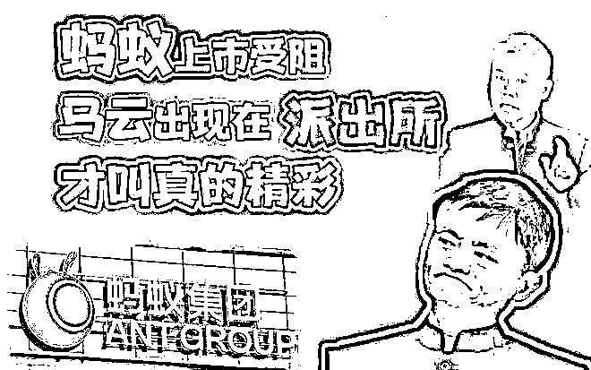
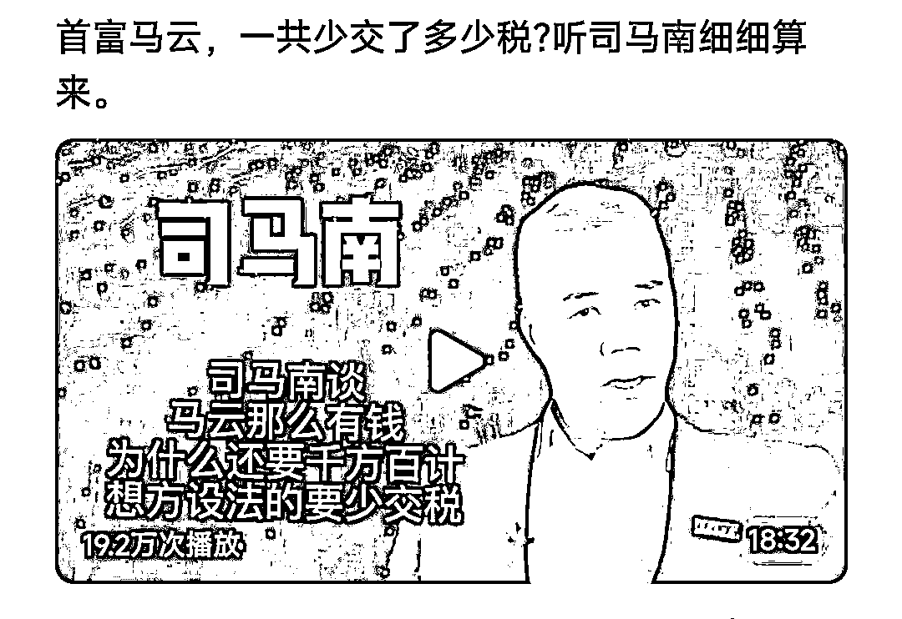
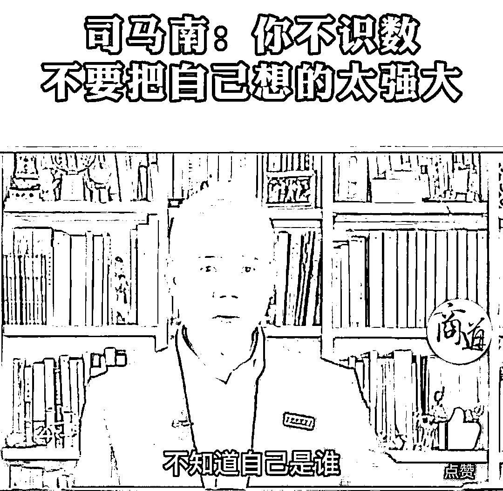
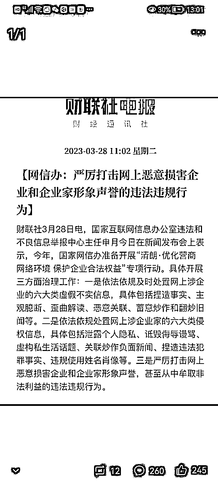
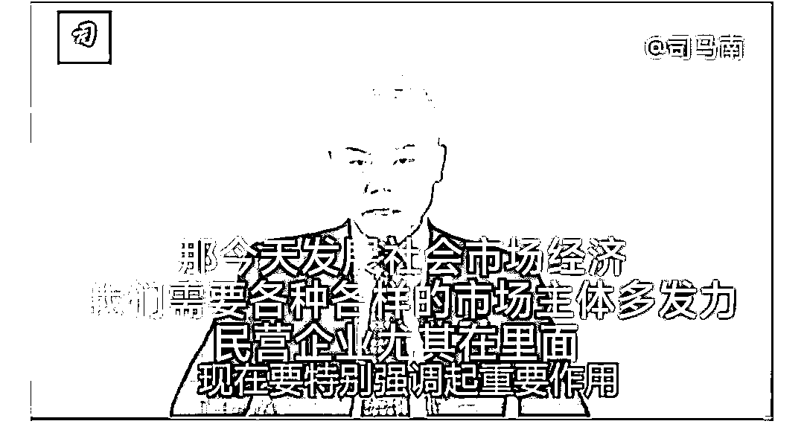
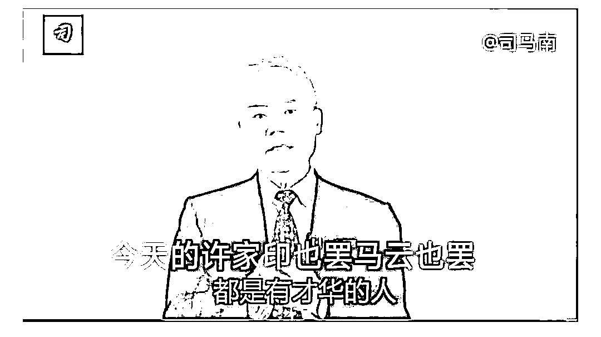

# 至于么？司马南又不是司马懿

> 原文：[`mp.weixin.qq.com/s?__biz=MzU0MjYwNDU2Mw==&mid=2247510257&idx=1&sn=c5515009e99de467c850c0241f58befe&chksm=fb1ac48dcc6d4d9b6426255f1bd7c1f275716740ee0b85506635be90377304b32c43ee121655#rd`](http://mp.weixin.qq.com/s?__biz=MzU0MjYwNDU2Mw==&mid=2247510257&idx=1&sn=c5515009e99de467c850c0241f58befe&chksm=fb1ac48dcc6d4d9b6426255f1bd7c1f275716740ee0b85506635be90377304b32c43ee121655#rd)

有读者很有心，也很有趣，按照时间顺序，整理了五张图发给我。

**第一部分三张图来自司马南，如下：** 

**第二部分来自媒体，如下：** 

**第三部分的两张图仍然来自司马南，如下：**

按照时间顺序，一共六张图，五张来自司马南，一张来自媒体。

然后排出来就是这样一个效果。问我怎么看？

我看到了，你很有心，也很有幽默感，如果你拜入德云社，云字辈肯定是没戏了，鹤字辈，不知道还有没有名额。

当然，咱们这位读者不是来搞笑的，他是来哭诉的，他说他是司马南的粉丝，他很生气。

生气是冲司马南去的，司马南老师从他心目中的司马大侠，变成了司马老贼......

他觉得有一种，难以言述的，总之我也形容不出来的滋味在心头。

这位读者朋友把我给逗乐了。

还司马老贼，呵呵，让我想起曹贼这个说法，能被叫做司马老贼的，大概也只有司马懿了。

司马南老师还够不上司马懿，无论你个人对他有什么看法，我觉得，夸张了。

我今天替司马南老师说几句公道话，因为不仅你是他的粉丝，我也是。

我这个粉丝，可比你资格老多了，我是司马南老师的粉丝的年代，互联网还没进入咱们国家呢。

90 年代有一个云，可不是马云，虽然他 90 年代就开始创业了，可是他那时候还是籍籍无名之辈。

那时候有个大名鼎鼎的人叫做柯云路，你不知道很正常。就像韩寒属于博客时代，柯云路属于报纸时代。

我小时候爷爷奶奶家订了一堆报纸，我成天跟着看报纸，所以对柯云路耳熟能详。

柯云路，原名鲍国路，80 年开始写作，84 年的第一部长篇小说《新星》得到了广泛关注。

到了 88 年，开始转型，发表了一系列有关东方神秘主义的著作。就是气功。

我多次介绍过一本剧，《我爱我家》，90 年代放映的，剧中的老傅就沉迷于气功，那时候气功在老干部群体里非常热，老傅就是个副厅级的干部。

那个时代，别说老傅，真正的大人物，包括特别大的科学家，都是很重视这个领域的。而且全世界在 8，90 年代，都对神秘主义，对特异功能非常感兴趣，尤其美苏。

原因是美苏争霸到了后期都没钱了，星球大战没打起来，钱烧没了。但是美苏争霸还没有结束，较劲还在继续，在什么领域较劲呢？只能在神秘主义领域里较劲了。毕竟这玩意儿比登月便宜多了。

柯云路深刻地理解了全球格局，抓住了风口，在当年写了一大批这样的文章，介绍东方神秘主义的，他就火了。

司马南的出道就是这个时期，纸媒时期。

最先，司马南是学气功的，他敏锐地抓住了风口，想要学柯云路，也蹭一碗饭吃，但是没有火起来。

很快，他发现风向变了，因为美苏争霸 91 年年底结束了嘛，苏没了，美苏争霸自然就没了。美苏争霸没了，什么的基础就没了？

研究神秘主义的经费支持的基础就没了。

所以气功这事儿要结束了。 

我曾经讲过，任何生态位的背后一定是对应的生态位，就像阳生态位背后一定有一个对应的阴生态位。苹果的背后一定是小米，就这点道理。 

柯云路抓住了气功生态位，火了，司马南想要学，学了一阵子学不像，他并没有傻乎乎像罗永浩似的去声称自己是柯云路转世灵童，而是很聪明的去寻找气功背面的生态位了。 

这个生态位就是气功打假。俗称加入不了，我就反对。

你看过 1993 年的《我爱我家》，司马南出演的那个角色，就是给老傅这个副厅级干部介绍气功打假，于是司马南也就火了。

此后司马南老师追过很多热点的，他是一个非常优秀的媒体人，今天可以讲，自媒体人。 

自媒体本质上就是说相声，而说相声本就是靠砸人饭碗过日子的。

你想想看，郭德纲说于谦他爸是八大铁帽子王之绿帽子王，是蒙古国海军司令。

我问你，有这么个王爵么？蒙古国有海军么？

他就是让观众笑的一门艺术嘛，有人骂就骂人，没人骂就骂街，骂街不允许的时候，只能骂什么？骂搭档。

我小时候非常喜欢听相声的，相声就是天南地北一通骂。

那时候允许骂，不需要证据的，你胡扯就行了，反正也不用负责，大家听着也高兴。

后来文明程度高了，就只能骂搭档了，再后来，更文明了，连骂搭档的段子也不允许低俗了。

你看过去的那种二人转，过去的那种相声，就知道有多 open。

你管司马南叫老师，没有问题的，就像我们通常也管郭德纲叫老师，也管苍老师叫老师，也管我叫老师。

司马老师，苍老师，西风老师，都是老师。

老师并不意味着褒义，也没有贬义，老师过去是对某种职业的称呼，比如教书的。后来就变成了对前辈的称呼，对入行早的人的称呼。

入行早，往往是指艺人。所以你叫司马老师，西风老师，苍老师，都没问题的。

这都是艺人，我在这个公众号里的时候，就是一个艺人。

有的人只有一个身份，你比如司马老师，他就是个艺人，你比如苍老师，她也是艺人，她是个德艺双馨的外国艺术家。

但有的人有多重身份，你比如林志颖是科技公司老板，是赛车手，也是艺人。

我也有多重身份。

但甭管这人多少重身份，在这里，在舞台上，扮上了，咱就是在说相声。

**你不能把一个说相声的当大侠，就算真大侠，扮上了，登了台，这会儿，也是艺人。何况职业艺人呢？** 

你可以喜欢司马老师的相声，但是你不能因为喜欢司马老师的相声就说你喜欢他爱国。

这两者没有关系的，明白么？

我前面跟你讲，作为相声这门艺术的听众，我比你资深，或者说，我听过的相声比你吃过的米多。

司马老师爱骂人，到处骂人，是因为相声这么艺术就是这样的，不需要理由，不需要根据，随便骂。

随便骂才有流量，才有人听呀。

你说我来登台的时候，我也是相声演员了，我不怎么骂人，为什么？

因为一种习惯。

我不是司马老师那样职业艺人出身，一开局就追着社会风向出名赚钱起家的，不是。

我是一个商人出身的。

**相声的特点是逮谁骂谁，做生意的特点是花花轿子众人抬，说话有分寸。**

你看我打了这么多年比方，我连自己经历过的公司是哪家，都从来没有说过。

为什么？

因为我不希望干扰别人的股价，这是一种生意人的天性。

生意人天性就对钱敏感，所谓己所不欲勿施于人，我不希望人家影响我赚钱，反过来，我也就不希望影响了别人赚钱。

你看我骂人，往往就逮着罗永浩不放，为什么？

因为他需要这个，他虽然也是商人，可是他是做流量生意的，我骂罗老师，并不是真的害了他，反而是帮他。我等于反复的，免费的给他提供流量。他感激我都来不及。

对于那些不需要流量的企业家，我就不怎么点评了。

这是我一个生意人出身的人，在登台表演相声的时候，不由自主的行为习惯。

**同样，你以为我今天的说法是揭了司马老师的老底？不，我等于帮了他。** 

司马老师是一个艺人，他是做流量生意的，别说我没有骂他，我只是作为他 30 年前的老粉丝，如实地告诉你他这三十年来的表演艺术生涯。

即便我真去骂他，他也会很高兴很欢迎，因为黑粉也是粉，明白不？

你不懂演艺圈，我比你懂。站在艺人的视角下，无所谓爱自己的粉和恨自己的粉，因为都是钱。

爱是钱，恨也是钱，偶尔看到一眼还是钱。**你数钱的时候难道区分这张是爱自己的？那张是恨自己的？**

我仅仅是教你理解艺人么？不，我同时教你理解了商人。

我这种商人一出手，就是帮人赚钱的，商人的天性就是和气生财，花花轿子众人抬。

这就是商人的特性，商人通常都不乐意坏人的事儿，哪怕拿老罗打个岔，也顺手帮他挣钱，哪怕把司马南老师揭个底，也顺手帮他赚钱。

他们感激我都来不及。

同样，基于我的出身，我告诉你，只有基于利益的爱国，才值得相信。

比如我就很爱国，虽然我从来也不标榜，从来也不提，也许今天是第一次告诉你。

知道为什么我这么笃定我很爱国？

因为我是做国际市场高频交易起家的，这也是我的主业，高频交易严格意义上讲，是美国金融市场重点打击的对象。

如果全世界都被美国说了算，等待我的结局就是失去所有历史收益，后半辈子蹲在号子里，面壁思过。

你觉得我会不会不爱国呢？

不会的，因为我没有别的选项。

我不可能同时得罪全世界的两强，那我何处容身呢？难道像孙宇晨一样买个小国的豁免权，从此东躲西藏？

反过来，你想想看，你有办法约束司马老师么？

没有，他在美国没有犯任何事，个人纪录非常良好，所以他还可以在美国买别墅，都不用怕人家没收。

你注意，我并没有选择相信，或者不相信司马老师，**因为我和你不一样，我不是孩子了，我是个老帮菜。**

我根本不相信任何人，人的爱恨都是靠不住的。

一个男人跟你说我很专一，你理解的专一是他永远爱你。

事实上，专一是说这个男人 18 岁的时候爱 28 岁的姑娘，等他 88 了，仍然爱 28 的姑娘。什么叫专一？这才叫专一。

看懂了吧？你从根子上就理解错了。

所以我给你讲，信任源自什么？源自你手握把柄，你信任一个人，除非你握有他的把柄。

试问你握有司马老师什么把柄？或者说吧，你有什么办法拿捏他？

**没有，那你靠什么信任他呢？**

人家司马老师怼天怼地怼空气，这就是一门艺术，郭德纲骂于谦他爸需要理由么？

说不定台上刚骂完，台下就一个席上把酒言欢，称兄道弟，给老爷子敬酒，好的不得了。

你真以为郭德纲和于谦有矛盾？逗你玩的，are you ok？

看戏就看戏，拜托控制下自己的情绪。

何况你还信任他信任到哭了，一会儿觉得他是你的爱豆，一会儿又觉得他背叛了你，你追星追魔怔了明白么？

你好去看医生了，你看，我果然是个商人，又顺手给医院介绍了一单生意。