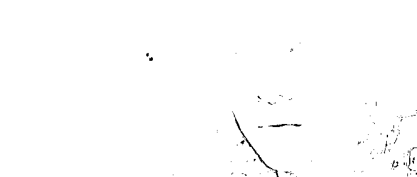

# 在胡某宇这件事上，唯一不反思的就是成天让人反思的互联网

> 原文：[`mp.weixin.qq.com/s?__biz=MzU0MjYwNDU2Mw==&mid=2247509530&idx=1&sn=e6e93e756eecd30a563c7d4f7f2205b1&chksm=fb1aca66cc6d43703dbcc2875f1f8b36ff66710303a117e290d4d88a4e28de119d52cbcfcece#rd`](http://mp.weixin.qq.com/s?__biz=MzU0MjYwNDU2Mw==&mid=2247509530&idx=1&sn=e6e93e756eecd30a563c7d4f7f2205b1&chksm=fb1aca66cc6d43703dbcc2875f1f8b36ff66710303a117e290d4d88a4e28de119d52cbcfcece#rd)

昨天的[拖至今天，我们才写胡某宇事件](http://mp.weixin.qq.com/s?__biz=MzU0MjYwNDU2Mw==&mid=2247509520&idx=1&sn=01598bc64c406929706db4c165ffc48c&chksm=fb1aca6ccc6d437ab0c11acef0e52ec66e968dcdbee72dbe7c7ac37d383c3b4835ac76c7379b&scene=21#wechat_redirect)，很多人没看懂。

没看懂不是你的问题，人本来就不可能什么都看得懂。

我来写一篇绝大多数人都能看懂的。

胡某宇这件事，在我看来最该反省的，就是互联网本身。

我知道有人会讲，他的父母不关心他，所谓关心其实就是关心他的学习，无论他精神状态怎么样了，仍然只强调学习，让他觉得，他妈妈不爱他，他妈妈唯一爱的就是他学习好。 

能听懂这句话么？ 

我考得好我就是你的好儿子，我考得不好，我就不是你的好儿子了，那你真的是在关心我本人么？

请记住这句话，这是个句式。 

昨天我反复给你讲，你不是在关心胡某宇，你是在关心自己，因为他距离你太近了，你担心发生在他身上的，会发生在你身上。

其实你就是自私，只是你不愿意承认。 

就像作为父母，你不可能承认你关心的其实不是孩子，而是孩子的成绩。

你会不由自主的把两件事合并起来，但是那个孩子，他感受得到，他区分的开。

你觉得你在为他好，只是你觉得，他会有他觉得。人人都会有自己的自定义，因为人人都是活在自我编织的意义之网上的生物。

我知道有人理解不了，网民都觉得我关心胡某宇未必是关心自己，也许是关心我的孩子。

你看，多崇高，变个概念，把对象从自己身上剥离出去，扯到孩子身上就显得很伟大了，是么？

满江红里的秦桧，他也活在自定义的世界里，秦桧不会觉得自己是观众眼里的秦桧的。 

秦桧和原配老婆王氏患难与共几十年，一起从金国逃回来的，他老婆生不了孩子，于是秦桧就没有孩子，他有个养子。

秦桧不觉得自己十恶不赦，虽然他的确贪污，他的确私通金国，他的确背叛大宋，但是，在他自定义的精神世界里，他是个暖男呀，他爱老婆呀，他爱养子呀。

他的养子后来拿着很多金银珠宝，说不定还想转移资产去金国，去蒙古呢。

秦桧不会那么看自己的，他眼里的自己是充满了牺牲精神的，是苦了自己这一代，幸福后来人的。 

这才是他自定义的精神世界。 

宋思明觉得背叛原配是自私么？不会的，在他自定义的精神世界里 ，虽然他贪污，虽然他出轨，但是他对海藻是真爱，他最后都要进号子里了，还不忘转移给海藻 500 万，让海藻带着肚子里的儿子一起生活。 

在宋思明构建的精神世界里，他不自私呀，他是为了海藻和儿子。

开始对人性有点基本认识了么？ 

人性和癞蛤蟆没区别的，浑身上下都是脓疮，不堪入目的。 

大多数人之所以不觉得是因为根本不曾正眼看过人性，一涉及灵魂深处你就会痛，就会开始找借口，撒谎，我说的撒谎是指自欺欺人。 

类似掩耳盗铃那种，自己骗完自己就当别人也信了。

所以你看人和看自己是不同的，人必然是双标的，人习惯了自欺欺人，你是不可能承认自己是个双标怪，是个到处找借口按照自己需求自定义的这么个家伙。 

你不会承认的，我也没打算让你承认，因为不重要。

认识人性就像一个癞蛤蟆把身上每个疮都挤掉，其过程比凌迟还痛苦，而且很多人在认识完之后就崩了，受不了了，接受不了。 

所以我没有建议过谁去做这种尝试，你糊里糊涂的过就对了，双标也好，自定义也罢，反正混着混着，这辈子就混过去了。 

没必要见天地、见众生，见自我。你会被吓死的。

胡某宇这件事的根源不在于他妈妈，他妈妈就是一个最普通的妈妈，他妈妈就算只关心他的成绩，也谈不上多大的错，天底下的父母大都这样。

小时候关心你成绩，长大后催婚催生催你考公，你做不到就骂你没出息，就这。

这不是多大错，人都这样，人就这样，人就这点水平，就像我前面说的，人都是活在自定义精神世界里的双标怪。 

你看着无数人骂秦桧，骂宋思明，其实在自定义和双标这两件事上，绝大多数人并不会超过秦桧和宋思明。 

所以你去指责胡某宇的妈妈，是最没有意义的。

我告诉你的就这点事儿，全网所谓的关心胡某宇，只是自私，人类从不担心同类，他们只是担心自己。

这里面唯一真痛苦的，恐怕就是胡某宇的妈妈了。那毕竟是她亲生的。

可是互联网在干嘛？在让全网恐怕唯一真痛苦的人去反思，让胡某宇的妈妈去反思。

她怎么反思？她就是普通人，你也是自定义下的双标怪，她凭什么可以不是？ 

你给她再来一遍人生的机会，她依然会像最普通的父母一样，小时候只关心孩子的成绩，长大后只会催婚催生催考公。 

**整件事当中，真正该反思的是什么？****是互联网本身。**

人类从来都是内容分级的，几千年来一直如此，一直如此。

古人不让你看商君书是害你么？是故意隐瞒么？ 

今天所有人都是这么看问题的，因为你生活在互联网时代。 

我曾经说过一句话，得到过很多人的认同，我说世界上最大的不公平是信息不对称，一群人在下面喊，西风，你是我的知音。

你们为什么不看我后半句呢？ 

后半句我怎么说的？我说信息永远都是不可能对称的，真要是强行对称，那是灾难。

不理解？

那你去看看《三体》里的杨冬。

杨冬是全书第一物理天才，一个比爱因斯坦天赋还高的女人。她会被三体的那些蒙人的小把戏搞到精神崩溃要自杀？

不，真正让她觉得物理学不存在了的不是三体，是她自己领悟到的更旷阔的宇宙深层的原理。

她早就发现三体在忽悠她，三体改变了某些局部的物理原理，让她误以为宇宙不存在。

但是她并没有因此要怎么样，她只是意识到三体要入侵地球，人类多半打不过，于是决定和老公以普通人的方式度过此生。

可是后来她领悟到了更多，她领悟到三体也只是一只虫子。既然三体可以随意改变地球上的物理原理，还有更高的生命可以随便改变三体的物理原理。

进而她领悟到整个宇宙也许根本没有原理，一切都是个玩偶，都是设计好的把戏。

那一刻她崩溃了。她说的物理不存在了是指整个宇宙而非地球。

她就像打开了穿越之眼，她好像提前看到了未来，看到了一个歌者小喽啰问长老随意的申请二向箔，把太阳系降低成二维，卷成了一幅画。

这个过程，就像一个扫地大妈问物业经理申请一个苍蝇拍，拍死一群苍蝇那么随意。

真正让杨冬精神崩溃的不是三体的忽悠，而是她领悟到了太多真相，她一瞬间接触到了太多的信息，把她的精神世界直接撑爆了。

**她一直以为自己是观察虫子的那个人，可是全宇宙信息冲击的一瞬间，她忽然明白，自己是被观察的那只虫子。甚至，是人家懒得观察的虫子......**

杨冬本来是一个地球上杰出的天才物理学家，她可以像爱因斯坦一样受人尊敬，度过充实且成功的一生，她本可以。

她本可以像白鹿原上一个村里优秀的后生那样因为读书好，当个小官，鸣锣开道，在祖坟上放铳子，风风光光的过一生。这辈子像鹿子霖一样，以当上乡约，被邀请进西安城里吃一碗羊肉泡，或者葫芦鸡为荣，跟村民吹上半辈子。

她本可以。

遗憾的是，这个后生因为考试考的好，进城念大学了，他忽然发现村里几辈子出不了一个的 985，在城里想找一份工作，很难很难。

就算找到工作，交完回龙观的房租所剩无几。谈个女朋友，人家上了宋思明的车。

如果仅仅是这样，不会导致这个后生崩溃的，不会。

因为就算他大学里遇到几个富二代，又不会和人家深交，进入社会后，他会一级一级的打开世界。

部门经理开会，作为普通员工你是进不去的。等你熬到经理，都三十多，四十岁了。你慢慢被岁月磨平了。觉得从燕郊的小房子里坐 4 个小时车上班也挺好。

问题是互联网一打开就不是这样的，原本 Z 只能看到 Y，Y 只能接触到 X，互联网一打开，XYZ 直接看到 ABC 是怎么生活的，你让他怎么受得了？

你这边刚租个房子找工作投简历，那边直接看到万柳少爷了拍皮球，背后挂的画是齐白石的真迹。少爷就不打工，就不做经理。人家跟你整个人生都不一样。

再看两本什么什么折叠的小说，你更崩。你发现人家住在一年几百万的酒店套房里看世界，你为了一个月几千块窝在格子间里打电话，还反复被客户拒。

你竭尽全力，竭尽几家人的全力，这辈子想买套几百万的回龙观的房子都难，更别说下一步置什么什么。

然后你打开小视频，发现各路豪宅给你推荐，所谓有些庄园，生下来有就有，生下来没有，这辈子也不会有了......

然后你又发现人家买别墅像买菜，而你中午点外卖的时候始终犹豫到底要不要加个蛋，.......

你现在明白杨冬的感受了么？

既然不能把宇宙的地图一下子给人类摊开，那为什么可以把社会的地图一下子给这个村里的后生摊开呢？

这么大的信息量，你让他怎么看到自己过往曾经有过的努力的价值和意义？

你让他怎么会不瞬间失去方向，乃至动力和人生的价值感？

孩子都会这样，成年人怎么会不焦虑？**胡某宇的妈妈为什么焦虑？**

因为互联网给她摊开的地图太大了。

你把人类鸡死，人类也无法在区区几百年赶上三体的文明，何况是让人类去追逐歌者，甚至去追逐把歌者当作虫子的存在？ 

X 本来活的好好的，他觉得自己比 YZ 强，YZ 也活的好好的，他觉得最多不过 X。 

你非要把 ABC 都摊开，让 XYZ 看到前面还有 23 个之多，他怎么接受？

就像杨冬生为 A，你忽然把整个宇宙给她摊开，告诉她 A 前面还有一万万亿的字母，她怎么接受？

信息不对称是必然的，整个宇宙都不对称，何况信息？ 

这就是为什么我昨天强调内容一定要分级，你考不过第二级，第三级就不对你打开。

凡事都有两个面，信息亦如此。 

人类最初发射信号寻找外星文明的目的只是为了获取更高的信息，从而在国与国的竞争者中寻找优势。

可是结果是什么？是等真正看明白宇宙全貌的时候，杨冬这样的顶级科学家，都扛不住巨大的信息量，精神崩溃了。 

金庸的小说里，扫地僧问鸠摩智，你学这么多武功，又不读佛经，扛不扛得住反噬？

那天我问你，[在开局的时候就直接开天眼，开地图，是如同有了外挂](http://mp.weixin.qq.com/s?__biz=MzU0MjYwNDU2Mw==&mid=2247509486&idx=1&sn=c1a11d1b76cd63a28b464b45ba86b88e&chksm=fb1ac992cc6d4084a736bc27f878289767545e1f819fff72abd6b6c27a0f9ef2062ae5d7bc76&scene=21#wechat_redirect)，但信息越大，痛苦越甚，你在那么年轻的时候，究竟能不能承受那么深的痛苦？

[人不可能同时拥有青春，和青春的知识](http://mp.weixin.qq.com/s?__biz=MzU0MjYwNDU2Mw==&mid=2247509486&idx=1&sn=c1a11d1b76cd63a28b464b45ba86b88e&chksm=fb1ac992cc6d4084a736bc27f878289767545e1f819fff72abd6b6c27a0f9ef2062ae5d7bc76&scene=21#wechat_redirect)。