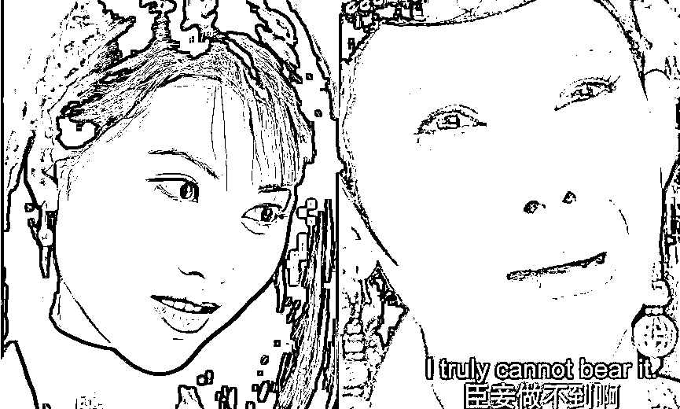
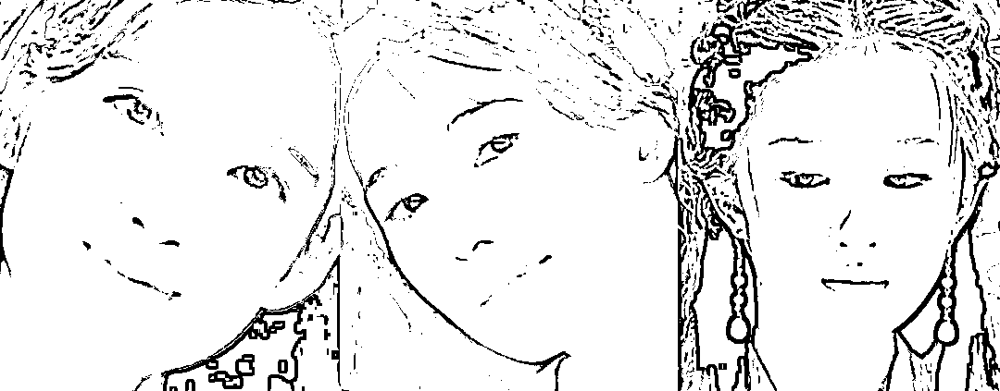

# 日韩这种对我们游客的歧视，靠骂是解决不了的

> 原文：[`mp.weixin.qq.com/s?__biz=MzU0MjYwNDU2Mw==&mid=2247509366&idx=1&sn=71a40fb0a13e2bdc6f8f50380f3eb0ae&chksm=fb1ac90acc6d401c25ccbd918210f53dccce60a766171329fc60508b73a8d97295032e2ffd76#rd`](http://mp.weixin.qq.com/s?__biz=MzU0MjYwNDU2Mw==&mid=2247509366&idx=1&sn=71a40fb0a13e2bdc6f8f50380f3eb0ae&chksm=fb1ac90acc6d401c25ccbd918210f53dccce60a766171329fc60508b73a8d97295032e2ffd76#rd)

很多读者很气愤，跟我说日本与韩国这两个近邻，对我们的游客采用了不尊重的方式。

有的挂红牌，有的挂黄牌，去了之后自费做核酸，自费隔离，尤其是韩国，隔离条件还挺差，大通铺，连个床都没有。

跟我说这事儿，就是想让我骂一骂，回头你好解气。 

骂是没用的，这是别人站队伍的一种表示，人不可能讨好所有人，有些人故意针对某些人是为了讨好另外的一些人。 

国家不是个人，不存在未经思考的动作，人家既然做了，就已经知道必然得罪我们，也已经想过了得罪我们的后果。 

这是别人的一种取舍。 

短期来看，我们能做的已经做了，就是对等。暂停了日韩的签证发放。 

这个矛盾当然是损害双方经济利益的，无论我们还是日韩，彼此的经济活动受到影响，三方都是有损失的。 

唯一高兴的是美国，这大概就是他们想要的。

但是我前面说的很清楚，日韩做这样的选择，是人家考虑过的，我们也只能做对等的处理。 

那么长期来看，其实很简单，等我们做了老大，当下你看到的所有问题都会消失。 

以前很多人让我聊越南，非说越南是我们的竞争对手，我说不可能，体量上限摆着。于是他们就让我聊印度，说印度大约是我们的竞争对手。 

我说也不可能。

我们的对手没有那么多，又不是打地鼠，此起彼伏，我们的对手就一个，美国。 

你只要超过美国就可以了。 

就像一个部门里面，大家对部门副经理呲牙咧嘴不一定是个人之间有什么矛盾，大概率是不向部门副经理呲牙咧嘴，就会被部门经理穿小鞋。

只要你替代老经理，你来做部门经理，这些昔日呲牙咧嘴的，都会点头哈腰。

这个道理很简单，你从下往上看，永远都是屁股；你从上往下看，永远都是笑脸。 

只要爬得高，一切都不是问题，你看到的都会是笑脸。 

这就是人的特性，慕强。 

万柳少爷未必做对了什么，但是定位在万柳，就是少爷，就会有一群人自称老奴，一群人自称臣妾，一群人求少爷收留，一群人求少爷临幸。 

没啥神奇的，和昔日王校长被定义为国民老公一回事。 

**你通过骂是不可能改变人类慕强本性的，你只能通过壮大自己。** 

等你比王校长还有钱的时候 ，你就是新任国民老公了。 

当然，你可以对这个称号没兴趣 ，那是你的事儿。但是你取代他的过程，才是他凉凉的过程。 

不过你仔细想想，老二是怎么取代老大的？ 

老二是因为复制了老大成为了老大么？ 

华莱士能够复制肯德基，但是华莱士很难超越肯德基。如果一个东西超越了肯德基，它一定是个新东西。

换句话说，它可以借鉴，可以学习，但绝不是照搬的。

它是怎么成为老大的？它是超越了自己成为老大的。

记住我这句话，**老二是超越了老二，所以才成为老大的。** 

从这个角度看，你没有对手，连美国也不是你的对手，你唯一的对手是自己。 

你要超越的并不是美国，你要超越的是自己。

美国今天遇到的很多问题都是无解的，实际上美国自己也不知道怎么做。 

我们聊过重定义财富，但是重定义财富本质上是一个永续债的过程。 

重定义财富的过程很简单，最初一群人在美洲大陆上，大家把种地看作财富，很快财富就固化了，消费就不足了，经济就失去活力了。 

你要重定义，牛车不灵了，火车是新风口了，铁路大亨，船运大亨兴起了。原有的财富拥有者还是拥有，但是总量增加了，于是他们实际上被稀释了。

就像 100 变成 1000 的过程，原来 100，农场主占据 80，现在铁路，船运进来了，农场主增加了，80 增加到 100，可是铁路，船运大亨，拥有 800。

农场主的财富占比从 80%被稀释到了 10%，虽然他们的财富总量从 80 增加到了 100。 

接下来铁路码头建完了，财富又开始固化，GDP，GDP，你要折腾才有 GDP。 

所以电子行业兴起了，各种电器层出不穷，财富又被重定义了，总量从 1000 到了 10000。

再然后，计算机，互联网，一次次的重定义。

这实际上是一个向未来要钱重定义当下的过程，这个过程当中债务会不停的积累。

我们聊过[怎么看城投债这件事](http://mp.weixin.qq.com/s?__biz=MzU3NDc5Nzc0NQ==&mid=2247522059&idx=1&sn=13084eea8f1230c9578561298024a7f9&chksm=fd2e35d5ca59bcc3dd30919fe485722e8d8088a868b08bb15c157812664aefc50a6696fa8df8&scene=21#wechat_redirect)。156 个亿的债务，展期 20 年，头 10 年仅付息不还本。

其实美国从来就没想过要还本，这就叫永续债。

只要能还得起利息，债务就可以永远存在下去，那么如果利息也还不起了，还可以怎么样？可以降息，可以零利率。 

老牌发达国家在加杠杆这件事上比我们要风骚走位的多。 

你长期这么做，是有尽头的。 

我待过的第二家公司，有一年开年会，CEO 说，从他上任以来，公司每年的销售额都翻番，连续五年了，所以展望未来，非常激情。 

我和我的部门经理在下面聊天，说，其实这样很危险。 

因为你不可能年年翻番，大臣在棋盘上放米粒，下一个格子比上一个格子翻倍的算法我们都知道。

这么去吊投资人的胃口，是有风险的。

果然，来年销售额腰斩，公司的骨干出逃了一半，公司上市没成，反而差点挂了，后来花了十年才恢复元气。

美国今天遇到的问题就是一个无解的问题，其实美联储在操控预期的领域已经炉火纯青了，美国在充分调动市场的能力上已经无可指摘了，包括美国利用全球矛盾，到处挖坑或者煽风点火，都是高手。 

问题是，这也不可能挽回美国已经迈过巅峰，开始走向衰落的事实。 

美国并没有做错什么，只是应验了 pony 说过的那句话，你什么都没有做错，你只是太老了。

图中是同一个女人，真的是她自己做错了什么吗？并不是，这是岁月的力量。

有时候怎么说呢，臣妾真的做不到啊。

我们要做新的老大，或者说新的选美冠军，不是抄谁的问题。

你抄右图有用么？她自己都做不到的事情，你抄她能做到么？

所有的时代美女，本质上是什么？都是一种创新。

这三个美女长得一样么？不一样，可是她们分别引领了不同的时代。

换句话说，没有周慧敏的时代，只有时代的周慧敏，换成林志玲也一样，换成刘亦菲也一样。 

你想做冠军，一定要拿出自己独特的美。 

这个美的本质是一种创新。 

创新不是学了什么武功，创新就是一代宗师。一代宗师不是学武功，是创造武功。 

[昨天看了小号记忆承载 3 的文章](http://mp.weixin.qq.com/s?__biz=MzU3NDc5Nzc0NQ==&mid=2247522087&idx=1&sn=bf1844d063ff6adc4ee4c53ba311e41b&chksm=fd2e35f9ca59bcefd4ebe49ab467c416fbc2acf87288c16ae78df5f1594612f371309bbc7666&scene=21#wechat_redirect)，很多人不理解，问了很多很多问题。 

这些问题怎么回答呢？千头万绪我告诉你一句话，或者说一个引子。 

你要放弃你的固有思维。 

固有思维是什么意思？就是我去问一下，他是怎么做的。

肯德基卖汉堡，你也卖汉堡，你顶天了就是个华莱士。

当人们不吃汉堡了，肯德基滞销了，你也会跟着滞销。

我们国家过去四十多年的成功并不在于美国做什么，我们就抄什么，虽然我们的确借鉴学习了很多很多。

我们的成功恰恰在于我们实际上是有想法的，我们实际上是没有思维僵化的。

[我昨天聊黑猫白猫就这个意思](http://mp.weixin.qq.com/s?__biz=MzU0MjYwNDU2Mw==&mid=2247509350&idx=1&sn=8ff7cb4e90e2119c54011bbc468b28da&chksm=fb1ac91acc6d400ce6e6cd0072e20981500348dd0ed958e552a0501ad39d64ef1f7a50dab121&scene=21#wechat_redirect)。很多人不是这么理解的。

他们以为过去是黑猫，一旦说了黑猫白猫，那就是要白猫了，反正无论什么猫，他们一辈子都在纠结于黑猫白猫黄猫绿猫。

而我在小学的时候，我自认为听了这句话，我认为说这话的人的关键点根本不在于猫什么色，而在于抓耗子。

我当年是个小学生不假，可我自认为比多数大人脑子好使多了。

创新的本质来源于什么？来源于你不受限，明白么？

很多人脑子是脑梗的状态，他一定要较真是孔子说的？那么是老子说的？那么是韩非子说的？

你为什么非要在 ABC 里面选一个呢？为什么呢？

为什么不是南拳就是北派？为什么不能是 D 呢？

你想想你是怎么知道南拳和北派的？是不是因为你长大了？是不是因为别人给你埋了一个 ABC 的有限选项的思维僵化的范围？

你小时候知道么？你刚出生的时候知道么？

所以昨天很多人问我，怎么才能像人一样摘桃子而不是像猴一样的时候，你已经落入猴的思维了。

你还是在问 ABC 选什么，你要忘了 ABC，才能看到 DEF。

怎么才能忘了 ABC？很简单，回忆自己婴儿的时候。

你刚出生的时候，你作为婴儿的时候，明明什么都不知道，可是你却那么快的成长，为什么？

就是因为你不知道呀。

**正因为你脑子里没有黑白，你才会去本能的抓耗子。**

张三丰教张无忌拳法，让他忘记，为什么不是教他招式而是教他忘记呢？

你想想看。

张三丰到底在教张无忌什么？[张三丰在教张无忌回到小时候，回到婴儿的状态下。](http://mp.weixin.qq.com/s?__biz=MzU3NDc5Nzc0NQ==&mid=2247522087&idx=1&sn=bf1844d063ff6adc4ee4c53ba311e41b&chksm=fd2e35f9ca59bcefd4ebe49ab467c416fbc2acf87288c16ae78df5f1594612f371309bbc7666&scene=21#wechat_redirect)

所谓，专气致柔，能婴儿乎？ 

[婴儿，才是天人合一的啊。](http://mp.weixin.qq.com/s?__biz=MzU3NDc5Nzc0NQ==&mid=2247522087&idx=1&sn=bf1844d063ff6adc4ee4c53ba311e41b&chksm=fd2e35f9ca59bcefd4ebe49ab467c416fbc2acf87288c16ae78df5f1594612f371309bbc7666&scene=21#wechat_redirect)