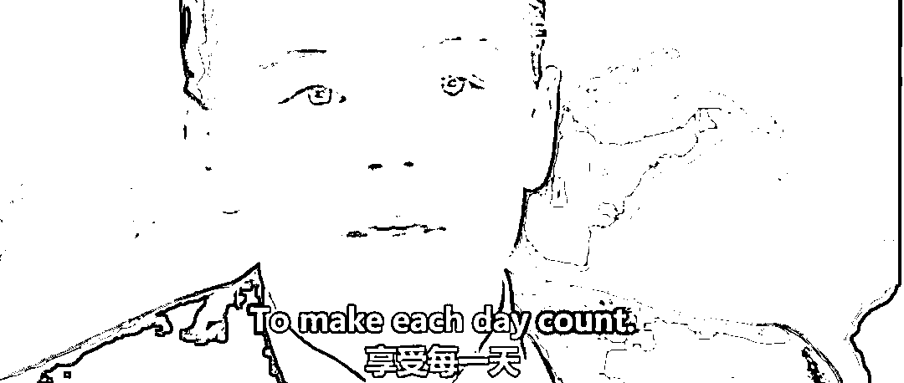
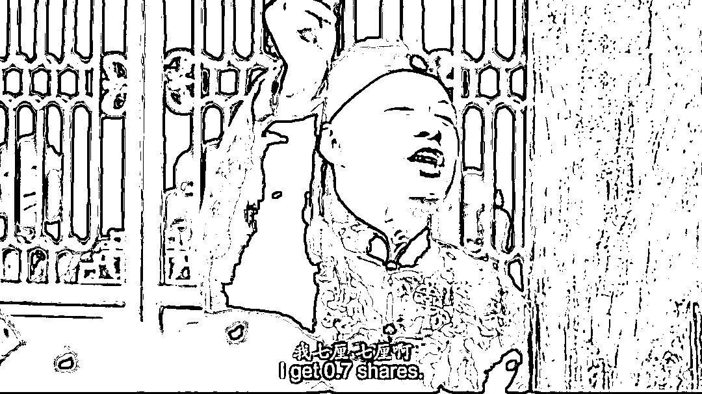

# 比放开更重要的，是放开

> 原文：[`mp.weixin.qq.com/s?__biz=MzU0MjYwNDU2Mw==&mid=2247509082&idx=2&sn=98f9f6aede431165da54252e06b98558&chksm=fb1ac826cc6d4130636a8e9dc920e31ef7cf535db1c84a69c2143f3b26d114a4ac48d00406d1#rd`](http://mp.weixin.qq.com/s?__biz=MzU0MjYwNDU2Mw==&mid=2247509082&idx=2&sn=98f9f6aede431165da54252e06b98558&chksm=fb1ac826cc6d4130636a8e9dc920e31ef7cf535db1c84a69c2143f3b26d114a4ac48d00406d1#rd)

我们聊过[如果要放开，最重要的事情是什么？](http://mp.weixin.qq.com/s?__biz=MzU0MjYwNDU2Mw==&mid=2247509062&idx=2&sn=f71abdd965204d3dc36d8fe0d540c081&chksm=fb1ac83acc6d412cf3b2fb2181199f7c429b89ba7bc23a6da7af760f4cabe163ec6faa7f0a74&scene=21#wechat_redirect)

很多人说，我聊着聊着就跑题，他们想听的是放开。

我们今天就聊放开。 

很多人嘴上说放开放开，可依我看，大多数人这辈子最放不开的是什么？是思想。

你的思想放不开，身体放再开有什么用？ 

思想为什么放不开？因为一个人局限在小环境里久了。他不由自主地把所有的评判标准都局限化。

这种事我曾经以为只有几十年前有过，那年月的人一辈子工作在一个厂子里，每天念叨的事情不是谁多加了半级工资，就是谁年底分到的带鱼尾巴比自己的长。 

他从来没有想过这些事情到底有没有意义？一辈子为了这种驴头狗尾的事情究竟值不值？ 

城里人这样，村里人也这样。张家长李家短无非谁看得起谁，或者谁看不起谁，谁敬酒谁没喝能记一辈子。

我曾经以为这是电视剧描述给你看的过去的那些糊里糊涂的人们。 

后来我长大了，我发现当我走入社会之后，新世纪之后，其实人们并无改变。

我待过的第二家公司是家芯片公司，当时的同事们也是为了谁先提的高工这种事情，争的头破血流。 

我当时也很纳闷的，全公司大部分员工都是硕博士，大部分都毕业于 C9，是什么让他们活成了这副模样？ 

我感觉就像大红灯笼高高挂，姨太太们一辈子为的事情无非是老爷今晚有没有点亮自己的灯笼。 

有人听到这里很高兴，以为我想说，大部分人之所以这样是因为他们不上外网，而他自己上过外网，他喜不自胜的以为我要认同他了....... 

对不起，要让这部分人失望了。 

你以为跑出去旅游两趟就开眼看世界了？你以为跑去外企待几年就开眼看世界了？ 

我这个从十几年前就因职业原因不得不长时间泡在外网上的人，从来没有觉得外国的网民和本国有什么不同。 

某种程度上，他们更狭隘。

这个狭隘是什么造成的？**是经历造成的。** 

我以前聊过消费者思维和商家思维，你在鹤岗购物，你在上海购物，你在纽约购物，你在伦敦购物，你哪怕去全世界每个城市都购物一圈也不可能改变你的消费者思维，知道为什么？ 

**因为在哪儿购物，都是购物。** 

你哪怕在鹤岗支个地摊，摆一个月，我准保你的消费者观念会有破冰的迹象。 

因为这一个月里面你必然有很多不同于以往的经历，你要进货，你要出货，你要了解货源，你要了解财务，你要了解营商环境，你要了解客户喜好，街道位置，人流量，方方面面。 

就像为什么我敢说我了解互联网？ 

因为我上过外网吗？我去拉斯维加斯玩一次我就敢说了解赌？那我就是棒槌了。 

我说我了解网络，是因为我在内网是博主，我在外网也是博主，我有几十万国人关注者，我也有几十万外国人关注者。

这就够了么？这不够。 

我之所以嬉笑怒骂点评某些你们熟悉的，某些你们不熟悉的大 V，是因为我认识。 

这里的认识，是认识他们老板。

你觉得他们是大 V，其实他们是艺人。你喜欢的艺人和你不喜欢的艺人，两个对骂的，观点截然相反的艺人，可能是同一个老板旗下的。 

而我和他们老板恰好有其他领域的业务往来。

听到这里我知道你要生气，你又要骂街了，都是资本惹的祸，是吗？ 

对不起，我再告诉你。那个骂资本的艺人和夸资本的艺人，仍然是同一个老板旗下的。

还想生气么？该学会沉默了吧。 

不要那么大气性，一个人年轻的时候没有气性，说明没有灵魂；一个人不年轻了，还只剩气性，说明没有脑子。 

为什么没有脑子？因为没有经历呀。

**你无非是本国的大红灯笼高高挂，还是外国的大红灯笼高高挂。** 

仅此而已。 

知道老爷为什么比姨太太见识高？

**因为老爷的世界不只有姨太太，可是姨太太的世界只有老爷......**

很扎心，好好品。

一个人要放开思想，还指望别人，是没有用的。你都要放开思想了，还指望别人，那你放开了什么？ 

没有一本书，没有一个网，没有一个人能让你放开思想。人要开悟，全靠天启。天启谁不启谁，全靠自己。所谓自助者，天助之。 

走出环境是靠你自己的，这个环境不是地域，是位置，是经历。 

**你去一百所小学重复读一百次小学，你读的仍然是小学，可是你考上中学，经历就不同。** 

人们为什么会走不出限制，放不开思想？ 

因为他们不愿意尝试新的东西，他们不愿意迎接挑战。 

我在第二家公司做架构师的时候，跟上司抱怨，新的软件架构做好了，公司不肯投入大项目了，只剩对原有系统的维护。这样的工作太乏味，太无趣。 

说白了，我是来打仗的，不是来守城的。打下一座城，我要钱粮军马，我要打新城。 

上司是这么跟我解释的，他没有站在公司的利益视角，而是站在我的视角。他说，做一个月领一个月薪水，做新项目也是一个月薪水，维护老项目也是一个月薪水，重复过去的工作不香么？ 

我回答说，不香。 

你觉得香，是因为你觉得上班是为了挣钱，我觉得不香是因为我觉得上班不是为了挣钱。 

所以你划算，我不划算。 

我毕业的头五年是有时间压力的，在这段时间里，我要尽快熟悉开公司的全部流程，我要做技术，我要做管理，我要熟悉公司内部的运作以及外部市场的挑战。 

然后我要去开公司做老板了呀，我哪儿有闲工夫为了这几个工资跟你这儿瞎耗？

我只是搭你的船，去熟悉这片海域，去踩我可能踩的坑。 

所以发工资有什么用？只要我的目的达不到，马上就得分道扬镳。 

我去创业做老板，难道就会把公司当作自己的全部吗？不。 

技术是道具，公司也可以是道具。技术是你熟悉公司的道具，公司是你熟悉市场的道具。 

[那天很多人问我，你对应收账款这个梗耿耿于怀，](https://mp.weixin.qq.com/s?__biz=MzU0MjYwNDU2Mw==&mid=2247508880&idx=2&sn=d88ddf473130c373bffda5f008b47927&chksm=fb1acfeccc6d46fa6da02881082151318c146f7054165a278865c053b80b9494c462447c6c99&token=621278327&lang=zh_CN&scene=21#wechat_redirect)是不是因为第一次创业的时候公司就因为这事儿没做成？ 

你想多了，**公司没做成，我做成了。** 

你好好品这句话，技术是阶梯，公司也可以是阶梯。

我做船员是为了了解船，我开船可不是为了那条船。 

是不是特别讨厌我这种人？ 

讨厌就对了。

**人通常都会讨厌自己理解不了的事物。** 

无论哪国人，都不外如是。 

你以为只有中国有大红灯笼高高挂？你去看呼啸山庄，不一样么？ 

越是封闭的环境，越是充满了狭隘的爱情，这就是呼啸山庄的本质。一个外国版的大红灯笼高高挂。

你的精神世界太小了，你的精神世界里只剩下二姨太和老爷，今天二姨太怎么看你，明天四姨太怎么看你，后天老爷来没来，就剩这个了。 

所以你看我像怪物。你觉得我怎么能不在乎二姨太的看法呢？

对呀，我就是不在乎。因为我不需要在乎。

你以为我是事情做成了，我比你多挣了几个臭钱所以来你这里洋洋得意的显摆？就像那个令人厌憎的五姨太？ 

呵呵，所以我说你没有跳出限制，你跑去全世界 100 个城市购物你都跳不出这种限制。

你的精神世界里永远都是大红灯笼高高挂。

你没法放开，你的灵魂深处被局限在一个小圈子里。你永远用一个方式去理解你看不懂的事物，我就知道，你放不开。

你觉得我和泰坦尼克上那个放荡不羁泡人未婚妻的穷屌丝 JACK 有什么不同？

这两张图有什么区别？告诉我有什么区别？ 

一个是艺术家一个是商人？

不。

你没发现吗？两个人眼里闪烁着同样的光。

从看到 JACK 穿着借来的西服坐在一群商人中间，甩着响指吹“Life is a game of luck”的那一刻起，我就清楚，我们是一样的人。 

**他睡了他想睡的，我做了我想做的。**

你告诉我，我们有什么分别？ 

无非他做的事情恰好与主流世界的定义背道而驰，而我想做的事情，恰好与世俗世界的定义吻合。 

俗称他做的事情不挣钱，我做的事情挣钱，仅此而已。

你以为 JACK 挣的是艺术？白银帝国里这位挣的是银子？ 

不，他们挣的都是生命。

老天爷给了一辈子，我一点没糟践的都去做了一切我想做的，我值了。 

你值吗？ 

假如明天就阳了，假如我们随时要离开这个世界，你值吗？

你不用回答我，正如同你根本不用回答二姨太。 

回答一下自己，回顾一下自己，这辈子的每一天，值吗？真的活过吗？

[就像我们那天的话](http://mp.weixin.qq.com/s?__biz=MzU3NDc5Nzc0NQ==&mid=2247521373&idx=1&sn=0bff7fbddb57bc55e244a1f2386b2b96&chksm=fd2e3683ca59bf95056f54e3f6794df755eff435997004a37bb75dcbc2b0c346b6ebab545ce3&scene=21#wechat_redirect)，人就一辈子。你始终记住，人就一辈子。

时间呼呼呼的就过去了，一闭眼，一睁眼，一天就过去了；一闭眼，不睁眼，一辈子就过去了。 

尤其在这个你可能会反复感染，反复感染的世界里，你准备怎么度过自己的一生，随你。 

你完全可以认为我上面写的都是 P。你完全可以继续别人踢一脚你动一下，然后牢骚满腹的日子。

没问题，开心最重要，你自己觉得自己这辈子值，就好。