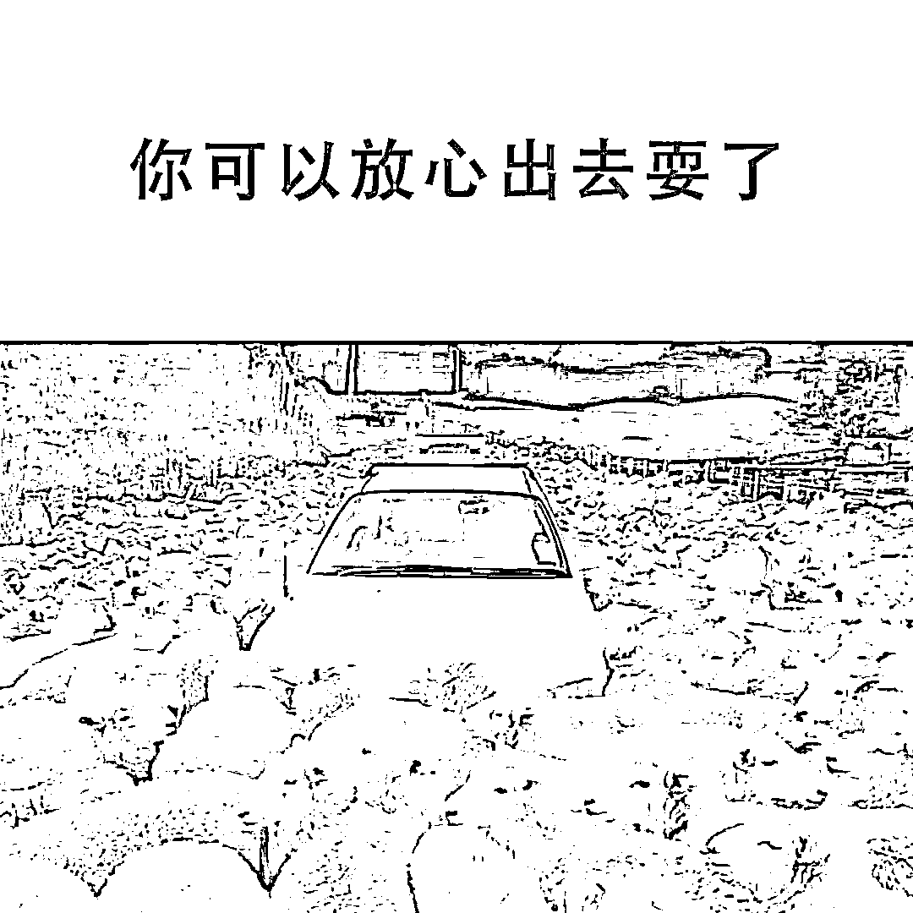

# 如果要放开，最重要的事情是什么？

> 原文：[`mp.weixin.qq.com/s?__biz=MzU0MjYwNDU2Mw==&mid=2247509062&idx=2&sn=f71abdd965204d3dc36d8fe0d540c081&chksm=fb1ac83acc6d412cf3b2fb2181199f7c429b89ba7bc23a6da7af760f4cabe163ec6faa7f0a74#rd`](http://mp.weixin.qq.com/s?__biz=MzU0MjYwNDU2Mw==&mid=2247509062&idx=2&sn=f71abdd965204d3dc36d8fe0d540c081&chksm=fb1ac83acc6d412cf3b2fb2181199f7c429b89ba7bc23a6da7af760f4cabe163ec6faa7f0a74#rd)

这些天很多读者问我，现在几乎是个大 V 都在讨论放开这个话题。

但是又有点奇怪，这些大 V 一边说放开很好，一边表示自己暂时不出门，也不聚餐也不扎堆也不下馆子也不看电影.......

然后就是在自己的媒体上跟大家说，放开好，放开了有烟火气。

看过这些内容，来提问的读者们有点懵，懵的程度类似下面这张图。

这张图的意思是有点不知所措。所以来问我怎么看。

**事情很简单，分宏观层面和微观层面**。 

宏观层面我的看法始终是一本经济账。[就像前两天我打的那个比方，](http://mp.weixin.qq.com/s?__biz=MzU0MjYwNDU2Mw==&mid=2247509026&idx=1&sn=308e0c2f2ebb0551a98bb083517e6131&chksm=fb1ac85ecc6d4148f8c4095614d528d89dc3b274f71891f3f962f5327a1431932f1fa40f2e21&scene=21#wechat_redirect)贵族学校好不好？肯定是好的。

长江七号里面星爷的儿子该不该上？两个判断维度，第一个是这孩子能不能挣回来，第二个是他老爹供不供得起。 

我自我剖析过很多次，我的价值观里面是始终是一笔账，我很难脱离算账来给你评价好坏。 

就像以前总有人问我，花几百万去读书好不好。 

我说好不好要看两件事，一个是这孩子能不能挣回来，一个是你作为家长一年挣多少钱。

如果能挣回来，那读书有什么不好呢？

如果挣不回来，就得你的年收入几何了。

如果你一年挣几百万，就算挣不回来，花几百万让孩子读书有什么不好呢？受教育的机会一辈子也就一次。 

反过来如果你一年只挣个 2，30 万，甚至十来万，那你自己觉得呢？ 

这番话说出口，很多人都骂我，他们说知识是无价的。

我没法反驳，因为咱们的底层价值观是不同的。

就像日本人觉得和牛是拿来吃的，印度人觉得牛是拿来供奉的，底层逻辑要是不一样，就没法达成共识。

站在我的价值观体系内部，我这几年说的每句话，都可以得到很好的解释，说明我这人始终如一，说明我没有撒谎，我说的就是我想的。

你比如去年，前年我一直在讲，我说过去的防疫策略非常优秀，为什么？因为特别划算。 

他们说，你怎么能这么说呢，你应该说保护了多少生命。 

是的，老读者都发现了，我极少提及生命。我这人很俗，成天在算账。 

前年，去年，我一直在说，防疫的成功使得内部很安全，大家敢于出门消费，一定程度上消解了疫情带来的阴霾。

更重要的是，没有对我们的生产体系造成冲击，使得我们在外部世界供应体系瘫痪的过程中，狠狠赚了一笔。

我更多的是从这个角度去思考。 

今年以来，我聊的也不是生命，而是担忧，担忧随着病毒传染力度的加强，开支太大了，过去的模式是不是还吃得消。 

能听明白我前面埋伏的关于读书的那个比方吧？

前年，去年，就像一个孩子读书，他是能自己把学费挣回来的。 

从今年开始，就像一个孩子读书已经挣不回学费了，那就只能看是否还供得起了，以及，能供多久。 

我问大家一个问题，如果供不起孩子读书，你觉得最重要的是什么？

很简单，是让这孩子赶紧去挣钱，千万别耽误。

我这人就这么俗，我这人的逻辑就这么简单，**用李云龙的话说，两头总得占一头，咱不能啥都捞不着。** 

你想通了这点读书的道理，去看你们问我的这个话题，答案已经浮出水面了。 

如果要放开，那就要多下馆子多看电影多消费，你得和那些大 V 们个人的策略反着来。

为什么？ 

原因很简单。

古时候帝王要御驾亲征，臣子都是劝阻的，为什么劝阻？ 

因为风险太大，一旦有失，就会进退失据。 

你派个将军去打，打得赢皆大欢喜，打不赢大不了把将军斩了，然后你有两个选项，另选人去重新打过或者议和，都无妨。 

因为打不赢不说明什么，前次派去的只是个将军，赢不了也许是他个人能力问题。不会动摇预期的。 

但是御驾亲征，是没有缓和余地的。不打则已，打则必胜。绝对不存在打输的选项。 

因为一旦输了，是没有后招的。

从古到今，预期管理都是最重要的事情，没有之一。

我说过很多次，不只有打工的人认为放开了自己就容易挣钱了，其实老板们也这么想。 

这是什么？这就是一种共识。就像古代人认为御驾亲征一定能赢一个道理。 

所以大臣们才会说要慎重，要么不轻易做，要做就必须做成。 

经济学常识，一个人的支出就是什么？就是另一个人的收入。 

没有人支出老板会不会容易挣钱？老板都不容易挣钱打工人会不会容易挣钱？

更不会对吧？

所以你现在明白了？如果放开了，不能不下馆子，不能不看电影。

因为一旦这样，一旦没有如那些希望放开的人预想的迅速恢复烟火气，事儿就难办了。 

老板靠什么坚持？靠预期。他卖了自己姥姥留下的房子都要坚持，是他觉得只要放开就能挣钱了。 

他还有一口念想。

如果一旦放开，结果烟火气没有快速恢复，那么这些小老板的信心就会快速消散。 

这就是为什么我个人，始终坚持预期管理的策略，我说要有步骤，要学会吊着资本市场的预期，最终利用他们的家底，帮你们找工作。 

问题是，那只是我个人的看法。这是人类的地球，最终说穿了是人多的说了算。

那么如果要放开，你就得尽快放下过去几年形成的思维惯性，你要让自己有意识的多下馆子，多看电影，多出差。

还有读者在问，为什么那些大 V 不那么做？ 

很简单，这是第二个视角，微观视角。

这个话怎么讲呢，一种流行病，只要能反复感染多次，多次之后你的免疫系统肯定是会受到冲击的。 

其实欧美的经历已经告诉你这个过程了。免疫力最差的人，可能第一波被带走，或者因为本来就有基础病，因为医疗挤兑被带走。那么后面几年，一波一波又一波的感染，比如你第四次感染，你的免疫力已经不如你第一次时那么强了，那你感受到的症状，可能与第一次时就不太一样。

你要知道，你在网络上能看到的大 V，大部分都是做老板的，或者做高管的，或者人家是职业从事自媒体的。 

这些人的条件要比他们的粉丝强很多。他们想要靠后一些迎接海浪，让自己更安全。也很正常，人之常情。 

这就是微观视角。 

你发现好像有些冲突对吧。 

这就是最麻烦的地方，我前面讲过，管理预期最头疼的就是反反复复。 

就像御驾亲征的时候，大家都知道必须赢，可是最担心不能心齐，不能将士用命。 

这时候最重要的是什么？是模范带头作用。 

你要消除大家的疑虑，就需要有人分享更多的感染经历，就像打仗的时候也需要有个百夫长，千夫长之类的带头冲。

这种角色，只有大 V 合适，因为有足够的影响力。 

现阶段特别需要那些每天说放开特别好的自媒体大 V，亲自去示范性的感染一遍。 

然后把自己生病的过程拍摄下来，做成视频，分享给大家。

这样会很大程度上打消大众的疑虑，让本来狐疑的人们敢于逛街。 

而且有些话怎么讲呢，虽然我说了不聊健康话题，实际上健康话题的本质仍然是共识问题。 

**我个人从来没觉得这病毒能有多大杀伤力，而且人吃五谷杂粮，面对天气变化，本来就不可能不承担风险。** 

**问题的关键在哪里？在于大家怎么看这种病。**  

如果大家都是抱着别人阳了让他放心没事儿的；邻居阳了要求赶紧拉走；自己阳了恨不得三甲主任全天候照顾，那必然医疗挤兑。 

明白了吧？共识有问题。 

这个共识需要改变，怎么改变？怎么让绝大多数人都认为邻居阳了不嫌弃，家人和自己阳了不麻烦医生靠自己？怎么才能达成这个新的共识？

很显然，需要榜样。需要他们信任的，熟悉的人阳给他们看。

他们信任的就是这些每天说要放开的大 V，这些大 V 说，自己之所以要放开，不是为了自己，全是为了粉丝们容易找工作呀。 

你看，他那么关心你，他那么爱你，他说的每句话都是为了你，你自然信任他。所以他先阳给你看，最能安你的心。 

人都有从众心理和羊群效应，看到自己喜欢且信任的爱豆示范了，心结就打开了，就敢于下馆子看电影了，阳了也不会去麻烦医生了。

明星效应之下，消费打开了，医疗也不挤兑了，才真的有利于你挣钱。 

一个大 V 能影响几百万人，几百个大 V，其实是很好的样本，非常有助于重塑共识。

过去有个说法叫做吃播，作用是探店美食，希望这些大 V 去做阳播。不要辜负粉丝们的信任。