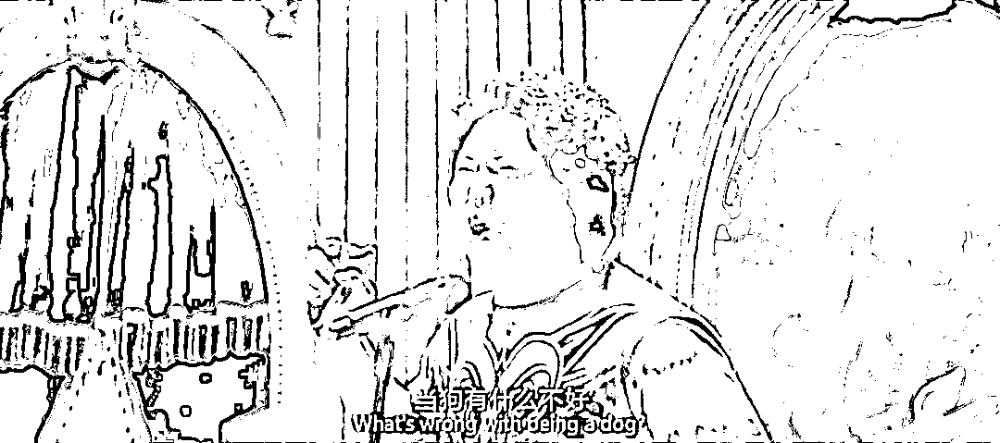
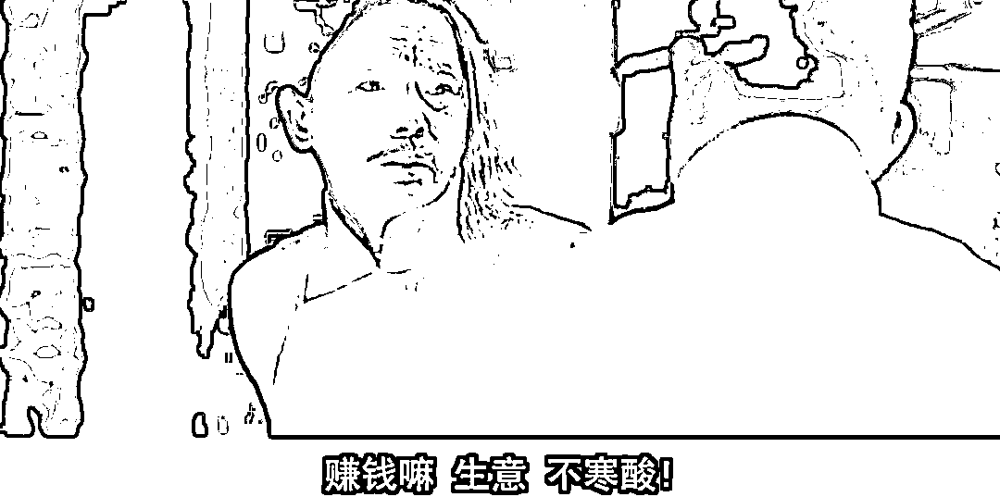
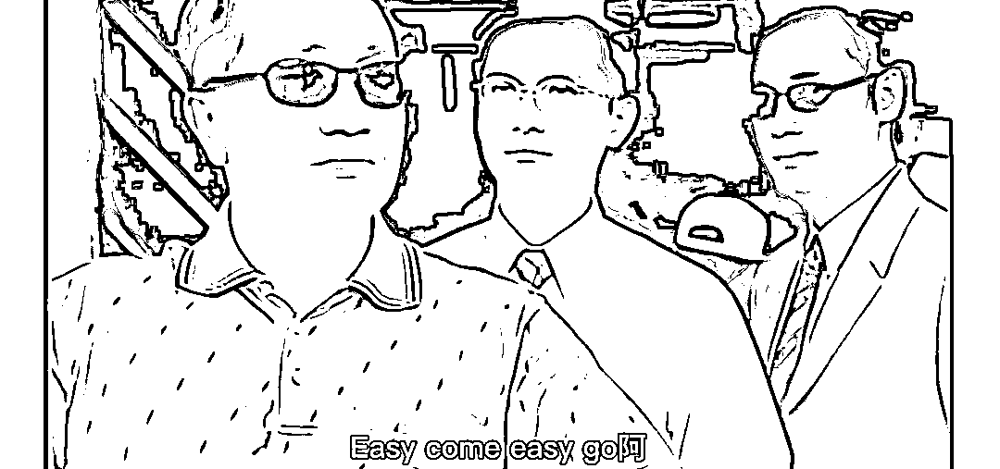

# 切瓜不如切因果，汪小菲大 S 的瓜，同样有原因

> 原文：[`mp.weixin.qq.com/s?__biz=MzU0MjYwNDU2Mw==&mid=2247508740&idx=2&sn=636b378f626295d2bb1d5f394e68e678&chksm=fb1acf78cc6d466e62e11d982271a82f4abc3e97fcefb6200bcb803fb0733929c58aaa47dcb8#rd`](http://mp.weixin.qq.com/s?__biz=MzU0MjYwNDU2Mw==&mid=2247508740&idx=2&sn=636b378f626295d2bb1d5f394e68e678&chksm=fb1acf78cc6d466e62e11d982271a82f4abc3e97fcefb6200bcb803fb0733929c58aaa47dcb8#rd)

[我那天提了一嘴](http://mp.weixin.qq.com/s?__biz=MzU3NDc5Nzc0NQ==&mid=2247521222&idx=1&sn=fc357bdad344d3933c572a0646a69303&chksm=fd2e3118ca59b80e4835b936775adbbe953a0aad14d8c5a59f3f5c87ab649772f1e4b512b339&scene=21#wechat_redirect)，我说娱乐圈乱，是一种生态结果，不是谁的人品那么简单。 

很多人对这个感兴趣，想让我展开。 

展开就是两个字：因果。 

瓜是不是一种果？瓜既然是一种果，你顺着瓜藤往上摸，总能顺藤摸到因，这就叫因果。

凡事都绕不开因果。 

我那天说，无论汪小菲爆料的那些关于大 S 小 S 嗑药的事情是不是真的，明星们嗑药的新闻都不鲜见。 

有人问，这是为什么？是人钱多了之后骚包么？不嗑药就不能证明自己有钱么？ 

你想，明星大都高消费，豪宅豪车，奢侈品包包，如果这些都不能显得自己有钱，那么嗑药显然是更好的选择。 

我曾经举过一个例子，我说没有无因的果。 

你看着一个小商人一定要买一辆，甚至租一辆超出自己年收入的车，为什么？ 

因为那是生产资料，不是消费品。他需要豪车撑面子，需要豪车背书，需要豪车让合作伙伴相信他的实力，相信他能够把工程做完而不是拿了定金跑路。 

你看到很多包工头去工地都开着豪车，是做给谁看的？就是做给农民工看的。让农民工觉得，我一个开豪车的人，会差你那几万块工钱么？

事实上，他的资金周转还真靠那几万块工钱，一个工人身上欠几万，一百个工人就可以欠几百万，这是他中标的前提，他等于垫资入场接的活。整件事的背书，就是你看似他为了撑面子开的那辆豪车。 

所以品牌很重要。 

汽车销售市场里发现某些品牌很小众，性能很高端的车子卖不出去，为什么卖不出去？ 

因为在买车的群体里看来，他们需要的是一个抵押品，而不是汽车本身。抵押品最重要的是共识而非性能。 

就像你在赌场里，劳力士是随时可以换筹码的，而且可以换的比例很好。你 10 万块的劳力士可以换 8 万块的筹码，有的上百万的表，只能换三十万的筹码。

共识不同，所以你会发现经常出没在赌场里的人，胳膊上的劳力士特别多，他宁愿戴 10 块 10 万的，也不愿意戴 1 块 100 万的。因为万一输光了，前者可以抵 80 万的筹码，后者只能抵 30 万。 

**那么在娱乐圈里，什么是抵押品？** 

把柄就是抵押品。 

我们很多时候看一个人，看一件事，看到的都是果。 

你看到她今天是个有钱人，是个明星，你有没有想过，为什么是她呢？ 

把时光往前追溯很多年，很可能她就是一个平民子弟，为什么是她呢？为什么不是你我呢？ 

一个人，想要成名，固然有自己的勤奋与特殊才能，所谓很努力很努力。但这些在巨大的成功面前，都不值一提。 

巴菲特有句话很实诚，他说 ，无论我有多聪明，多努力，都不可能配得上我的所获。 

这句话没毛病吧？ 

你拿几百亿美金出来在全世界海选，绝对能够选出一大堆比巴菲特还聪明还努力的。 

所以成功成名，一定无法脱离运气与资本的加成。 

运气是什么？运气是你的第一票，**资本的加成是什么？是你一票之后还能有下一票，而不是昙花一现。** 

我们聊过这个话题，[资本面前，打工人不快乐，资本家其实也不快乐。](http://mp.weixin.qq.com/s?__biz=MzU0MjYwNDU2Mw==&mid=2247508730&idx=2&sn=ddb787fd740f67892cfb980f99102c62&chksm=fb1ace86cc6d479022acc2dfc31099921d5e3ecebda47790708b719fd046e65bad3c9dfd7392&scene=21#wechat_redirect)

打工人之所以不快乐是因为资本希望打工人之间彼此只剩下竞争关系，**资本总是倾向于没有最努力，只有更努力。**

资本家之所以也不快乐是因为你只能给资本当狗，而不可能反过来给它当主人。 

即便巴菲特，也得给资本当狗，这是没有办法的。这就是资本的游戏。

所谓你不当，有的是人当。 

就这点事儿，不寒碜。 

在大众眼里，你是资本家，或者是大明星，但是在资本眼里，在市场眼里，你就是跪着要饭的。 

所以很多人总以为资本家和打工人是对立的，总以为资本家是高高在上的，是资本的主人。 

你想多了。又或者说，**你习惯于拟人化的思考世界了。**

人法地，地法天，天法道，道法自然。

资本不是最高一级的存在，最高一级是宇宙规则，类似大刘说的黑暗森林这就算自然了。

资本属于道，次一级的。**人和道之间还隔着天地呢。** 

所以我昨天说，资本没有那么容易征服。当然我相信一定能够征服。 

我们人类不可能永远被私欲左右着，既然咱们能从猴进化成人，我们就能进化成孙悟空，我们一定有办法成为更高等的生命。 

到那时候 ，我们就能和道平起平坐，我们就可以人法自然。作为更高等的生命，我们当然能够很容易地控制资本。

说白了就是控制欲望，我们将不再被私欲所左右。 

暂停展望美好的未来，回到当下。当下的人类文明整体上维度还是比较低，除了个别人道德情操很高，对于普通人来说，你想摆脱欲望的束缚，你想得大自在，还是很难的。

那么你想要做资本家，俗称你想要给资本当狗，你也得有投名状不是？ 

林冲上梁山还得劫俩客商呢，你什么把柄都没有，资本凭什么收下你当狗？ 

你想想看是不是这么个理儿？ 

我曾经说过一句话，我说我打小就知道，一个人不可被威胁，不可被利诱，那么这个人就绝对不值得信任。

这话是我说的，但是这话不是我创造的。这就是道的一部分。 

很多时候，明星，尤其是流量明星的高消费，就是为了证明自己可以被利诱，而嗑药，就是为了证明自己可以被威胁。 

听着很奇怪对吧？换个思路，学会理解时间。你脱离果对你的束缚，你站在因的角度想想，就明白了。 

有些时候，为了上位，为了得到机会，为了被资本选中或者青睐，就是不得不呀。 

想想林冲的无奈。 

你注意，这不是必然的。我没有一杆子打翻一船人。

有人可以说不，你是老戏骨，你真的有金刚钻，别人离了你还真揽不了这瓷器活；你出身很好，并不需要非得讨好谁；你运气爆棚，锦鲤附体。这些都可以成为你说“不”的理由。

问题是，你想想看，这些特质是什么？都是稀缺的。

所以，更多人会怎样，就不必我说了吧？ 

**你要学会用因果来看待这个世界，而不是用道德去评价每个人。**

十多年前我刚开始带市场团队的时候，经常和我们常务副总出差，他比我大五六岁，算半个前辈。 

我此前研发出身的嘛，忽然带着很多帅哥靓女，出没灯红酒绿，难免对环境有负面看法。 

说白了，我相对来说，是自命清高的那个。

常务副总就跟我讲，清高未必是你人品好，很可能只是你运气好，毕竟不是每个人都有你的先天条件。 

我可以不去讨好客户，那是因为有我的下属代劳了；我可以不做市场，那是因为我离开这份工作，依然可以去做架构师；我甚至可以脱离这个行业，我的主要收入来源于投资又不来自于工作。 

所有任性的背后都是老天的格外优待。 

一个人如果不需要投名状，不需要被威胁被利诱，除非你自带资源出场。 

俗称命运，我就是命好，我就是运气好，又或者，你说我宁愿不要超出自己勤奋与才华之外的那部分成就，我也不乐意被资本控制。

我没有为那些人品实在不咋地的污点艺人们洗脱的意思，我只是告诉你，很多事儿都是因果。

**你可以摘掉两个腐烂的果子，可是这里面的复杂因果依然存在着。** 

这就是为什么我昨天非常情感饱满的跟你们讲，我们人类非常渴望进化成高等文明的形态。 

猴子还晓得跳出三界外，不在五行中，何况人呢？ 

可是回到现实，正因为这种不怎么符合人性的因果的存在，人们往往会有补偿心理。 

什么叫做补偿心理？ 

你比如祁同伟，他虽然是一个反面角色，可是摸着良心说，他的前半生，的确是个受害者。 

他在校园操场上跪下的那一刻，就难免产生日后的补偿心理。 

他日后做了很多错事，包括对梁璐的感情伤害，都来自于昔日他自己受到的伤害。

有人说，为什么一个男人，当初明明靠着女人上位，后来那么负心？ 

因为他需要通过后来的行为去治愈自己前半生受过的伤害。 

这样的例子很多，祁同伟，蜗居里的宋思明，古龙的小说，....... 

龙啸云为什么总要害李寻欢？他的一切都是李寻欢给的，甚至连他老婆林诗音都是李寻欢让出来的。

就因为这样呀，正因为这个因，当他得到了一切之后，他更想要抹杀李寻欢的存在。 

因为每每看到李寻欢或者想起这个人，都会让龙啸云觉得往事不堪回首，自己的早年不堪回首。

反过来，女人也是一样的。 

如果一个女人通过各种让自己不快乐的方式拥有了名气与财富，你觉得她会不会希望自己的后半生，拥有一些舔狗和软饭男呢？

没什么稀奇的，心理补偿效应在起作用而已。

同样的道理，为什么个别商人或者富二代沉迷于花天酒地，出轨成瘾？

还是心理补偿效应。 

[我们聊过三期赌博](http://mp.weixin.qq.com/s?__biz=MzU0MjYwNDU2Mw==&mid=2247508701&idx=1&sn=a6c456aade45cfb1dcffb37e94443ccd&chksm=fb1acea1cc6d47b73560cb36dc5467afd1ed59181008951defa2bc210670d7da5d740bc490d2&scene=21#wechat_redirect)，有人问我为什么非要把稳定盈利定义的那么困难，我无法做到低方差、大重复，难道赢来的钱就不是钱了吗？

是钱，可是你的心态是不同的。

各种方式都能赢，无非对运气的隔绝程度不同。如果 easy come easy go，你的内心也会 easy come easy go。

说这句台词的霍景良为什么执迷于婚内出轨和泡女明星？因为他不知道自己为什么赢的，他内心恐惧。

你担心大起大落，那些迟早不是你的，就会倾向于用各种方式寻找刺激，只有花掉的，才感觉自己曾经拥有过。 

**可是这样真的能拥有什么吗？** 

你只是被资本这个道，从头玩弄到尾......，俗称“俺那里把你哄”。

所以祁同伟那种看似反抗的挣扎，是没有办法胜天半子的，你从头到尾，也未曾离开道的五指山......

言归正传，回到今天的主题。我可什么都没说过，我只是在分析因果，请勿与现实对号入座。我愿意相信我们拿来当药引的当事人都是好中年。

我只是觉得，网民们与其把时间花在各种八卦别人隐私的事情上，激动的冲入别人的直播间，兴奋的连那个据说几百万，连什么姿势都会实时发短信给手机的床垫都要拍下来。 

你有那个钱和工夫，不如想想因果。

不昧因果，**人们看不破因果，必然落于因果**。