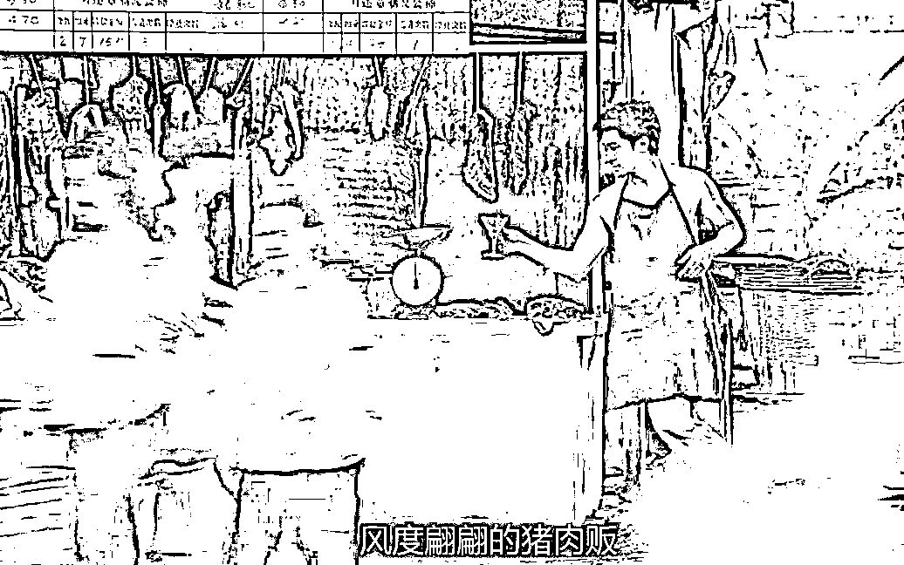

# 消费者要是靠得住，母猪都能上树

> 原文：[`mp.weixin.qq.com/s?__biz=MzU0MjYwNDU2Mw==&mid=2247508730&idx=2&sn=ddb787fd740f67892cfb980f99102c62&chksm=fb1ace86cc6d479022acc2dfc31099921d5e3ecebda47790708b719fd046e65bad3c9dfd7392#rd`](http://mp.weixin.qq.com/s?__biz=MzU0MjYwNDU2Mw==&mid=2247508730&idx=2&sn=ddb787fd740f67892cfb980f99102c62&chksm=fb1ace86cc6d479022acc2dfc31099921d5e3ecebda47790708b719fd046e65bad3c9dfd7392#rd)

[自从昨天对比了刘强东和马斯克之后](http://mp.weixin.qq.com/s?__biz=MzU3NDc5Nzc0NQ==&mid=2247521234&idx=1&sn=ffa022e884efa50d5e557d2cc182e7e3&chksm=fd2e310cca59b81a60cccf0884d71755dc03d5b9b8d80cfb71ffe5a65e7ee66677ec34c27f65&scene=21#wechat_redirect)，就有人开始迷恋上这种我们极少表达的宏大叙事。

有人跟我讲，他看好东哥，东哥好样的，他相信自此以后，消费者会首选京东。

你这会儿的情绪我理解，可是你的判断，我表示呵呵。 

原因就是标题的这句话，消费者要是靠得住，母猪都能上树。 

真的，你与其相信消费者的许诺，你真不如相信热恋当中男人的甜言蜜语，相对来说，后者靠谱一百倍。 

消费者为什么靠不住？因为消费者是一个很广泛的群体，消费者几乎就等同于网民。 

你觉得网民群体靠得住么？ 

昨天我少有的宏大叙事了一次，后台充满了对我的夸赞，表扬信都快把服务器搞挂了。夸我的比平日里骂我的多十倍，我还真不习惯。

这种表扬，能持续吗？ 

你说你爱我，能坚持三天么？ 

不可能的，互联网上没有什么情绪能够维持三天，无论是爱，亦或者恨。

现在大家都知道这一次全网关注要不要去台湾的那个男人叫做汪小菲，你们当中有多少人还记得上一次全网都关注要不要去台湾的那个女人叫什么？

网民的记忆难以持久，本身就是人性的一部分。这就是为什么我很少去聊宏大叙事。

因为所有的大目标都不是一步登天的。

我们有很多人喜欢宏大叙事，是不考虑时间这个计量单位的。

昨天写了资本的异化之后，之所以很多人很激动，是因为他们觉得，下星期人类就摆脱资本的束缚了。 

所以我要郑重的告诉你，下星期肯定来不及。 

我昨天讲的那个东西，又不是我原创的，那是咱们每个人小时候都学过的，考研都还要考，我们从小学到大。 

如果你看完之后好像第一次接触，我都怀疑你小时候老师是怎么放水让你过的。 

咱们小时候，老师就跟我们说过，这是人类要做的事情，并不是人类已经做到的事情。 

要做距离做到，中间需要时间。 

这个时间并不是以星期来计量，而是可能要跨越数代人。 

就像我们在星际航行，一代一代的人告诉后代，目标是什么，否则咱们就迷失在茫茫宇宙中了。 

可是这个过程中，我们很多代人也许都要终身生活在飞船上，能够抵达目的地的，是后人。 

所以平静一点，没有什么宏大的目标，是很短时间内就能实现的。 

你的努力是为了让现实变得完美那么一点点，而不是你指望着现实下星期就完美，然后让你享受。 

**说到底，你是来种树的，不是来乘凉的。** 

如果你指望所有的老板明天早上都不追求效率了，如果你指望所有的同事明天早上都不再是你的竞争者了。 

只能说明你在异想天开。

我相信我们的后人总有一天，能够不为了赚钱而工作，或者说，能够不主要为了赚钱而工作。 

我也相信我们的后人总有一天，人与人之间更多的是合作关系，是分享精神喜悦的关系，是彼此衷心的为对方鼓掌的关系，而非主要是竞争关系。

但是你注意，我始终用的措辞是我们的后人，而非我们。 

为什么？因为我并不知道怎么去实现理想。 

拥有理想与实现理想之间有很遥远的距离。

我本人就是一个国际市场里的炒买炒卖者，我虽然没有在美国生活过，但是我相信我比 99.99%的美国人都更加理解资本对人的异化。 

做交易，你不接受资本对你的异化改造，你是不可能稳定盈利的。 

可是我昨天也说过，资本应该是人类的工具，而非主人，否则这个游戏长远看，是很荒诞的。 

难道真要两台人工智能，一个挖矿，一个卖矿机，追求资本增值率最高，把人类排斥在外么？

做高频交易的人，这种感觉是最明显的，因为我并不是凭借经验，凭借眼光在操作。 

我是通过写程序，是通过跑程序，是通过刷数据。可能最初人工的部分是很多的，越往后，程序起到的作用就越多。 

打个比方，就像你在开发能够自学习的算牌器，到最后，到底是你在打牌，还是算牌器在打牌，你自己都会迷茫。 

你会觉得越来越荒诞，到底是它在为我赚钱，还是我在为它赚钱？到底它是我的工具，还是我变成了它的铲屎官？ 

如果某一天，所有的决策都得是听这个程序的，那么到底它是我的，还是我是它的呢？ 

亦或者说，钱和我，都是它的？

我比你们更能感受到资本的荒谬，但那不意味着我有什么办法下星期就解决。 

世界是个生态链，市场也是。生态链里有生态位，你不占据它，别人就会占据它。 

我不做的事情，别人也会做，又不是说我不做，生态位就会消失，生态结构就能改变。

大部分人的一生都是像我一样从事着普通的工作，就像国产凌凌漆里面的星爷，他只是个杀猪卖肉的。 

他天天在肉摊上杀猪，杀了几十年，都以为组织忘掉他了。 

没想到达文西来召唤他，告诉他，组织没有忘记他，告诉他，哪怕是一张卫生纸，某一天组织也会派上用场。 

这时候星爷很高兴，因为他的生命终于有机会融入宏大的历史叙事了。 

但是你注意，这是编剧写的，所谓无巧不成书，所谓主角光环。 

我相信星爷多数同事都是一辈子在杀猪，默默的替组织守护着肉摊，到老也没能等来召唤。 

很多时候，你看到的更多的是主角叙事。比如《觉醒年代》。剧中给你演的是一个时代的极小一部分。 

大部分人还是工农商，可能就是卖馄饨的，煮面条的。 

你可以问问自己的爷爷奶奶，太爷爷太奶奶，那些超过 80 岁的老人，他们当年是做什么的，他们一生都在做什么。 

电视是很少选取他们做题材的，因为他们的一生乏善可陈，可是他们更接近于寻常人。

你我就是个寻常人，打工我也打过，创业我也创过，和同事间的竞争我也有过，和资方之间的扯皮我也扯过。

无论是成天为不着调的客户改方案，定位 BUG，还是出差拜访客户碰钉子，吃闭门羹，讨尾款讨不回来，或者被资方晃点，工资发不出来，我通通经历过。 

这些我都没觉得无聊，或者没意义，那我又怎么会觉得炒买炒卖就无意义呢？ 

意义这东西，是自己赋予的。 

不是只有解决人类上千年的目标才叫能力，忠于职守，你这辈子就没有白活。

谁说陶谦没有能力？

他身为汉臣，一辈子兢兢业业的守着徐州，黄巾挡住了，曹操也挡住了，他在等什么？等上级的指示呀。

等不来指示最后终于来了个姓刘的同志，他就把徐州交给了刘备。 

这就叫尽忠职守。

对于你我这样的普通人，难不成我们还想要个文忠，文正的谥号吗？

别闹了，我们没有那个能力。 

我们这辈子能做的事情就是靠谱，做一个靠谱的人。我能解决的问题我解决，我解决不了的问题，我守着自己的职责。

哪怕只有一个肉摊交到我手里，我也能做到早起准时卖肉，晚上仔细收摊。 

如果说关二爷这种人追求的是讲究，那你我这样的凡夫俗子，能追求的，就是靠谱。

做一个靠谱的人，就是我们人生的意义。我们没有谥号，但我们可以有考评。

我们一辈子活下来，不希望别人讲我们像网民一样三分钟热度，晚上想想千条路，早上起来走老路。

我们一辈子活下来，不希望别人讲我们像消费者一样要是靠得住，母猪都能上树。

那就已经做得远远超出平均水平了。

这就叫普通人也可以有不普通的地方。 

即便像星爷那样杀猪卖肉，也会有夜莺称赞他那忧郁的眼神，唏嘘的须根，神乎其技的刀法，还有那杯 Dry-Martine，像漆黑中的萤火虫，那样鲜明，那样出众。

我们可以普通，但我们身上要有让人欣赏的地方。