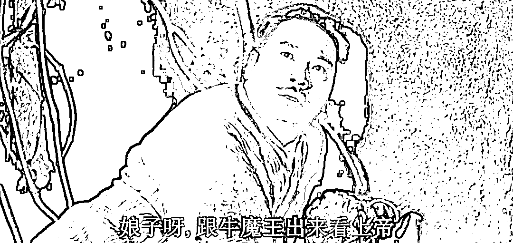

# 教育专家指责父亲带儿子去工地上体验搬钢筋，错了吗？

> 原文：[`mp.weixin.qq.com/s?__biz=MzU0MjYwNDU2Mw==&mid=2247508148&idx=1&sn=f1921d978e541b48565b01cf0c3d04ae&chksm=fb1accc8cc6d45debc2cbffb8de6a874b14c616bf32f27408de5a05a8853c384349fda1965cd#rd`](http://mp.weixin.qq.com/s?__biz=MzU0MjYwNDU2Mw==&mid=2247508148&idx=1&sn=f1921d978e541b48565b01cf0c3d04ae&chksm=fb1accc8cc6d45debc2cbffb8de6a874b14c616bf32f27408de5a05a8853c384349fda1965cd#rd)

在广东深圳打工的杨先生，因为 9 岁留守在湖南老家的儿子厌学，于是就带他去深圳的工地上体验搬钢筋。

他们一家 10 月 3 号抵达深圳，4 号给儿子找来了合适的工装，到了 5 号下午，儿子就表示太累了，要回去读书。

于是假期工地游结束，7 号孩子被送回老家，8 号又开始了上学。

某教育研究院院长表示，这个家长的教育方式是错误的。你这样会让孩子养成鄙视体力劳动的价值观，不利于他的身心健康。

.......

读者问我的问题很简单，无非专家与父亲，谁的教育是正确的？

首先，专家的意见其实就是我常说的那个悖论，在真话与正确的话之间，我们该怎么选？

**真话不一定就是对的，对的也不一定就是真的。你千万不要以为对的就是真的，真的就是对的，不一定。** 

什么是对的？对的很多时候是一种想象，或者说期待。我期待这样，应该这样，应然。

什么是真的？实际上怎么回事，当下怎么回事，现实怎么回事，实然。

实然与应然之间是有时间差的，这个时间差可能是三五年，也可能是三五千年，三五万年，也许直到人类都不存在了，应然还没有实现，完全有可能。

我一直说，悟性高的特征就是对时间的敏感。一句话说出去，他马上就能够意识到这是在说五十年前的事儿，五年后的事儿，还是五百年后的事儿。

大部分人是不具备这种时间敏感性的，他们连空间敏感性都没有。

[就比如我那天举的例子，吃饺子蘸不蘸酱油](http://mp.weixin.qq.com/s?__biz=MzU3NDc5Nzc0NQ==&mid=2247520578&idx=1&sn=e255a9981b0be3662b52255f99959c48&chksm=fd2e339cca59ba8a8fb7d0612c9d12af1f9dfd6cb21c9a9bf56ebb718cee692b2d183a2cf165&scene=21#wechat_redirect)。他没有空间敏感性的，他无法意识到这个世界上有 70 亿人，不是只有你家附近的几个人。

如果这个都不可能理解，那更不可能意识到人类其实分割成几千个团体，在数千年的历史里各自演进，就像葡萄酒和白酒本身就有很大的差异，何况还各自经过了不同的时间的作用。比如 82 年的葡萄酒和 92 年的，就不是一个味道。

你比如职业的地位。

职业的地位是演化的，并不是固定的。工人地位最高的时候，是六七十年代。

那时候工人的社会地位绝对比今天码农的地位要高。六七十年代你嫁个工人，和你今天嫁个码农，没什么实质性的区别。

今天码农与富士康的普工，你选什么？你会选择做后者吗？

那不就结了？如果我们非要蒙着眼睛，说阿里的码农与富士康的普工都是劳动，这话没有错。

但是，人们的选择或者说倾向性已经表明了态度。

不需要别人的眼光，不需要。

阿里是码农里的大厂，富士康是工人里的大厂，大厂 VS 大厂，我们就让双方的职工自己做选择。

有一个算一个，你去阿里做调查，P6~P7 的这些基层码农，你问他们，去富士康流水线上做普工，愿意吗？

同样，反过来再做一次抽样调查，富士康的普工，你问他们，调你们去阿里做 P6~P7，愿意吗？

我告诉你，回答愿意的人，都能上热搜，你信么？

所以没必要闭着眼睛说瞎话，说什么工作不分 369，那是不可能的。

哪怕在上世纪六七十年代，工人地位最高的时候，也不是这样。

这话是我小时候，和我奶奶之间私底下讨论的。

我问她，电影上说六十七年代读书不重要，那时候人们都不喜欢读书，也不大看得起知识分子，觉得做工人最牛，是这样吗？

老太太不屑一顾地反问，到底是一级教授薪水高，还是八级钳工薪水高？

别说一级教授，四级教授他也比不了，副教授他也比不了。那是工人地位最高的时期，也是知识分子地位最低的时期。

不要完全相信影视作品里的描述，那只是一个侧面。

读书人是吃了两天苦，问题是，回顾几千年，一共也就吃了两天苦嘛。

不要因为个别影视作品的放大，就以为那个时期的人真以为读书不重要了，瞎说。

别说念不念书会分 369，念过书难道就不分 369 了？

不分 369，为什么会招聘启事上会对学历有要求？

不分 369，为什么同样的学历，会分 985，211 乃至一本二本？

不分 369，都是博士，都是清华的博士，为什么还要第一学历歧视？

即便都已经毕业了，已经工作了，已经是同一个岗位了，难道就不分 369？

你觉得那个一天写了十人份，还没有 BUG 的码农，和那个一星期都憋不出一行的码农，别人看他们的目光是一样的吗？

后者能被无形的目光给鄙视死。就像一天卖十套房的中介和半年都开不了一单的中介的差距。

这就是真实的人生，你告诉我怎么叫健康的价值观？

专家就算能说服一个父亲，他能说服全世界吗？

今天专家替这孩子说服他爸，等他长大了，专家替他说服丈母娘？说服老板？说服得过来吗？

你注意，我并不是在反驳专家。专家说的是对的。

问题是，人类一直是错的，你能怎么着？你以为你上帝啊？

那么反过来说，难道这个父亲就是对的？

这个问题本身就是错的。我前面说过了，专家占着应然，应然就是对的，只不过那个对的很迂腐，在你我有生之年，根本不会发生。

那么这个父亲有没有占据实然呢？或者说，你甭管他的教育方法对的错的，有没有效？

我认为是无效的。

你不要看这孩子当天大哭一场，表示工地太累了，他要回去读书，就以为奏效了。

如果奏效真这么容易，我明天就可以给你把 70 亿人全都培养成自律的，奋发的，上进心爆棚的。

很简单，你带他们参观下有钱人的生活，再带他们体验下没钱人的生活，收工。

教育有这么简单吗？太天真了。

我前面说得很清楚，人与人之间悟性的差别，很大程度体现在对于时间维度的掌控。

**既然大部分人意识不到时间这个维度，你觉得这种教育奏效，能持续多久？** 

金鱼的记忆只有七秒，人类的记忆，能有七天就不错了。

这就叫记吃不记打，七天之后，你又需要再带他去一次工地，重新体验。

**我问你，第二次体验的促学效果还会有第一次那么好么？** 

不会的，能有一半就不错了。所以第三次体验，效果还会减半。

你就这么每周带他去一次工地，要不了仨月，会怎样？他就熟悉工地了。他慢慢慢慢的就认命了，我不是读书的料，我还是去工地吧。

读书的痛苦没法下降，可是去工地的痛苦，是一次比一次低的。

所以当学霸可没那么容易，因为学习并不是一天就能见效的。

学习不是即时反馈的游戏，它有一个漫长的准备期，然后才开始有回报，这明显是不符合人性的。

人性需要即时反馈，我做一天，你给我一天的工资，然后我去打游戏，5 分钟内肯定能刷到装备。

工地的工作模式和游戏的设计都是参考了人性，充分顾虑到大部分人是不可能掌握一整段时间的目标的，所以给你切割了，让你每个阶段都有回馈。

**做学霸要比去工地搬砖难得多，因为需要你熬过一个漫长的没有收获的，单纯付出的这么一段暗黑岁月。** 

做老板比做学霸还要难得多。因为做学霸的套路是既定的，前人论证过的。做老板的道路是没人知道的，你要临时摸索。

你可能很努力很努力的挨过了暗黑岁月，然后迎面而来的是一个坑，破产了。

你也可能很努力很努力的挨过了暗黑岁月，像学霸一样进入稳定发展期，然后忽然行业变迁，海上起风浪，直接给你扑杀了。

所以学霸没法用这么简单粗暴的方式去养成，没用的。你要改变这孩子的习惯，或者说，重新帮他养成习惯。

你要让他养成预习复习的习惯，天天如此，最后让他变得像吃饭喝水一样自然。

老师每次家长会都会讲这句话，**好习惯的养成是学习的关键，从小养成。**

这个家长只是因为工作太忙，他的孩子是留守儿童，他没有时间陪伴在身边，从小培养孩子良好的学习习惯，假期这么短，又急于求成，于是只能用这种看似有效，其实效果持续不了一星期的办法。

至于老板，那是没法培养的。他首先得有愿景，愿景多大，未必成就多大，但是没有愿景，就很难有动力一次次与大海的风浪博弈。

如果他的愿景只是豪车美女，那么等他有钱了，他就没有动力了。

如果他的愿景更大，才有可能推动他继续往前走，而不是小富即安。

你比如很有名的，我们打小都学过，为什么什么而读书。