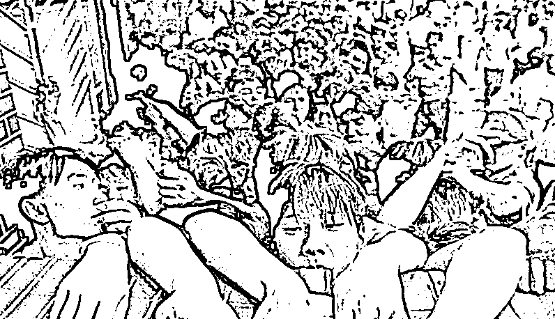

# 劳荣枝不意味着美女爱流氓

> 原文：[`mp.weixin.qq.com/s?__biz=MzU0MjYwNDU2Mw==&mid=2247507389&idx=1&sn=07ef3b054fbfe0b8206a9a091b5bf056&chksm=fb1ab1c1cc6d38d7c0eb2f246994432b3601dde17861ffeb48eb7da3dfcc920a5eab92d3d248#rd`](http://mp.weixin.qq.com/s?__biz=MzU0MjYwNDU2Mw==&mid=2247507389&idx=1&sn=07ef3b054fbfe0b8206a9a091b5bf056&chksm=fb1ab1c1cc6d38d7c0eb2f246994432b3601dde17861ffeb48eb7da3dfcc920a5eab92d3d248#rd)

劳荣枝案二审，很多人在问我，她到底是不是傻白甜，她到底是不是无辜的。

她一审的时候我就写过，凭直觉我是一点都不相信她的每一句话。

就像殷素素对张无忌说的，越是漂亮的女人，越会撒谎。

你看劳荣枝在一审时说过什么话？

1、我除了炒股，没有做错过什么。

2、你们可以说我不是一个优秀的人，但不能说我不是一个善良的人。

好精明。

第一句话是企图引起共鸣的，针对的对象就是共鸣。我和你一样，看，你该支持我吧？ 

第二句话还是企图引起共鸣的，这世上大部分人都不喜欢优秀的人，都喜欢善良的人。因为优秀的人可能占他们便宜，善良的人可以被他们占便宜。 

最好的猎人都是伪装成猎物的，这两句深谙人性的话一扔出来，我就知道顶级猎手来了。

不过话说回来，这么优秀的一个人，这么懂人性，这么会操控预期，又这么漂亮，为什么走上邪路？为什么和法子英这样的杀人行凶的流氓混迹在一起，一个色诱，一个行凶？

她没有读过书么？读过。74 年生，考上了师范学校。按说在那个时代，她完全可以走一条光明大道。 

于是就有人跟我讲，美女与流氓是绝配，就像那句话，男人不坏，女人不爱。 

真的是这样吗？ 

从来不存在美女喜欢混混这种事，只存在什么？只存在一个话题，那就是选择范围，俗称你能够看见多大一片区域。

我曾经举过一个例子，为什么过去的婚姻稳定？ 

**因为农耕文明下，人的移动范围太小，人的接触面太少，人的信息获取太困难，人的比较范围太窄。**

村里的小芳为什么喜欢大牛哥？你要看剩下的候选者是谁？ 

A，老光棍张三，今年 50 了。 

B，二混子李四，干嘛嘛不成，吃嘛嘛不剩。今年 35，身高一米 5。 

C，还有一群傻兮兮的光屁股少年，都还在玩泥呢，有的流鼻涕，有的懦弱，有的呆萌，都管自己叫姐。

你不选大牛哥选谁？告诉我，下面这张图里，不选秋香你选谁？

就这么简单的道理。 

许晴之所以喜欢冯小刚这个老炮儿，不是他有多出息，而是因为她看过冯小刚年轻时男版的“秋香对比图”。

冯小刚演的那个老炮儿，穿着将校呢的军大衣，挥舞缴获的军刀，这就是那个年代大院子弟的装备。

是他打架的英姿映入许晴的视野就拔不出来了吗？不，是他的身份。

许晴年轻时那个年代还没有商品化，更别提互联网。一个姑娘能够见到的人群是很有限的。

你觉得那个穿着将校呢的军大衣，挥舞着日本军刀，肯为了你打架的大院子弟吸引你，还是那个土不拉几的吸引你？  

你的比较范围就这点呀。 

今天你看起来很傻，当然很傻。你拉大到一个全球的视角下，当然很傻。 

年纪轻轻的，没有人生目标，糊里糊涂地混日子，跟人打架斗殴，傻不傻？这样的人你也能看上？

可问题是，回到几十年前，在许晴的视线里，除了这种，还有什么选项呢？

我说过，我们的变化是逐渐的，时间上和地域上。也许深圳 80 年代就开始变化了，但是到了劳荣枝生活的那个环境里，可能要 90 年代，到某些地方，甚至要 2000 年以后。

是什么把大家的目光一瞬间拉到一起了？是移动互联网。你注意我的措辞，移动互联网。

我 99 年的时候在互联网上，棋牌室或者聊天室里只能遇到大学老师，学生，隔了一年，2000 年，我就能见到进城务工人员了，有人在工地上干了一天，夜里去网吧消遣下。 

你会发现互联网上的人员变化很明显。但是你注意，覆盖面仍然很窄，大多数人那时候还是没有私人电脑，有网吧的地方，才有网民。

什么时候几乎除了特别老的老年人之外，所有人都上网了？是最近十年的事儿了。 

所以人们彼此看见的范围一直都不同的。如果把人分为 A~Z，有的人一辈子只能看见 EFG，有的人一辈子只能看见 XYZ。 

在互联网到来之前就是这样，大家是被彼此隔绝的。我们可以看到每一个字母，甚至看到全世界的每一个字母，是互联网带来的。

所以互联网的原住民们是无法理解电影当中许晴姐姐的。

一件事有两个面，60 后，70 后最大的优势是抢占了先机，他们年轻的时候更容易发财。

可是，反过来讲，一旦出生地不好，他们那代人很容易被埋没。因为缺乏看见的途径。

60 后，70 后如果你很早就去了北上广深，也许你就发财了。反过来，如果你待在很偏远的地方，在互联网没有到来之前，你看都没看见过，你的思想怎么随之改变？

也许你还觉得穿着军大衣，拿个武士刀才是你的人生目标呢。

80 后是远不如前辈们机会多，可是年轻的时候赶上了互联网，你的眼界打开了，你的目标树立了，你最起码清楚，我这辈子要干嘛，至少，你不会被什么军大衣，武士刀耽误了。

我们今天看印度，是俯视的。你让哪个同事出差去印度，就像要他命一样。他管你要的艰苦补贴，也许比派他去阿富汗的战地补贴都高。

其实印度没那么糟糕，印度的生活水平，城市水平整体上就像我们 20 年前，2000 年左右。

而就在 30 年前，我们的人均 GDP，还不如印度呢。总想回到过去的人好想想了，你连出差印度都扛不住，还回到过去呢。

我们出差印度的同事一堆要求，只能喝大品牌的瓶装水，刷牙洗脸都只能用瓶装水，必须住五星级酒店等等。

你其实回忆下，90 年代有部电视剧叫《打工妹》，那时候港澳同胞前来内地投资办厂，她们也是随车携带整箱瓶装水的。

那种心态和你今天出差印度没有任何区别。

这就是我说的，选择的范围。

在没有互联网的时代里，一个人眼光的提高是需要运气的。你生在广州，你就知道去深圳了，你生在上海，老八股的时代，大家是这样买股票的，看到了吧？

那年月，抢到就是赚到。

所以我说选择与选择范围有关，不是美女爱流氓，而是特殊时期美女的选择范围太小。 

你根本没有见过世界你哪来的世界观？小芳哪怕买张火车票去了富士康，她都会见到无数比大牛哥更优秀的年轻人。 

这就叫看见的力量。 

当然，看见不一定能把握。 

零几年的时候，有个跟我学操作系统的应届生小弟，某一天，他跟我说，他不想做研发了，也不想做我们这个行业了。

我以为他要去互联网行业，虽然那时候互联网在低谷，但作为 ebay 时代的电商深度爱好者，我始终很看好互联网。2014 年之前，大部分离开我的手下，都被我推荐，或者劝说去了互联网大厂。

只有这一个例外。 

这小伙跟我说什么呢？他说他喜欢传统行业。他觉得那些工厂里的销售，每天穿着西装革履，拎着笔记本电脑，奔走在各个机场的样子，很帅，很成功。

而我们这些人呢，冬天穿着格子衫，夏天穿着裤衩，还老穿拖鞋，一看就是 loser。 

我像看着外星人一样看着这孩子，一句话都说不出来。 

他太年轻了，小时候接触的就是爸妈与家里亲戚那些人，后来读书没离开过学校，直到毕业。我们还没有足够的力量把他脑子里原生家庭的烙印洗掉，来不及洗，人家就走了，转行了。 

回老家，中部的某个省会，去做了一个传统行业的销售。因为他说，他见过最成功的人就是二叔，二叔是穿西装的某个厂的销售。他爸是种地的，只有种地的才会穿的和我们一样，穿裤衩，拖鞋。 

后来的结果当然很简单，行业红利也没有抓到，房地产红利也没有抓到。 

很遗憾，即便 A~Z 摆你面前，也有可能会有个别人选错，有时候选错的理由让人无语。 

他哪怕当年看过《我爱我家》也会知道，英达客串的美国电脑公司老板是穿汗衫的，旁边那个西装革履的才是马仔。 

老傅一家买电脑，就是为了巴巴的等着中 1 万美金的大奖，那一年 1 万美金在北京可不止买一套四合院。

毛衣上破个洞是比尔盖茨留下的传统，那时候他早已是首富，世界的。我本以为这孩子就算没听过中国的财富神话，至少也该听过美国的。 

遗憾的是他都不知道，他到两千零几年了，居然还以为刚下飞机，西装革履的才是大佬。 

所以选择大于努力是有前提的，前提是你真的弄清楚了每个选项，而且你是有机会看到的。 

如果各行各业，每个圈子的高中低三档，人家明面儿上赚多少钱，实际上到底赚多少钱，每个细节你都门清。你选起来就非常容易，你很难选错。

可是反过来，如果你只能凭什么有限的几个二叔二舅跟那儿瞎猜，那你太难了。

说穿了就是这点事儿，人世间最大的不公平就是信息不对称。他知道你手里的那个碗拿到苏富比卖多少钱，可是你不知道，于是你 5 块钱卖给他了。 

今天的美女要比劳荣枝容易很多，最起码，A~Z，表面上你都能看见了，你不需要在一个很小的范围内做选择了。 

问题是，你看见全部了吗？没有吧。A 不一定是 A，Z 也不一定是 Z，这就是背调的价值。

可背调是要花钱的，于是你发现信息与资本在结合。俗称巴依老爷越来越聪明，越来越像阿凡提了。