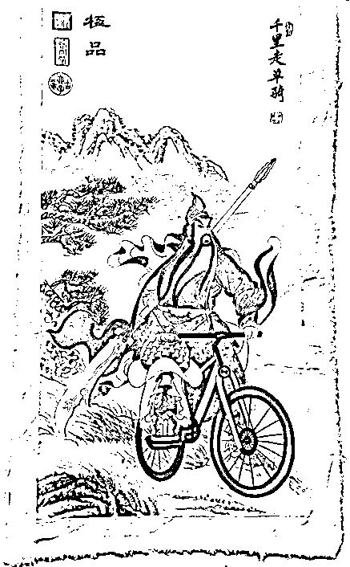

# 二郎神杨戬这个二舅是治不了外甥沉香的精神内耗的

> 原文：[`mp.weixin.qq.com/s?__biz=MzU0MjYwNDU2Mw==&mid=2247507363&idx=1&sn=bbaee8182b8ea3314a30955c8ff52da3&chksm=fb1ab1dfcc6d38c9843b41cb6459ebbbb9e178fc91bd5b4a7e67f7238327805ec7c51d1538b6#rd`](http://mp.weixin.qq.com/s?__biz=MzU0MjYwNDU2Mw==&mid=2247507363&idx=1&sn=bbaee8182b8ea3314a30955c8ff52da3&chksm=fb1ab1dfcc6d38c9843b41cb6459ebbbb9e178fc91bd5b4a7e67f7238327805ec7c51d1538b6#rd)

很多人让我写《新神榜：杨戬》的影评。有心的读者会发现，追光拍过的动画片，我评价都不太好。

不是我有意见，我没意见，看到国产动画片的特效，镜头，画面，甚至水墨的意境这么好，我也非常高兴。 

但是怎么说呢，我发现我们失去了最重要的能力，讲故事的能力。 

讲故事并不是说你一定要去迎合当下的思潮，你这么左迎合，右迎合，迎合到最后，失去的是自我。 

你失去了一个讲好中国神话故事的机会，你失去了一个构建中国神话体系的机会。 

神话体系是需要构建的，神仙不过是个 IP，IP 是需要加工的，这些加工最后要能够基本对得上。 

你看日本人就很会讲故事，他们讲的不是他们的故事，是我们的故事。

你比如三国志系列，吕布武力一哥的地位是不可改变的，下面是张飞，马超，关羽，赵云等，不同的版本会有变化，但这就是第二梯队，然后是典韦，许诸那些人。

每一代可能有微调，但是基本架构保持不变，他们就成功的输出了一个三国世界。 

三国演义是我们的小说，三国是我们的历史，但是日本人在开发三国志这款游戏上做得很成功。 

你把世界构建出来，你就可以一代一代的推产品，俗称躺着挣钱，还是挣全世界的钱。 

我们有很多财富的，你比如金庸的小说，古龙的小说，有没有为此构建一个金庸世界，古龙世界？ 

是有过金庸群侠传，但太粗糙了。也许当时是个亮点，后来引起很多人怀旧。但是那只是一时间。 

因为你的出发点不是构建一个世界，你的出发点仅仅是说抢占了一个先机，找到了一个亮点，挣了一笔钱。

这是很多时候我们的商人短视的地方。

一个金庸的世界你构建出来，可以吃一辈子的。光荣公司把三国志和信长系列吃了几十年，上个月还在推出新版本。 

这就是我们的问题，真的很遗憾。就像家里有矿，结果采得一塌糊涂。

在这一点上，有时候还不如某些网文作者，我忘了是谁。反正我以前曾经看到过好几个写网文的。

他们都各自构建过一个宏大的神仙世界，把我们古代传说中那些神仙，都串起来了。

你比如在某个网文小说构建的神仙世界里，最大的是鸿钧，先有鸿钧后有天。

然后一气化三清，就是元始天尊，灵宝天尊，道德天尊（太上老君）。 

接引道人，就是如来佛祖，是鸿钧的弟子。至于玉帝，是鸿钧的童子，类似金角银角大王与太上老君的关系。

当然，这是某个网文小说里构建的神仙世界，与很多我此前看到过的其他古典小说里是不一样的。

你比如有人说鸿钧不是最大的，最大的是昊天。

也有说最大的是创始元灵，他有四个徒弟，分别是盘古、鸿钧、女娲以及如来的师父，什么青莲。

不管怎么说，你都是先构筑了一个神仙世界，这里面有两条脉络要弄清楚。 

一个是谁先谁后，一个是谁强谁弱。

金庸的小说连贯性很强的，段誉是南帝的爷爷，武功的传承也都很清楚，黄衫女出场肯定会古墓武功，一阳指就绑定了大理段氏。

这个很重要，你不要加入很多乱七八糟的因素，那些没有意义。 

就像关云长千里走单骑，你非要说他骑的是自行车，还是捷安特的，这没好处。 

最大的弊端在于你讲的故事最后人家记不住。 

你去看三国志游戏，吕布，方天画戟，关羽，青龙偃月刀，张飞，丈八蛇矛，赵云，青釭剑。

这不叫没有创新，这恰恰是最好的讲故事手法。 

故事的本质就是重复，你重复的多了，IP 形成了，你才能展开周边的产业，比如你开发一款游戏，人家选择了诸葛亮，就会愿意花钱买羽毛扇，花钱买四轮车。 

玩家也会想，羽扇纶巾，我家亮哥怎么能没扇子呢？ 

实际上羽扇纶巾是周瑜的形象，起码苏东坡写词的时候，羽扇纶巾，谈笑间，樯橹灰飞烟灭。说明那个时代，诸葛亮羽扇纶巾的 IP 还没有形成。

我们这几年的动画片，最大的缺点就在这儿。 

制作成本是越来越高了，画面是非常精致了，遗憾的是，你讲过的每个故事，我都记不起来。 

我记不起来的原因是对不上呀，你回回不一样呀。

你想想，假如关羽第一次出场绿头巾，第二次黄头巾，第三次戴帽子，第四次头盔，试问谁还能记得他？ 

关羽绿袍绿头巾的形象深入人心，是每一个刻画者重复之后产生的效果。这中间有任何一个人不守规矩，这个 IP 的塑造就失败了。

什么杨戬吹着口琴爵士乐，还有暗黑破坏神系列里的传送门，就像当初的哪吒骑摩托，别人可能第一次看，觉得你很有想法，但是很快就会忘光了。

其实我非常明白剧组为什么让杨戬吹爵士乐，爵士乐是 19 世纪，种植园的黑人表达抗争的一种方式。 

剧组也许是想要迎合年轻人，想要治愈年轻人，毕竟杨戬也是个舅舅。 

二郎神二郎神，他还真是二舅。 

杨戬他们家，是一个具有反抗精神的家族，他曾经劈山救母。

原因是杨戬的母亲是玉帝的妹妹，嫁给了凡人杨天佑，所以玉帝把他母亲幽禁了。

后来杨戬的妹妹也嫁给了凡人，杨戬把他妹妹也给幽禁了，这就有了宝莲灯的故事。外甥学着舅舅，也劈山救母。 

这个故事很好，如果放在古代，的确具备一定的反抗精神。 

你比如杨戬听调不听宣，拒绝了封神榜，带着梅山六兄弟和一千二百草头神，执意待在灌口，灌口二郎神。

但是你放在今天看，并不着调。 

杨戬的故事放在古代社会下，涉及两件事，婚姻与工作。 

古代婚姻是包办的，结婚是两个家族的事，不是两个人的事。所以才有了杨戬和他外甥两代人的劈山救母。 

这个故事你拿到印度去，是有市场的。印度至今还有荣誉谋杀，就是高种姓的女子嫁给了低种姓的男子，高种姓家族的人以捍卫荣誉为理由，采取谋杀的犯罪行为。

但是这东西在我们这里，还能体现什么反抗精神？ 

哪有什么婚姻是强制的，你会发现到处都是大龄未婚的男女。 

工作也是一样的，古人如果想像司马懿一样拒绝出仕，是需要不断的寻找理由，作假，甚至谋杀婢女都要伪造理由。 

今天想离职谁能拦你？ 

你知道当下的年轻人，他们最想要的是什么？是一份不阻碍你离职的工作吗？ 

不，他们最想要的，是一份不会主动裁员的工作，否则就不会出现云南一对夫妻考编上百次的传说了。

所以你觉得这个故事有治愈的能力吗？有吗？ 

今天有哪个首富的妹妹要下嫁？或者说有一份前途光明的编制特招，你就是不去，非要在灌口摆摊卖煎饼？听调不听宣？点外卖可以但是想把你收编了，不行？

你想象一下，有没有这些场景？ 

没有。

正是因为没有， 所以就得改编，于是小编只能瞎编，涉及剧情，我们不在这里剧透，反正被改编的一塌糊涂。

最后只为了一件事，就是杨戬这个二舅，治愈了他外甥沉香的精神内耗。

有意义么？ 

我小时候并不喜欢三国的故事，因为老师总喜欢问，刘备反映了什么精神，张飞体现了什么意义。

我不是说语文的阅读理解不应该有中心思想，但是我觉得，如果每个故事都要这么套用，那孩子们慢慢地就不喜欢阅读了嘛。 

他为什么不能享受故事本来的样子呢？ 

就像我喜欢三国这段历史，是玩了三国志系列游戏之后，我发现还有另一种视角，比如你问小孩子们，你们知不知道关羽骑的什么马？这匹马以前是谁的？再以前又是谁的？

我没有压力了，所以才有了兴趣。 

思潮这个东西，是变的，你如果想要追着讨好，或者追着治愈年轻人的精神内耗，你是追不到，也讨好不了的。 

年轻人其实需要的不是讨好，他们自会长大。

[我们提到过那个兽医出身的大佬的故事。](http://mp.weixin.qq.com/s?__biz=MzU3NDc5Nzc0NQ==&mid=2247519808&idx=1&sn=cab393ffdb62773fb0ccffe4abaddfa8&chksm=fd2e2c9eca59a588a146f0759816bcf529e5817c9cc4cc24e0152cf86b852eaa8679b9769e25&scene=21#wechat_redirect)不同的时间点下你去看他，评价是不一样的。 

他曾经是个非常强的开拓者，你回到那个历史节点下，他就是对他所在的行业做出了很重要的推动作用，这一点，你今天去看他们行业的大事记，仍然在年表里。 

那个时候，大家都想创业，他肯定是个偶像级的人物。 

他早年进去过，短暂的待了待又出来了，继续做弄潮儿，这个过程在那些年里，大家是不稀奇的。 

现在，他又进去了，你站在现在这个节点看他，就是野蛮生长。

是的，瑕不掩瑜，可是反过来，瑜也不能掩瑕呀，错了就是错了，一码归一码。

如果他能够熬到再放出来，真的学某位老前辈去种橙子，那或许人家又成励志榜样了。 

这个也很正常，因为经济不景气的时候，大家发现钱不好赚的时候，很需要励志的形象，你又发现他的优点了。

你发现没有？不是他变了，是你解读下的他变了。 

人类是活在自我编织的意义之网上的生物，很多东西的解读是你根据自己当下的需要去做的。 

可是随着时间，你的需要是变化的。你看到瑜是你想看到瑜，你看到瑕是你想看到瑕。

其实人身上有瑜也有瑕，如果你总是盯着这些，那么今天杨戬是正面的，他是劈山救母的，明天他就是反面的，他是阻碍外甥劈山救母的。

干嘛，今天杨戬搞爵士，明天搞朋克么？

艺术这种东西，不要这样去搞。这样搞，搞着搞着 IP 就没了。最后孩子们还以为我们的哪吒本来就是骑摩托的，我们的杨戬本来就是吹爵士的。

回头他们把下面这张画当真迹给你买回来的时候，你就呆若木鸡了。

