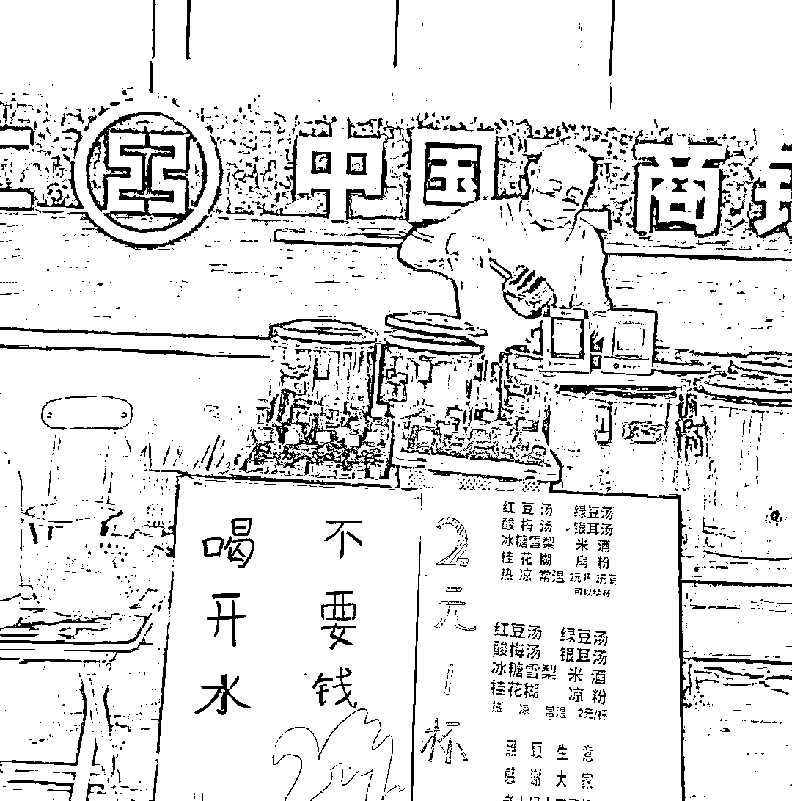
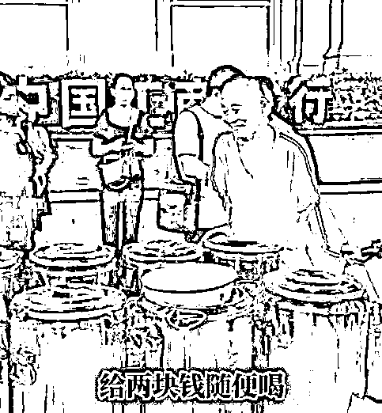

# 六十七、岁的糖水爷爷是被逼走的么？

> 原文：[`mp.weixin.qq.com/s?__biz=MzU0MjYwNDU2Mw==&mid=2247507315&idx=1&sn=c17d59f125b8af7164751bcf4217bffa&chksm=fb1ab10fcc6d381967fbb2260a13179a155994d013e54a69fb933386185e9687ff9119898b90#rd`](http://mp.weixin.qq.com/s?__biz=MzU0MjYwNDU2Mw==&mid=2247507315&idx=1&sn=c17d59f125b8af7164751bcf4217bffa&chksm=fb1ab10fcc6d381967fbb2260a13179a155994d013e54a69fb933386185e9687ff9119898b90#rd)

糖水爷爷原名谢永安，河南人，30 多年前，来到武汉打拼，打过很多工，卖过很多菜，做过很多小本买卖，最后选择了卖糖水，一卖就是 17 年。 

这 17 年来，他一共只涨了一次价，从 1 块钱一杯涨到了 2 块钱一杯。2 块钱无限量续杯。老人孩子连两块钱也免掉，开水是不要钱的。

正因为物美价廉分量足，糖水摊子被顾客拍成了视频发到了网上，一下子火了，关注者甚多。 

从此各种谩骂就开始围绕这个老人，比如他卖糖水的时候没有戴口罩，也没有戴手套，他的那些器具，摆放的也不整齐，质疑这样的卫生管理是不过关的。 

不只有糖水，还包括人身攻击。说他这么大年纪出来摆摊，子孙肯定不孝，而子孙不孝只能说明他自己教育得不好。所谓可怜之人必有可恨之处。

无休止的谩骂下，老人的子女很为难，老人的孙子在痛哭，于是老人决定关掉摊子，离开奋斗了三十多年的武汉，回老家河南。 

事情就这么一个事情。 

互联网上围绕这件事的说法基本上清一色地集中在网暴这个话题上，是网暴逼走了一个善良的老人。 

我不知道大家有没有注意到，但凡此类事情，互联网大 V 们的意见统一的出奇，为什么？ 

原因很简单，最大的网暴受害群体，正是各路大 V，所谓的意见领袖。 

你只要说话，就一定有人骂，甚至你不说话，**只要你能够被看见，就一定有人骂**。 

我们不管骂你的人是不是对的，骂的内容是不是真相，被骂这件事，是能够得到数学支撑的。 

一个人，一件事，摆在互联网上，被一万个人看见，总有一百个人想要留言，想要说点什么，那么无论如何，这里面总会有一个人是出来骂你的。至少。 

这里没有为什么，就是单纯的概率。 

概率告诉你，人多了什么事儿都有，所以网暴是必然的。除非怎么样？除非你禁止留言。 

没有留言才能没有恶意留言，只要有留言，就一定会有恶意的。

这就是为啥我说，各路大 V 才是真正的网暴受害者，他们才是每天生活在风口浪尖上的人。 

但是，网暴受害者就仅仅是受害者吗？当然不是，一件事有两个面，**一个人最大的缺点往往是他最大的优点，一件事也是同样的。**

网暴的受害者同时也可以是网暴的受益者，只要你愿意加入这个行业，那么受害与受益的转化往往只有一瞬间。 

这个老人是单纯的受害者那是因为他并不是互联网从业者，如果他愿意做个网红，他马上就会发现，那些骂他的，才是爱他的。 

流量这东西是不分爱你的，恨你的，爱恨都是流量，没有区别的。 

事实上，如果做个统计，你会发现，那些黑粉才是好粉，从钱的视角看，10%的黑粉也许给你创造了 70%的收益。

为什么？原因很简单，因为黑粉是最能够激起争议的。 

有人夸你，不一定有人应和的，但是有人骂你，通常不仅有人应和，还有人会反驳。 

一进一出，两份热量，谁贡献的？就是那个骂你的人贡献的。 

有人看到这里不理解，会问我，怎么从来没有在咱们的留言区看到过攻击我的观点？ 

当然有，只是助理挡掉了，你没看到而已。 

站在单纯流量运营的策略下，放出来攻击你的留言，甚至给对方置顶，才是明智的。 

因为这么做会挑逗其他没留言的黑粉，他们会以为自己的攻击奏效了，会跃跃欲试。

另一方面，也会激起铁粉的反感，他们会浮出水面保护博主，展开反击，双方的战火被博主撩起之后，他就可以坐收流量了。

这就是自媒体运营技巧，很多大 V 都是这么玩的。 

**我之所以没有采用的原因非常简单，因为这种读者间的互殴，是能够带来流量，可是也会使得我的观点变得无足轻重。**

你想嘛，如果课堂上乱了，大家彼此对骂，骂着骂着还有人记得老师刚才讲的什么吗？ 

自媒体的定位是不同的，绝大部分大 V 都是情绪化的，你仔细看就会发现他们并没有真正意义上的思考，他们只是情绪的撩拨者，就像 BBS 时代的挖坑等着你来灌水。 

所以他们希望撩拨对骂，这对他们有利。

而我们是观点很强势的那种公众号，基本上就是我在说，你在听，不仅如此，我还在试图引导读者聚焦。你只能朝这个方向听，跟着走，别走散了。 

这种定位的公众号，自然不希望下面一群人 PK。流量很重要，聚焦也很重要，定位的不同，使得我舍弃了前者。 

所以我们不是没有被网暴，只是那些各种骂我的观点，没有被放出来，可我仍然会在聊天的过程中，时有时无的提到。

这些攻击我的话，你甭管表现形式多么五花八门，本质上是一个意思。

一言以蔽之，你和我希望的不一样，或者说，你不符合我的预期。 

至于我为什么不反驳，也不会当回事，原因更简单，因为我为啥要和你想的一样呢？

这个糖水爷爷，说到底，他还是在乎。在乎你就输了。 

他本心或者本性上还是把大家对他的评价当作很重要的一个人生指标，这是他和那些同样遭受网暴的大 V 们最大的不同。 

他还是想要得到认同，得到赞许，所以当网民们质疑他的动机的时候，他会伤心，会失望。 

同样遭受网暴，那些大 V 是刻意的，他们知道，你越暴我，我越受益，所以一面痛斥网暴，一面很享受，come on，让暴风雨来得更猛烈些。 

但是这个老人，很显然是动情了的，谁付出了感情谁受伤，这是必然的。互联网本来就是一个只能走肾不能走心的地方。

而且说实话，这个老人他的这个形象在互联网上也是非常难以生存的。 

因为他是一个正面形象。正面形象是很容易坍塌的，为什么？因为**你越好，人们对你的期望就越高，对你也就越刻薄。** 

你看我很少挨骂的另一个原因是因为没法骂，所谓粪土之墙不可垢也。 

人，你站得高，总会有人想要把你往下拉，如果你足够低，你就躺在坑底，谁也没法拉你下来，你已经没法更低了。 

很多人会被骂爱钱，几乎没人骂我爱钱。 

作为职业投资人，爱钱才是本分，不爱钱那是不专业。

很多人会被骂脱实向虚，几乎没有人这么说我。

没谁比日内交易的人更虚头八脑。

做实体的人眼里，搞房地产的是虚的，搞房地产的人眼里，投资人是虚的，投企业的人眼里，巴菲特这种炒股的是虚的。 

当初巴菲特还没有给盖茨基金会捐钱的时候，盖茨痛骂老巴是个只懂得炒买炒卖的无聊的人。 

但是在巴菲特眼里，做日内交易的，就是贼，他多次非常痛恨的骂，说高频交易本质上就是一群没有创造过任何价值，盗取人类财富，寡廉鲜耻的贼。 

所以作为寡廉鲜耻的贼里面的一分子，我天然就具备很多优势，很多事儿都不需要解释了。 

你看就从来没有人问过我，当年技术做的很好，都做到甲方架构师了，为什么不想着技术攻关，不负年华。 

你看也没有人问过我，当年管理做的很好，做到副总了，为什么不想着在科技行业里，真正带出一支能打的队伍，或者做出传世的产品。 

也没有人问过我，本专业一直读到研究生，后来放弃，一门心思从事无意义的事情，可惜不可惜。 

不会有人质疑我的。盖茨在大众眼里就是个资本家，巴菲特在盖茨眼里就是个炒买炒卖的虚妄的无意义的人，而日内交易者在巴菲特眼里只是一群让人恶心的贼。 

那你可想而知，高频交易者在大众眼里是什么。大约还不如一坨翔。

有谁会对一坨翔产生预期呢？预期足够低，骂你的人就少了。你自己的心理负担也小了，事实上你但凡做一丁点儿好事儿，甚至你少做几件坏事，别人都会刮目相看，都会表扬你。

你像很多读者表扬我爱国，以至于我都有点不好意思。

他们说我爱国的理由竟然是因为我是做国际市场的，所谓专偷美国。于是他们就觉得我是侠盗罗宾汉。

做贼做到被夸，也是没谁了。

我做国际市场的原因很简单，最重要的原因是国内很多品种都不支持日内交易。 

你明白了吧？不是我不偷你，市场约束而已。你想多了，我没你想得那么好。 

第二个原因是兔子不吃窝边草。做高频交易难免会惹上官司，一般来说，你惹官司的地方和你生活的地方最好是两个地方，而且是彼此不引渡的。

我曾经解读过某些富人移民的这件事，我说这里面其实也不完全是一个人爱什么，信什么，和他本人的具体处境息息相关。 

你比如他在国内做生意发家，过程难免有很多遗留问题，他有时候就是为了逃避问题移民的。因为他知道自己很多事儿翻出来是过不了关的。

那么你反过来讲，如果一个人是做国际市场发家的，在美国有一堆的遗留问题，屁股也擦不干净，那么他当然不想出国，去了有可能就被人扣了。

我解读过历史上的所谓侠盗罗宾汉。他不是什么大侠，他盗取伯爵们的财富，又怕秋后算账，于是就掏出 1/10 分给村民，以此换取对他行迹的隐匿。 

这是一种生态链，而非什么道德取向。

类似的生态链很常见，很多商人做了很多不光彩的事情，回到家乡，修桥铺路建学校，为什么？他就是想换取村民的保护嘛。 

你看到了，人性很复杂，也很简单，想不通就很复杂，想通了就很简单。

很明显，这个老人是想不通的那种，他没有办法接受林子大了，什么鸟都有，一百个人里面总有一个恶意的。 

所以收摊有什么不好呢？做这种事他自己也赚不到钱，年纪大了，过两天随心随性的舒服日子不香么？ 

我觉得他不是被逼走了，他只是想开了，人间不值得。尤其被架在一个道德标杆的位置上，更难受。借坡下驴，这是最好的退出时机。