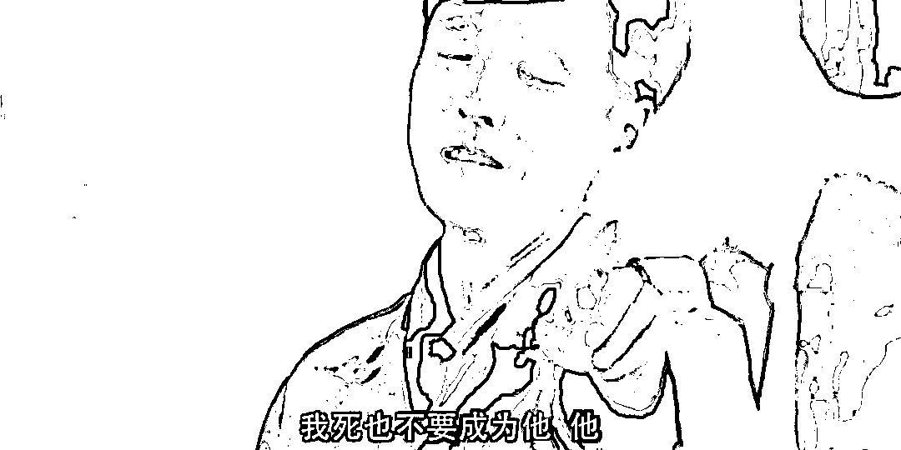
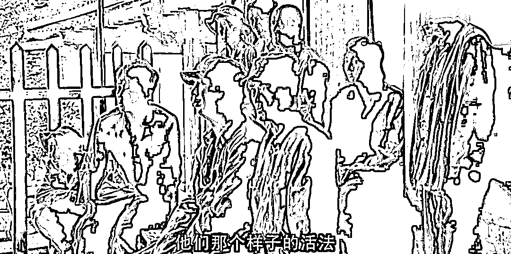
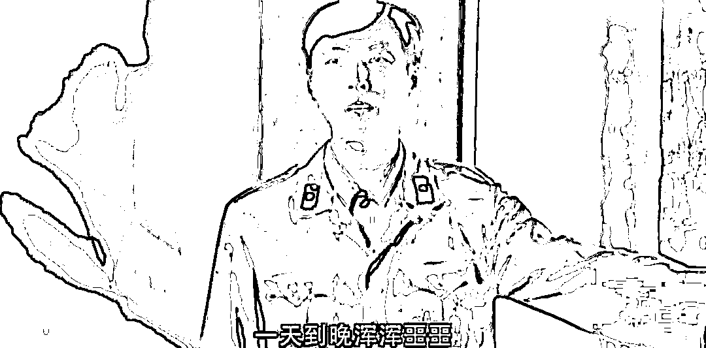
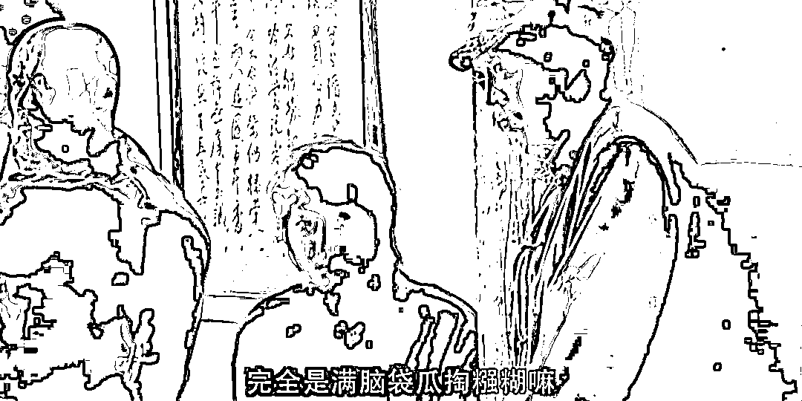
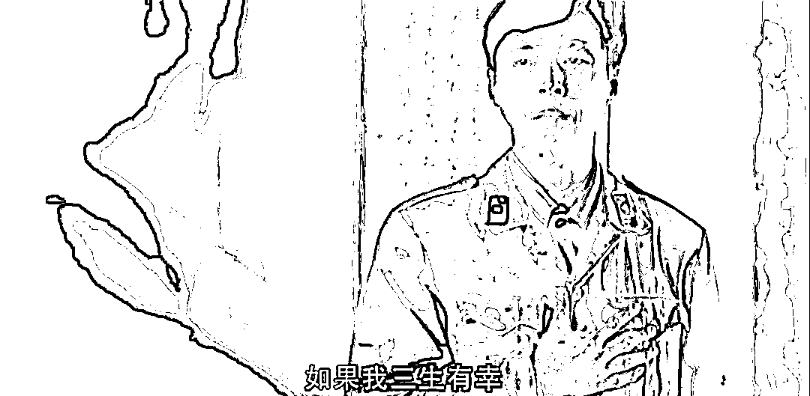
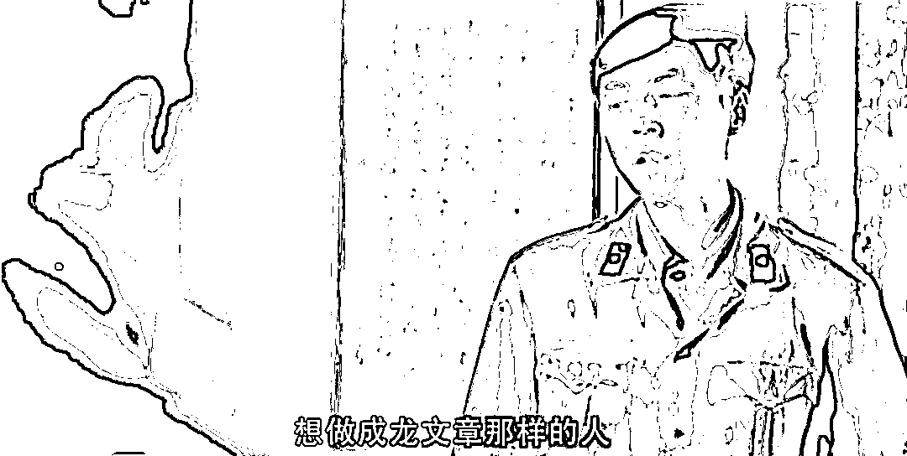
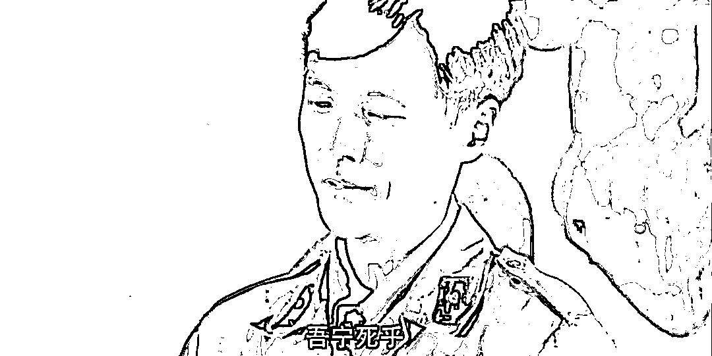

# 赚钱与打炮并不矛盾

> 原文：[`mp.weixin.qq.com/s?__biz=MzU0MjYwNDU2Mw==&mid=2247507262&idx=1&sn=9116010a5bf5360f390fc8ba23946ae5&chksm=fb1ab142cc6d3854e2cd4807d8a288b8cca6bd209335135ca4537cbb8476ef659ce92e3dc780#rd`](http://mp.weixin.qq.com/s?__biz=MzU0MjYwNDU2Mw==&mid=2247507262&idx=1&sn=9116010a5bf5360f390fc8ba23946ae5&chksm=fb1ab142cc6d3854e2cd4807d8a288b8cca6bd209335135ca4537cbb8476ef659ce92e3dc780#rd)

之前小号记忆承载 3 推送了一篇，[有些炮，只有穷的时候才能想怎么打就怎么打](http://mp.weixin.qq.com/s?__biz=MzU3NDc5Nzc0NQ==&mid=2247519520&idx=1&sn=99f872ef854ab4c2303c57b94489f01e&chksm=fd2e2ffeca59a6e83e7f1da360377883b62e9444809c11284dd3b55d1c6d11a523e0d4146398&scene=21#wechat_redirect)。 

有些人跟我讲，人有钱了，就怕死了，就自私了，就没有那么豁出去的精气神了。问我怎么看。

首先，如果你做个测试就会发现，怕不怕死这件事，和你有没有钱，没有多大关系。 

你觉得人有钱了就怕死，和你觉得有钱人大都坏，实际上都是一种暗示，来自影视剧的暗示。 

相比于数据，人更容易相信暗示，这就是市场里预期能够被操控的原因，也是为什么前天昨天，我都反复提到一个词儿，市场避险情绪。 

我一直说，我个人很想顺道打了，假戏真做。问题是，我看看市场避险情绪的变化，就觉得多半不会发生什么。 

这个习惯，最终判断一件事依靠数据的习惯，是培养的。从情绪上你看出来了，我和你一样，我也是相信暗示的。 

老胡很激动，整个内宣都很激动的时候，我个人也是很激动的。如果你要是把按钮交给我，我铁定给你按下去了。

这就是人性，你我都一样。

但我是经过专业训练的，这两天做单的时候，我只能根据数据下单，而不是情绪。

我反复告诉大家市场的避险情绪没起来，与之相反的是，2 号晚上实际上还小幅度回落。

资金比什么都可信，因为资金，尤其是大资金的动向就是由一个个只看数据的职业操盘手，通过计算机辅助在精准的运行着。 

他们不一定完美，但肯定比人性完美。 

我讲这些，就是想告诉你一件事，你的直觉不可靠，从来不可靠。 

如果你相信数据，那么数据会告诉你，好人坏人是均衡的分布在有钱人与没钱人之间的。 

有钱人里面也有好人，没钱人里面也有坏人。同样，有钱人也可能不怕死，没钱的人也会怕死。

**绝对意义上的怕不怕死，和什么相关？和这个人的人生观相关。** 

你的人生观是什么？你是否热爱生活？ 

一般来讲，热爱生活的人是怕死的，因为生活是阳光的，是积极的，是美好的，是有希望的。 

你比如有的人热爱美食，有的人热爱旅游，有的人热心肠。 

那么这个绝对意义上怕死的人，有没有可能不怕死呢？当然有。 

**这就是相对意义上的怕不怕死，和什么相关？和这个人面对的选择相关。** 

抗美援朝战争期间，美国兵并不是少爷兵，他们的供给很充沛是后勤强大带来的，并不是说他们离了那个就不能打。他们能打的。 

他们之所以打不过志愿军有两个原因。

一则志愿军本身就是人类步兵巅峰，虽然武器后勤很糟糕，但是战略战术单兵素质已经达到人类历史上的最高值，本来就很难战胜。

二则美军不理解为什么要跑到万里之外的冰天雪地里作战，他们未见得是怕死，他们只是不理解到底为啥赴死。 

你真把战火烧到珍珠港，美军还是悍不畏死的，但是战场选错了。他们当然没有士气。 

那么反过来，志愿军是在家门口打，士气自然高昂。 

我并不认为志愿军里面大部分人是绝对不怕死的，我不认为是这样。我认为他们当中大部分人是热爱生活的，是积极乐观的，是向往建设家园，是向往日后美好生活的。 

他们怕死，可是他们不能怕死，人家打到门口来了。所以他们表现出了大无畏的精神。

如果你要讨论怕不怕死这个问题，你应该把人划分。

从绝对意义上讲，大部分人都是怕死的，怕死不丢人，他们热爱生活而已，他们当中有人有钱，有人没钱，但都热爱生活。

极少数人是不怕死的，也没啥特别的原因。不热爱生活而已。 

你去看很多亡命之徒，其实很有钱了，已经挣了很大一笔，但还是不愿意上岸，不愿意从此做正经生意，仍然做着刀头舔血的买卖，为什么？

因为这些人贪婪？不，因为他们只能做那个，他们做别的没劲，不刺激，不好玩，能理解吗？

就像嗑药，嗑到一定程度之后你就对其他事情没兴趣了，太平淡了，太无趣了，只有嗑药能刺激你，能让你觉得你还活着。 

就像历史上的大投机者利弗摩尔，他开枪自杀的时候，身家仍然相当于今天的几十亿 RMB。这是一个绝大多数人一生都不可能遇到的数字，别说拥有。

可他还是死了，为什么？

因为对他而言，生命中除了“嗑药”，早已无可留恋。如果药量无法增大，他就不想活了，这才是原因。

他就是少数的绝对意义上不怕死的人，亡命之徒，需要不断加大剂量才能维持生命，其实就是上瘾了，劲太大了，离不开了，至于生死，无所谓了。

那么在大部分绝对意义上怕死的人里面，会表现出怕死，还是不怕死，要看值不值得。 

很多时候有钱人给你的感觉是怕死，其实只是人家的选项多，他犯不着自己涉险，花点钱就能搞定。 

真当必选项的时候，其实人性是一样的。

怕不怕死这事儿很重要，但是没有你想的那么占据绝对地位。 

[我多次讲过，一百万不怕死的人也打不过一万怕死的军队。](http://mp.weixin.qq.com/s?__biz=MzU3NDc5Nzc0NQ==&mid=2247519539&idx=1&sn=da0e3d15504b5585a19cfc2c0ae6060b&chksm=fd2e2fedca59a6fbac513f1f6233abba0b4e1cd9f48adbe6265161175278a02e50bbe6bd59cd&scene=21#wechat_redirect) 

为什么？因为后者的组织度比前者高得多。

很努力很努力的人多了，有多少把事儿做成的呢？因为你方法都是错的，晓得了么？

不怕死只是志愿军的特性之一，志愿军牛的地方多了去，你没有研究过人家的战略战术，没有看过他们的单兵作战意识以及高组织度，你就不理解那支军队。 

就像学霸考第一原因很多，你不能光盯着学霸今天用的是 2B 铅笔，他用 HB 的铅笔，也能考第一的。 

昨天上午还有人问我，是不是发错了。

我没有发错，我知道你们昨天上午以为我要聊什么，聊打仗对吧？

你们对打仗的看法是有问题的。我们太久不打仗，很多人把打仗理解成春游了。 

你以为打仗就不用来上课了？作业就不用交了？你们就可以在教室里放羊了？还是说打仗今晚就不用加班了？KPI 就作废了？或者房贷就不用还了？

别闹，都几十岁的人了，一个个怎么还跟小孩子似的？

你不赚钱拿啥打炮？炮弹是要钱的呀，一枚炮弹几十万上百万，这钱谁挣？ 

你我去挣，理解吗？

打仗不是春游，打仗是加作业，工作量要增加，所以赚钱与打炮从来不矛盾。

**战争是烧钱的艺术，赚钱是烧钱的基础。** 

我们要做的不是买瓶酒，就着花生米看节目，我们才是推动舞台的人，OK？ 

用雷军的话说，are you OK？

打起精神来，做好自己该做的事，前方打前方的仗，后方打后方的仗，后勤，生产，亦是战争。

如果前方打一辈子，那我们就支持他们打一辈子，这才叫悍不畏死。

[昨天晚上小号记忆承载 3 的读者没地儿留言](http://mp.weixin.qq.com/s?__biz=MzU3NDc5Nzc0NQ==&mid=2247519539&idx=1&sn=da0e3d15504b5585a19cfc2c0ae6060b&chksm=fd2e2fedca59a6fbac513f1f6233abba0b4e1cd9f48adbe6265161175278a02e50bbe6bd59cd&scene=21#wechat_redirect)，在后台一个劲的问我，你把人这辈子拆分的这么细致，那活着还有什么乐趣？ 

你觉得什么叫乐趣？ 

我推荐过很多次《我的团长我的团》，我说这是一本很神奇的战争片。

如果和常规的正能量比，它充满了政治不正确。 

但是就是这份不正确打动了我，有时候，一百个正面形象，还不如一个负面形象好使。

片子里有一个很窝囊的国军少校军官，叫做阿译。下面是片段截图。 

阿译指着那群兵痞，他感慨说，自己宁愿死，也不想再那么没头苍蝇一样的活了，那种活法，还不如死呢。

阿译没说错，活成那样，真不如死。

这群没人看得起的垃圾兵，最后之所以跟着龙文章创造了奇迹，只有一个原因。 

因为他们想通了，我连活着都不怕，我还怕什么死呢？

[人，就一辈子，早晚得死，你不需要考虑自己怎么死，你只需要考虑自己怎么活。](http://mp.weixin.qq.com/s?__biz=MzU3NDc5Nzc0NQ==&mid=2247519539&idx=1&sn=da0e3d15504b5585a19cfc2c0ae6060b&chksm=fd2e2fedca59a6fbac513f1f6233abba0b4e1cd9f48adbe6265161175278a02e50bbe6bd59cd&scene=21#wechat_redirect)