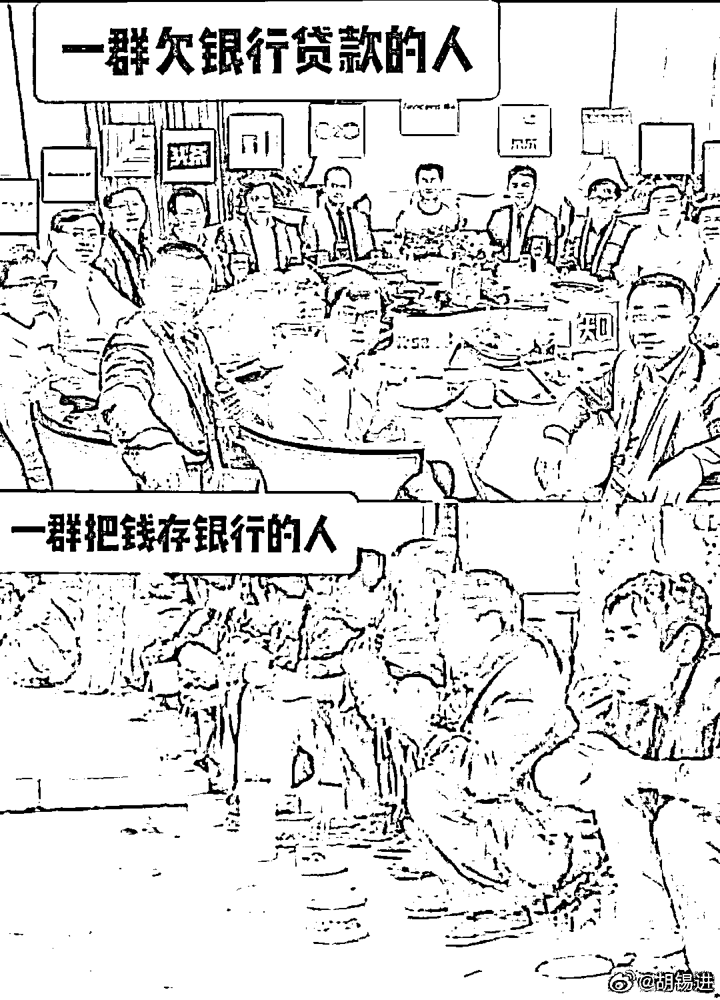

# 怎么看这张围绕银行，十分尖锐的对比图？

> 原文：[`mp.weixin.qq.com/s?__biz=MzU0MjYwNDU2Mw==&mid=2247507185&idx=2&sn=accaac44b8326475782591131dc2fb8a&chksm=fb1ab08dcc6d399b795a2084d851392d57dd4f62dbbcb92eb8d84882bdd12cb88fad3633bee2#rd`](http://mp.weixin.qq.com/s?__biz=MzU0MjYwNDU2Mw==&mid=2247507185&idx=2&sn=accaac44b8326475782591131dc2fb8a&chksm=fb1ab08dcc6d399b795a2084d851392d57dd4f62dbbcb92eb8d84882bdd12cb88fad3633bee2#rd)

有些人让我评价上面这张图，缘起是他们不满于老胡和稀泥的态度。

很遗憾，我恐怕相较于老胡，更令你们不满，因为我的态度很尖锐，只不过是另一个方向上的尖锐。

首先说明我对杠杆的看法，我认为，杠杆最大的问题是过大。

你注意我的措辞，过，这是关键词。 

换句话说，只有超出了风险管理的杠杆才是有问题的，否则，那就是个好东西。 

也就是说，在我眼里，杠杆对商人，对商品社会运行，对整个经济而言，就类似于饭，商人借钱，人要吃饭。 

你说饭有没有坏处？有，如果你撑死了，那就是坏处。这就叫失去了风险管控的杠杆。

可是在风险管控内，杠杆是必需品，就像你必须吃饭。你不吃饭，会饿死，商品社会完全没有杠杆，大家都得饿死。

这才是我的态度。

这张图的用意我看得懂，但是这种刻意的对比，是无知或者别有居心的体现。 

我们想一件事就明白了，你觉得，银行靠什么存在？靠什么赚钱？ 

靠放贷与存款之间的利息差存在。 

假如我们把借钱的都定义为有罪，没有人问银行借钱，试问，银行拿什么来支付存款者的利息？ 

如果没有人借钱，银行不仅不支付利息，而且还会问你收取管理费，就是说，你存钱，还得倒贴。 

因为人家开那么多网点，人家给你点钱，人家帮你保管，帮你异地存取，这些都要人力，都要成本的呀。

第二个问题，你觉得借钱是占银行便宜？存钱是让银行占你的便宜？

是吗？如果是这样，你可以借呀，你为什么不借呢？

因为借钱，是要还的呀。你说有些人借了不还，最后变成老赖。

没错，问题是，这是不是全貌？是，或者不是？

当然不是，如果说银行的客户，大部分都是借了不还的，都是占银行便宜的，银行还能混到今天？

这个机构就没法诞生，刚出娘胎就得夭折。 

银行的整体坏账率顶多几个百分点，再多，根本维持不下去。换句话说，9 成以上的借钱的客户，都是要还钱的，不仅要还，而且是连本带息的还。 

那么到底是谁占谁的便宜？是存钱的占了便宜还是借钱的占了便宜？ 

如果你觉得借钱的占了便宜你就该倾家荡产去举债，去借，去创业，而不是发牢骚。 

你一方面对于那些借钱举债开公司提供就业的发牢骚，觉得他占了你的便宜，另一方面，又不肯借钱创业，不肯提供就业岗位，总想着有人给你发工资，这是什么道理？ 

心口不一？ 

第三个问题，如果没有人借钱，大多数人，都不会有就业的。

你去看下数字，8 成的劳动人口是在私人企业里上班，而这些公司，绝大部分都是靠借钱来维持商业运作。 

换句话说，如果去掉借钱这个环节，八成的人就都不要工作了，干嘛？去你家，你管饭吗？ 

我很认同站队，我也坚决的站在大多数人一边。问题是，在我看来，**站队的前提是不损害自己队伍的利益。**

听得懂吗？

你不能站着站着把大部分人的饭碗站没了，那你站什么？站寂寞？ 

**你不能为了正确而正确。**

老板是要承担风险的，大部分创业者是注定破产的，员工和老板谈判的目的是让对方承担更多风险，让渡更多利益，而不是一拍两散。

我不喜欢老板的潜台词是让老板给我加点薪，而不是说把老板干掉，老板干掉了，你就得去做老板。懂吗？

就像没有人借钱你就拿不到利息了，懂吗？

**谈判的目标是让自己利益最大化而不是谈成鸡飞蛋打。** 

杠杆这个东西，我讲过很多次，它是一种必需品，也是一种危险品，它的危险在于失去了风险管控。 

而不是反过来，我们因为一家公司，几家公司的高杠杆，就认定杠杆有毒。这就是因噎废食，你因为有个人撑死了，于是说，大家以后都别吃饭了。

这是无知的体现，或者，是别有用心的体现。

**生意的本质是什么？就是时间的杠杆。商品社会的本质是什么？就是对杠杆的运用。**

大清朝之所以打不过日本，是因为前者是古代社会，后者已经进入了商品社会。

日本虽小，可是他可以举债，他可以加杠杆，他可以透支未来。但是大清不行，那时候大清没有建立起现代的货币机制。 

他们的军费依赖于金属，还是一种非自产的国际金属，叫做白银。

那这种情况下当然打不赢。 

就像你的战斗力极限受制于当年的粮食产量，对方的战斗力极限是可以通过期货市场加杠杆的，他可以透支未来一百年的粮食产量，先赢了你再说。

赢完了之后让你赔，结果人家大赚。 

这就是非常经典的现代社会利用加杠杆去打一个古代社会的例子。 

那么站在个人的角度，单纯的出卖劳力，是有上限的，你拒绝杠杆，你就不可能赚到钱。这是必然的。

商人为什么讲究周转率，讲究翻台翻得快？因为这就是对时间在加杠杆。

杠杆可以加在时间上，可以加在资金上。

当杠杆加到资金上的时候，也就产生了风险，因为杠杆越大，能够承受的波动就越小。 

所以我们要对杠杆进行风险管理。

你今天看到的那些烂尾楼的问题，就是因为 KFS 对时间的杠杆，和资金的杠杆都加到了极致。 

他们的售价是被限定的，拿地的价格比较高，这里面的差价要覆盖借贷资金的利息，也就是所谓资金的使用成本。 

那么他就必然要进入一种高周转的状态，也就是拿了地，马上就得连轴转，盖出来立刻卖。

你前几年听到的那些关于 KFS 内部各种只要没干死，就往死里干的传闻，就是因为要提升翻台率，不得不加速加速再加速。

那么时间杠杆这么大，资金杠杆也这么大，一旦遇到市场行情有变，楼卖不出去，那他就只能躺平，摆烂，也就是你看到的烂尾。

这个问题是多方面因素叠加形成的，不是单方面的。 

你今天觉得社会舆论集中骂加杠杆，其实你反过来想想，假如几年前，干脆要求 KFS 全款拿地，不许借钱，那结果是什么？ 

结果就是从几年前开始，就没有新盘入市了，于是大家只能买二手房。那我告诉你，如果没有新盘的竞争，二手房就会加价，今天舆论的抱怨只增不减。

如果你只会骂，无论 A 发生还是 B 发生，你都只会骂，那你和网民有什么区别？

杠杆这个东西不是只有零和无穷大，就像人的脑子不能是二极管，只有零和一。

我们的目标不是一会儿任由杠杆扩大一会儿又急速冷冻让它变零。我们的目的是让杠杆维持在合理的区间内，比如 3 到 5 倍，这是良性的。

同样，保有两种截然不同的观念，还能正确行事，这才是一流智慧的标志。