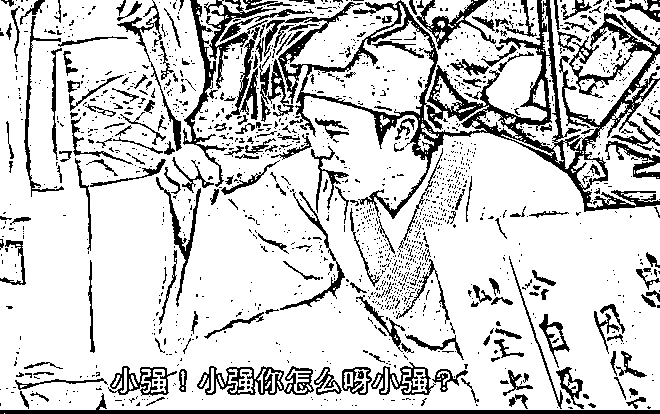

# 吴啊萍是谁？你从这么多替曾颖叫屈的公知身上就看出来了

> 原文：[`mp.weixin.qq.com/s?__biz=MzU0MjYwNDU2Mw==&mid=2247507175&idx=1&sn=aafcc43864c9f716c7fe0e0e73d8b16c&chksm=fb1ab09bcc6d398da0418e4e3f659e97b681ac11e5e5cb9112b272dd3f955ab914352e04fdec#rd`](http://mp.weixin.qq.com/s?__biz=MzU0MjYwNDU2Mw==&mid=2247507175&idx=1&sn=aafcc43864c9f716c7fe0e0e73d8b16c&chksm=fb1ab09bcc6d398da0418e4e3f659e97b681ac11e5e5cb9112b272dd3f955ab914352e04fdec#rd)

咱们小号记忆承载 3 写[供奉日本战犯的南京玄奘寺，需要的不只是整顿](http://mp.weixin.qq.com/s?__biz=MzU3NDc5Nzc0NQ==&mid=2247519099&idx=1&sn=cc48bfe77d5d5bd0265ecd8a61110fb8&chksm=fd2e29a5ca59a0b328f17514770c5d8f41a351b097d2b84befc9c153aeff074d9893ed5450b0&scene=21#wechat_redirect)。 

我没有提到吴啊萍是谁，虽然全网都在热搜这个人，公安也在四处寻。

这人肯花十几万给四个日本战犯在南京的寺庙里供奉牌位长达四年之久，大概不会是真名。 

而且这个名字我琢磨着就觉得是故意的，吴啊萍，谐音无凭，又在南京，其心可诛。

这事儿只能公安去查，查不出来国安去查，网民在这儿着急也找不出来的。 

我觉得，无论找出来还是找不出来，这人不是问题的关键。

你的房间里如果发现了一只蟑螂，你觉得蟑螂是关键吗？你找到蟑螂就能解决问题吗？ 

我觉得不是，这明显不符合常识。

房间里如果你看到一只蟑螂，那你没看到的，起码有一百只。房间里为什么会出蟑螂，它吃什么？它存在的因素是什么？这是你要找出来的。

你不把根给掐了，窝还在，食物还在，蟑螂就在，出来一只你踩死一只，那是没用的，明白吗？ 

昨天为什么我没有围绕一个寺庙一个方丈去开骂？因为我觉得那不是问题的关键。 

问题在于你不觉得有些寺庙来钱来得太容易了吗？来钱容易却没有担负相应的责任，所谓权责不对等，你没发现吗？ 

这才是问题的关键，这才是要解决的。 

出家人四大皆空，要钱干什么？何况冒着这么大的风险去挣这种钱？

我把话说得更透彻一点，如果真的做到四大皆空，如果真的做到挣来的钱一分也留不下，都得用作慈善。你觉得，这帮人还有没有那么强的动力去挣钱？

作为一个老香客，很多时候我都给所谓大师们留着面子呢。非要我把话挑明了，不就这回事么？ 

有些事儿，你不较真，总是藏污纳垢的，你家里有蟑螂，说到底，是你不爱卫生。 

你要是每个角落都不留食物，我就不信了有蟑螂，它喝西北风啊。

说到底，钱才是核心，蟑螂是你养的明白吗？

就在全网搜索吴啊萍的这一天，你去看看，有多少公知，在为曾颖抱不平。

曾颖何许人也？就是一个记者。日本前前首相安倍晋三遇刺，她报道时痛哭流涕，不能自已。 

很多网民表示，你哭什么？如丧考妣，至于么？ 

本来没多大事儿，你哭你的，人家质疑人家的，有什么问题？ 

我没有看出任何问题。但是这个曾颖一哭二闹三上吊。

她哭完就是闹，她连续的在微博里发各种文章，解释自己为安倍哭的理由，你解释就解释嘛，你的私事。

但是你不能因为你想哭，就要求所有网友都得哭安倍，甚至不能质疑你哭安倍。

这就叫闹，她闹到最后，微博都看不下去，把她账号停了。因为现在不是网友绑架你，是你在绑架网友。你要求网友也得哭安倍，否则就是没有同情心。

这算什么逻辑？

一哭二闹该结束了吧？不，这女生开始三上吊，表示自己不活了，又来一拨搜热。 

一群公知给她捧场，你看，都是被网友们逼的。 

我都想不通，网友们逼你什么了？从头到尾你自己在演戏好吗？

我打个比方吧，曾颖哭安倍，就像祁同伟哭坟。

赵立春的爹死了，又不是祁同伟的爹死了，他在坟前哭得比赵立春还伤心，从此成了职场笑话。 

连李达康当着一众常委都拿他开涮，所有常委包括沙瑞金都在取笑，取笑祁同伟。 

为什么取笑？因为质疑呀，你哭什么？又不是你爹死了。 

所以呢？祁同伟就要上吊吗？按理说他也被网暴了呀，他被所有常委网暴了，难道不是吗？ 

祁同伟有上吊吗？有吗？当然没有。

你能做还不许人家质疑了？

为什么祁同伟哭坟就允许大家质疑，甚至允许大家嘲笑？到了你曾颖就不行，凭什么？

你曾颖脸白啊？

我把话说穿了，人家赵立春好歹是祁同伟的上司，哭上司的爹，也算是个理由。 

安倍是你曾颖的上司？还是你曾颖上司的爹？ 

八竿子打不着，你哭两句，人家笑两声，没啥吧？要是以这个理由你说你不想活了，回头赖网友，那比你冤枉的人多了去。 

我每天都要挨骂，各种理由。最多的理由就是写的内容和读者希望的不一样。

很多读者每天在后台骂我，理由就一个。西风，你为什么不写出我的心里话？

我又不是你肚子里的蛔虫，我怎么写你的心里话？

人家可不管这个，就是骂，天天骂。干嘛？难道我因此不活了？ 

我就算因此不活了，也赖不着他们吧？

多简单的道理？需要我讲吗？还这么多公知替曾颖鸣不平？你们这么能，怎么不去替祁同伟鸣不平呢？

我说句公道话，祁同伟比曾颖，值得同情得多。 

他至少曾经是个英雄，是个缉毒英雄，虽然后来把路走歪了。 

曾颖何许人也？ 

2018 年的时候，和男友一起搞区块链，骗了很多人，割了很多韭菜，那时候就在闹自杀。 

有人觉得这剧本不对呀？割韭菜是个喜庆的事儿呀，你看孙宇晨孙割，人家割得多开心？

被你割得倾家荡产的那些人没自杀，你自杀什么？

说实话我也不理解这个逻辑，直到我看了一本剧，[《幸福到万家》。](http://mp.weixin.qq.com/s?__biz=MzU0MjYwNDU2Mw==&mid=2247507134&idx=1&sn=28f63cd60bba0a26949397f7c4cf7da6&chksm=fb1ab0c2cc6d39d432083ca8f9f3ac58191d9d512764dcfa60059f2de08c12b70f69b324f01f&scene=21#wechat_redirect)

村书记老万的闺女，冒名顶替老王家女儿的名字去上大学，盗取了人家的人生。本来人家是大学生，现在人家成了落榜生，还得给万家的企业打工。 

按说你是得利者吧？结果是万家的闺女先闹上吊，理由是她觉得见不得人。 

拜托，你觉得见不得人，你别干这事儿啊。

你觉得见不得人，回头要求受害人老王家的闺女不许说出去，不许告你，否则你就要自杀，你还要不要脸？

这就像你强暴了别人，你回头要求被强暴的那个人替你隐瞒，否则你就要寻死觅活的，咱还能要点脸吗？ 

我真是理解不了这里面的逻辑。你玩区块链割了别人韭菜，回头你反而成了受害者，因为你寻死觅活。 

寻死觅活之后，人家洗白了，人家成功地从一个割韭菜的变成了一个受害者。 

摇身一变，成记者了。 

干嘛？这次又来故伎重演？你哭安倍，你绑架网友，说网友不哭安倍就没有同情心，绑架完了你还闹自杀，而且每次闹自杀，第二天都活蹦乱跳的又开开心心的继续搞个人秀了。

干嘛，你的自杀跟孙割的一百万一样，都是祖传的？怎么哪儿都有呢？

还一堆公知出来给你捧场，我算服了，我估计孙割都得服。你看人家孙割，每次割完韭菜都被骂，曾颖倒好，回回割完她倒成受害者了，成了需要被安慰的。

孙割怎么不服？孙割都该拜你为师。

说到底，都是惯的。这么多公知，一天到晚上蹿下跳，开心得不得了，也没见有人收拾他们。 

还一堆网民在下面像迷弟迷妹一样发痴，什么先生不出，奈天下何。 

那你还惊奇有蟑螂？蟑螂不就是你们养的吗？