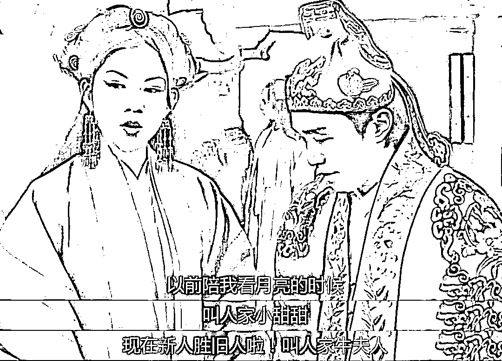

# 刚聊了自己变的变绿，就看到了别人因黄袭警的经历

> 原文：[`mp.weixin.qq.com/s?__biz=MzU0MjYwNDU2Mw==&mid=2247506808&idx=1&sn=25dc400ad931d47c2e7aecd618b89c65&chksm=fb1ab704cc6d3e12de14865a5219d509328a1928429ce7a350354a1a45c01e662f2de864b87b#rd`](http://mp.weixin.qq.com/s?__biz=MzU0MjYwNDU2Mw==&mid=2247506808&idx=1&sn=25dc400ad931d47c2e7aecd618b89c65&chksm=fb1ab704cc6d3e12de14865a5219d509328a1928429ce7a350354a1a45c01e662f2de864b87b#rd)

[我前两天刚刚聊过自己从一个小黄人，变绿的经历。](http://mp.weixin.qq.com/s?__biz=MzU0MjYwNDU2Mw==&mid=2247506706&idx=1&sn=2045cb3b61c8897d24ece9e9c82356f0&chksm=fb1ab76ecc6d3e7851a3b46ad6b63a61007f6cef67b493f870ea631848d5e9d8dcc38916be44&scene=21#wechat_redirect) 

话音刚落，就有读者问我怎么看，发生在丹东的这起小黄人袭警的经历。

首先我们回顾下过程，辽宁丹东一对父女，41 岁的女儿驾车带着 70 岁的父亲去医院，遇到了一个交通检查处，民警要求司机出示健康码。

这个女儿出示了黄码，民警就把她拦停了。视频中，女子说自己有社区的取药证明。

你注意，是取药，网上的信息不准，不是去看病，是去取药。

那么民警不让她通行，发生了争执，然后女子有些情绪失控，表示黄码怎么了。接着就说，那我不去了，我回去行了。

但是民警不让走，让她登记，完成流程。从镜头上看，民警用胳膊拦阻了进入驾驶舱的入口。女子想要突破，俩人一用力，女子倒地。

这个时候，正巧 70 岁的父亲从车尾绕过来，那是个视线死角，他可能是误会了，以为是民警故意推倒他女儿，于是上去扇了民警一个嘴巴子，结果民警捂着脸倒地了。

那么之后，这名女子被拘留了十日。

有人问，为什么打人的那个父亲没有拘留，是这样的，他年满 70 了。年满 70 会被拘留处罚，但是没法执行。

理解这意思吧？

就是说从处罚条例上讲，你被拘留了。实际上因为年龄超限，真让你待在所里，万一有点什么，也没法交代，所以年满 70，实际上是没法拘留的。

当然，这是指行政处罚，如果涉嫌犯罪，是另一回事，没人管你满不满 70。

这个事情引起的争议其实我非常能理解，因为我前几天刚有过类似的体验。

和这个女子不同，她知道自己是黄码，而且据她说，是开了社区证明的。

我是不知道的，我被小区保安拦下的时候，第一次知道自己橙码了。

当时我也尴尬，我总得回家呀。我带着一个橙码，就算去酒店，也没人收我。

现在被保安拦着，不让我进小区，那我怎么办。

所以我非常理解这名女子的困境。她真的需要取药。

有人说，她可以找人代取。可能吧，问题是，这些都是事后了，她出门的时候既然找社区开证明，就是也没觉得有多大事儿。

你像她后来，看到自己父亲袭警了之后，也想要息事宁人，想要回家。问题是，已经晚了。

其实那天我都在想，如果保安比较二，就这么拦着我，不让我回家，也没有那个很 NICE 的社区小哥给我开证明，以及给我指一条明路，说不定，我也有可能和保安发生冲突。

当然，这跟性格有关，也和压力有关。

说到底，我的压力不是很大。有时候你要将心比心地站在别人的处境下想问题。

比如一个要上班的人，尤其是在私企工作的人，真的被隔离半个月一个月的，他会不会因此丢掉工作？

他丢掉了工作之后，这个家庭靠什么维系？房贷怎么还？孩子读书怎么办？

你要知道我们现在不是两年前，刚开始的时候，人们更容易配合。时间久了，大家在长期的压力下，情绪都比较暴躁。

民警不能说铁饭碗吧，至少通常情况下，不会面临裁员这种压力。但是私企的压力是很大的。

互联网行业这种利润丰厚的，地主家的，都没有余粮，都减薪裁员，其他行业就不要想。

所以我在想，那个女人，中年女人，暴躁有她暴躁的原因。

或许，她是个开店的，自己真的没法停，停下来，房租还得交，工资还得开。

当然，我讲这一切，不是为这对父女开脱，任何事，钉是钉铆是铆，如果前几天，我打了保安，被拘留的，就是我了。

那天我遇到的那个保安，态度也很恶劣，至少让我心哇凉哇凉的。

小区里的保安都是训练过的，平常没事儿的时候，业主开车出入，他们都是立正敬礼，身体随着汽车行驶的方向转动，目视业主离开，或者进入。

这就是一种服务意识，十多年前就兴起这套流程了。

但是那天我掏出橙码，他那个嫌弃的样子，冷漠的表情，让我瞬间就想起那句台词。

确实有这种感受，原来那么尊重我的人，现在这么趾高气扬。

但是我理解他。

他作为一个基层的执行者，每天要面对五花八门，形形色色各路人。

就像电话客服，你说她对着第一个客人好脾气，有没有能力一整天下来，都是好脾气？

这个话题我以前常出差的时候，跟同事聊过。

我说，你看那些空姐，很温柔，和你说话永远都是轻声慢语，处处考虑你的情绪，要是娶回家多好。

我同事跟我讲，那是在工作，你真娶个空姐回家，她真的会那样对你吗？

她在外面越是那样，回到家里，反而有可能换一个人，因为大家都是人，都有烦躁的时候。

她只是把一整天积累的不满，都带回了家里。

我想想看也是。

第二个问题，作为一个基层执行者，经常面对的问题是无解的。

他也想人性化，但是人性化与放纵以及懒政之间的边界，很多时候都是模糊的。

上级考察下级的时候，都是结果论而不是过程论。

如果你真的放走了一个人，这个人最后确诊了，造成了很大的损失。那么这个后果一旦追责，你是无法回避处罚的。你不可能以人性化作为自己免责的借口。

那天在小区门口，我尴尬，保安比我更尴尬。

他当然知道如果连家都回不去，我更没地儿去，酒店也不会收我。

问题是，如果我从他这个入口处进去了，他就得负责。所以在他看来，我才是那个烫手的山芋。

那天给他解围的，是社区小哥。社区小哥让我别回家，先去社区登记，这个目的，就是为了把保安摘出来。

你没有责任了，责任在社区。就算有问题，也是那个很 NICE 的社区小哥，他来扛。

这才是问题的关键。**如果你要解决问题，就只有改变对方的决策系统。**

决策系统，我们提过不止一遍了。

几天前有个读者问，某大厂不乐意招女生去非洲，是为了保护她吗？不，是为了保护自己。

因为一个女生去非洲遇到危险的概率要大于男生。如果你招聘的次数多了，小概率事件就会变成必然事件，就会变成成本问题。

你招 100 个女生去非洲，总有一个会出事，你招 1000 个男生，可能才有一个会出事。

那么覆盖掉成本之后，谁都不愿意招女生去非洲，这就是决策系统。

你抱怨性别歧视，能理解，但是这是一种情绪，解决不了任何问题。人家不会跟你讲，因为你是女生。HR 会用一千种瞎编的理由去搪塞。

你知道他在搪塞，他知道你知道他在搪塞，so tama what？

**改变对方的决定，只有改变对方的决策成本，没有别的办法。人都是趋利避害的。**

那么我们来看这个女子。

她掏出社区证明，有用吗？对保安有用。因为保安 report 给物业主任，物业主任 report 给社区。也就是说，社区证明可以转嫁保安的责任。

问题是，民警是另一条体系的。

这张证明掏出来，保安立马轻松了，因为责任转移了，烫手的山芋扔出去了。可是在民警看来，没用，大家不是一个系统的。

他如果看到这张证明就放人，回头真出了事儿，他还是要背责任的。

所以他才想把女子拦下来，登记，处理，就是为了把流程走完。

问题是，这会儿女子已经没有耐心了。

她选择了发飙，释放情绪。这种办法在大多数情况下都是管用的，为什么？

因为你改变了对方的决策成本。

如果对方是路人，发飙很管用的，就像两辆车相遇，谁都不让道，最后谁让道？谁急谁让道。

他为什么让道？因为你改变了他的决策成本，他觉得耗下去不划算了。他觉得你是个难说话的，他不想在你身上继续沉没成本，你触发了他的止损位。

就这么简单。

你想想，我第二天早上去做核酸，沿路上用的什么方法？就是这个女人的方法，其实我就是在让所有人觉得我是个难弄的人。

在马路上，我逢车就插队，人家有意见我就举码，橙码。

他会不会和我争？不会的。

除非他是红黄码，红码也出不了门。橙码遇到黄码，本就是极小概率事件。

我算准了，所以逢人就耍无赖，对方作为绿码，他看见橙码是避之唯恐不及的。

犯不着嘛，万一对方是小阳人，自己被感染，亏大了。

所以那天上午我如同周润发降临，不要太拉风。甚至到了医院门口，已经没车位了，我亮码。保安还是放我进去了。

很显然，他知道我是危险人群，如果任由我到处找车位，再随着人群挤进去，将来出了事，问起来谁值班，他更加吃不了兜着走。

所以他给我开了后门，还特意交代，让我直接开到检测点跟前，测了马上走人。

我到了检测点跟前，没位置了。于是下车，很帅气的拔出手机，把橙色的码亮出来，在空中潇洒地转了一圈。

马上就有一辆车开走了，我就停在他的位置上。

他为啥走？原因很简单，我改变了他的决策成本。他本来也许想呆一会儿，或者有别的事情。但是看到一个危险的人，想想算了，赶紧跑，离得远远的，哪怕在医院里兜一圈，另外找位置重新停，也不想在我身边多待一分钟。

你看到了，这种方法对普通人是非常好使的。

但是，你想想看，头一天晚上，对着保安，用这招有用吗？

没有的，他戴上双层口罩，捂着口鼻，都拒绝放我进去。为什么？

因为工作更重要，他不想丢了饭碗。

同样，如果我拿这一招去对付交警，那么吃不了兜着走的，一定是我。

因为对方职责在身，他没得选。

**很多时候其实就是这回事，站在自己情绪的角度，我们很希望对方能够体谅自己。问题是，越是基层，他越没有办法体谅你。**

**因为他真的只是个螺丝钉，他没有权限，他的决策系统就没有办法做出改变。**

**你以为他想和你争？他其实一秒钟都不想在你身边待，但是他没得选。**

就像当年我们大学里军训，那么热的天，教官从来不体谅你，偶尔领导来了，比如什么师长，人都很 NICE 的，总是批评教官，别搞那么严格。要防止学生中暑，要多休息，千万不要出事情。

但是教官就只能苦笑，因为具体到一个连，一个排。那个代理的连长，真的只是个兵。他回到部队上，就是个普通的士兵。我们昔日军训的排长，后来去我们学校做了保安。

他的权限就在那里，他的 KPI 就在那里，你让他咋通融？

**你觉得大热天的，他想为难你？他也不想的。**

不过话说回来，我觉得这件事，这个民警的上司，他们所长，应该出来打圆场的。

批评教育下，让打人的，给民警道个歉，写个保证书算了，真拘满 10 天，虽然合法，也没多大意思。

这种事只有派出所领导出面调解，说实话，大家都挺不容易的。