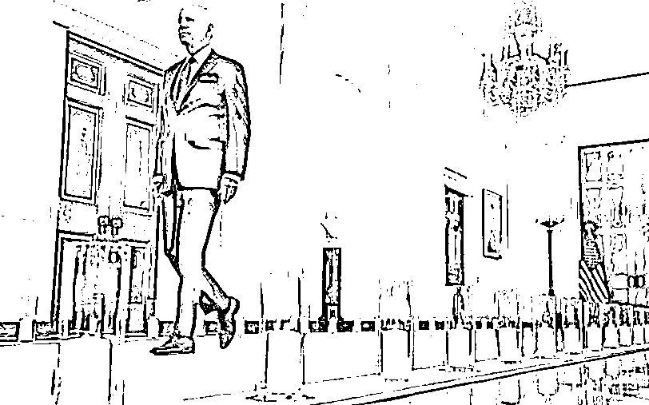

# 我从来也没有这么盼着被绿过

> 原文：[`mp.weixin.qq.com/s?__biz=MzU0MjYwNDU2Mw==&mid=2247506706&idx=1&sn=2045cb3b61c8897d24ece9e9c82356f0&chksm=fb1ab76ecc6d3e7851a3b46ad6b63a61007f6cef67b493f870ea631848d5e9d8dcc38916be44#rd`](http://mp.weixin.qq.com/s?__biz=MzU0MjYwNDU2Mw==&mid=2247506706&idx=1&sn=2045cb3b61c8897d24ece9e9c82356f0&chksm=fb1ab76ecc6d3e7851a3b46ad6b63a61007f6cef67b493f870ea631848d5e9d8dcc38916be44#rd)

前几天我黄了，什么黄了？码黄了。

什么原因呢？起初我也不知道。

就是回小区，被门卫要求看码，结果他发现我黄了。 

当时我很紧张，一脸懵逼的看着他，他比我更紧张，赶紧拉了拉松弛的口罩。

我正要说话，他摇摇手，又从屁股后面的兜里摸出一个新口罩，戴上，双层口罩，双倍防护。 

没有什么是一只口罩搞不定的，如果有，就再来一只。 

戴上两只口罩，他依然像美国警察看到黑人一样，十分谨慎的用一只手推向我，似乎想要排斥点什么。 

我下意识地想要举起双手，后来想了想，他只是个保安，好像我才是业主。

瞬间又有了底气。

何况，如果我真的举起双手，谁负责拿手机呢？

于是我主动地摇下车窗，把手机伸到他面前，请他帮我看看。 

他没有顾得上这个，而是先掏出一个小本本，告诉我，你要登记，具体住址。 

登记完了之后，他又掏出一张纸，指给我看，我要立即向社区报备。 

我掏出电话，打给了社区，社区的负责人很 NICE，也很有经验，他先告诉我，不要紧张。 

把黄码交给保安，让保安看清楚，到底是哪一种。

一瞬间，我又紧张了起来，怎么？都黄了，还有哪一种？ 

保安拒绝接过手机，他让我高高举起，然后他捂着戴了双层口罩的嘴，凑近一看，瞬间好像放松了。 

只见他放下捂着口鼻的手，轻松地对着开着免提的手机向社区报告，说，这个不是黄了，这个是橙了。

橙子的橙。

那一瞬间，我更惊悚了，什么？我不是黄了？我是橙了？ 

赤橙黄绿青蓝紫，橙还在黄红之间，那岂不是说，我离红，又近了一步？ 

正当我的心扑通扑通的跳，一脸绝望的看着保安的时候，电话那头社区的声音温柔的响起。

那是一个男声，应该很年轻，起码比我年轻十岁以上。

社区的值班负责人，十分 NICE 地安慰我，别急别急，想想，你是不是最近买药了？

我一想，哎呀，果然是这样。我昨天晚上是去买药了。然后我就赶紧跟电话那头的社区负责人讲，我买了什么什么药。

他笑着说，没事，你就是因为买的药里面含有感冒药的成分，于是被列为重点监测对象。

何况我们监测到，你的核酸检测，已经过期了，超过了 72 小时。 

我的心，瞬间，又提了起来。

我想，怎么连这个你们都知道？

其实我并没有严格的执行每 72 个小时都去做一次核酸。而是偷懒，每星期只做一次。 

原因很简单，一星期有 168 个小时，人不可能 168 个小时都在重要场所晃悠。

比如你只有 5 天要去公共场所，那么只剩 120 个小时了。这 120 个小时里面，头尾是睡觉的，或者在家里，于是只剩下 90 多个小时了。 

人做核酸，到结果出来，中间有好几个小时的空档期。这几个小时，我也是可以出入很多场所的，因为显示的是绿码+已经核检，只是暂时还没有出结果。 

于是 72 又被延长到 80，再配上前面 90 个多个小时的实际需求，理论上讲，如果你不是经常出入公共场所，一周做一次，也勉强够用。

那一瞬间，我脑海里浮现了很多镜头，差一点就对着电话讲，我交代，我交代，我全都老实交代。 

....... 

正当我按耐不住，马上就要交代过往的各种鸡贼的小心思的时候，电话那头温柔的声音，又响起来了。

社区负责人跟我说，你只需要 24 小时之内，再做一次核酸，结果是阴性，就会被恢复绿码的。

当时已经晚上了，我问他，我该去哪里做？ 

他先是提议去医院，后来发现一个问题，没有绿码，医院是进不去的，门口的门卫会拦住。

我问他，去晚上的那些附近的检测点，可以做吗？

他说不行，检测点只接受绿码的人员，你现在属于重点人群。

那我就问他，该怎么办？

他说，按照流程，你要先来社区一趟，拿一张表格，然后带着表格，第二天去指定医院，等人家上班后，在重点人群的定点位置，做一次检测就可以了。

但是，他有个顾虑，那就是有可能睡一觉起来，就超过 24 小时了。 

毕竟我是前一天晚上买的药，到发现自己橙码，已经 24 小时了，睡一觉起来，只怕被赋予了黄码。 

这就麻烦了。

但是他安慰我，这里面有时间差。就像绿码检测是有时间差的，同样，系统发现我买药，到赋予我橙码，也是有时间差的。

也许系统并不是前一天晚上就发现了，也许是第二天才赋予我橙码的，那么到第三天去检测，就不满 24 小时。 

于是我开车去社区拿了盖章的表格，惴惴不安地回到家中。 

我太太跟我说，你最好还是住出去吧，住到别的房子里去，不要牵连了我和儿子。

我说，别的房子里连枕头被子都没有，你让我怎么住？ 

她说，反正是夏天，临时凑合下呗。

我心想，古人诚不我欺，果然，夫妻本是同林鸟，大难临头各自飞。

这还只是橙了，就赶我走了。 

于是我气鼓鼓的，还是睡在了她身边，只不过上了一个闹钟，第二天一大早就跑去定点医院。

我发现橙了，果然很好用。 

一路上遇到企图加塞的，我直接拔出手机亮码，车库里没车位了，我直接拔出手机亮码，所向披靡，看到的人秒怂。

没有一个人敢和我叫板，没有一个人敢不退让。

我就这么顺顺利利，一路畅通地在早高峰时段，准时抵达定点医院，定点检测位。 

这个医生不愧是重点人群的，不像平常，只是插插喉咙，他插了喉咙插鼻孔，插了左鼻孔，还要插右鼻孔。

搅拌来搅拌去，最后还不放心，还要把棉签折断，存储起来。

看来，是想留有证据。 

就这么过了惴惴不安的半天，结果我变绿了。 

那一刻，十分激动，差一点就喊，我绿了，我绿了。

从来没有这么盼着被绿。 

这个过程，你觉得，我用戏谑的口吻说来，是在抱怨吗？ 

不，这本就是事物的两个面。

如果你指望一个人为你解决问题，他一定会对你有所要求。

医生对你有要求，又要你付钱，又要你吃药，所以他才有可能给你治病。 

佛祖对你没有任何要求，所以你指望他保佑你，也只能是个念想。 

[我们小号记忆承载 3，昨晚聊了一个话题，美国和中国是不一样的，规定不一样。](http://mp.weixin.qq.com/s?__biz=MzU3NDc5Nzc0NQ==&mid=2247518524&idx=2&sn=64ac0c456e12d6fd1fa894ceeb9f5a87&chksm=fd2e2be2ca59a2f41ac894e64ed137196261f091fc8dc0bef5722d5b6be08b6a38918bc79bbb&scene=21#wechat_redirect)  

可是规定不一样的背后是什么？是模式不一样。

美国允许你随便反映问题，可是随便反映问题的背后是什么？他给你解决问题吗？ 

NO，门都没有。

你不需要对你反映的问题的真实性负责，他也不需要对解决问题负责。 

美国枪击案之后，拜登只需要走个蜡烛秀就可以了。 

然后呢？然后继续，该咋咋地，爱咋咋地。

新冠死了那么多人，拜登不也就是点根蜡烛吗？ 

他们的模式本就是这样，一切让上帝负责吧。

我们在反映问题的源头处就有要求，你得有证据，如果没有，你得实名。 

你说我又没有证据，又不想实名，我就想在不基于事实的前提下，随便反映反映怎么了？

对不起，会有很多问题的。会被追责。 

为什么会被追责？

因为你是随便反映反映，可我们真的有人去落实，去解决问题。 

像美国那样，你反映什么都没人搭理的情况下，当然随便你反映。

像我们这样，你反映了就要去查证，就要去解决的模式下，每个人都没有依据，或者拒绝实名的去反映，那你让干活的人怎么办？ 

你造谣动动嘴，他辟谣跑断腿。人能跟你罢休吗？

说穿了，甘蔗没有两头甜。

如果你出事儿了不需要有人罩你，那就没人管你；反过来讲，如果你要有人罩你，那就一定有地方限制你。